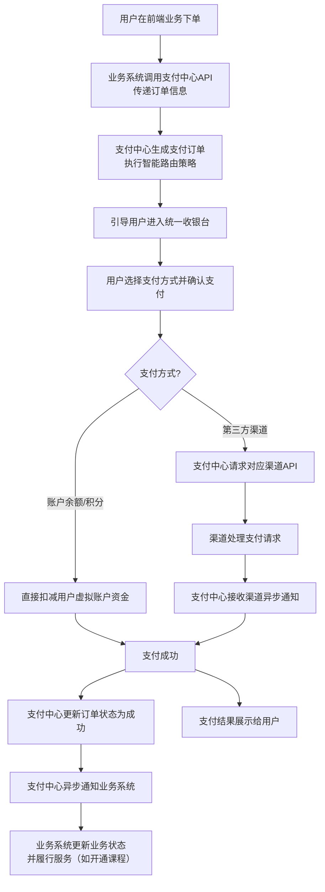

# 2.10 统一支付中心
## 2.10.1 功能描述
统一支付中心是九州寰宇平台的核心交易与资金处理枢纽，是一个集成了多支付渠道聚合、统一账户管理、智能路由分发、自动化清算对账于一体的金融级基础服务模块。它通过标准化接口为平台内各业务场景（在线教育、工具集合、好物推荐等）提供安全、稳定、便捷的支付、结算与资金管理能力，实现对支付宝、微信支付、银联、数字货币等主流支付渠道的统一接入和管理。其核心价值在于打通平台内商业闭环，提升用户付费转化，降低业务接入成本，并确保平台金融级的数据安全与合规性。
## 2.10.2 用户场景

| 场景类型      | 使用角色          | 具体场景描述                                                                                        |
| --------- | ------------- | --------------------------------------------------------------------------------------------- |
| 知识付费与课程购买 | 数字原生代学生与技术爱好者 | 用户在“在线教育”模块选择一门付费课程，在结算时，系统展示其常用的支付方式（如微信零钱），用户确认支付金额并验证密码后，秒级完成支付，即时获得课程访问权限。                |
| 服务订阅与工具解锁 | 都市乐活白领与中产     | 用户订阅“好物推荐”的会员服务或购买“工具集合”内的高级功能授权，选择使用平台余额结合优惠券进行支付，系统自动计算折后价并完成扣款，服务即刻生效。                     |
| 内容打赏与价值回报 | 斜杠内容创作者与独立开发者 | 一位读者在浏览某位创作者的精彩博客后，受到启发，希望通过“打赏”功能表达支持。他点击打赏按钮，选择固定金额或输入自定义金额，使用已绑定的支付宝快速完成打赏。资金即时进入创作者的平台账户。 |
| 交易退款与售后处理 | 所有付费用户        | 用户购买课程后因内容不符预期申请退款，商家在后台审核通过后，系统通过支付中心原路退回款项，用户收到退款成功通知，资金在1-3个工作日内按支付渠道规则返回。                 |
| 平台运营与财务管理 | 平台运营与财务人员     | 财务人员每日通过支付中心管理后台，一键生成各业务线的日度交易报表，自动与银行渠道对账，核对交易流水，处理异常订单，并查看平台营收总览。                           |

## 2.10.3 核心价值
- 省时（效率提升）：聚合多种支付方式，用户无需在不同支付APP间切换；统一的API接口使各业务模块快速具备支付能力，缩短研发周期。
- 省心（体验优化）：智能支付路由提升支付成功率；统一的账单、退款、客服入口，让用户资金管理一目了然，减少纠纷。
- 增值（商业赋能）：为平台内各业务场景（教育、电商、工具等）提供完整的商业基础设施，促进交易达成，创造营收。
- 安全（风险可控）：构建平台级的资金安全与风险控制体系，保护用户资金与交易数据安全，履行平台责任，增强用户信任。
## 2.10.4 需求清单

| 功能类别  | 功能名称    | 功能概述                                 | 优先级 |
| ----- | ------- | ------------------------------------ | --- |
| 支付核心  | 多渠道聚合支付 | 统一接入支付宝、微信支付、银联、数字货币等，对外提供标准API      | P0  |
| 支付核心  | 智能路由与降级 | 根据渠道成本、成功率、到账时间智能选择最优渠道，支持故障自动降级     | P1  |
| 支付核心  | 统一收银台   | 为Web、App、小程序提供一致支付体验，支持余额、优惠券、组合支付   | P0  |
| 支付核心  | 交易状态管理  | 支付、退款、关闭等交易状态同步与生命周期管理               | P0  |
| 账户与账务 | 虚拟账户体系  | 为用户、商户、平台建立虚拟账户，管理余额、冻结资金            | P1  |
| 账户与账务 | 资金清分结算  | 按规则将交易资金清分至不同账户，支持T+N结算周期            | P1  |
| 账户与账务 | 自动化对账   | 与支付渠道对账，自动处理差账、错账                    | P1  |
| 业务支撑  | 多场景支付   | 支持APP内支付、H5支付、扫码支付、小程序支付等多种场景        | P0  |
| 业务支撑  | 账单与明细   | 用户端查看所有交易与资金明细，支持按业务来源筛选             | P0  |
| 业务支撑  | 多业务线支持  | 为教育、电商、工具、内容等不同业务线提供独立账务配置           | P1  |
| 运营与风控 | 支付管理后台  | 交易查询、商户管理、渠道配置、费率设置、财务报表             | P0  |
| 运营与风控 | 风控与合规   | 实时反欺诈监控、大额交易预警、敏感操作二次验证，符合PCI DSS等规范 | P1  |
| 运营与风控 | 数据驾驶舱   | 可视化展示交易规模、成功率、渠道分布等核心数据              | P1  |

## 2.10.5 需求详述
### 2.10.5.1 多渠道聚合支付
- 渠道接入：集成支付宝、微信支付、银联、数字货币等主流支付渠道，确保覆盖绝大多数用户习惯。后续可扩展国际支付渠道（如PayPal、Stripe）。
- 标准API：对外提供一套简单、标准的支付API（如create_payment, query_payment, refund），业务方只需调用一次，无需关心各渠道差异。
- 参数封装：支付中心处理各渠道复杂的参数组装、签名验证、证书管理等底层细节。
- 异步通知：统一处理各支付渠道的异步回调，并转换为平台标准格式，可靠地通知业务方最终交易结果。
### 2.10.5.2 智能路由与降级
- 路由策略：支持基于规则的智能路由。可根据渠道当日成功率、费率成本、到账速度等维度，动态选择最优支付渠道。例如，优先使用成功率最高的渠道。
- 故障降级：当某个支付渠道出现故障或响应超时时，系统能自动、无缝地切换至备用渠道，保证支付流程不中断。
- A/B测试：支持为部分流量配置不同的路由策略，进行A/B测试，以优化整体支付成功率和成本。
### 2.10.5.3 统一收银台
- UI一致性：提供与九州寰宇平台设计语言高度一致的收银台组件，支持在H5、APP、小程序等终端嵌入，保证用户支付体验的一致性。
- 支付方式列表：清晰展示用户可用的所有支付方式，如余额、银行卡、信用卡、各第三方支付等，并支持管理优先级排序。
- 优惠信息整合：自动计算并展示订单可用的优惠券、积分折扣等信息，显示最终应付金额。
- 快捷支付：对于已绑定支付工具的用户，支持小额免密或快速验证支付，提升支付效率。
### 2.10.5.4 虚拟账户体系
- 账户分类：为平台用户、内容创作者、平台官方建立独立的虚拟账户，记录余额、积分、冻结资金等。
- 资金流向：清晰记录每一笔资金的变动（充值、消费、收入、提现、退款）及关联业务订单。
- 账户安全：通过密码、手机验证码、生物识别等方式保障账户操作安全。设置交易限额。
- 账务准确性：通过事务、对账等措施，保证虚拟账户内资金变动与渠道实际资金流水绝对一致。
### 2.10.5.5 资金清分结算
- 清分规则：支持配置灵活的资金清分规则。例如，一笔课程费用可按平台服务费、讲师收入、税费等比例自动清分至不同账户。
- 结算周期：支持按日、周、月等周期（T+1, T+0等）为商户（如讲师、供应商）进行结算。
- 结算记录：提供清晰的结算单，明细列出结算金额、手续费、对应订单等，方便核对。
- 手续费管理：支持设置和计算不同渠道、不同业务的手续费，并明确展示。
### 2.10.5.6 支付管理后台
- 交易查询：支持按订单号、用户、时间、渠道、状态等多维度组合查询所有交易记录。
- 商户管理：管理接入支付中心的内部业务方或外部商户，包括信息、状态、结算规则等。
- 渠道配置：可视化配置各支付渠道的参数、开关、限额等。
- 财务报表：生成交易总额、成功率、渠道分布、营收统计等关键财务报表。
### 2.10.5.7 风控与合规
- 实时监控：建立实时风控规则引擎，对可疑交易（如短时高频、大额、异地支付）进行验证或拦截。
- 合规安全：系统设计和操作流程需遵循PCI DSS等支付安全规范，敏感数据加密存储，确保合规性。
- 操作审计：记录所有后台管理操作日志，便于审计和追溯。
## 2.10.6 核心流程
### 2.10.6.1 核心支付流程

## 2.10.7 详细用例
### 用例：用户购买在线教育课程
- 项目描述：学生用户购买一门付费编程课程。
- 主要参与者：学生用户、在线教育系统、统一支付中心、微信支付渠道。
- 前置条件：用户已登录九州寰宇，已在课程详情页点击“立即购买”，并确认订单信息。
- 基本事件流：
	1. 在线教育系统调用支付中心创建订单接口，传递课程ID、价格、用户ID等信息。
	2. 支付中心生成唯一支付订单号，并根据路由策略（如用户常用微信）选择微信支付。
	3. 用户被引导至统一收银台页面，页面展示订单金额、课程名称，并默认选中微信支付。
	4. 用户确认支付，点击“确认支付”按钮。
	5. 支付中心请求微信支付接口，生成支付参数。
	6. 用户手机唤醒微信APP，进入支付界面，完成指纹验证。
	7. 支付成功后，微信支付异步通知支付中心。
	8. 支付中心验证通知有效性，将订单状态更新为“支付成功”。
	9. 支付中心异步通知在线教育系统“支付成功”。
	10. 在线教育系统立即为该用户开通课程访问权限。
	11. 用户收到支付成功提示，并自动跳转至课程学习页面。
- 扩展事件流：
	5a. 支付密码错误：微信提示用户重新输入，有次数限制。
	7a. 支付失败：支付中心通知业务系统“支付失败”，收银台展示失败原因，引导用户重试或选择其他方式。
	9a. 通知失败：支付中心具备重试机制，确保业务方最终收到通知。
## 2.10.8 界面与交互要求

## 2.10.9 埋点方案

| 类别   | 事件/页面 ID                | 事件名称    | 触发时机        | 关键属性（示例）                                    |
| ---- | ----------------------- | ------- | ----------- | ------------------------------------------- |
| 页面访问 | page\_checkout          | 收银台页面浏览 | 用户进入收银台页面   | order\_id, order\_amount, business\_channel |
| 用户交互 | payment\_method\_click  | 选择支付方式  | 用户选择/切换支付方式 | previous\_method, current\_method           |
| 用户交互 | coupon\_select          | 使用优惠券   | 用户选择使用优惠券   | coupon\_id, discount\_amount                |
| 交易行为 | payment\_confirm\_click | 确认支付    | 用户点击确认支付按钮  | order\_id, final\_amount, payment\_method   |
| 交易行为 | payment\_success        | 支付成功    | 支付成功且业务方确认  | order\_id, channel, time\_cost              |
| 交易行为 | payment\_fail           | 支付失败    | 支付失败或用户取消   | order\_id, fail\_reason                     |

## 2.10.10 技术细节
- 架构设计：采用微服务架构，将交易核心、渠道网关、账户服务、清结算等模块解耦，通过API网关对外提供服务，保证高可用和弹性伸缩。
- 数据一致性：支付流程中涉及多个系统状态变更，需采用分布式事务（如TCC模式）或最终一致性补偿机制，确保资金数据准确无误。
- 性能与缓存：对费率、渠道配置等低频变更数据使用缓存。对账等批量任务在业务低峰期执行。
- 安全约束：
	- 通信安全：全链路HTTPS加密。
	- 数据安全：敏感信息（卡号、CVV等）绝不落地，如需存储则采用加密措施。
	- 风控集成：与风控系统紧密集成，对交易进行实时评估。