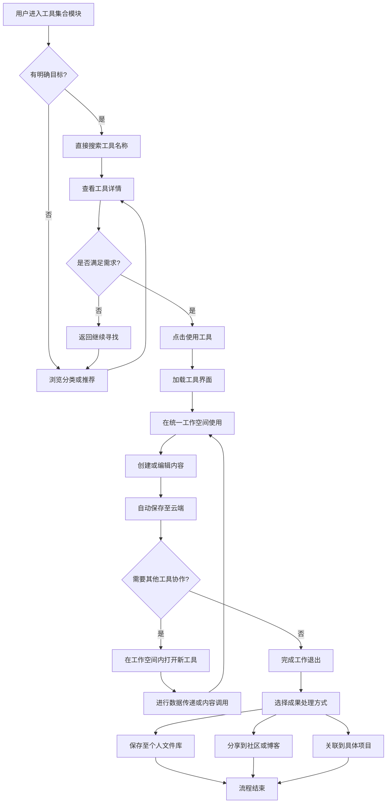

# 2.11 工具集合
## 2.11.1 功能描述
工具集合是九州寰宇平台的核心生产力工具聚合模块，旨在集成各类实用工具，为用户提供一站式生产力解决方案。该模块通过智能分类、个性化推荐和统一工作空间，聚合文档处理、设计创作、数据分析、开发编程、效率提升等多元化工具资源。支持工具即开即用、成果云端保存、多工具协同工作，并深度融入平台生态，与博客、项目公示、在线教育等模块无缝联动，真正实现"一个平台，全能工具"的便捷体验。
## 2.11.2 用户场景

| 场景类型      | 使用角色          | 具体场景描述                                                   |
| --------- | ------------- | -------------------------------------------------------- |
| 学习实践与技能提升 | 数字原生代学生与技术爱好者 | 学生在学习编程课程后，直接在线调用代码编辑器进行实践，将作业成果保存至个人空间并分享到技术社区获得反馈。     |
| 工作效率与生活管理 | 都市乐活白领与中产     | 白领使用在线文档协作撰写报告，用思维导图梳理工作思路，通过日历工具规划日程，所有工具统一账号，无需反复切换登录。 |
| 创作生产与专业协作 | 斜杠内容创作者与独立开发者 | 创作者使用设计工具完成作品后，一键发布到个人博客和项目展示区，工具间支持内容无缝流转，提升创作效率。       |
| 跨工具工作流整合  | 所有深度用户        | 用户在处理数据时，可在表格工具中直接调用图表生成工具，再将可视化结果嵌入到演示文档中，形成完整工作闭环。     |

## 2.11.3 核心价值
- 省时（工具聚合免切换）：聚合海量优质工具，用户无需在不同工具平台间频繁切换登录，节省注册、学习和切换成本。
- 省心（智能推荐直达需求）：基于AI分析用户工作习惯和当前任务，智能推荐最合适的工具组合，降低选择难度。
- 增值（工作流无缝衔接）：打破工具壁垒，实现数据、文件、成果在不同工具间的顺畅流转，创造1+1\>2的协同价值。
- 归属（工具使用社区化）：围绕工具形成兴趣社群，用户可分享工具使用技巧、模板资源，获得成就感与归属感。
## 2.11.4 需求清单

| 功能类别    | 功能名称    | 功能概述                           | 优先级 |
| ------- | ------- | ------------------------------ | --- |
| 工具集成与管理 | 工具分类与导航 | 建立多维度工具分类体系，支持按领域、功能、使用场景等分类浏览 | P0  |
| 工具集成与管理 | 工具发现与搜索 | 提供全局搜索、热门工具推荐、新品上线等功能，方便用户发现工具 | P0  |
| 工具集成与管理 | 工具详情页   | 展示工具功能、使用指南、用户评价、相关资源等信息       | P0  |
| 工具集成与管理 | 工具使用历史  | 记录用户最近使用、常用工具，支持快速访问           | P0  |
| 工具体验与交互 | 统一工作空间  | 提供集成化工具使用环境，支持多工具并行使用          | P1  |
| 工具体验与交互 | 工具即开即用  | 用户点击即可直接使用工具，无需复杂配置            | P0  |
| 工具体验与交互 | 成果云端存储  | 用户使用工具产生的文件、数据自动保存至云端          | P0  |
| 工具体验与交互 | 工具间协作   | 支持不同工具间的数据传递、内容调用              | P1  |
| 个性化与智能  | AI工具推荐  | 基于用户画像、使用场景智能推荐合适工具            | P1  |
| 个性化与智能  | 工具组合模板  | 提供预设的工具组合方案，如"文档写作套装"、"数据分析套装" | P1  |
| 个性化与智能  | 使用技能分析  | 分析用户工具使用习惯，提供技能提升建议            | P2  |
| 社交与生态   | 工具评价与分享 | 用户可对工具进行评分评价，分享使用心得            | P0  |
| 社交与生态   | 工具使用社群  | 围绕工具建立讨论区，用户交流使用技巧             | P1  |
| 社交与生态   | 工具成果展示  | 用户可将工具创作成果展示到个人主页或相关社区         | P1  |
| 后台管理    | 工具接入平台  | 提供标准接口和规范，支持第三方工具快速接入          | P0  |
| 后台管理    | 工具运维监控  | 监控工具使用状态、性能指标，保障服务稳定性          | P0  |
| 后台管理    | 数据统计与分析 | 统计工具使用量、用户满意度等数据，指导运营优化        | P1  |

## 2.11.5 需求详述
### 2.11.5.1 工具分类与导航
- 多维度分类体系：建立三级分类结构，一级按领域划分（办公效率、设计创作、开发编程、学习教育等），二级按功能细分（文档处理、图表制作、代码编辑等），三级按使用场景细分（个人学习、团队协作、专业创作等）。
- 标签化组织：每个工具可添加多个标签，如"免费"、"新手友好"、"团队协作"等，支持按标签组合筛选。
- 可视化导航：采用图标+文字的分类展示方式，支持图标自定义和排序，重要分类在首页优先展示。
- 跨分类关联：工具可属于多个分类，如流程图工具同时出现在"设计创作"和"办公效率"分类中。
### 2.11.5.2 工具发现与搜索
- 智能搜索：支持关键词搜索工具名称、功能描述、用户评价内容，提供搜索建议和纠错功能。
- 个性化推荐：在首页根据用户身份特征（学生、创作者、白领）和使用历史推荐相关工具。
- 场景化推荐：基于用户当前任务场景推荐工具组合，如在项目规划阶段推荐思维导图、甘特图工具。
- 趋势展示：展示热门工具、新上线工具、近期更新工具，帮助用户发现优质资源。
### 2.11.5.3 统一工作空间
- 多标签页管理：支持同时打开多个工具，以标签页形式管理，快速切换不同工具环境。
- 统一账号体系：用户使用所有工具均无需单独注册登录，统一使用平台身份认证。
- 数据互通：在工作空间内不同工具间支持数据拖拽传递，如将表格数据直接拖入图表生成工具。
- 会话保持：用户中途退出后重新进入，可恢复之前的工具使用状态和未保存内容。
### 2.11.5.4 AI工具推荐
- 用户画像分析：综合分析用户注册信息、行为数据、社交关系等，构建精准用户画像。
- 场景感知：结合用户当前所在模块（博客、教育、社区等）和正在进行的任务，推荐相关工具。
- 协同过滤：基于相似用户群体的工具使用偏好，推荐可能感兴趣的工具。
- 反馈优化：根据用户对推荐工具的采纳率和满意度，持续优化推荐算法。
## 2.11.6 核心流程
### 2.11.6.1 工具使用核心流程

## 2.11.7 详细用例
### 用例：学生用户完成课程作业
- 项目描述：计算机专业学生需要完成数据结构课程的编程作业
- 主要参与者：学生用户、工具集合系统、在线教育系统
- 前置条件：用户已登录平台，正在学习数据结构在线课程
- 基本事件流：
	1. 用户在课程页面看到编程作业要求，点击"在线编程"按钮
	2. 系统自动跳转到工具集合的代码编辑器界面，并加载作业模板文件
	3. 用户在编辑器中编写代码，系统提供语法高亮、自动补全功能
	4. 用户点击运行按钮，系统在后台编译执行代码，显示运行结果
	5. 代码调试通过后，用户点击保存，作业自动关联到课程作业提交区
	6. 系统同时将代码保存到用户的个人文件库，并生成使用记录
	7. 用户可以在学习社区分享解题思路，吸引同学讨论交流
- 扩展事件流：
	4a. 代码运行错误：系统显示错误信息和建议修改方案，用户根据提示调试代码
	5a. 需要图表辅助说明：用户在工作空间内打开图表工具，绘制流程图后插入作业文档
## 2.11.8 界面与交互要求

## 2.11.9 埋点方案

| 类别   | 事件/页面 ID          | 事件名称   | 触发时机       | 关键属性                                 |
| ---- | ----------------- | ------ | ---------- | ------------------------------------ |
| 工具发现 | tools\_home\_view | 工具首页浏览 | 用户进入工具集合首页 | source（导航/推荐/通知）                     |
| 工具发现 | tool\_search      | 工具搜索   | 用户搜索工具     | keyword, result\_count               |
| 工具使用 | tool\_launch      | 启动工具   | 用户点击使用工具   | tool\_id, tool\_category             |
| 工具使用 | tool\_usage       | 工具使用时长 | 用户使用工具期间   | tool\_id, duration, operation\_count |
| 工具协作 | tool\_switch      | 工具间切换  | 在工作空间内切换工具 | from\_tool, to\_tool                 |
| 成果管理 | content\_save     | 内容保存   | 用户保存工具成果   | tool\_id, file\_type, size           |
| 社交互动 | tool\_share       | 工具分享   | 用户分享工具或成果  | tool\_id, share\_platform            |

## 2.11.10 技术细节
### 2.11.10.1 架构设计
- 微服务架构：工具管理、用户认证、文件存储、推荐引擎等模块独立部署，通过API网关统一调度
- 容器化部署：每个工具采用Docker容器化部署，保证环境隔离和快速扩缩容
- 统一认证：基于OAuth 2.0实现统一身份认证，一次登录即可使用所有工具
- 数据存储：结构化数据使用PostgreSQL，文件数据使用对象存储，缓存使用Redis集群
### 2.11.10.2 性能优化
- 懒加载策略：工具界面按需加载，优先加载核心功能，提升响应速度
- CDN加速：静态资源通过CDN分发，保证全球用户访问速度
- 缓存策略：常用工具模板、用户偏好设置等多级缓存，减少数据库压力
### 2.11.10.3 安全约束
- 沙箱环境：第三方工具在沙箱环境中运行，防止恶意代码影响主系统
- 数据加密：用户文件传输和存储全程加密，保护隐私数据
- 访问控制：精细化的权限管理，控制用户对工具和数据的访问权限