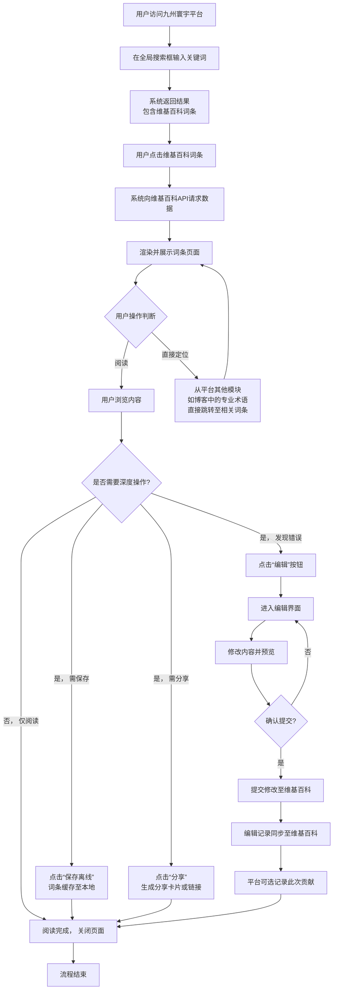

# 2.12 维基百科
## 2.12.1 功能描述
维基百科是九州寰宇平台集成的一项核心知识服务模块，是一个基于维基技术的多语言、协作式在线百科全书。该模块允许用户通过统一平台入口，直接访问、搜索和阅读覆盖300多种语言、超过4000万篇条目的高质量百科全书内容。用户无需切换应用即可进行跨语言内容浏览、全文检索、文章离线保存以及参与内容编辑协作。其与平台其他模块（如博客系统、在线教育、项目公示）深度集成，支持知识内容的一键引用与分享，旨在为用户提供一个无缝、高效的知识获取与贡献环境，强化平台“信息一站式聚合”的核心价值。
## 2.12.2 用户场景

| 场景类型       | 使用角色          | 具体场景描述                                                                  |
| ---------- | ------------- | ----------------------------------------------------------------------- |
| 学习研究中的即时查证 | 数字原生代学生与技术爱好者 | 学生在撰写技术博客或完成课程项目时，遇到不明术语或概念，可直接在平台内搜索维基百科，快速获取权威解释，并引用到文章或项目报告中，提升内容质量。 |
| 工作决策的参考支持  | 都市乐活白领与中产     | 白领在阅读“好物推荐”或规划旅行时，需了解某品牌背景或目的地文化，通过维基百科获取结构化、多角度的信息，辅助消费决策或行程规划。        |
| 内容创作的素材搜集  | 斜杠内容创作者与独立开发者 | 创作者准备视频脚本或专题文章时，利用维基百科的系统性知识梳理作为基础素材，确保事实准确性，并通过编辑功能补充最新动态，完善知识条目。      |
| 跨语言信息的获取   | 有国际视野的用户      | 用户需要查阅某国外科技公司的历史或某国际事件的多方观点，利用维基百科的多语言版本切换功能，对比不同文化视角下的内容叙述。            |
| 离线环境的持续学习  | 通勤或旅行中的用户     | 用户在网络信号不佳的环境下，提前将所需百科文章保存至本地，在离线状态下随时阅读，实现不间断的知识积累。                     |

## 2.12.3 核心价值
- 省时（一站式知识获取）：将全球最大的百科全书深度集成至平台，用户免去单独访问、注册维基百科的步骤，在信息获取、内容创作、学习娱乐等场景中实现无缝切换，极大提升效率。
- 省心（智能知识推荐）：结合平台AI个性化推荐引擎，根据用户当前浏览内容、兴趣标签及学习路径，主动推荐相关的维基百科词条，降低信息搜寻成本，实现“知识找人”。
- 增值（知识生态联动）：维基百科的词条可作为基础知识图谱，与平台的“博客系统”（引用来源）、“在线教育”（课程辅助材料）、“项目公示”（技术背景说明）等模块形成强大联动，赋予单一信息点更多应用场景，提升整体体验价值。
- 归属（参与共建的成就感）：用户可基于平台统一身份，直接参与维基百科条目的编辑、修正与补充，其贡献可同步展示在个人主页或社区动态中，增强用户在平台内的参与感、归属感与影响力。
## 2.12.4 需求清单

| 功能类别 | 功能名称      | 功能概述                                  | 优先级 |
| ---- | --------- | ------------------------------------- | --- |
| 内容核心 | 多语言知识库接入  | 无缝接入维基百科官方API，同步其多语言（超300种）词条内容与实时更新。 | P0  |
| 内容核心 | 全局搜索与全文检索 | 支持关键词搜索维基百科全库，结果按相关度、语言、热度排序。         | P0  |
| 内容核心 | 词条页面展示    | 高清渲染词条内容，包括文本、图片、表格、参考资料、目录导航。        | P0  |
| 内容核心 | 多语言版本切换   | 用户可便捷切换同一词条的不同语言版本，对比阅读。              | P0  |
| 交互体验 | 阅读偏好设置    | 支持设置字体大小、主题（日间/夜间/护眼）、默认显示语言。         | P1  |
| 交互体验 | 离线阅读功能    | 用户可保存词条至本地，无网络时也可查看已保存内容。             | P1  |
| 交互体验 | 内容分享与引用   | 支持将词条或特定章节分享至平台内外，并提供标准化引用格式。         | P0  |
| 交互体验 | 阅读历史与书签   | 自动记录浏览历史，用户可主动添加书签，便于后续继续阅读。          | P0  |
| 社区协作 | 统一身份编辑    | 用户使用平台统一账号登录后，可直接编辑维基百科词条。            | P1  |
| 社区协作 | 编辑预览与历史   | 提供编辑预览模式，并可查看词条的完整修改历史与版本对比。          | P1  |
| 社区协作 | 协作讨论区接入   | 集成维基百科词条讨论页，用户可就编辑内容进行交流。             | P2  |
| 平台集成 | 智能内容推荐    | AI引擎根据用户行为，在信息流中推荐相关维基百科词条。           | P1  |
| 平台集成 | 跨模块知识关联   | 在博客、课程、项目等模块中，关键概念可一键跳转至相关维基词条。       | P1  |
| 后台管理 | 内容缓存与更新   | 管理端配置缓存策略，平衡数据实时性与访问性能。               | P0  |
| 后台管理 | 访问数据统计    | 后台统计词条浏览量、搜索热词、用户活跃度等数据。              | P1  |

## 2.12.5 需求详述
### 5.1 多语言知识库接入
- API无缝集成：通过维基百科官方提供的API接口，实时、稳定地获取最新词条内容。确保数据同步的准确性与时效性，延迟控制在分钟级以内。
- 内容格式化处理：对API返回的原始数据（包含Wiki标记语言）进行解析和渲染，确保复杂格式（如数学公式、信息框、表格）在平台内正确、美观地显示。
- 增量更新机制：建立增量同步机制，优先同步高热度或用户最近访问过的词条，优化服务器资源分配。
### 5.2 全局搜索与全文检索
- 统一搜索入口：在平台全局搜索框内，输入关键词后，维基百科词条作为一类重要结果，与平台内博客、项目等内容一同呈现，并有明显标识区分。
- 高级筛选功能：搜索结果页面提供筛选条件，如按语言、所属学科领域（历史、科学、文化等）、词条类型（人物、事件、概念）进行精确过滤。
- 搜索建议与纠错：根据用户输入实时提供搜索建议，并对常见拼写错误进行自动纠正或提示，提升搜索成功率。
### 5.3 词条页面展示
- 响应式布局：页面采用响应式设计，在桌面端和移动端均能提供最佳的阅读体验。主体内容区清晰易读，侧边栏可显示词条目录，便于快速导航。
- 多媒体支持：完美嵌入并展示词条内的图片、图表等信息，支持点击放大查看。适配音频、视频等富媒体内容（如果词条包含）。
- 参考资料链接：文中的参考文献以超链接形式呈现，点击后可跳转至源网站，或以稳妥方式（如新标签页打开）处理外部链接，保障用户安全。
### 5.4 离线阅读功能
- 一键保存：在词条页面的显著位置提供“保存离线”按钮，用户点击后即可将当前词条的文本和图片缓存至本地设备。
- 离线内容管理：在用户个人中心设有“我的离线库”模块，可查看、管理所有已保存的词条，支持创建文件夹进行分类管理。
- 存储空间提示：系统会提示离线内容所占用的存储空间，并允许用户批量删除已保存的词条，避免占用过多设备容量。
### 5.5 统一身份编辑
- 权限打通：用户使用九州寰宇平台统一账户体系进行认证，无需额外注册维基百科账户，即可进行符合维基百科社区规范的编辑操作。
- 编辑界面集成：在词条页面提供“编辑”入口，点击后唤起集成的、易于使用的编辑界面（支持可视化编辑和源码编辑两种模式），降低用户参与门槛。
- 贡献记录关联：用户的编辑行为将记录在维基百科的公共编辑历史中，同时，其重要贡献也可选择性地同步显示在九州寰宇平台的个人主页，作为其知识贡献的体现。
## 2.12.6 核心流程
### 2.12.6.1 核心阅读与编辑流程

## 2.12.7 详细用例
### 用例：学生用户快速查询概念并用于博客写作
- 项目描述：一名大学生在撰写关于“人工智能伦理”的博客时，需要快速理解“技术奇点”概念。
- 主要参与者：学生用户、九州寰宇平台、维基百科API。
- 前置条件：用户已登录九州寰宇平台，并处于博客编辑器的写作界面。
- 基本事件流：
	1. 用户在博客编辑器中写到“技术奇点”这一术语时，选中该词，右键点击弹出菜单，选择“搜索‘技术奇点’”。
	2. 平台右侧滑出搜索面板，结果显示来自维基百科的“技术奇点”词条排在首位。
	3. 用户点击该结果，词条内容以浮动层或侧边栏形式快速展开，用户快速浏览定义和核心观点。
	4. 用户认为解释准确，点击内容下方的“引用”按钮，系统自动生成标准格式的引用（如Markdown格式的链接和摘要）。
	5. 引用内容被自动插入到博客编辑器光标所在位置。
	6. 用户继续写作，并可随时再次打开该词条浮动层参考更多细节。
	7. 写作完成后，用户还将该词条保存至离线库，以备日后查阅。
- 扩展事件流：
	3a. 内容需深入阅读：用户选择在新页面全屏打开该词条，进行深度阅读。
	4a. 发现内容需补充：用户发现词条某处描述可完善，点击“编辑”，进行简要补充并提交，完成一次知识贡献。
## 2.12.8 界面与交互要求

## 2.12.9 埋点方案

| 类别     | 事件/页面 ID                    | 事件名称   | 触发时机                 | 关键属性（示例）                                   |
| ------ | --------------------------- | ------ | -------------------- | ------------------------------------------ |
| 页面访问   | page\_wikipedia\_view       | 词条页面浏览 | 用户成功进入维基百科词条页        | entry\_title, language, source（搜索/推荐/内部链接） |
| 内容互动   | wikipedia\_search           | 维基百科搜索 | 用户在维基百科搜索框或全局搜索中执行搜索 | search\_query, result\_count               |
| 内容互动   | wikipedia\_language\_switch | 语言切换   | 用户切换词条的语言版本          | from\_language, to\_language               |
| 内容互动   | wikipedia\_save\_offline    | 保存离线   | 用户点击保存词条供离线阅读        | entry\_title                               |
| 用户生成内容 | wikipedia\_edit\_start      | 开始编辑   | 用户进入词条编辑界面           | entry\_title                               |
| 用户生成内容 | wikipedia\_edit\_submit     | 提交编辑   | 用户提交对词条的修改           | entry\_title, edit\_summary（如有）            |
| 分享行为   | wikipedia\_share            | 分享词条   | 用户通过分享按钮分享词条         | entry\_title, share\_channel（平台内/外）        |

## 2.12.10 技术细节
- 架构设计：采用后端聚合API网关模式。九州寰宇平台后端通过API网关统一调用维基百科官方API，并对返回的数据进行格式化、过滤和缓存处理，再提供给前端。这有助于提升性能、控制数据结构和实施安全策略。
- 缓存策略：实施多级缓存。使用Redis缓存热点词条和搜索结果，降低API调用延迟。对不常变动的词条内容，设置较长的缓存时间（如24小时），对高热度或近期修改过的词条，设置较短的缓存时间（如几分钟）。
- 性能优化：
	- 图片懒加载：词条内的图片采用懒加载技术，当用户滚动到图片位置时再加载，提升页面首屏加载速度。
	- 文本压缩：对传输的文本内容进行GZIP压缩，减少网络传输量。
- 安全约束：
	- 输入验证与转义：对所有用户输入（如搜索词）进行严格的验证和转义，防止XSS等注入攻击。
	- 编辑权限控制：虽使用统一身份，但编辑操作需遵循维基百科社区规则，平台侧需有机制防止恶意刷编辑行为，并准备接受维基百科的反滥用机制监督。