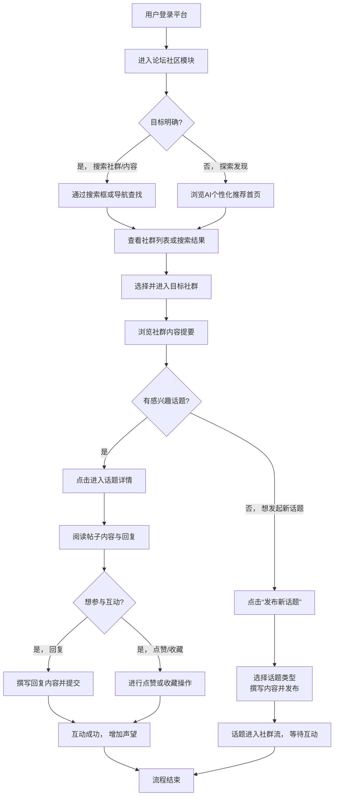

# 2.13 论坛社区
## 2.13.1 功能描述
论坛社区是九州寰宇平台的核心互动与归属感建设模块，是一个基于兴趣图谱与地理邻近的现代化动态社区系统。它超越了传统BBS的线性讨论模式，构建了一个集主题社群、实时互动、知识沉淀与活动组织于一体的社交空间。用户可根据个人兴趣与地理位置，发现并加入多元化社群，参与异步讨论、实时聊天、线上/线下活动，并借助AI赋能的内容推荐与创作辅助工具，高效地进行知识交流、经验分享与关系建立，最终在平台内获得深度的归属感和社区认同。
## 2.13.2 用户场景

| 场景类型        | 使用角色          | 具体场景描述                                                                      |
| ----------- | ------------- | --------------------------------------------------------------------------- |
| 兴趣探索与知识获取   | 数字原生代学生与技术爱好者 | 一名计算机专业学生希望深入学习前端框架，通过平台兴趣标签系统发现“前端开发前沿”社群，参与技术讨论，向行业专家提问，并获取学习资源。          |
| 生活决策与本地社交   | 都市乐活白领与中产     | 一位刚搬到新城市的白领，通过基于地理位置的社区推荐，加入“新城美食探索”和“周末徒步小队”等本地社群，获取可信的本地生活指南并结识附近志同道合的朋友。 |
| 个人品牌建设与专业协作 | 斜杠内容创作者与独立开发者 | 一位UI设计师在“创意设计联盟”社群中持续分享作品与见解，积累声望，并通过社群发起线上设计挑战赛，吸引潜在客户与合作伙伴，扩大个人影响力。       |
| 跨场景知识应用与分享  | 所有平台用户        | 用户在“在线教育”模块学习完数据分析课程后，直接在相关的“数据实践社”社群中分享自己的课程项目成果，获得社群成员的反馈和建议，形成学习闭环。      |

## 2.13.3 核心价值
- 省时（一站式互动）：将分散的社群讨论、活动组织、知识分享功能聚合于平台内，用户无需在多个独立社交应用间切换，即可满足全方位的互动需求。
- 省心（智能连接）：通过AI分析用户兴趣、行为与地理位置，智能推荐高价值社群、优质讨论内容与潜在好友，降低用户发现优质内容和连接的成本。
- 增值（生态联动）：社区与博客、项目、教育、工具等模块深度打通。博客文章可引发社区讨论，社区成果可沉淀为项目，社群活动可整合平台工具，创造叠加价值。
- 归属（深度参与）：通过精细化的社群管理工具、声望等级体系以及线上线下一体化的活动，培养成员间的信任与情感连接，使平台成为用户的精神家园。
## 2.13.4 需求清单

| 功能类别    | 功能名称    | 功能概述                                  | 优先级 |
| ------- | ------- | ------------------------------------- | --- |
| 社群架构与发现 | 动态兴趣社群  | 支持用户基于兴趣标签创建、发现和加入社群，支持公开/半公开/私密等多种类型 | P0  |
| 社群架构与发现 | AI社群推荐  | 基于用户画像、行为数据及地理位置，智能推荐相关社群和热门内容        | P1  |
| 社群架构与发现 | 地理邻近社区  | 基于LBS推荐同城、附近社群及活动，促进线下互动              | P1  |
| 内容创作与互动 | 多载体话题   | 支持发布普通帖子、投票、问答、活动等多种话题形式              | P0  |
| 内容创作与互动 | 智能内容推荐  | 在社群内及全局推荐用户可能感兴趣的话题和精华内容              | P1  |
| 内容创作与互动 | 实时互动功能  | 集成群组聊天、帖子内@提及、实时通知等功能                 | P1  |
| 内容创作与互动 | 内容声望系统  | 通过点赞、采纳、精华等机制，量化内容价值与用户贡献             | P0  |
| 用户管理与声望 | 成员角色与权限 | 定义所有者、管理员、版主、核心成员、普通成员等角色及权限          | P0  |
| 用户管理与声望 | 用户声望与等级 | 建立基于贡献的声望等级体系，解锁专属权益和可视化标识            | P1  |
| 用户管理与声望 | 匿名互动机制  | 在特定板块或话题下支持匿名发帖/回复，保护隐私               | P1  |
| 活动与集成   | 线上线下活动  | 支持创建、发布、报名线上活动（如直播）和线下活动，并关联社群        | P1  |
| 活动与集成   | 平台生态集成  | 与博客、项目、教育等模块深度集成，支持内容一键分享至社区讨论        | P0  |
| 管理与运营   | 内容审核与管理 | 支持自动化规则与人工审核结合，管理举报，处理违规内容            | P0  |
| 管理与运营   | 社群数据洞察  | 为社群主和管理员提供成员活跃度、内容趋势等数据看板             | P1  |
| 管理与运营   | 平台管理后台  | 提供全面的社区管理、用户管理、数据统计功能                 | P0  |

## 2.13.5 需求详述
### 2.13.5.1 动态兴趣社群
- 灵活创建机制：允许用户通过选择多个兴趣标签（如“编程”、“Python”、“机器学习”）来创建或发现社群。社群类型包括：
	- 公开社群：自由加入，内容完全公开。
	- 半公开社群：自由加入或需审核，内容公开，但发帖权限可设限。
	- 私密社群：需邀请或申请并经严格审核，内容仅成员可见。
- 社群信息结构：每个社群拥有独立主页，包含社群简介、标签、规则、核心成员、精华内容区、最新动态等。
- 个性化装扮：允许社群主自定义社群头像、封面图、颜色主题，形成独特品牌形象。
### 2.13.5.2 多载体话题
- 丰富发布形式：提供多种话题类型以满足不同互动需求：
	- 标准讨论帖：支持富文本、Markdown、多图上传、附件、嵌入视频等。
	- 问答帖：提问者可以标记一个最佳答案，形成知识沉淀。
	- 投票帖：快速收集群体意见。
	- 活动帖：集成活动功能，包含时间、地点、报名流程。
- 智能编辑器：编辑器可根据用户所在社群的主题（如技术社群出现代码插入选项，设计社群出现多图上传提示）提供智能化工具选项 。
- 内容恢复功能：防止因网络问题导致内容丢失，提供草稿自动保存和提交内容恢复机制 。
### 2.13.5.3 成员角色与权限
- 精细化权限体系：
	- 所有者：拥有社群所有管理权限，可转让社群。
	- 管理员：可管理内容、成员、设置部分社群信息。
	- 版主：负责特定板块的内容审核和用户互动引导。
	- 核心成员（基于声望）：拥有诸如高亮、关闭话题等高级权限。
	- 普通成员：可发帖、回复、参与互动。
	- 游客：仅可浏览公开内容。
- 权限可视化：不同角色的用户在社群内拥有独特的标识和权限说明。
### 2.13.5.4 内容审核与管理
- 多层审核机制：
	- 自动化过滤：基于关键词、图片识别等技术自动拦截或标记高风险内容。
	- 社群自治：社群管理员和版主负责本社群的日常内容审核与管理。
	- 平台监管：平台运营团队处理跨社群的严重违规和用户申诉。
- 举报与处理流程：用户可举报违规内容，系统跟踪举报处理状态，并对有效举报者给予轻微声望奖励。
### 2.13.5.5 平台生态集成
- 内容双向引流：
	- 博客至社区：用户可将博客文章同步或推荐到相关社群，引导讨论。
	- 项目至社区：项目创作者可在相关社群展示项目进展，招募协作者。
	- 教育至社区：课程学习者可一键将学习笔记或疑问分享至特定学习社群。
- 统一通知中心：社区互动（如回复、@提及）通知与其他模块通知聚合在平台统一的通知中心。
## 2.13.6 核心流程
### 2.13.6.1 用户参与社区核心流程

## 2.13.7 详细用例
### 用例：白领用户通过本地社群组织周末活动
- 项目描述：一位白领用户希望通过社群找到周末同好一起骑行。
- 主要参与者：白领用户、社群管理员、其他社群成员。
- 前置条件：用户已登录平台，并允许平台获取其地理位置信息。
- 基本事件流：
	1. 用户进入论坛社区首页，系统基于其位置和过往浏览兴趣，在“附近热门社群”中推荐了“新城周末户外团”。
	2. 用户点击进入该社群，浏览简介和过往活动照片，觉得符合兴趣，点击“加入社群”（此为公开社群）。
	3. 加入后，用户在社群内看到置顶的版规和活动发起指南。
	4. 用户点击“发布活动”，填写活动主题“周末西山绿道骑行”，选择活动类型为“线下活动”，设置时间、集合地点、预估人数、费用说明（AA制）。
	5. 发布后，活动帖出现在社群流中，并有人开始报名。
	6. 系统通过站内信和APP推送通知了其他对户外活动感兴趣的附近用户。
	7. 几位用户报名并在线提问，发起者一一回复。同时，有资深成员在帖子下补充了骑行路线注意事项。
	8. 活动成行后，参与用户回到活动帖分享照片和感受，该帖沉淀为社群的精华活动记录。
- 扩展事件流：
	4a. 用户不确定活动细节：用户可先发布一个“投票”帖，征集大家对时间和路线的意见，再发起正式活动。
	7a. 报名人数超预期：发起者可利用平台的在线支付能力，要求报名者提前支付小额定金以确保参与率。
## 2.13.8 界面与交互要求
参考UI设计稿
## 2.13.9 埋点方案

| 类别   | 事件/页面 ID              | 事件名称   | 触发时机         | 关键属性（示例）                              |
| ---- | --------------------- | ------ | ------------ | ------------------------------------- |
| 页面访问 | page\_community\_home | 社区首页浏览 | 用户进入社区首页     | source（平台导航/通知引导）                     |
| 社群互动 | community\_join       | 加入社群   | 用户成功加入一个社群   | community\_id, community\_category    |
| 社群互动 | community\_leave      | 离开社群   | 用户主动退出社群     | community\_id                         |
| 内容互动 | topic\_publish        | 发布话题   | 用户成功发布一个新话题  | topic\_id, topic\_type, community\_id |
| 内容互动 | topic\_reply          | 回复话题   | 用户回复一个话题     | topic\_id, reply\_length              |
| 内容互动 | content\_like         | 点赞内容   | 用户点赞帖子或回复    | content\_id, content\_type            |
| 系统交互 | notification\_click   | 点击通知   | 用户点击社区相关推送通知 | notification\_type（回复/提及/点赞等）         |

## 2.13.10 技术细节
- 架构设计：采用微服务架构，将用户服务、社群服务、内容服务、消息推送服务、推荐引擎等解耦，通过API网关统一调度，保证高可用性和弹性扩展能力。
- 推荐算法：使用协同过滤（基于用户行为相似性）和内容基于过滤（基于社群和话题标签）的混合推荐模型，并融入地理位置因子，提高推荐准确性。
- 实时交互：使用WebSocket或Server-Sent Events (SSE) 技术实现实时通知、在线状态显示和即时聊天功能，确保低延迟互动体验。
- 性能与缓存：
	- 对热点社群列表、热门话题、用户基本信息等实施多级缓存（如Redis），极大减少数据库读取压力。
	- 对图片、附件等静态资源使用CDN加速分发。
- 安全与合规：
	- 实施严格的内容安全过滤机制，对用户生成内容（UGC）进行实时扫描和事后审核。
	- 所有用户数据（包括私信）进行加密存储和传输，符合GDPR等数据隐私法规。