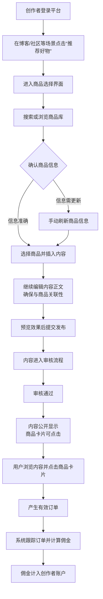

# 2.14 好物推荐
## 2.14.1 功能描述
“好物推荐”是九州寰宇平台整合内容种草与电商导购的核心模块，是一个集AI智能导购、创作者种草社区、跨平台比价返利于一体的消费决策与价值分享平台。该模块深度融合平台的内容生态（博客、社区、项目），允许用户（特别是创作者）通过文章、视频、动态等多种形式分享真实消费体验，推荐优质商品，并嵌入来自主流电商平台（如京东、淘宝、拼多多等）的商品卡片。其他用户可以进行互动、获取建议，并实现便捷的一站式购买，创作者则可据此获得佣金收入，形成“内容-互动-交易-收益”的价值闭环。其核心在于将消费决策深度融入用户的内容消费与社交流程，打造可信、高效、有趣的平台内消费体验。
## 2.14.2 用户场景

| 场景类型       | 使用角色          | 具体场景描述                                                                       |
| ---------- | ------------- | ---------------------------------------------------------------------------- |
| 内容种草与消费决策  | 都市乐活白领与中产     | 用户在购买新款笔记本电脑前，在平台内搜索相关评测，阅读多位创作者的深度测评文章和视频，结合AI整理的对比清单，做出购买决策，并通过文章内商品卡片下单。  |
| 知识变现与影响力构建 | 斜杠内容创作者与独立开发者 | 一位资深数码摄影师在博客撰写“专业摄影器材年度推荐”长篇评测，文中嵌入多个相机、镜头商品卡片。粉丝阅读后通过链接购买，创作者获得佣金，提升个人品牌价值。 |
| 社群分享与跟风购买  | 数字原生代学生与技术爱好者 | 学生在某个兴趣社群（如“高性价比数码党”）看到群主发布的“宿舍神器”好物清单帖子，对其中一款便携显示器很感兴趣，直接跟风购买并在社群内晒单。       |
| AI导购与精准发现  | 所有用户          | 用户有模糊需求（如“想提升居家幸福感的小物件”），通过AI万能搜输入需求，AI生成一份结合场景的图文推荐清单，用户可直接浏览并跳转购买。         |
| 活动营销与主题消费  | 平台及商家         | 平台策划“七夕送礼指南”专题活动，聚合相关创作者内容，并引入合作品牌商品，用户可在主题页内一站式获取灵感并完成礼品采购。                 |

## 2.14.3 核心价值
- 省时（决策效率）：聚合真实用户评测、AI智能导购与跨平台比价，为用户过滤商业噪音，缩短从需求产生到购买决策的路径，避免在多平台间反复横跳。
- 省心（信任代理）：基于平台内可信创作者（KOL/KOC）的真实分享和社群互动反馈，构建高于单纯广告的信任体系，让消费决策更安心、更可靠。
- 增值（生态联动与收益共享）：将消费内容与博客、社区、项目等模块深度绑定（如项目所需的工具推荐、学习课程的资料推荐），并为创作者提供知识变现渠道，形成平台、用户、创作者三方共赢的生态。
- 归属（社群化消费）：围绕共同消费兴趣形成社群（如“宝妈好物团”、“摄影装备党”），用户在社群内分享、讨论、跟买，增强消费的社交乐趣和群体归属感。
## 2.14.4 需求清单

| 功能类别    | 功能名称          | 功能概述                            | 优先级 |
| ------- | ------------- | ------------------------------- | --- |
| 内容创作与集成 | 多场景好物推荐       | 支持在博客文章、社区帖子、项目描述、个人动态中插入商品推荐卡片 | P0  |
| 内容创作与集成 | 商品卡片与橱窗       | 提供标准化商品卡片组件，支持创作者在个人主页设置精品商品橱窗  | P0  |
| 内容创作与集成 | 内容规范与审核       | 定义推荐内容格式（如文字下限）、原创要求，建立审核机制     | P0  |
| 商品与供应链  | 多平台商品库接入      | 接入京东、淘宝、拼多多、美团等主流电商平台商品库        | P0  |
| 商品与供应链  | 商品搜索与筛选       | 创作者可通过关键词、品类等搜索并选择要推荐的商品        | P0  |
| 商品与供应链  | 禁限售品类管理       | 定义平台禁止或限制推荐的品类（如医疗、金融、成人用品等）    | P0  |
| AI赋能    | AI智能导购（AI万能搜） | 用户自然语言输入需求，AI生成图文结合的推荐清单与选购建议   | P1  |
| AI赋能    | AI辅助创作        | 为创作者提供选品建议、标题优化、内容润色等AI工具       | P2  |
| AI赋能    | 个性化推荐引擎       | 基于用户画像、行为数据，在信息流中个性化推荐好物内容与商品   | P1  |
| 互动与社区   | 互动与评价体系       | 支持对推荐内容点赞、收藏、评论、提问，建立问答氛围       | P0  |
| 互动与社区   | 真实口碑沉淀        | 鼓励购买者发表“买家秀”和长期使用报告，沉淀真实评价      | P1  |
| 交易与佣金   | 佣金管理与结算       | 跟踪订单，计算并管理创作者佣金，提供提现功能          | P0  |
| 交易与佣金   | 统一支付与跳转       | 与统一支付中心集成，支持平台内下单或安全跳转至电商平台APP  | P0  |
| 交易与佣金   | 订单与收益查询       | 创作者可查询推广订单明细、佣金收入及预计到账时间        | P0  |
| 运营与风控   | 创作者管理与权限      | 创作者申请、权限分级（基础/扩展）、擅长品类设置        | P0  |
| 运营与风控   | 反作弊与合规        | 防范刷单、刷赞等作弊行为，确保推荐真实性            | P1  |
| 运营与风控   | 专题活动与运营       | 平台策划主题营销活动，聚合优质内容与商品            | P1  |

## 2.14.5 需求详述
### 2.14.5.1 多场景好物推荐
- 无缝嵌入：在博客编辑器、社区发帖器、项目编辑页面等场景，提供明显的“推荐好物”按钮（如钱袋图标），点击后唤起商品搜索与选择面板。
- 内容关联：系统应鼓励并引导创作者使推荐的商品与所在内容高度相关，避免无关推广。
- 呈现形式：嵌入的商品卡片需与正文样式协调，展示商品主图、标题、价格、来源平台、佣金比例（可选显示）等关键信息。
### 2.14.5.2 多平台商品库接入
- API集成：通过各电商平台的开放API（如京东联盟、淘宝联盟、多多进宝）接入其商品库，确保商品信息（价格、库存、详情）的相对实时性。
- 佣金同步：同步各平台的佣金政策，确保创作者能准确了解推广收益。
- 账号绑定：创作者如需推广某平台商品，需在平台内完成相应平台推广账号的绑定授权。
### 2.14.5.3 AI智能导购（AI万能搜）
- 自然语言交互：提供搜索入口，用户可输入如“送给喜欢户外露营的男朋友的生日礼物，预算500元”等复杂需求。
- 结构化报告：AI生成的结果应以清晰的结构呈现，如分场景（如“露营舒适性”、“安全照明”）、分预算、包含商品图、核心卖点、价格对比等。
- 深度思考与偏好：支持“深度思考”模式，提供更详尽的决策逻辑；同时结合用户平台内行为数据，呈现个性化推荐结果。
### 2.14.5.4 佣金管理与结算
- 订单跟踪：通过API跟踪通过平台商品卡片产生的有效订单，准确归属至对应的创作者和内容。
- 收益可视化：在创作者中心提供清晰的收益面板，展示预估收入、已结算收入、待结算收入等。
- 多平台汇总：支持将来自不同电商平台的佣金收入在平台内统一管理，简化创作者对账流程。
- 提现通路：提供便捷的提现功能，部分平台佣金可能需跳转至其官方平台提现。
### 2.14.5.5 创作者管理与权限
- 权限分级：
	- 基础权限：所有合规用户可推荐平台自营或特定合作商品。
	- 扩展权限：创作者满足一定条件（如内容质量、粉丝数、活跃度）后可申请，解锁推荐京东、淘宝等外部平台商品的权限。
- 擅长品类：引导创作者设置1-3个擅长推荐品类，有助于系统精准推荐粉丝和内容。
- 规范与教育：明确告知创作者内容规范（如原创要求、字数下限、禁止行为），并提供操作指南。
## 2.14.6 核心流程
### 2.14.6.1 创作者发布好物推荐核心流程

## 2.14.7 详细用例
### 用例：白领用户通过AI导购与创作者内容购买办公用品
- 项目描述：一位白领用户欲购置提升工位舒适度的设备，预算有限。
- 主要参与者：白领用户、AI智能导购系统、创作者、好物推荐系统。
- 前置条件：用户已登录九州寰宇平台。
- 基本事件流：
	1. 用户在平台首页搜索框使用AI万能搜，输入：“500元以内，能提升办公室工位舒适度的好物，要安静不吵同事。”
	2. AI生成一份推荐报告，分类列出“人体工学”、“桌面收纳”、“环境改善”等类别的商品，如腕托、收纳盒、小型加湿器，并附推荐理由和价格。
	3. 用户对其中一款加湿器感兴趣，点击查看AI推荐详情，同时系统在下方关联显示平台内创作者撰写的关于该商品或同类商品的评测文章。
	4. 用户点开一篇评价真实的创作者文章，仔细阅读后，确认此物符合需求。
	5. 用户点击文章中的商品卡片，查看实时价格和优惠券信息。
	6. 用户决定购买，点击卡片上的“购买”按钮，系统安全跳转至京东APP该商品页面（用户手机已安装），或调用平台统一收银台（若支持）。
	7. 用户在京东完成支付。
	8. 数日后，交易成功，创作者获得佣金。用户可在平台社区晒单，分享使用体验。
- 扩展事件流：
	2a. AI推荐不满意：用户可修正需求，或转而直接搜索创作者的相关评测内容。
	5a. 发现更优选择：用户在浏览创作者文章时，可能被文中提到的另一款更合适的商品种草，转而购买该商品。
## 2.14.8 界面与交互要求
参考UI设计稿
## 2.14.9 埋点方案

| 类别    | 事件/页面 ID                     | 事件名称     | 触发时机                 | 关键属性（示例）                                       |
| ----- | ---------------------------- | -------- | -------------------- | ---------------------------------------------- |
| 内容互动  | goodstuff\_content\_view     | 好物推荐内容浏览 | 用户浏览包含商品卡片的内容页       | content\_id, content\_type（博客/帖子）, creator\_id |
| 内容互动  | goodstuff\_card\_click       | 商品卡片点击   | 用户点击内容中的商品卡片         | content\_id, item\_id, platform\_source        |
| 购物行为  | goodstuff\_purchase\_intent  | 产生购买意向   | 用户点击商品卡片后跳转或调起收银台    | item\_id, referral\_content\_id                |
| AI交互  | ai\_shopping\_query          | AI导购查询   | 用户使用AI万能搜进行提问        | query\_text, result\_count                     |
| AI交互  | ai\_recommendation\_feedback | AI推荐反馈   | 用户对AI生成推荐清单进行有用/无用评价 | query\_id, is\_helpful                         |
| 创作者行为 | goodstuff\_content\_publish  | 发布好物推荐   | 创作者成功发布含商品卡片的内容      | content\_id, item\_count                       |

## 2.14.10 技术细节
- 架构设计：采用微服务架构，分离商品服务（管理商品库、价格同步）、内容服务（管理推荐内容）、佣金服务（订单跟踪、结算）、AI推荐服务（智能导购、个性化推荐），通过API网关聚合。
- 商品数据同步：通过电商平台API定时（如每小时）或触发式同步商品核心信息（价格、库存、状态）。考虑使用消息队列应对同步高峰。
- AI推荐算法：结合协同过滤（基于用户与商品行为）和基于内容的推荐（基于商品特征和内容标签），并引入深度学习模型处理自然语言查询和复杂场景。
- 订单跟踪技术：采用电商联盟通用的技术方案，如通过跳转链接埋参（ulink）、API订单查询等方式进行跟踪，需处理订单状态同步和归因逻辑。
- 性能与缓存：对商品信息、热门推荐内容等实施多级缓存（Redis），显著降低API调用延迟和数据库压力。静态资源（商品图片）使用CDN加速。
- 安全与合规：
	- 严格过滤和审核推荐内容，防止虚假宣传和违禁品推广。
	- 用户隐私数据加密存储与传输，遵守相关法律法规。
	- 防范佣金作弊行为，建立反作弊规则引擎。