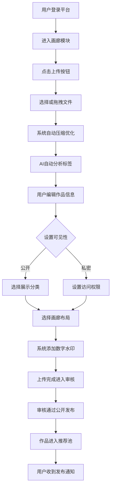

# 2.15 画廊
## 2.15.1 功能描述
画廊是九州寰宇平台的核心视觉内容展示模块，是一个集数字艺术品展示、摄影作品分享、视觉创作社区于一体的沉浸式视觉内容平台。该模块支持用户上传、管理、展示各类图像与视频作品（包括摄影、绘画、设计、数字艺术等），提供专业的作品分类、标签管理、版权保护功能，并通过AI智能推荐、社交互动、虚拟展览等创新形式，构建一个连接创作者与欣赏者的视觉内容生态。其核心在于为平台用户提供高品质的视觉内容消费体验，同时为视觉创作者提供作品展示、价值变现和社区交流的一站式解决方案。
## 2.15.2 用户场景

| 场景类型        | 使用角色          | 具体场景描述                                                 |
| ----------- | ------------- | ------------------------------------------------------ |
| 作品展示与个人品牌建设 | 斜杠内容创作者与独立开发者 | 摄影师用户将个人作品按主题分类上传，设置个性化画廊布局，通过平台社交功能分享作品集，吸引潜在客户和合作机会。 |
| 视觉内容消费与灵感获取 | 都市乐活白领与中产     | 用户在休息时间浏览平台推荐的个性化艺术内容，收藏喜欢的作品和创作者，参与线上虚拟展览活动。          |
| 技能学习与交流提升   | 数字原生代学生与技术爱好者 | 设计专业学生上传课程作业作品，通过社区反馈改进技能，同时学习其他优秀创作者的技法和风格。           |
| 商业合作与版权交易   | 所有创作者用户       | 创作者对优质作品设置版权保护和水印，通过平台版权交易机制与商业客户建立合作联系。               |

## 2.15.3 核心价值
- 省时（创作展示一体化）：提供从作品上传、管理到展示的全流程工具，创作者无需在多平台间切换即可完成作品发布与推广。
- 省心（智能分类与推荐）：基于AI技术自动识别作品内容、风格和质量，实现智能分类和个性化推荐，提升内容发现效率。
- 增值（版权保护与价值变现）：内置数字水印、版权登记和交易机制，帮助创作者保护并实现作品商业价值。
- 归属（视觉创作社区）：围绕共同视觉兴趣构建社区，用户可加入特定风格或主题的创作群体，获得归属感和认同感。
## 2.15.4 需求清单

| 功能类别 | 功能名称    | 功能概述                                          | 优先级 |
| ---- | ------- | --------------------------------------------- | --- |
| 内容管理 | 多格式文件支持 | 支持JPG/PNG/GIF/WebP/PSD/RAW等主流图像格式及MP4/MOV视频格式 | P0  |
| 内容管理 | 批量上传与管理 | 支持拖拽批量上传、智能压缩、元数据自动提取                         | P0  |
| 内容管理 | 作品分类与标签 | 支持自定义作品集、智能标签推荐、多级分类体系                        | P0  |
| 展示体验 | 自适应画廊布局 | 提供网格、瀑布流、 masonry 布局等多种展示模式                   | P0  |
| 展示体验 | 沉浸式查看器  | 支持全屏查看、缩放导航、幻灯片播放、背景音乐                        | P1  |
| 展示体验 | 虚拟展览空间  | 3D虚拟展厅、线上艺术展览、策展工具                            | P2  |
| 社交互动 | 互动与评论系统 | 点赞、收藏、评论、分享、@提及功能                             | P0  |
| 社交互动 | 创作者关注系统 | 关注创作者、新作品通知、作品合集订阅                            | P1  |
| 版权保护 | 数字水印系统  | 可见/不可见水印、版权信息嵌入                               | P1  |
| 版权保护 | 版权交易机制  | 版权登记、使用授权、交易记录管理                              | P2  |
| AI功能 | 智能标签与分类 | AI自动识别作品内容、风格并添加标签                            | P1  |
| AI功能 | 个性化推荐   | 基于用户行为和偏好推荐作品和创作者                             | P1  |
| 管理后台 | 内容审核系统  | 自动化内容审核、人工审核队列、违规处理                           | P0  |
| 管理后台 | 数据分析看板  | 作品浏览量、互动数据、用户行为分析                             | P1  |

## 2.15.5 需求详述
### 2.15.5.1 多格式文件支持
- 全面格式兼容：支持从普通JPG/PNG到专业PSD/RAW等30+图像格式，以及MP4/MOV/AVI等主流视频格式。
- 智能格式转换：上传时自动将专业格式转换为web友好格式，同时保留原始文件下载选项。
- 元数据保留：完整保留EXIF信息（相机型号、拍摄参数等），供专业用户参考学习。
### 2.15.5.2 自适应画廊布局
- 多种布局模式：提供网格布局（规整统一）、瀑布流（动态高度）、masonry（错落有致）等展示方式。
- 响应式适配：自动适配桌面端、平板、手机等不同屏幕尺寸，确保最佳浏览体验。
- 自定义设置：允许用户自定义每行显示数量、间距、背景色等视觉参数。
### 2.15.5.3 沉浸式查看器
- 流畅查看体验：支持手势缩放、滑动切换、键盘导航等交互方式。
- 多媒体支持：图片支持EXIF信息显示，视频支持在线播放控制。
- 展示增强：可选背景音乐、幻灯片定时播放、自适应屏幕旋转等功能。
### 2.15.5.4 数字水印系统
- 多重水印保护：支持可见水印（logo/签名）和不可见数字水印两种方式。
- 版权信息嵌入：自动嵌入创作者信息、上传时间、版权声明等元数据。
- 水印自定义：允许创作者调整水印位置、透明度、大小等参数。
### 2.15.5.5 智能标签与分类
- AI自动识别：基于计算机视觉技术自动识别作品内容（人物、风景、建筑等）、风格（写实、抽象、印象派等）。
- 标签推荐：根据识别结果推荐相关标签，减少用户手动输入工作量。
- 质量评估：对作品进行初步质量评估，给出优化建议（如构图、曝光等）。
## 2.15.6 核心流程
### 2.15.6.1 作品上传与分享核心流程

## 2.15.7 详细用例
### 用例：摄影师用户发布系列作品并创建虚拟展览
- 项目描述：专业摄影师需要发布新拍摄的城市风光系列并创建线上展览。
- 主要参与者：摄影师用户、画廊系统、AI推荐引擎、社区用户。
- 前置条件：用户已完成身份认证，拥有创作者权限，作品已准备就绪。
- 基本事件流：
	1. 用户进入画廊模块，点击"上传作品"选择10张城市风光照片。
	2. 系统自动对图片进行智能压缩，保持画质的同时减小文件体积。
	3. AI自动识别图片内容，推荐"城市风光"、"建筑摄影"、"夜景"等标签。
	4. 用户补充作品描述、拍摄地点、创作理念等信息，设置作品集为"公开"。
	5. 用户选择瀑布流布局，设置深色背景以突出夜景作品效果。
	6. 系统自动添加不可见数字水印，保护版权。
	7. 上传完成后，用户使用"虚拟展览"功能，选择3D画廊模板，布置作品悬挂位置。
	8. 用户设置展览主题"都市幻夜"，添加导览文字和背景音乐。
	9. 展览发布后，系统通过推荐算法将展览推送给喜欢城市摄影的用户。
	10. 其他用户参观虚拟展览，留下评论和点赞，摄影师通过互动获得反馈。
- 扩展事件流：
	7a. 用户对自动布局不满意：可手动调整每幅作品的位置、大小和角度。
	9a. 作品收到侵权举报：系统启动审核流程，暂时隐藏涉事作品等待人工审核。
## 2.15.8 界面与交互要求
参考UI设计稿
## 2.15.9 埋点方案

| 类别   | 事件/页面 ID         | 事件名称 | 触发时机        | 关键属性                                |
| ---- | ---------------- | ---- | ----------- | ----------------------------------- |
| 内容互动 | gallery\_upload  | 作品上传 | 用户成功上传作品    | file\_type, file\_size, item\_count |
| 内容互动 | gallery\_view    | 查看作品 | 用户查看作品详情页   | content\_id, view\_duration         |
| 内容互动 | gallery\_like    | 点赞作品 | 用户点赞作品      | content\_id, creator\_id            |
| 社交互动 | gallery\_comment | 作品评论 | 用户发表作品评论    | content\_id, comment\_length        |
| 社交互动 | gallery\_share   | 分享作品 | 用户分享作品到其他平台 | content\_id, share\_platform        |
| 系统性能 | gallery\_load    | 画廊加载 | 画廊页面加载完成    | load\_time, item\_count             |

## 2.15.10 技术细节
### 2.15.10.1 架构设计
- 微服务架构：采用用户服务、内容服务、AI分析服务、社交服务分离的架构。
- 存储策略：原始文件存入对象存储，优化后版本使用CDN分发，数据库存储元数据。
- 异步处理：图片处理、AI分析、水印添加等耗时操作采用异步队列处理。
### 2.15.10.2 性能优化
- 智能压缩：根据设备网络条件和屏幕尺寸自动提供合适质量的图片。
- 懒加载：采用无限滚动和图片懒加载技术，优先加载可视区域内内容。
- 缓存策略：热门作品和用户数据多级缓存，减少数据库压力。
### 2.15.10.3 安全约束
- 内容审核：采用AI自动审核+人工审核双重机制，确保内容合规。
- 版权保护：数字水印技术防止未授权使用，侵权检测系统监控全网盗用行为。
- 访问控制：精细化的权限管理系统，支持公开、仅关注者可见、私密等多级权限。