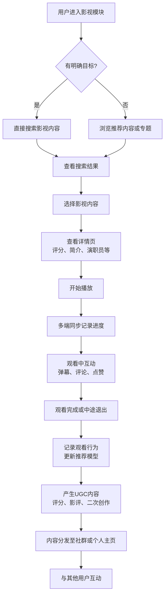

# 2.16 影视
## 2.16.1 功能描述
影视功能是九州寰宇平台的核心数字娱乐消费模块，是一个集多源内容聚合、智能观影体验、社交化互动与创作生态建设于一体的下一代影视内容平台。该模块深度整合电影、电视剧、综艺、纪录片、微短剧等多元视听内容，通过AI个性化推荐、多端无缝续播、弹幕互动、影视社群等创新功能，为用户提供沉浸式的观影体验。同时，它向创作者开放影视内容二次创作、影评体系及影视素材库等工具，构建从内容消费到创作分享的完整生态闭环，强化平台在数字娱乐领域的服务能力。
## 2.16.2 用户场景

| 场景类型     | 使用角色          | 具体场景描述                                                 |
| -------- | ------------- | ------------------------------------------------------ |
| 碎片化休闲观影  | 都市乐活白领与中产     | 通勤或午休时间，用户打开影视模块，AI根据其喜好推荐合适的微短剧或综艺片段，支持断点续播，充分利用碎片时间。 |
| 沉浸式家庭观影  | 所有用户群体        | 用户周末在家中，通过多端联动在电视大屏上观看4K电影，享受影院级音画体验，并可邀请异地亲友同步观看评论。   |
| 兴趣社群影音交流 | 数字原生代学生与技术爱好者 | 用户在影视社群中参与特定导演或题材的讨论，发表深度影评，参与投票评分，与同好交流观影心得。          |
| 影视内容二次创作 | 斜杠内容创作者与独立开发者 | 创作者使用平台提供的影视素材库和剪辑工具，对热门影视内容进行二次创作，生成解说、混剪等内容并分享。      |
| 影视文旅联动体验 | 所有用户群体        | 用户看完某部取景地特色的影视作品后，可通过平台直接获取取景地旅游信息和攻略，实现“观影-旅游”联动。     |

## 2.16.3 核心价值
- 省时（智能观影决策）：通过AI深度个性化推荐和精心策划的影视专题，帮助用户在海量内容中快速发现符合口味的影视作品，减少选择成本。
- 省心（全场景无缝体验）：支持手机、平板、电脑、电视等多端无缝切换观影，记录观看进度，提供一致性的用户体验。
- 增值（生态联动增值）：与平台内好物推荐、论坛社区、博客系统等模块深度联动，如影视同款商品导购、影评社区互动等，创造超出单纯观影的附加价值。
- 归属（影视兴趣社群）：基于特定影视类型、导演或演员构建兴趣社群，用户可找到志同道合的观影伙伴，形成稳定的社交圈层。
## 2.16.4 需求清单

| 功能类别    | 功能名称      | 功能概述                 | 优先级 |
| ------- | --------- | -------------------- | --- |
| 内容聚合与分发 | 多源内容聚合    | 整合主流视频平台内容，实现统一搜索和播放 | P0  |
| 内容聚合与分发 | 智能内容推荐    | 基于用户画像和观影行为推荐个性化内容   | P0  |
| 内容聚合与分发 | 专题策划与编辑推荐 | 人工策划影视专题，如类型、主题、档期专题 | P1  |
| 观影体验    | 多端无缝续播    | 支持跨设备同步观影进度，无缝切换     | P0  |
| 观影体验    | 自适应码率播放   | 根据网络条件自动调整播放画质       | P0  |
| 观影体验    | 沉浸式播放器    | 支持弹幕、互动特效、背景音效等增强功能  | P1  |
| 社交互动    | 影视社群与圈子   | 基于影视兴趣的社交群组，支持讨论、问答  | P1  |
| 社交互动    | 弹幕互动系统    | 实时弹幕评论，支持表情、特效弹幕     | P1  |
| 社交互动    | 同步观影与语音连麦 | 支持好友实时同步观影，语音交流      | P2  |
| 创作生态    | 影视素材库     | 向创作者提供正版影视素材用于二次创作   | P2  |
| 创作生态    | 影评体系与评分   | 用户发表影评，参与评分，形成评价体系   | P1  |
| 数据与洞察   | 观影数据统计    | 个人观影报告，观影偏好分析        | P1  |
| 数据与洞察   | 影视热度榜单    | 实时热度榜、口碑榜、飙升榜等多样化榜单  | P1  |

## 2.16.5 需求详述
### 2.16.5.1 多源内容聚合
- 统一内容库：通过API接口聚合主流影视平台内容，构建统一的元数据数据库，包含影片信息、演员信息、评分评价等。
- 智能搜索：支持跨平台内容搜索，可根据片名、演员、导演、类型等多维度进行检索，结果按相关度排序。
- 播放跳转与统一体验：对于授权内容实现平台内直接播放，对于外部内容提供便捷跳转，并尽可能保持一致的播放器UI/UX设计。
### 2.16.5.2 智能内容推荐
- 多维推荐算法：结合协同过滤（基于相似用户偏好）和内容based过滤（基于影片特征），融入时序模型考虑用户近期兴趣变化。
- 场景化推荐：根据时间、位置、设备等场景信息调整推荐内容，如通勤时段推荐短内容，晚间推荐长内容。
- 反馈优化：通过显式（评分、点赞）和隐式（观看时长、中途退出）反馈持续优化推荐效果。
### 2.16.5.3 多端无缝续播
- 进度同步机制：通过云端实时同步用户的观影进度、收藏列表、历史记录。
- 跨端体验优化：针对不同设备特性优化界面布局和交互方式，如电视端简化导航，移动端优化触控操作。
- 离线观看：支持移动端内容缓存，供无网络环境下观看，自动同步观看记录。
### 2.16.5.4 影视社群与圈子
- 社群分类：支持按影片、类型、演员、导演等维度创建或加入兴趣社群。
- 互动功能：社群内支持发帖、评论、投票、问答等多种互动形式。
- 活动组织：支持组织线上观影会、主题讨论、主创交流等社群活动。
## 2.16.6 核心流程
### 2.16.6.1 核心观影流程

## 2.16.7 详细用例
### 用例：白领用户周末沉浸式观影与社交互动
- 项目描述：一位都市白领在周末晚上选择一部电影进行沉浸式观看，并与好友互动。
- 主要参与者：用户、影视推荐系统、同步观影模块、社群互动系统。
- 前置条件：用户已登录平台，有完整的兴趣画像，已加入若干影视社群。
- 基本事件流：
	1. 用户周五晚上打开影视模块，AI基于其工作日观影偏好（轻松喜剧）和周末场景（有充足时间），推荐一部深度剧情片。
	2. 用户查看推荐影片的详情页，阅读简介和评分，决定观看。
	3. 用户邀请两位好友加入同步观影室，开启语音连麦功能。
	4. 影片播放过程中，三人在关键情节通过语音交流感受，同时观看弹幕中其他观众的实时评论。
	5. 观影结束后，用户在影片页面留下评分和详细影评，分析影片的主题和艺术手法。
	6. 用户的影评自动分享到其加入的“深度电影研究”社群，引发社群成员讨论。
	7. 系统根据本次观影行为和影评内容，更新用户画像，为后续推荐提供依据。
- 扩展事件流：
	3a. 好友无法同步观影：用户可选择独自观看，观影后通过社群分享感受。
	5a. 用户对影片有创作灵感：可使用平台二次创作工具，制作影片解读视频并发布。
## 2.16.8 界面与交互要求
参考UI设计稿
## 2.16.9 埋点方案

| 类别   | 事件/页面 ID             | 事件名称   | 触发时机       | 关键属性                         |
| ---- | -------------------- | ------ | ---------- | ---------------------------- |
| 内容发现 | film\_home\_view     | 影视首页浏览 | 用户进入影视首页   | source（平台导航/推送）              |
| 内容发现 | film\_search         | 影视搜索   | 用户执行搜索操作   | keyword, result\_count       |
| 观影行为 | film\_play\_start    | 开始播放   | 用户开始播放影视内容 | content\_id, content\_type   |
| 观影行为 | film\_play\_progress | 播放进度   | 播放中记录进度点   | content\_id, progress        |
| 社交互动 | film\_comment        | 发表影评   | 用户发表评论或评分  | content\_id, comment\_length |
| 社交互动 | film\_bullet\_chat   | 发送弹幕   | 用户发送弹幕     | content\_id, chat\_length    |

## 2.16.10 技术细节
- 架构设计：采用微服务架构，内容管理、用户服务、推荐引擎、播放服务等模块独立部署，通过API网关统一调度。
- 推荐算法：结合协同过滤和深度学习模型，使用Wide&Deep等算法平衡记忆性（利用用户明确偏好）和泛化性（发掘潜在兴趣）。
- 播放性能优化：使用CDN全球分发，支持DASH/HLS自适应码流技术，根据网络状况动态调整码率。
- 数据同步：使用分布式数据库保障多端数据一致性，通过增量同步减少数据传输量。