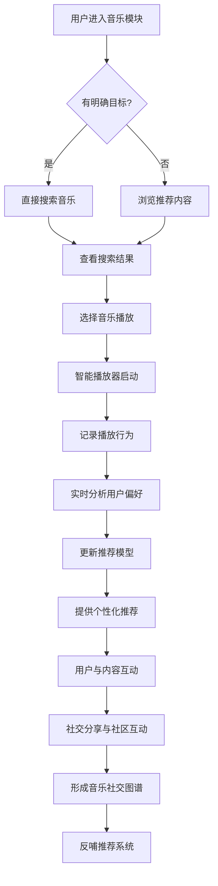

# 2.17 音乐
## 2.17.1 功能描述
音乐功能是九州寰宇平台的核心数字娱乐与社交互动模块，是一个集多源音乐聚合、智能场景推荐、社交化音乐体验与创作生态建设于一体的下一代音乐服务平台。该模块深度整合全球音乐资源，通过AI个性化推荐、多端无缝续播、场景化音乐匹配、社交互动等创新功能，为用户提供全方位的音乐体验。同时，它向创作者开放音乐创作、分享及变现渠道，构建从音乐消费到创作分享的完整生态闭环，强化平台在数字娱乐领域的服务能力。
## 2.17.2 用户场景

| 场景类型        | 使用角色          | 具体场景描述                                             |
| ----------- | ------------- | -------------------------------------------------- |
| 日常通勤与碎片化聆听  | 都市乐活白领与中产     | 用户在地铁通勤时，平台根据当前位置、时间和用户心情，自动推荐适合的通勤歌单，支持离线下载，节省流量。 |
| 专注学习与工作效率提升 | 数字原生代学生与技术爱好者 | 学生在图书馆学习时，使用"专注模式"播放白噪音或纯音乐，AI根据学习时长和专注度动态调整音乐节奏。  |
| 社交互动与情感共鸣   | 所有用户群体        | 用户发现一首好歌，可分享至社区或创建"一起听"房间，邀请好友同步聆听并实时交流听感。         |
| 创作分享与个人品牌建设 | 斜杠内容创作者与独立开发者 | 独立音乐人上传原创作品，平台提供AI辅助创作工具，并可通过数字版权管理实现作品变现。         |
| 场景化智能音乐体验   | 所有用户群体        | 用户运动时，平台根据心率数据和运动强度，自动匹配节奏相符的音乐，提升运动效果。            |

## 2.17.3 核心价值
- 省时（智能音乐发现）：通过AI深度学习和多维度数据分析，为用户智能推荐符合其偏好和当前场景的音乐内容，减少搜索和选择成本。
- 省心（全场景无缝体验）：支持多设备同步和无缝切换，根据用户活动状态自动调整音乐内容和音质，提供"始终适宜"的听觉体验。
- 增值（生态联动与创作赋能）：与平台内其他模块深度整合，如博客中的背景音乐、社区中的音乐话题等，同时为创作者提供完整的创作-发布-变现通路。
- 归属（音乐社交与情感连接）：构建以音乐为纽带的兴趣社群，用户可在音乐中找到情感共鸣，形成有归属感的音乐社区。
## 2.17.4 需求清单

| 功能类别    | 功能名称    | 功能概述                   | 优先级 |
| ------- | ------- | ---------------------- | --- |
| 音乐内容与播放 | 多源音乐库聚合 | 整合主流音乐平台资源，建立统一音乐库     | P0  |
| 音乐内容与播放 | 智能播放器   | 支持播放、暂停、进度调节、音效设置等基本功能 | P0  |
| 音乐内容与播放 | 多场景音质适配 | 根据网络环境和设备能力自动调整音质      | P1  |
| 内容发现与推荐 | AI个性化推荐 | 基于用户行为和偏好推荐音乐内容        | P0  |
| 内容发现与推荐 | 场景化歌单   | 根据时间、地点、活动等场景因素推荐音乐    | P1  |
| 内容发现与推荐 | 社交化发现   | 通过好友动态和社区热度发现音乐        | P1  |
| 社交互动    | 音乐社区    | 基于音乐兴趣的社交互动功能          | P1  |
| 社交互动    | 一起听     | 好友实时同步听歌并交流            | P2  |
| 社交互动    | 音乐评论与互动 | 歌曲评论区互动和情感共鸣           | P0  |
| 创作与变现   | 创作者平台   | 音乐人上传、管理和推广作品          | P1  |
| 创作与变现   | AI辅助创作  | 提供AI创作工具和素材库           | P2  |
| 创作与变现   | 数字版权管理  | 音乐版权确认和收益分配            | P2  |
| 平台集成    | 跨模块联动   | 与博客、社区等平台模块深度整合        | P1  |
| 平台集成    | 统一账户与支付 | 使用平台统一账户和支付系统          | P0  |

## 2.17.5 需求详述
### 2.17.5.1 多源音乐库聚合
- 资源整合机制：通过API接口整合QQ音乐、网易云音乐等主流平台的音乐资源，使用统一的元数据标准，确保搜索和推荐的准确性。
- 版权管理：建立完善的版权识别和收益分配机制，支持正版音乐传播，保护创作者权益。
- 内容质量控制：对所有入库音乐进行质量审核和标准化处理，确保音质和元数据的一致性。
### 2.17.5.2 AI个性化推荐
- 多维度用户画像：综合分析用户的听歌历史、收藏行为、社交互动、设备传感器数据等，构建动态更新的用户画像。
- 场景感知推荐：结合时间、地点、天气、用户活动状态等场景因素，调整推荐策略，实现"千人千面"的个性化推荐。
- 实时反馈优化：通过用户的实时互动行为（如跳过、重复播放等）持续优化推荐算法，提高推荐准确度。
### 2.17.5.3 音乐社区与社交功能
- 兴趣社群：支持用户基于音乐类型、艺人或特定主题创建和加入社群，分享音乐发现和听歌心得。
- 情感共鸣机制：强化歌曲评论区的情感交流功能，允许用户表达听歌时的情绪状态，形成情感共鸣。
- 社交互动工具：提供好友关注、私信、音乐礼物等社交功能，增强用户之间的音乐互动。
### 2.17.5.4 创作者平台
- 作品上传与管理：为音乐人提供简便的作品上传工具，支持多种音频格式和元数据编辑。
- 数据洞察面板：为创作者提供详细的收听数据和分析报告，帮助其了解受众偏好。
- 变现渠道建设：整合数字音乐销售、版权授权、虚拟礼物等多种变现方式，支持创作者可持续发展。
## 2.17.6 核心流程
### 2.17.6.1 核心音乐播放与发现流程

## 2.17.7 详细用例
### 用例：白领用户通勤场景下的智能音乐体验
- 项目描述：一位都市白领在早高峰通勤途中使用音乐功能。
- 主要参与者：用户、AI推荐系统、音乐播放器、社区互动系统。
- 前置条件：用户已登录平台，有完整的听歌历史和偏好标签。
- 基本事件流：
	1. 用户上班途中打开音乐模块，系统检测到用户处于移动状态、时间为早晨，自动推荐"晨间通勤"歌单。
	2. 用户选择播放歌单，系统根据当前网络状况自动调整音质，确保流畅播放。
	3. 在收听过程中，用户对其中一首爵士乐表示喜欢（点击爱心），系统记录此偏好。
	4. 到达公司后，系统检测到用户位置变化，自动切换为"专注工作"背景音乐。
	5. 午休时，用户将早晨发现的爵士乐分享至音乐社区，并附上听后感。
	6. 几位好友在评论区互动交流，形成小型讨论话题。
	7. 下班途中，系统基于用户一天的听歌行为和社交互动，推荐更加精准的晚间音乐。
- 扩展事件流：
	3a. 用户不喜欢推荐歌曲：用户跳过歌曲，系统记录并避免类似推荐。
	5a. 用户想与好友共享：用户创建"一起听"房间，邀请好友同步聆听并语音交流。
## 2.17.8 界面与交互要求
参考UI设计稿
## 2.17.9 埋点方案

| 类别   | 事件/页面 ID              | 事件名称   | 触发时机     | 关键属性                         |
| ---- | --------------------- | ------ | -------- | ---------------------------- |
| 内容发现 | music\_home\_view     | 音乐首页浏览 | 用户进入音乐首页 | source（平台导航/推送）              |
| 内容发现 | music\_search         | 音乐搜索   | 用户执行搜索操作 | keyword, result\_count       |
| 播放行为 | music\_play\_start    | 开始播放   | 用户开始播放音乐 | content\_id, content\_type   |
| 播放行为 | music\_play\_progress | 播放进度   | 播放中记录进度点 | content\_id, progress        |
| 社交互动 | music\_share          | 分享音乐   | 用户分享音乐内容 | content\_id, share\_platform |
| 社交互动 | music\_comment        | 发表评论   | 用户发表音乐评论 | content\_id, comment\_length |

## 2.17.10 技术细节
- 架构设计：采用微服务架构，音乐库管理、用户服务、推荐引擎、播放服务等模块独立部署，通过API网关统一调度。
- 推荐算法：结合协同过滤和深度学习模型，使用Wide&Deep等算法平衡记忆性和泛化性，提高推荐准确度。
- 播放性能优化：使用CDN全球分发，支持自适应码流技术，根据网络状况动态调整码率。
- 数据同步：使用分布式数据库保障多端数据一致性，通过增量同步减少数据传输量。