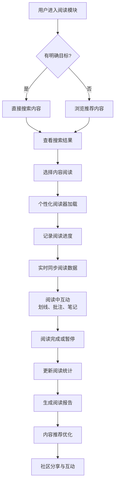

# 2.18 阅读
## 2.18.1 功能描述
阅读功能是九州寰宇平台的核心知识获取与内容消费模块，是一个集多源内容聚合、智能阅读体验、社交化互动与知识管理于一体的下一代数字阅读平台。该模块深度整合图书、小说、期刊、学术文献、新闻资讯等多元阅读资源，通过AI个性化推荐、多端无缝续读、社交化批注、知识体系构建等创新功能，为用户提供沉浸式的阅读体验。支持多种文件格式（EPUB、PDF、TXT等），提供可定制的阅读界面、智能笔记管理、阅读进度同步等功能，并与平台内社区、博客、教育等模块深度联动，构建从内容发现到知识内化的完整闭环。
## 2.18.2 用户场景

| 场景类型    | 使用角色          | 具体场景描述                                           |
| ------- | ------------- | ------------------------------------------------ |
| 深度学习与研究 | 数字原生代学生与技术爱好者 | 学生在撰写论文时，通过平台检索相关学术文献，使用智能笔记功能摘录重点，并加入专业讨论组交流见解。 |
| 碎片化知识获取 | 都市乐活白领与中产     | 通勤途中，用户打开APP继续阅读昨晚未读完的商业书籍，系统自动同步进度，并推荐相关精华摘要。   |
| 内容创作与分享 | 斜杠内容创作者与独立开发者 | 创作者阅读行业报告后，生成思维导图笔记，分享至个人博客并引发社区深度讨论。            |
| 主题化深度阅读 | 所有深度用户        | 用户对某一历史时期感兴趣，平台推荐相关书籍、论文、影评等多元内容，形成主题知识网络。       |

## 2.18.3 核心价值
- 省时（一站式内容获取）：聚合图书、小说、期刊、学术文献等多元阅读资源，用户无需在多个阅读APP间切换即可获取全面知识服务。
- 省心（智能阅读辅助）：通过AI推荐算法精准匹配用户兴趣内容，提供阅读进度管理、知识点梳理等智能辅助功能。
- 增值（知识体系构建）：与平台内社区、博客、教育等模块联动，将阅读行为转化为知识积累，形成个人知识体系。
- 归属（阅读社区互动）：基于阅读兴趣构建社群，用户可分享读书笔记、参与主题讨论，找到志同道合的书友。
## 2.18.4 需求清单

| 功能类别 | 功能名称    | 功能概述                         | 优先级 |
| ---- | ------- | ---------------------------- | --- |
| 内容资源 | 多源内容聚合  | 整合图书、小说、期刊、学术文献等多元资源，建立统一资源库 | P0  |
| 内容资源 | 多格式支持   | 支持EPUB、PDF、TXT、MOBI等主流电子书格式  | P0  |
| 阅读体验 | 个性化阅读器  | 可调整字体、间距、背景色，支持白天/夜间模式切换     | P0  |
| 阅读体验 | 智能笔记管理  | 支持高亮、批注、思维导图式笔记整理            | P1  |
| 阅读体验 | 多端进度同步  | 阅读进度、书签、笔记跨设备实时同步            | P0  |
| 内容发现 | AI个性化推荐 | 基于阅读历史和行为推荐个性化内容             | P1  |
| 内容发现 | 智能全文检索  | 支持关键词全文检索，结果按相关度排序           | P0  |
| 社交互动 | 阅读社区    | 基于书籍的讨论区，读者交流阅读心得            | P1  |
| 社交互动 | 笔记分享    | 读者可分享读书笔记和批注                 | P1  |
| 知识管理 | 个人知识库   | 自动整理阅读记录、笔记，形成个人知识体系         | P2  |
| 知识管理 | 阅读统计    | 展示阅读时长、书籍完成率等数据统计            | P1  |
| 版权保护 | 数字版权管理  | 数字水印、版权保护机制                  | P1  |

## 2.18.5 需求详述
### 2.18.5.1 多源内容聚合
- 资源整合机制：通过API接口整合主流出版机构、原创文学平台、学术数据库资源，构建统一的元数据标准，确保检索和推荐的准确性。
- 版权管理：建立完善的版权识别和合作机制，支持正版内容传播，保护创作者权益。
- 内容质量控制：对所有入库内容进行质量审核和标准化处理，确保阅读体验的一致性。
### 2.18.5.2 个性化阅读器
- 阅读界面自定义：支持字体大小、类型、行间距、背景颜色等多种个性化设置，适配不同阅读偏好。
- 阅读模式：提供滚动、翻页等多种阅读模式，支持白天、夜间、护眼等多种主题模式。
- 智能书签：自动记录阅读进度，支持手动添加书签，支持章节快速导航。
### 2.18.5.3 AI个性化推荐
- 多维用户画像：综合分析用户的阅读历史、停留时长、笔记行为等数据，构建动态用户画像。
- 场景感知推荐：结合时间、地点、阅读设备等场景因素，调整推荐策略，实现个性化推荐。
- 反馈优化机制：通过用户的互动行为持续优化推荐算法，提高推荐准确度。
### 2.18.5.4 阅读社区与互动
- 兴趣社群：支持用户基于书籍、作者或主题创建和加入阅读社群，分享阅读体会。
- 互动功能：提供点赞、评论、转发等社交功能，增强用户间的阅读互动。
- 阅读活动：支持组织线上读书会、阅读挑战等社群活动，提升用户参与度。
## 2.18.6 核心流程

## 2.18.7 详细用例
### 用例：学生用户研究性阅读与知识整理
- 项目描述：一名大学生为准备论文需要阅读多篇相关学术文献并整理笔记。
- 主要参与者：学生用户、阅读系统、AI推荐系统、社区互动系统。
- 前置条件：用户已登录平台，有明确的研究主题。
- 基本事件流：
	1. 用户进入阅读模块，搜索论文关键词，系统返回相关学术文献列表。
	2. 用户选择一篇文献开始阅读，系统自动加载上次阅读进度。
	3. 阅读过程中，用户对重要内容进行高亮和批注，并添加个人笔记。
	4. 系统根据用户的阅读行为和笔记内容，推荐相关的补充文献。
	5. 用户将多篇文献的笔记整合为思维导图，形成知识结构。
	6. 用户将整理好的笔记分享到相关研究社群，与其他学者交流。
	7. 系统根据本次阅读行为，更新用户画像，为后续推荐提供依据。
- 扩展事件流：
	2a. 文献需要下载：用户可缓存文献到本地，离线阅读。
	4a. 推荐不准确：用户可反馈不感兴趣，系统调整推荐策略。
## 2.18.8 界面与交互要求
参考UI设计稿
## 2.18.9 埋点方案

| 类别   | 事件/页面 ID            | 事件名称   | 触发时机      | 关键属性                            |
| ---- | ------------------- | ------ | --------- | ------------------------------- |
| 内容发现 | reading\_home\_view | 阅读首页浏览 | 用户进入阅读首页  | source（导航/推送）                   |
| 内容发现 | reading\_search     | 内容搜索   | 用户执行搜索操作  | keyword, result\_count          |
| 阅读行为 | reading\_start      | 开始阅读   | 用户开始阅读内容  | content\_id, content\_type      |
| 阅读行为 | reading\_progress   | 阅读进度   | 阅读中记录进度点  | content\_id, progress, duration |
| 社交互动 | reading\_comment    | 发表书评   | 用户发表评论或笔记 | content\_id, comment\_length    |
| 社交互动 | reading\_share      | 分享内容   | 用户分享阅读内容  | content\_id, share\_platform    |

## 2.18.10 技术细节
- 架构设计：采用微服务架构，内容管理、用户服务、推荐引擎、阅读服务等模块独立部署，通过API网关统一调度。
- 推荐算法：结合协同过滤和深度学习模型，使用Wide&Deep等算法平衡记忆性和泛化性，提高推荐准确度。
- 阅读体验优化：使用智能预加载技术，提升内容加载速度；支持自适应排版，适配不同屏幕尺寸。
- 数据同步：使用分布式数据库保障多端数据一致性，通过增量同步减少数据传输量。