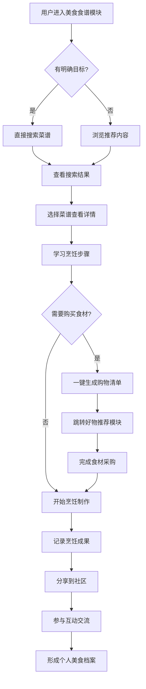

# 2.19 美食
## 2.19.1 功能描述
美食是九州寰宇平台的核心饮食生活服务模块，是一个集智能菜谱管理、社交化美食分享、个性化饮食推荐于一体的综合美食平台。该模块支持用户创建、发现、分享各类美食菜谱，通过AI智能推荐、视频教学、营养分析等创新功能，为用户提供从食材采购到烹饪制作的全流程饮食解决方案。深度整合平台内好物推荐、统一支付、社区互动等模块，构建内容创作-分享-消费的完整生态闭环。
## 2.19.2 用户场景

| 场景类型   | 使用角色          | 具体场景描述                                             |
| ------ | ------------- | -------------------------------------------------- |
| 日常烹饪学习 | 都市乐活白领与中产     | 用户下班后想快速制作健康晚餐，通过AI推荐根据家中现有食材生成个性化菜谱，观看视频教学轻松完成烹饪。 |
| 美食内容创作 | 斜杠内容创作者与独立开发者 | 美食博主上传原创菜谱，通过平台社交功能积累粉丝，建立个人品牌，并与好物推荐模块联动实现变现。     |
| 饮食技能提升 | 数字原生代学生与技术爱好者 | 学生学习烹饪技能，通过分步视频教学和营养分析功能，系统化提升厨艺和饮食知识水平。           |
| 社交美食体验 | 所有用户群体        | 用户参与平台美食挑战活动，与兴趣社群成员交流烹饪心得，形成稳定的美食社交圈层。            |

## 2.19.3 核心价值
- 省时（智能饮食规划）：通过AI推荐算法和智能菜谱匹配，为用户提供个性化的饮食方案，减少决策和搜索时间。
- 省心（全流程烹饪指导）：整合视频教学、食材采购、营养分析等功能，提供一站式的烹饪体验。
- 增值（生态联动创作）：与好物推荐、统一支付、社区模块深度联动，为创作者提供内容变现渠道，为用户提供完整饮食解决方案。
- 归属（美食兴趣社群）：基于美食兴趣构建社交网络，用户可分享创作、参与讨论，获得社群认同感和归属感。
## 2.19.4 需求清单

| 功能类别 | 功能名称      | 功能概述                        | 优先级 |
| ---- | --------- | --------------------------- | --- |
| 菜谱管理 | 智能菜谱创建与编辑 | 支持图文、视频菜谱创建，详细记录食材、步骤、技巧等信息 | P0  |
| 菜谱管理 | 分类与标签体系   | 按菜系、口味、难度、场景等多维度分类标签        | P0  |
| 内容发现 | AI个性化推荐   | 基于用户口味偏好、饮食习惯推荐菜谱           | P1  |
| 内容发现 | 智能搜索与筛选   | 支持关键词搜索和多条件组合筛选             | P0  |
| 学习体验 | 视频教学支持    | 提供步骤化视频教学，支持慢速播放和关键帧定位      | P1  |
| 学习体验 | 营养分析功能    | 自动计算菜品营养成分和热量信息             | P2  |
| 社交互动 | 美食社区互动    | 点赞、评论、收藏、分享等社交功能            | P0  |
| 社交互动 | 美食挑战活动    | 定期举办主题美食活动，激励用户参与           | P1  |
| 创作工具 | 创作者平台     | 为美食创作者提供内容管理和数据分析工具         | P1  |
| 平台集成 | 好物推荐联动    | 与好物推荐模块打通，实现食材厨具一键购买        | P1  |
| 数据管理 | 个人饮食记录    | 记录用户烹饪历史和饮食偏好               | P1  |

## 2.19.5 需求详述
### 2.19.5.1 智能菜谱创建与编辑
- 多格式内容支持：支持图文并茂的菜谱创建，包含食材清单、用量配比、分步制作说明，关键步骤可配图或短视频。
- 智能食材识别：用户上传食材图片，系统自动识别并推荐相关菜谱，简化菜谱创建流程。
- 结构化数据录入：提供标准化的食材库和烹饪术语库，确保菜谱信息的准确性和一致性。
### 2.19.5.2 AI个性化推荐
多维度用户画像：基于用户浏览历史、收藏行为、评分数据、饮食限制等因素构建用户口味画像。
情境感知推荐：结合时间、季节、天气等情境因素，推荐适合当前场景的菜谱。
实时反馈优化：根据用户对推荐菜谱的互动反馈，动态调整推荐策略，提高推荐准确度。
### 2.19.5.3 美食社区互动
社交功能集成：支持用户关注美食创作者、点赞评论菜谱、分享烹饪成果等功能。
兴趣社群构建：支持用户基于特定菜系、饮食方式（如素食、低卡路里）创建和加入美食社群。
UGC内容激励：通过话题挑战、创作活动等方式激励用户生成内容，形成活跃的内容生态。
### 2.19.5.4 好物推荐联动
- 食材厨具电商打通：菜谱页面直接关联相关食材和厨具购买链接，一键跳转好物推荐模块。
- 智能购物清单：用户收藏菜谱后，自动生成食材购物清单，支持一键加入购物车。
- 创作者变现通道：美食创作者可通过推荐食材厨具获得佣金收入，形成内容变现闭环。
## 2.19.6 核心流程

## 2.19.7 详细用例
### 用例：白领用户快速健康晚餐制作
- 项目描述：一位都市白领下班后想快速制作健康晚餐，利用平台快速完成从菜谱发现到烹饪的全过程。
- 主要参与者：用户、AI推荐系统、好物推荐模块、社区互动系统。
- 前置条件：用户已登录平台，有基本的烹饪技能和厨具。
- 基本事件流：
	1. 用户下班回家路上打开美食食谱模块，系统基于用户过往偏好推荐"快速健康晚餐"专题。
	2. 用户选择"30分钟完成低脂餐"筛选条件，系统展示符合条件的菜谱列表。
	3. 用户选择一道"蒜香柠檬鸡胸肉"菜谱，查看食材清单和分步视频教学。
	4. 系统检测用户缺少部分食材，提示一键生成购物清单。
	5. 用户通过好物推荐模块下单缺失食材，选择30分钟配送。
	6. 食材送达后，用户按照视频教学逐步完成烹饪。
	7. 烹饪完成后，用户拍照分享成果到美食社区，获得其他用户点赞和评论。
	8. 系统记录本次烹饪行为，更新用户饮食偏好档案。
- 扩展事件流：
	4a. 用户想替换食材：系统提供基于营养相似的食材替换建议。
	6a. 烹饪遇到困难：用户可通过社区实时求助功能获得其他用户指导。
## 2.19.8 界面与交互要求
参考UI设计稿
## 2.19.9 埋点方案

| 类别   | 事件/页面 ID           | 事件名称   | 触发时机     | 关键属性                        |
| ---- | ------------------ | ------ | -------- | --------------------------- |
| 内容发现 | recipe\_home\_view | 食谱首页浏览 | 用户进入食谱首页 | source（导航/推送）               |
| 内容发现 | recipe\_search     | 菜谱搜索   | 用户执行搜索操作 | keyword, filter\_conditions |
| 学习行为 | recipe\_view       | 菜谱查看   | 用户查看菜谱详情 | recipe\_id, view\_duration  |
| 学习行为 | cooking\_start     | 开始烹饪   | 用户点击开始烹饪 | recipe\_id, cooking\_mode   |
| 社交互动 | recipe\_share      | 菜谱分享   | 用户分享菜谱内容 | recipe\_id, share\_platform |
| 社交互动 | cooking\_share     | 成果分享   | 用户分享烹饪成果 | recipe\_id, image\_count    |

## 2.19.10 技术细节
- 架构设计：采用微服务架构，菜谱管理、用户服务、推荐引擎、社交互动等模块独立部署，通过API网关统一调度。
- 推荐算法：结合协同过滤和内容分析算法，使用深度学习模型理解菜谱内容和用户偏好，提高推荐准确度。
- 视频处理：使用智能视频处理技术，自动识别关键步骤节点，支持用户快速定位所需教学片段。
- 数据同步：使用分布式数据库保障多端数据一致性，通过增量同步减少数据传输量。