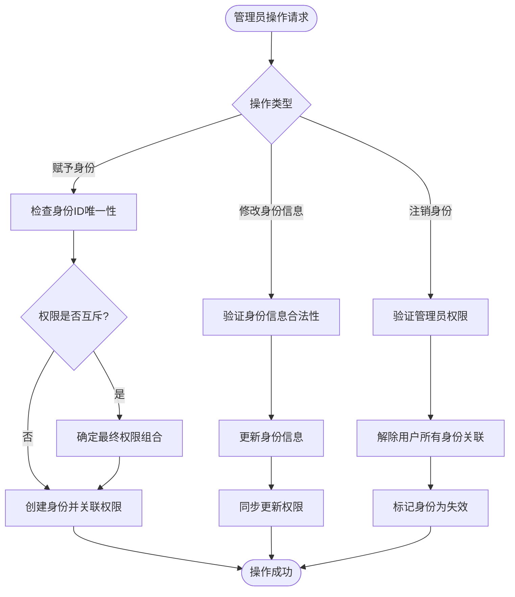
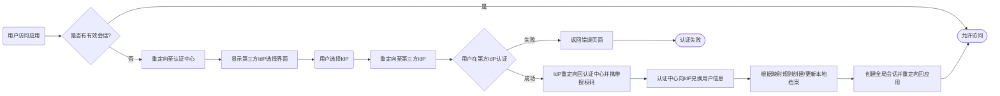
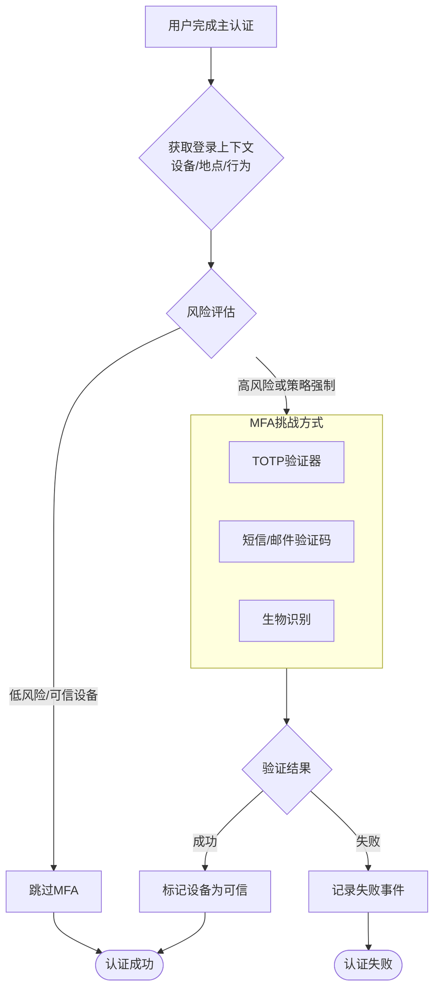
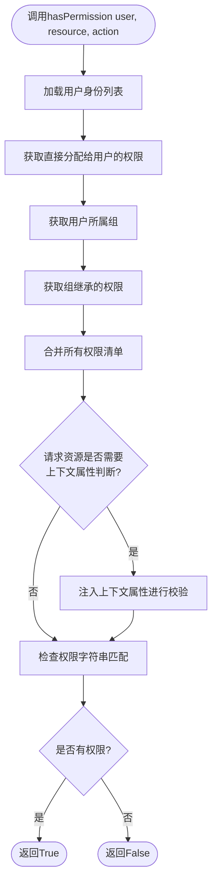
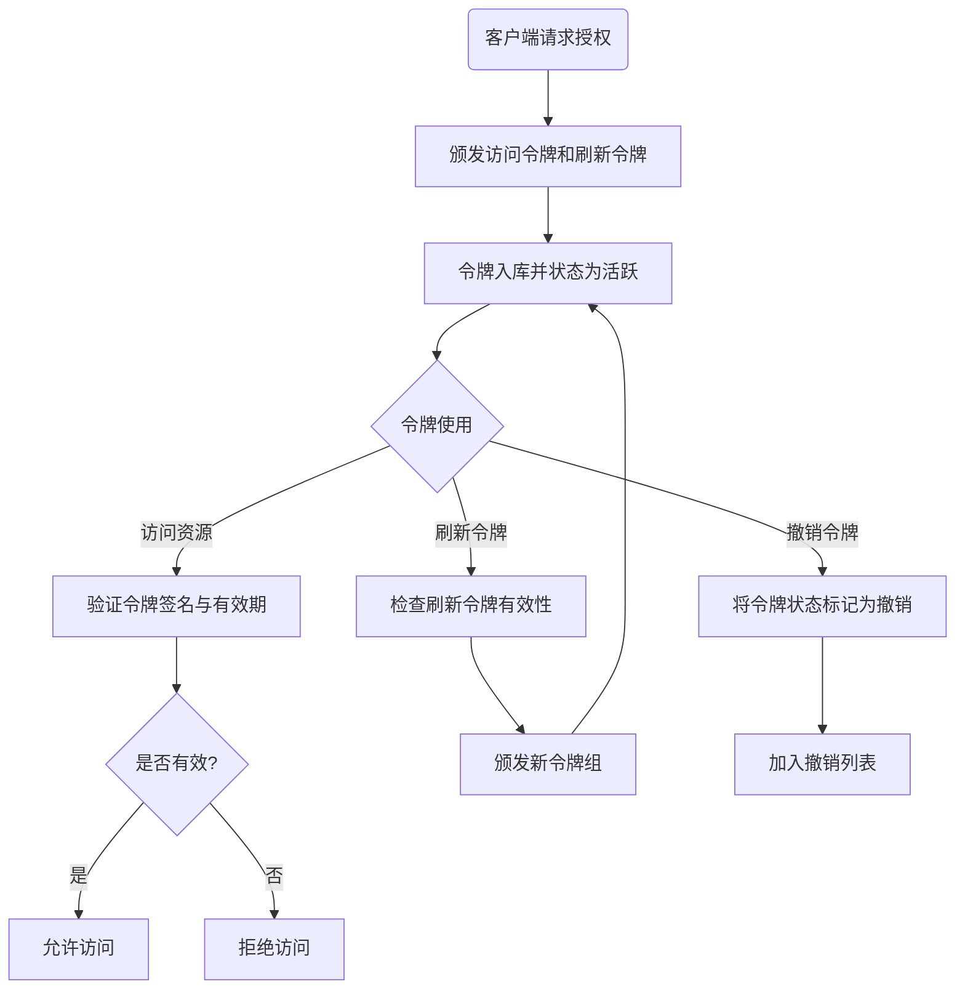
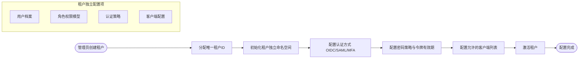
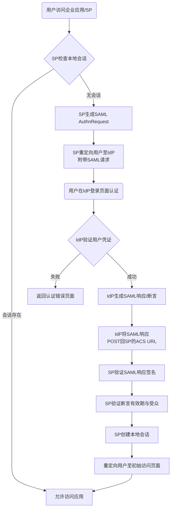
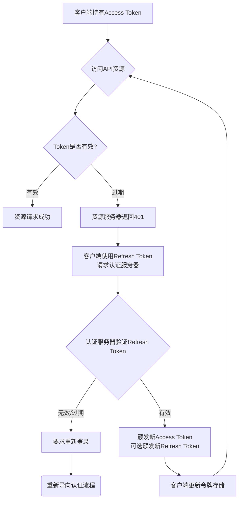
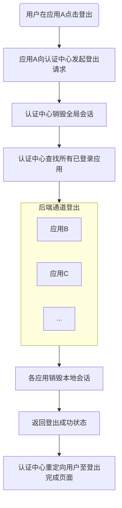

# 2.2 统一安全中心
## 2.2.1 功能描述
统一身份中心是“九州寰宇”平台的核心身份治理枢纽，为所有业务子系统（如博客、论坛、在线教育、工具集合等）提供集中式的用户身份管理、统一认证鉴权、单点登录（SSO）及精细化的访问控制能力。统一身份中心仅负责各种形式的认证与鉴权，不参与用户的管理，包括注册登录。
## 2.2.2 用户场景

| 场景         | 触发条件                       | 用户行为                                 | 系统响应                          |
| ---------- | -------------------------- | ------------------------------------ | ----------------------------- |
| 新用户注册/首次登录 | 用户首次访问平台任一服务（如博客、维基）       | 选择注册方式（手机号、邮箱或第三方社交账号），填写基本信息，选择兴趣标签 | 系统创建统一身份ID，分配基础权限，生成个性化初始首页   |
| 日常跨服务访问    | 用户已登录博客，希望无需再次认证即可使用“工具集合” | 点击导航栏中的“工具集合”图标                      | 系统通过单点登录机制自动完成身份验证，直接进入工具页面   |
| 权限变更处理     | 用户晋升为内容创作者，需增加“博客管理”权限     | 管理员在后台调整用户角色                         | 系统实时更新用户权限，下次访问时生效，无需重新登录     |
| 安全审计与排查    | 管理员需核查异常登录行为               | 在管理后台设置时间范围、用户群等筛选条件，查看登录日志          | 系统提供按时间、IP、操作类型等筛选的日志明细及可视化报表 |

## 2.2.3 核心价值
- 省时：一次认证，全网通行，避免重复登录，提升用户操作效率。
- 省心：统一的账号和安全策略管理，降低用户记忆和管理多个账号密码的负担，同时通过集中管控降低安全风险。
- 增值：为跨业务场景联动（如博客内容同步至论坛）提供连贯的身份上下文，支撑个性化服务推荐。
- 归属：统一的身份标识有助于用户在多元业务中建立一致的个人形象，增强其在平台生态内的归属感。
## 2.2.4 需求清单

| 功能类别 | 功能名称     | 优先级 | 说明                |
| ---- | -------- | --- | ----------------- |
| 身份管理 | 统一身份体系   | P0  | 为每个用户分配平台内唯一的身份标识 |
| 认证服务 | 统一认证     | P0  | 验证身份凭证的有效性，签发访问令牌 |
| 认证服务 | 统一鉴权     | P0  | 对访问请求进行权限裁决       |
| 权限管理 | 令牌与会话管理  | P0  | 管理令牌和会话的全生命周期     |
| 权限管理 | 租户与系统管理  | P0  | 支撑多租户和系统接入        |
| 安全管理 | 安全与可观测性  | P0  | 保障系统安全稳定运行        |
| 应用接入 | 客户端与服务集成 | P0  | 允许外部第三方服务接入本系统    |

## 2.2.5 需求详述
### 2.2.5.1 统一身份体系
- 用户注册、登录，注册新用户时，自动添加身份信息
- 维护基本用户信息，用户名密码等，并提供接口供其他服务管理
- 赋予身份、注销身份、查询身份信息、修改身份信息(管理员)
- 具有平台内唯一的身份 ID
- 不同身份具有不同的权限
- 一个用户可以同时具有多个不同的身份
- 不能赋予具有互斥权限的身份，如果要赋予需要确定最终的权限
- 建立第三方用户标识（如OpenID）与系统内部统一身份ID的映射关系，支持配置属性映射规则，将第三方IdP返回的用户属性（如邮箱、姓名）映射到内部用户档案
- 注册：
	- 新用户注册时需同意用户协议和隐私政策
	- 手机号注册：验证码验证，设置密码
	- 邮箱注册：发送验证邮件，设置密码
	- 账密注册：设置用户名，设置密码
	- 除了手机号和邮箱注册外，均需绑定邮箱才能注册成功
	- 非账密注册需要填写用户名，用户名会检测重复，不区分大小写
	- 所有情况均需要填写昵称和头像，昵称不检测重复，头像默认使用系统默认头像，可不改
	- 发送验证码间隔60s
	- 密码要求：6-32位，最低要求小写英文+数字
	- 第三方快捷注册：支持微信、QQ、微博、GitHub等主流平台
	- 第三方注册后需绑定现有账号或创建账号
	- 新注册会需要填写基本信息，可跳过，生日和实名必填
	- 多层次风控：
		1. 前端：图形验证码、行为验证（如拖拽滑块）。
		2. 后端：IP/设备指纹频率限制、号码邮箱信誉库、与第三方风控服务（如数美、顶象）集成
- 登录：
	- 账号密码登录：支持手机号/邮箱/用户名+密码
	- 验证码登录：手机/邮箱验证码登录
	- 扫码登录：移动设备扫码登录
	- 一键登录：手机号一键登录（如未注册直接注册，用户名随机，密码无）（移动端）
	- 第三方授权登录：跳转至第三方平台授权
	- 生物识别登录：支持指纹、面容识别（移动端）
	- 单点登录（SSO）：用户在一个子系统登录后，可免登录访问所有已接入的子系统
	- 移动端登录需要勾选同意协议，服务端提示：登录后自动同意协议
	- 无密码认证：
		- 遵循FIDO/WebAuthn标准
		- 用户公钥存储于平台，私钥留存于用户设备（安全芯片/认证器），平台不掌管私钥
	- 登录状态保持：默认保持7天登录状态，可设置“记住我”
### 2.2.5.2 统一认证
- 允许系统管理员为不同租户及本系统配置多个第三方身份提供者（如微信、钉钉、Google等）
- 存储第三方IdP的发现端点、客户端ID和密钥等配置信息
- 实现OAuth 2.0和OpenID Connect (OIDC) 协议，用于与第三方IdP进行认证流程对接
- 实现SAML 2.0协议，用于对接企业级IdP（如AD FS）
- 支持基于风险的自适应认证，可根据登录地点、设备等动态触发MFA
- 集成TOTP验证器应用（如Google Authenticator），支持生成和验证6位动态码
- 支持通过短信或邮件发送验证码
- 支持生物识别认证（如果前端应用提供能力）
- 在用户完成主认证后，管理和验证MFA挑战的会话状态
- 支持可信设备标记，在可信设备上可在一段时间内免MFA
- 允许为配置了安全等级的用户或服务设置强制MFA规则
### 2.2.5.3 统一鉴权
- 提供统一的 API（如 `hasPermission(user, resource, action)`），根据策略判断用户是否拥有对某资源的操作权限。    
- 鉴权时能结合请求的上下文（如访问的目标 API、数据属性）进行更细粒度的判断。
- 定义和管理权限元数据
- 创建和管理角色，并为角色分配权限集合
- 创建和管理用户组，并将用户分配到组。支持为组直接分配角色，实现组内用户批量授权
- 支持直接为用户分配特定角色
- 提供统一的授权决策端点（例如基于OAuth 2.0的授权中间件）
- 在颁发的令牌中嵌入用户的角色和关键权限信息
- 构建一个复杂的“权限矩阵”测试集对权限进行测试
### 2.2.5.4 令牌与会话管理
- 支持OAuth 2.0的多种授权模式（授权码模式、客户端模式等）颁发访问令牌（Access Token）和刷新令牌（Refresh Token）
- 支持生成和验证JWT格式的令牌，令牌内包含用户身份、所属租户和基本权限声明
- 提供对应接口，用于验证令牌的有效及返回对应的信息
- 支持OAuth 2.0 Token Introspection协议，返回令牌的当前状态（有效/无效）及关联的元数据
- 支持令牌的轮换，自动轮换和手动轮换
- 支持维护令牌撤销列表（Token Revocation List），并提供接口以供管理
- 支持即时撤销单个令牌（如用户登出时）
- 维护令牌的黑白名单，并对外提供接口以供管理
- 创建并维护用户的全局登录会话（Global Session）
- 实现基于浏览式协议（如OIDC）的SSO登录/登出流程
- 实现前端/后端通道登出，通知所有已登录的应用系统销毁本地会话
### 2.2.5.5 租户与系统管理
- 提供API用于创建、配置、禁用和删除租户（Realm/Tenant）
- 租户指使用平台的一个独立客户单位，包括入驻的机构及平台自身。平台自身为默认租户，个人用户归属其中，默认租户不可删除。
- 不同租户（尤其是企业）的数据必须严格隔离，确保隐私和安全
- 不同租户可以定制某些服务模块（如博客园、项目公示）的样式、功能或访问规则
- 平台可以按租户分配资源（如存储、流量）并实现差异化计费
- 用户可同时作为个人用户和企业成员，多租户模型能支持用户在不同租户上下文间切换，获得相应的权限和内容
- 通过子域名（如 `company.platform.com`）提供租户主页访问
- 用户账号全局唯一，可属于多个租户
- 通过“用户-租户-角色”表记录用户在租户内的角色和权限（如企业管理员、普通成员）
- 用户登录后，可在所属租户列表中选择当前活动的租户，系统根据所选租户加载相应数据和权限
- 所有业务表添加`tenant_id`字段，在查询时查询此字段或动态路由到租户对应的schema/数据库
- 平台默认租户（个人用户）使用共享schema；企业租户按套餐选择隔离级别（基础版共享schema，高级版独立schema或数据库）。
- 租户可启用或禁用特定模块，并可定制模块的界面、规则等（如企业租户自定义博客园的样式）。
- 第三方集成服务，可能为全局共享，但租户可能有独立的访问记录或配置
### 2.2.5.6 安全与可观测性
- 记录所有认证、授权、令牌颁发与撤销、管理员操作等事件
- 日志包含时间戳、租户ID、用户ID、操作对象、IP地址等关键信息
- 监控认证服务的健康状态和性能指标（如QPS、延迟）
- 配置异常登录（如异地登录、频繁失败）的实时告警
- 支持邮件告警、短信告警等多种告警方式配置
- 支持各种方式的实名认证
- 存储安全：
	- 敏感信息字段级加密（如手机号、邮箱）
	- 隐私数据匿名化处理
- 密码修改：定期提醒修改密码，密码强度要求（6-32位，最低要求小写英文+数字），重置密码（通过绑定手机/邮箱）
- 忘记密码：
	- 自助恢复：
		- 基于时间的延迟恢复：用户触发恢复后，系统向所有已注册的联系方式（如备用邮箱、绑定手机号）发送一个延迟生效的恢复链接。该链接在24/48小时后才能使用。
		- 安全问题
		- 备用联系人
		- 实名验证
	- 人工审核：
		- 生物特征
		- 账户深度信息问答：
			- “您最近一次成功登录的大致日期和地点？”
			- “您的好友列表中，哪三个是您最早添加的？”
			- “您最近一笔消费的金额和订单号末尾四位是什么？”（如果关联了支付）
			- 其他类似问答，可后台配置
- 每隔一段时间登录时，系统会提示用户“您的恢复代码已过期，请立即生成新的”或“请确认您的备用手机号仍有效”。
- 账号保护：支持账号冻结、注销申请（有30天冷静期）
- 密码加盐哈希存储（使用bcrypt或Argon2），设置适当高的计算成本（工作因子）
- 登录时如果没有设置密码，提示设置
- 账号锁定机制（连续输错密码5次锁定30分钟）
- 不活跃用户：
	- 连续12个月未登录的用户定义为“不活跃用户”。其详细资料、行为日志等非核心数据被迁移至低成本对象存储（如S3 Glacier），核心身份信息（UserID、邮箱、密码哈希）仍留在主库。
	- 用户尝试登录时，系统识别为不活跃用户，提示“因账户太久未使用，被停用，需要重新激活”，同时用户需要进行身份验证来重新激活。
### 2.2.5.7 客户端与服务集成
- 注册需要接入身份中心的各个微服务或前端应用，并为每个客户端分配唯一的客户端标识（Client ID）和密钥（Client Secret）
- 配置每个客户端的回调地址（Redirect URI）、授权模式等
- 提供轻量级的SDK，供各服务模块集成，用于验证令牌和调用身份中心API
- 提供完善的RESTful API，供服务端间直接调用
## 2.2.6 核心流程
### 2.2.6.1 身份管理流程

### 2.2.6.2 第三方联合认证流程

### 2.2.6.3 自适应多因素认证流程

### 2.2.6.4 统一权限校验流程

### 2.2.6.5 统一权限校验流程

### 2.2.6.6 统一权限校验流程

### 2.2.6.7 SAML 2.0 企业级认证流程

### 2.2.6.8 令牌自动轮换与刷新流程

### 2.2.6.9 前端/后端通道全局登出流程

## 2.2.7 详细用例
### 用例一：内容创作者管理其博客与网课权限
- 主要参与者：内容创作者（用户）、统一权限与认证中心、博客系统、网课系统。
- 前置条件：用户已成功通过平台SSO登录，且同时被授予“博客作者”和“网课讲师”角色。
- 基本事件流：
	1. 用户进入平Ï与认证中心返回授权成功，用户操作完成。博客系统和网课系统分别记录操作日志至审计模块。
- 扩展事件流：
	2a/5a. Token失效或权限不足：网关或业务系统拦截请求，返回“登录已过期”或“权限不足”提示，并引导用户重新认证或申请权限。
	6a. 敏感操作触发MFA：用户尝试修改已发布课程的定价，此操作被标记为高风险。统一权限与认证中心的风险自适应认证策略被触发，要求用户完成TOTP验证器应用的二次验证后，方可继续操作。
### 用例二：消费者使用第三方账号登录并完成购物
- 主要参与者：消费者（用户）、统一权限与认证中心、淘宝（电商）系统、第三方IdP（微信）。
- 前置条件：系统管理员已为平台配置微信作为第三方身份提供者，并设置了属性映射规则（如将微信返回的`nickname`映射为用户`displayName`）。
- 基本事件流：
	1. 用户首次访问平台影视服务，选择“微信登录”。
	2. 平台前端应用重定向至统一权限与认证中心的OIDC认证端点。
	3. 统一权限与认证中心重定向至微信认证服务器。用户扫码授权后，微信回调统一权限与认证中心并返回用户唯一标识（OpenID）和基本属性。
	4. 统一权限与认证中心根据预设的属性映射规则，自动创建内部统一身份ID及用户档案，并为用户分配“普通消费者”角色及其默认权限。
	5. 统一权限与认证中心颁发JWT令牌（内含`tenant_id`、`role`等信息）给影视服务，用户成功登录并可观看影片。
	6. 用户随后访问平台内的淘宝电商服务，由于SSO机制，无需再次登录。
	7. 用户将商品加入购物车并结算。电商服务通过轻量级SDK验证JWT令牌有效性，并调用统一授权API校验用户是否有“购买”权限。
- 扩展事件流：
	4a. 用户属性缺失：映射规则要求邮箱为必填项但微信未返回，系统自动引导用户进入补充信息页面。
	7a. 登出：用户在淘宝服务点击登出，统一权限与认证中心销毁全局会话，并向前端通道通知所有接入服务（如影视服务）进行本地登出。
### 用例三：租户管理员管理其员工权限
- 主要参与者：租户管理员（用户）、统一权限与认证中心。
- 前置条件：该管理员所属企业是平台的一个租户，该管理员账号已被授予“租户管理员”角色，拥有管理本租户内部用户的权限。
- 基本事件流：
	1. 租户管理员登录其管理控制台（Realm/Tenant Admin Console）。
	2. 统一权限与认证中心根据JWT中的`tenant_id`，确保其操作范围仅限于本租户数据。
	3. 管理员进入“用户管理”页面，点击“添加用户”，输入新员工信息（如姓名、邮箱）并选择“客服”角色。该角色已预设了“回复评论”、“处理退款申请”等权限集合。
	4. 系统调用SCIM协议或内部API，创建新用户账号，并关联“客服”角色。
	5. 管理员发现该员工需兼任部分运营工作，试图同时为其赋予“运营专员”角色。
	6. 统一权限与认证中心的权限互斥检查模块发现“客服”与“运营专员”角色在“数据导出”权限上存在冲突（互斥），阻止该操作并提示管理员确认。
	7. 管理员选择以“运营专员”的权限为准，系统成功更新用户身份绑定。
	8. 新员工收到激活邮件，完成账号激活后，即可使用被授予的权限访问相应服务。
- 扩展事件流：
	6a. 权限冲突解决：管理员选择“自定义解决”，手动调整该员工在两个角色中的具体权限项，形成最终有效的权限集合。
### 用例四：平台运维人员监控与应急响应
- 主要参与者：平台运维工程师（用户）、统一权限与认证中心、监控告警系统。
- 前置条件：运维工程师已登录并具备“全局运维”角色，该角色拥有访问监控仪表板和操作告警的权限。
- 基本事件流：
	1. 工程师登录统一运维平台，查看统一权限与认证中心的健康状态和性能指标（如QPS、认证平均延迟）。
	2. 监控系统触发一条实时告警：检测到来自某地理区域的异常高频登录失败事件。
	3. 告警系统通过配置的邮件和短信渠道将信息推送给值班工程师。
	4. 工程师在仪表板上确认告警，并查询统一权限与认证中心的详细审计日志，根据时间戳、IP地址、用户ID等信息进行分析。
	5. 初步判断为恶意攻击尝试，工程师通过管理API，即时撤销来自该IP范围的活跃会话令牌，并将该IP段临时加入黑名单。
	6. 系统记录运维工程师的所有操作，形成完整的审计跟踪。
- 扩展事件流：
	4a. 确认为安全事件：分析发现已有少数账号被盗。工程师可强制这些账号在下一次登录时必须完成MFA认证，并通知受影响用户。
### 用例五：平台安全团队审计各租户登录异常事件
- 主要参与者：平台安全管理员（用户）、统一权限与认证中心、日志审计服务、各业务租户系统（如淘宝、影视、博客园）。
- 前置条件：
	1. 用户已成功通过平台SSO登录。
	2. 用户被授予“平台安全管理员”角色，该角色具备全局的 `platform:audit:read` 权限。
	3. 日志审计服务已收集所有租户的认证日志。
- 基本事件流：
	1. 发起审计请求：平台安全管理员登录统一运维管控台，进入“全局安全审计”模块。系统根据其JWT令牌中的角色，动态加载跨租户管理权限。
	2. 设置审计条件：管理员设置查询条件，例如：`时间范围：最近24小时`，`事件类型：登录失败`，`风险等级：高危`。该查询意图范围涵盖平台下所有租户。
	3. 权限校验与上下文传递：
		- 前端应用携带JWT令牌向日志审计服务发起查询请求。
		- 统一权限与认证中心的授权端点（如 `/oauth2/check_token`）会校验令牌，并确认其声明的权限范围 `platform:audit:read` 允许进行跨租户查询。
		- 日志审计服务接收到请求后，识别到当前是平台管理员上下文，而非特定租户上下文，因此不会在数据库查询中自动附加 `tenant_id` 过滤条件。
	4. 执行跨租户查询：日志审计服务直接查询其日志存储，返回所有匹配条件的记录，这些记录天然包含了来源租户ID（`tenant_id`）信息。
	5. 结果呈现与隔离：系统将结果以租户为维度进行聚合展示。安全管理员可以清晰看到“租户A（淘宝）有50次异常登录”，“租户B（影视）有10次异常登录”。尽管能看到全局信息，但管理员无法直接访问或操作其他租户的业务数据，确保了操作层面的隔离。
- 扩展事件流：
	3a. 权限不足：如果一名普通租户管理员尝试执行此操作，系统在权限校验阶段会失败，返回“您无权进行跨租户审计”。
	4a. 数据脱敏：如果审计日志中包含用户手机号等敏感信息，系统会根据平台管理员的具体权限级别，决定是否需要对结果进行脱敏处理。
### 用例六：消费者使用电商积分兑换影视VIP会员
- 主要参与者：消费者（用户）、统一权限与认证中心、淘宝（电商）系统、平台影视系统。
- 前置条件：
	1. 用户已登录淘宝租户，账户中有可用的消费积分。
	2. 电商租户与影视租户已建立跨租户协作关系，并配置了资源共享机制与权限映射规则（例如，将“积分兑换VIP”操作映射为影视租户的“VIP会员”角色）。
- 基本事件流：
	1. 权益获取：用户在淘宝租户完成购物，获得积分奖励。淘宝系统通过内部规则，为用户在“电商积分”资源上授予权限。
	2. 发起兑换：用户在淘宝的“会员中心”看到“兑换影视VIP”入口。点击后，前端应用携带用户的JWT令牌，向统一权限与认证中心的授权端点发起请求，动作标识为 `cross-tenant:exchange:videoVIP`。
	3. 跨租户权限校验：
		- 统一权限与认证中心的网关首先识别出这是跨租户请求（用户当前位于淘宝租户，但目标资源属于影视租户）。
		- 中心检查两个租户间是否存在有效的协作信任关系。确认后，根据预设的权限映射机制，将请求转换为影视租户能理解的权限上下文（即，查询用户是否拥有足够积分，并映射为影视租户的“VIP会员”角色权限）。
	4. 执行兑换与授权：校验通过后，中心生成一个短期有效的、目标为影视租户的跨租户访问令牌。系统完成积分扣减，并将用户的影视账户升级为VIP状态。
	5. 无缝访问：用户点击跳转链接，平台前端应用携带新的跨租户令牌重定向至影视服务。由于SSO机制和令牌的有效性，用户无需再次登录即可直接进入影视租户的VIP专区，享受免广告、高清播放等权益。
- 扩展事件流：
	3a. 信任关系不存在：若两租户未建立协作，系统会提示用户“暂未开通此服务”。
	3b. 权限或积分不足：若用户积分不够，系统会提示“积分不足，无法兑换”。
	4a. 会话延续：在跨租户令牌有效期内，用户再次访问影视服务仍可享受VIP权益，直至令牌过期。
## 2.2.8 界面与交互要求
参考UI设计稿
## 2.2.9 埋点方案

| 埋点类别  | 事件/页面 ID                   | 事件名称                          | 触发时机                              | 关键属性（示例）                                                                                           |
| :---- | :------------------------- | :---------------------------- | :-------------------------------- | :------------------------------------------------------------------------------------------------- |
| 管理操作  | `identity_admin_operation` | `IdentityCreated`             | 管理员成功创建新身份（用户）                    | `tenant_id`, `admin_user_id`, `target_user_id`, `new_roles`, `new_groups`                          |
| 管理操作  | `identity_admin_operation` | `IdentityModified`            | 管理员成功修改身份信息（如角色、组）                | `tenant_id`, `admin_user_id`, `target_user_id`, `modified_fields`, `old_roles`, `new_roles`        |
| 管理操作  | `identity_admin_operation` | `IdentityRevoked`             | 身份被注销或禁用                          | `tenant_id`, `admin_user_id`, `target_user_id`, `revoke_reason`                                    |
| 用户行为  | `profile_page`             | `IdentityInfoQueried`         | 用户或管理员成功查询身份信息                    | `tenant_id`, `requesting_user_id`, `target_user_id`, `query_scope` (如：basic, full)                 |
| 配置操作  | `idp_admin_operation`      | `IdPConfigured`               | 管理员为租户成功配置新的身份提供者                 | `tenant_id`, `admin_user_id`, `idp_type` (如：wechat, oidc, saml), `idp_name`                        |
| 系统日志  | `federation_api`           | `ExternalIdLinked`            | 系统成功将第三方身份与内部身份ID建立映射             | `tenant_id`, `internal_user_id`, `external_idp`, `external_user_id`                                |
| 用户行为  | `login_page`               | `FederatedLoginInitiated`     | 用户在登录页点击第三方登录按钮                   | `tenant_id`, `session_id`, `initiated_idp`                                                         |
| 认证事件  | `auth_api`                 | `FederatedLoginResult`        | 第三方登录流程成功或失败                      | `tenant_id`, `session_id`, `used_idp`, `login_status` (success/fail), `error_code` (若失败)           |
| 用户行为  | `mfa_setup`                | `MFAEnrollment`               | 用户成功绑定新的MFA验证器                    | `tenant_id`, `user_id`, `mfa_type` (如：totp, sms, email), `is_primary`                              |
| 配置操作  | `mfa_admin_operation`      | `MFAPolicyUpdated`            | 管理员更新租户或应用的MFA策略                  | `tenant_id`, `admin_user_id`, `policy_scope`, `new_rules`                                          |
| 风险控制  | `risk_engine`              | `AdaptiveAuthTriggered`       | 系统基于风险评估动态触发MFA挑战                 | `tenant_id`, `user_id`, `risk_score`, `trigger_reason` (如：new_device, unusual_location)            |
| 认证事件  | `mfa_challenge`            | `MFAVerification`             | 用户完成或失败一次MFA验证                    | `tenant_id`, `user_id`, `mfa_type`, `challenge_id`, `verify_result` (success/fail)                 |
| 用户行为  | `trusted_device`           | `TrustedDeviceMarked`         | 用户在当前设备上选择“信任此设备”                 | `tenant_id`, `user_id`, `device_fingerprint`                                                       |
| 配置操作  | `rbac_admin_operation`     | `RoleCreated`                 | 管理员成功创建新角色                        | `tenant_id`, `admin_user_id`, `role_name`, `assigned_permissions`                                  |
| 配置操作  | `rbac_admin_operation`     | `PermissionChecked`           | 系统执行权限检查（如调用 `hasPermission` API） | `tenant_id`, `user_id`, `target_resource`, `requested_action`, `check_result` (allow/deny)         |
| 配置操作  | `rbac_admin_operation`     | `MutuallyExclusiveAssignment` | 系统检测到并处理了互斥权限的分配                  | `tenant_id`, `admin_user_id`, `target_user_id`, `conflicting_roles`, `final_decision`              |
| 认证事件  | `oauth_token`              | `TokenIssued`                 | 成功颁发访问令牌或刷新令牌                     | `tenant_id`, `user_id`, `client_id`, `grant_type`, `token_type` (access/refresh), `scope`          |
| 认证事件  | `token_introspection`      | `TokenValidated`              | 令牌通过验证接口被成功验证                     | `tenant_id`, `token_id`, `client_id`, `validation_result`                                          |
| 认证事件  | `oauth_token`              | `TokenRevoked`                | 令牌被撤销（如用户登出、管理员操作）                | `tenant_id`, `token_id`, `revoked_by`, `revoke_reason`                                             |
| 安全事件  | `token_blackwhite_list`    | `TokenListUpdated`            | 令牌黑名单或白名单被更新                      | `tenant_id`, `admin_user_id`, `list_type` (black/white), `update_type` (add/remove), `token_count` |
| 用户行为  | `sso_session`              | `GlobalSessionCreated`        | 用户成功登录，创建全局SSO会话                  | `tenant_id`, `user_id`, `session_id`, `login_method`                                               |
| 用户行为  | `sso_logout`               | `GlobalSessionTerminated`     | 用户成功登出，全局会话被销毁                    | `tenant_id`, `user_id`, `session_id`, `logout_type` (front/back channel)                           |
| 管理操作  | `tenant_admin_operation`   | `TenantCreated`               | 超级管理员成功创建新租户                      | `super_admin_id`, `new_tenant_id`, `tenant_config`                                                 |
| 配置操作  | `tenant_admin_operation`   | `TenantConfigUpdated`         | 租户的独立配置（如密码策略）被更新                 | `tenant_id`, `admin_user_id`, `updated_config_items`                                               |
| 系统日志  | `audit_log`                | `SecurityEventRecorded`       | 发生任何需要审计的安全事件（此为底层事件）             | `timestamp`, `tenant_id`, `user_id`, `event_type`, `ip_address`, `resource_id`, `outcome`          |
| 性能指标  | `health_metrics`           | `AuthRequestProcessed`        | 每次认证请求被处理完成时                      | `tenant_id`, `client_id`, `endpoint`, `response_time`, `response_code`                             |
| 告警事件  | `alert_system`             | `AnomalyDetected`             | 系统检测到异常（如频繁失败登录）                  | `tenant_id`, `alert_type`, `alert_severity`, `detected_anomaly`, `triggering_user_id` (若适用)        |
| 配置操作  | `client_admin_operation`   | `ClientAppRegistered`         | 新的微服务或应用客户端成功注册                   | `tenant_id`, `admin_user_id`, `client_name`, `client_type`, `grant_types`                          |
| SDK行为 | `sdk_api_call`             | `SDKTokenVerified`            | 通过SDK验证令牌的请求被处理                   | `tenant_id`, `client_id`, `sdk_version`, `verify_latency`                                          |
## 2.2.10 技术细节
- 采用微服务架构，认证中心作为独立服务，通过API网关为各业务系统提供统一的认证鉴权能力
- 为每个用户分配一个平台内唯一的全局身份ID（例如UUID），并建立独立的身份档案（Identity Profile）。该档案应包含基础信息、状态（活跃/禁用）以及指向所属租户的标识。支持一个用户关联多个这样的身份实体，每个实体在特定租户上下文内有效
- 实现一个冲突检测引擎。当尝试为用户赋予新身份或角色时，该引擎会基于预定义的互斥规则集（例如，`财务审批`与`财务报销`权限互斥；`禁用按钮`与`启用按钮`互斥）进行检查。如检测到冲突，可触发审批工作流，由管理员确定最终的权限组合，或根据预置的优先规则自动裁决
- 构建一个可插拔的IdP适配层。该层统一支持OAuth 2.0、OpenID Connect (OIDC)以及SAML 2.0等标准协议。存储每个第三方IdP的发现端点、客户端ID和密钥等配置信息
- 提供一个强大的策略决策点（PDP），例如统一的`hasPermission(user, resource, action)`API。该API能够结合用户角色、权限、访问的资源属性以及请求的上下文（如时间、IP地址）进行细粒度的授权判断
- 在API网关或各个微服务中部署策略执行点（PEP），它们会拦截请求并向PDP发起授权查询。同时，在颁发访问令牌（如JWT）时，可将用户的关键角色和权限信息嵌入其中，以便进行快速的本地授权验证
- 采用 KafKa 作为数据同步所使用的消息队列