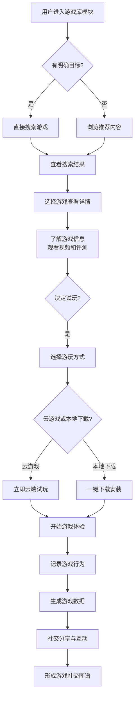

# 2.20 游戏
## 2.20.1 功能描述
游戏是九州寰宇平台的核心数字娱乐聚合模块，是一个集多平台游戏资源聚合、智能推荐发现、社交化游戏体验与创作者生态建设于一体的综合游戏服务平台。该模块深度整合各类游戏资源，包括手游、端游、页游、H5小游戏等，通过AI个性化推荐、云游戏技术、社交互动功能、游戏内容创作等创新服务，为用户提供从游戏发现、试玩体验到社交分享的全流程服务。同时为游戏创作者提供内容分发、社群运营和变现支持，构建完整的游戏产业生态闭环。
## 2.20.2 用户场景

| 场景类型    | 使用角色          | 具体场景描述                                        |
| ------- | ------------- | --------------------------------------------- |
| 游戏发现与试玩 | 数字原生代学生与技术爱好者 | 用户想找新的竞技类手游，通过AI推荐系统发现符合偏好的游戏，观看游戏视频和评测后一键试玩。 |
| 社交游戏体验  | 都市乐活白领与中产     | 下班后与好友组队游戏，通过平台内置语音聊天和社交功能，实时互动并分享游戏成就。       |
| 游戏内容创作  | 斜杠内容创作者与独立开发者 | 游戏高手录制游戏视频、撰写攻略，通过平台内容创作工具发布并获得粉丝关注和收益。       |
| 跨设备游戏体验 | 所有用户群体        | 用户在外用手机玩游戏，回家后通过云游戏技术无缝切换到PC端继续游戏进度。          |

## 2.20.3 核心价值
- 省时（一站式游戏服务）：聚合全平台游戏资源，用户无需在不同游戏平台、商店间切换，即可完成游戏发现、获取、管理和社交的全流程体验。
- 省心（智能游戏推荐）：通过AI算法分析用户游戏偏好和行为数据，精准推荐符合兴趣的游戏内容，降低选择成本。
- 增值（生态联动增值）：与平台内社区、好物推荐、统一支付等模块深度联动，游戏成就可分享至社区，游戏装备可通过好物推荐购买，形成增值体验。
- 归属（游戏兴趣社群）：基于游戏兴趣构建社交网络，用户可加入游戏社群、参与讨论、组建战队，获得归属感和认同感。
## 2.20.4 需求清单

| 功能类别   | 功能名称    | 功能概述                     | 优先级 |
| ------ | ------- | ------------------------ | --- |
| 游戏资源管理 | 多平台游戏聚合 | 整合手游、端游、页游、H5游戏等全类型游戏资源  | P0  |
| 游戏资源管理 | 云游戏服务   | 支持云端流式传输，无需下载即可试玩大型游戏    | P1  |
| 游戏资源管理 | 游戏库存管理  | 用户游戏库统一管理，包括已安装、已购买、愿望单等 | P0  |
| 内容发现推荐 | AI个性化推荐 | 基于用户行为和偏好推荐游戏内容          | P0  |
| 内容发现推荐 | 智能搜索筛选  | 支持多维度搜索和筛选游戏资源           | P0  |
| 内容发现推荐 | 游戏评分评测  | 提供专业评测和用户评价体系            | P1  |
| 社交互动功能 | 游戏社区    | 基于游戏和兴趣的社交功能             | P1  |
| 社交互动功能 | 组队开黑    | 内置语音聊天和组队匹配系统            | P2  |
| 社交互动功能 | 成就分享    | 游戏成就一键分享到社区              | P1  |
| 创作变现工具 | 内容创作平台  | 为创作者提供游戏内容创作和分发工具        | P2  |
| 创作变现工具 | 直播集成    | 集成游戏直播功能                 | P2  |
| 平台支撑服务 | 统一账号体系  | 使用平台统一身份认证               | P0  |
| 平台支撑服务 | 数据统计    | 游戏时长、成就等数据统计和分析          | P1  |

## 2.20.5 需求详述
### 2.20.5.1 多平台游戏聚合
- 资源整合机制：通过API接口和合作伙伴关系整合Steam、Epic、移动应用商店等主流游戏平台资源，建立统一的游戏数据库和元数据标准。
- 云游戏技术支持：采用先进的流媒体技术，支持用户无需下载即可试玩和运行大型游戏，降低设备门槛。
- 跨平台进度同步：支持用户游戏进度、成就和存档在不同设备间的云端同步，提供无缝体验。
### 2.20.5.2 AI个性化推荐系统
- 多维度用户画像：综合分析用户的游戏历史、游玩时长、评分行为、社交关系等数据，构建动态更新的用户游戏偏好画像。
- 智能推荐算法：结合协同过滤、内容过滤和深度学习技术，根据用户实时行为动态调整推荐内容。
- 场景感知推荐：结合时间、设备性能、网络环境等场景因素，推荐适合当前场景的游戏内容。
### 2.20.5.3 游戏社交生态系统
- 兴趣社群构建：支持用户基于特定游戏、游戏类型或主题创建和加入社群，形成稳定的游戏社交圈层。
- 实时组队功能：内置高质量语音聊天和智能组队匹配系统，支持好友快速组队游戏。
- 成就分享体系：游戏成就自动同步到平台，支持一键分享到社区和个人主页，增强用户荣誉感。
### 2.20.5.4 游戏创作者支持
- 内容创作工具：提供游戏视频录制、剪辑、直播等一站式内容创作工具，降低创作门槛。
- 内容分发渠道：通过平台推荐算法将优质游戏内容分发给潜在感兴趣用户，提高内容曝光度。
- 变现支持机制：为创作者提供广告分成、付费内容、虚拟礼物等多种变现方式，支持创作者可持续发展。
## 2.20.6 核心流程

## 2.20.7 详细用例
### 用例：学生用户发现并体验新游戏
- 项目描述：一名大学生想在周末找一款新的多人合作游戏与朋友一起玩。
- 主要参与者：学生用户、AI推荐系统、游戏社区、云游戏服务。
- 前置条件：用户已登录平台，有游戏历史记录和好友关系。
- 基本事件流：
	1. 用户周五晚上打开游戏库模块，系统基于其游戏历史推荐“多人合作游戏”专题。
	2. 用户使用筛选功能选择“合作”、“竞技”、“支持4人组队”等条件，系统展示符合条件的游戏列表。
	3. 用户选择一款游戏查看详情页，包括游戏视频、系统要求、用户评价和专业评测。
	4. 用户使用“邀请好友”功能组建游戏小队，系统自动检查好友在线状态和可用性。
	5. 小队成员一致同意后，使用云游戏功能直接试玩游戏demo，无需下载安装。
	6. 试玩后觉得不错，用户一键购买游戏并下载完整版。
	7. 游戏过程中，平台记录成就和数据，并自动同步到个人游戏档案。
	8. 游戏结束后，用户将精彩时刻分享到游戏社区，与其他玩家交流心得。
- 扩展事件流：
	4a. 好友设备不兼容：系统推荐支持云游戏版本，确保所有好友都能参与。
	6a. 游戏不适合：用户可快速切换其他推荐游戏，继续试玩体验。
## 2.20.8 界面与交互要求
参考UI设计稿
## 2.20.9 埋点方案

| 类别   | 事件/页面 ID             | 事件名称    | 触发时机      | 关键属性                        |
| ---- | -------------------- | ------- | --------- | --------------------------- |
| 游戏发现 | gamelib\_home\_view  | 游戏库首页浏览 | 用户进入游戏库首页 | source（导航/推送）               |
| 游戏发现 | game\_search         | 游戏搜索    | 用户执行搜索操作  | keyword, filter\_conditions |
| 游戏体验 | game\_trial\_start   | 开始试玩    | 用户开始试玩游戏  | game\_id, trial\_mode       |
| 游戏体验 | game\_play\_duration | 游戏时长    | 记录游戏进行时间  | game\_id, duration          |
| 社交互动 | game\_share          | 游戏分享    | 用户分享游戏内容  | game\_id, share\_platform   |
| 社交互动 | achievement\_share   | 成就分享    | 用户分享游戏成就  | game\_id, achievement\_id   |

## 2.20.10 技术细节
- 架构设计：采用微服务架构，游戏管理、用户服务、推荐引擎、云游戏服务等模块独立部署，通过API网关统一调度。
- 云游戏技术：使用视频流传输技术，支持高并发、低延迟的游戏体验，自适应调整画质保证流畅度。
- 数据同步：使用分布式数据库保障多端数据一致性，通过增量同步减少数据传输量。
- 安全防护：游戏文件经过安全检测，防止恶意软件分发，保障用户设备安全。