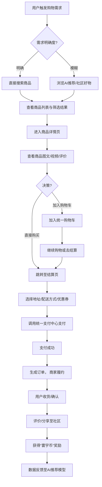

# 2.21 购物
## 2.21.1 功能描述
“购物”功能是“九州寰宇”平台实现商业闭环的核心模块，是一个集多源商品聚合、智能导购、社交化购物体验与创作者经济于一体的下一代电商服务平台。它并非简单的商品列表与交易处理，而是深度融入平台“一站式服务”理念，通过AI驱动个性化推荐、游戏化互动、直播购物、社群团购等创新模式，将购物行为转化为一种充满乐趣和发现感的社交体验。该模块与平台内“好物推荐”、“统一支付中心”、“论坛社区”等模块深度打通，构建从内容种草、决策支持、便捷支付到售后分享的完整消费链条，满足用户对商品、服务及体验的综合需求，同时为内容创作者提供内容变现的路径。
## 2.21.2 用户场景

| 场景类型        | 使用角色          | 具体场景描述                                                           |
| ----------- | ------------- | ---------------------------------------------------------------- |
| 日常采购与生活解决方案 | 都市乐活白领与中产     | 用户在工作日晚间，通过平台获取基于其健康饮食偏好和冰箱库存AI分析生成的生鲜食材推荐清单，一键下单后半小时送达，并附有推荐菜谱。 |
| 兴趣驱动与社交化购物  | 数字原生代学生与技术爱好者 | 用户在某个兴趣社群（如“机械键盘改装”）中看到群友分享的新品评测和拼团信息，直接参与拼团购买，并在社群内交流使用心得。      |
| 内容变现与品牌建设   | 斜杠内容创作者与独立开发者 | 一位数码测评博主在平台发布深度评测文章后，文中提及的产品可附带购买链接，粉丝购买后创作者可获得佣金，实现知识变现。        |
| 游戏化探索与发现    | 所有用户群体        | 用户通过完成平台任务（如浏览指定内容、参与社区讨论）获得“探索积分”，用于解锁专属折扣或抽奖，在趣味互动中发现新品牌和好物。   |

## 2.21.3 核心价值
- 省时（一站式购齐）：聚合海量商品与服务，用户无需在多个电商APP间切换。AI智能清单和场景化解决方案进一步简化决策与购买流程，提升效率。
- 省心（智能导购与信任代理）：基于平台AI深度学习和社交关系链，提供远超传统电商的个性化、可信赖的商品推荐与决策支持，降低选择成本与风险。
- 增值（生态联动与体验升级）：购物不再是孤立行为，而是与内容（博客、视频）、社交（社区、社群）、工具（清单管理）深度融合的体验环节，创造1+1\>2的附加价值。
- 归属（社群消费与共创）：围绕共同消费兴趣形成社群，通过拼团、评测、问答等互动，将购物行为社群化，增强用户参与感、归属感与信任感。
## 2.21.4 需求清单

| 功能类别  | 功能名称        | 功能概述                             | 优先级 |
| ----- | ----------- | -------------------------------- | --- |
| 商品与商家 | 多源商品聚合      | 接入品牌官方、授权经销商、本地超市、原创设计师等多方供应商商品  | P0  |
| 商品与商家 | 商家管理与入驻     | 为商家提供商品管理、订单处理、营销工具、数据看板的一站式后台   | P0  |
| 商品与商家 | 商品评价与问答体系   | 用户可发表带图评价、提问，已购用户可回答，形成可信口碑库     | P0  |
| 购物体验  | AI智能导购与推荐   | 基于平台全域数据（浏览、内容、社交）的个性化商品推荐       | P1  |
| 购物体验  | 游戏化购物旅程     | 积分、任务、成就、趣味互动（如“摇一摇”抽奖）提升购物乐趣    | P2  |
| 购物体验  | 直播购物        | 集成直播功能，支持主播实时展示商品、互动答疑、发放优惠      | P1  |
| 交易与履约 | 统一购物车与支付    | 跨商家商品合并支付，无缝对接平台“统一支付中心”         | P0  |
| 交易与履约 | 智能履约选择      | 根据地址、时效需求推荐配送（即时达、当日达、普通快递）或到店自提 | P0  |
| 交易与履约 | 订单统一管理      | 用户个人中心统一管理所有订单状态、物流跟踪、售后申请       | P0  |
| 平台集成  | 与“好物推荐”深度集成 | “好物推荐”内容可直接关联商品，实现“即看即买”         | P1  |
| 平台集成  | 社群团购与拼单     | 基于“论坛社区”模块，用户可发起或参与团购拼单          | P1  |

## 2.21.5 需求详述
### 2.21.5.1 多源商品聚合
- 开放式平台架构：采用类似“百联全渠道”的整合思路，通过标准API接口和合作伙伴关系，接入各类商品供应链。初期可优先接入本地商超（如九州超市的生鲜熟食）、知名品牌官旗，逐步扩展至长尾特色商品。
- 商品信息标准化：建立统一的商品信息库（SPU/SKU），确保来自不同渠道的同一商品信息一致，便于比价和聚合展示。
- 品质管控机制：设立商家准入标准和商品审核流程，对生鲜、食品等类目有更严格的资质要求，保障平台商品整体品质。
### 2.21.5.2 AI智能导购与推荐
- 全域兴趣画像：不仅分析用户在购物模块的行为，更整合其在平台内阅读博客、观看视频、参与社区讨论等全域数据，构建更立体的用户兴趣图谱，实现“比你更懂你”的精准推荐。
- 场景化推荐：结合时间、地点、天气甚至用户日程（如平台日历显示周末有聚会），主动推荐相关商品和购物清单。
- 智能客服“灵犀”：借鉴“移动爱购”的“灵犀智能体”，提供24小时商品咨询、订单查询、售后申请等智能服务，并能主动推送个性化优惠。
### 2.21.5.3 游戏化购物旅程
- 统一的积分与奖励体系“寰宇币”：参考“AI豆”体系，用户可通过每日签到、完成购物、发布优质评价、参与社区互动等行为获得“寰宇币”。
- 趣味互动任务：设计如“探索新品牌”、“完成一次绿色消费”等任务，完成后可获得额外奖励或勋章，增加粘性。
- “摇一摇”惊喜：在特定时段或场景，用户可通过“摇一摇”功能获得随机折扣券、试用装商品或“寰宇币”，增加购物过程中的惊喜感。
### 2.21.5.4 社群团购与拼单
- 社区原生功能：在“论坛社区”内，允许用户或商家（KOL）针对特定商品发起团购或拼单活动。活动帖在社区内展示参团人数、剩余时间，营造抢购氛围。
- 信任背书：基于社区的真实社交关系，团购发起人的信誉和参与者的实时互动能有效降低新用户的决策门槛，提高转化率。
- 自动化成团与结算：系统自动判断成团条件，成功后统一锁定库存、生成订单、分配佣金，流程高效透明。
## 2.21.6 核心流程
### 2.21.6.1 核心购物流程

## 2.21.7 详细用例
### 用例：白领用户基于社区推荐的快速购物决策
- 项目描述：一位都市白领在午休时想购买一款新的便携咖啡杯，希望快速做出靠谱决定并完成购买。
- 主要参与者：白领用户、AI推荐系统、社区用户、商家履约系统。
- 前置条件：用户已登录平台，并关注了“品质生活”相关社群。
- 基本事件流：
	1. 用户进入平台，在首页“购物”模块的搜索框输入“便携咖啡杯 防漏”。
	2. 搜索结果页不仅展示商品，侧边栏同时显示平台内“好物推荐”模块中相关的评测博文和社区讨论帖。
	3. 用户点开一篇社区内热度很高的“办公室咖啡杯横评”帖子，仔细阅读并对比了楼主和评论区其他用户的真实反馈。
	4. 相中其中一款，点击帖子中嵌入的商品卡片，直接跳转至商品详情页。
	5. 详情页内，AI智能客服“灵犀”自动弹出，提示用户该商品参与“寰宇币”抵扣活动，并可选择“即时配送”（从附近合作门店发货，1小时内送达）。
	6. 用户确认商品信息、选择抵扣“寰宇币”后，直接调用“统一支付中心”完成支付。
	7. 订单生成后，系统分配附近门店拣货，由骑手配送。用户可在订单页实时查看骑手位置。
	8. 收到商品后，用户使用满意，随手拍了一张照片并发布了一条简短评价，系统奖励其“寰宇币”。
- 扩展事件流：
	3a. 用户想了解更多：用户可通过社群功能直接向评测博主提问，获得更详细的信息。
	5a. 配送方式不符：若用户地址不在即时达范围，系统会推荐“普通快递”或“到店自提”选项。
## 2.21.8 界面与交互要求
参考UI设计稿
## 2.21.9 埋点方案

| 类别    | 事件/页面 ID            | 事件名称  | 触发时机              | 关键属性（示例）                                  |
| ----- | ------------------- | ----- | ----------------- | ----------------------------------------- |
| 商品曝光  | product\_impression | 商品曝光  | 商品卡片进入用户可视区域      | product\_id, position, source（推荐/搜索/社区）   |
| 商品互动  | product\_click      | 商品点击  | 用户点击商品进入详情页       | product\_id                               |
| 购物行为  | add\_to\_cart       | 加入购物车 | 用户点击加入购物车按钮       | product\_id, quantity                     |
| 购物行为  | checkout\_initiate  | 发起结算  | 用户点击“立即购买”或“去结算”  | order\_id, product\_count, total\_amount  |
| 交易行为  | purchase\_success   | 支付成功  | 用户成功完成支付          | order\_id, payment\_method, final\_amount |
| 游戏化互动 | reward\_earn        | 获得奖励  | 用户通过任务/签到等获得“寰宇币” | reward\_type, reward\_amount              |

## 2.21.10 技术细节
- 架构设计：采用微服务架构，商品服务、订单服务、用户服务、推荐引擎、积分服务等模块独立部署，通过API网关统一调度，保证高可用和弹性扩展。
- 推荐算法：结合协同过滤（用户行为相似性）和深度学习模型（处理非结构化数据如图文内容），并融入知识图谱（商品属性、用户兴趣标签）技术，提升推荐准确性和可解释性。
- 数据同步与一致性：使用事件驱动架构（EDA），通过消息队列（如Kafka）处理订单状态变更、库存扣减、积分变动等业务事件，确保最终一致性。
- 安全与合规：
	- 支付安全：严格遵循PCI DSS标准，所有支付信息加密处理，与“统一支付中心”安全对接。
	- 数据隐私：用户数据收集与处理符合GDPR等法规，明确告知并获得授权，提供数据管理工具。