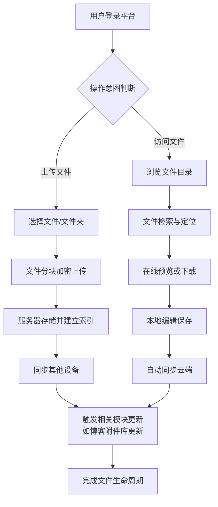

# 2.22 网盘
## 2.22.1 功能描述
网盘功能是"九州寰宇"平台的核心云存储与文件管理模块，是一个集智能文件存储、多端同步、协同办公和生态联动于一体的下一代云存储服务平台。该模块为用户提供安全可靠的云端文件存储空间，支持各类文件的自动备份、多设备同步、在线预览编辑、智能分类检索，并与平台内博客系统、项目公示、在线教育等模块深度集成，实现文件资源的无缝流转和高效利用。通过AI驱动的智能文件管理和协同办公功能，满足用户从个人文件备份到团队协作的全场景需求。
## 2.22.2 用户场景

| 场景类型      | 使用角色          | 具体场景描述                                             |
| --------- | ------------- | -------------------------------------------------- |
| 学习资料云端同步  | 数字原生代学生与技术爱好者 | 学生在实验室电脑编辑论文后，回家通过个人电脑自动同步最新版本，移动端随时查阅资料，学习进度无缝衔接。 |
| 工作文件协同编辑  | 都市乐活白领与中产     | 团队通过网盘共享项目文档，多人同时在线编辑，版本自动保存，避免重复劳动和版本混乱。          |
| 创作素材集中管理  | 斜杠内容创作者与独立开发者 | 创作者将设计素材、源代码、文档统一存储在网盘，跨设备调用并与平台内容创作模块无缝对接。        |
| 多设备文件统一管理 | 所有用户群体        | 用户手机照片自动备份至网盘，电脑端直接访问整理，释放本地存储空间。                  |

## 2.22.3 核心价值
- 省时（一站式文件管理）：统一管理平台内所有模块产生的文件资源，避免在不同存储服务间手动传输和同步。
- 省心（智能文件处理）：AI自动识别文件内容，智能分类标签，精准搜索快速定位，大幅提升文件管理效率。
- 增值（生态无缝联动）：网盘与博客、项目、教育等模块深度打通，文件一次存储多处使用，创造连贯的内容创作体验。
- 归属（协作社区建设）：基于文件共享和协作功能，构建兴趣社群和项目团队的文件协作空间，增强用户粘性和归属感。
## 2.22.4 需求清单

| 功能类别   | 功能名称    | 功能概述                 | 优先级 |
| ------ | ------- | -------------------- | --- |
| 文件存储管理 | 多格式文件支持 | 支持文档、图片、视频、代码等常见格式存储 | P0  |
| 文件存储管理 | 智能文件分类  | AI自动识别文件内容并分类打标签     | P1  |
| 文件存储管理 | 批量文件操作  | 支持批量上传、下载、移动、删除      | P0  |
| 同步备份   | 多端实时同步  | 桌面端、网页端、移动端数据实时同步    | P0  |
| 同步备份   | 自动备份设置  | 设定规则自动备份指定文件夹        | P1  |
| 同步备份   | 增量同步技术  | 仅同步修改部分，节省带宽和时间      | P1  |
| 文件协作   | 实时协同编辑  | 多人同时在线编辑文档，实时可见改动    | P1  |
| 文件协作   | 版本历史管理  | 保存文件修改历史，可回溯任一版本     | P0  |
| 文件协作   | 评论与批注   | 对文件特定位置添加评论和批注       | P1  |
| 分享权限   | 精细化权限控制 | 设置查看、编辑、下载等不同权限      | P0  |
| 分享权限   | 分享链接管理  | 生成分享链接，设置密码和有效期      | P0  |
| 分享权限   | 外链使用追踪  | 统计分享链接的访问和下载数据       | P2  |
| 平台集成   | 博客附件库   | 博客编辑器直接插入网盘文件        | P1  |
| 平台集成   | 项目文件托管  | 项目空间与网盘目录自动关联        | P1  |
| 安全隐私   | 端到端加密   | 传输和存储全程加密保护          | P1  |
| 安全隐私   | 双因素认证   | 提升账户安全性              | P1  |

## 2.22.5 需求详述
### 2.22.5.1 多格式文件支持
- 全面格式兼容：支持文档（DOC/DOCX、PPT/PPTX、XLS/XLSX、PDF）、图片（JPG、PNG、GIF、PSD）、音频视频（MP3、MP4、AVI）、代码文件等上百种格式。
- 在线预览能力：无需下载即可在线预览常见格式文件，包括Office文档、PDF、图片、音视频等。
- 特定格式优化：对代码文件提供语法高亮预览，对大型媒体文件提供渐进式加载。
### 2.22.5.2 多端实时同步
- 全平台覆盖：提供Windows、macOS、Linux桌面客户端，iOS和Android移动端，以及网页端访问。
- 智能冲突解决：当多设备同时修改文件时，自动检测冲突并生成解决界面，避免数据丢失。
- 离线访问支持：标记文件为离线可用，无网络时也能访问，联网后自动同步。
### 2.22.5.3 实时协同编辑
- 多人光标可见：协同编辑时实时显示其他参与者光标位置和编辑状态。
- 变更历史追踪：详细记录每个参与者的编辑内容和时间线。
- 主动冲突预防：文件被编辑时自动锁定，防止同时编辑造成冲突。
### 2.22.5.4 精细化权限控制
- 多层次权限体系：提供查看、预览、评论、编辑、管理等不同粒度权限。
- 有效期设置：分享链接可设置具体过期时间，到期自动失效。
- 密码保护：重要分享可设置访问密码，确保信息安全。
## 2.22.6 核心流程

## 2.22.7 详细用例
### 用例：团队项目文档协作
- 项目描述：一个产品团队使用网盘功能协作完成产品需求文档。
- 主要参与者：产品经理、设计师、开发工程师、网盘系统。
- 前置条件：所有成员已加入项目群组，并具有相应文件权限。
- 基本事件流：
	1. 产品经理在网盘项目文件夹创建PRD文档，设置团队编辑权限。
	2. 系统自动同步文档至所有团队成员网盘，并发送通知。
	3. 设计师在文档中插入设计稿链接，开发工程师补充技术方案。
	4. 多人同时在线编辑时，系统实时显示各成员编辑位置和内容。
	5. 每次保存自动生成版本历史，重要节点产品经理添加版本标签。
	6. 文档完成后，生成客户分享链接，设置7天有效期和查看密码。
	7. 项目结束后，文件自动归档，权限调整为只读。
- 扩展事件流：
	4a. 编辑冲突：系统检测到冲突编辑，自动保存冲突版本供手动合并。
	6a. 链接泄露：监测到异常访问，自动失效分享链接并通知管理员。
## 2.22.8 界面与交互要求
参考UI设计稿
## 2.22.9 埋点方案

| 类别   | 事件/页面 ID       | 事件名称 | 触发时机     | 关键属性                                  |
| ---- | -------------- | ---- | -------- | ------------------------------------- |
| 文件操作 | file\_upload   | 文件上传 | 用户完成文件上传 | file\_type, file\_size, method（拖拽/点击） |
| 文件操作 | file\_download | 文件下载 | 用户下载文件   | file\_type, file\_size, source（直接/分享） |
| 文件操作 | file\_preview  | 文件预览 | 用户在线预览文件 | file\_type, preview\_duration         |
| 协作行为 | collab\_edit   | 协同编辑 | 多人同时编辑文档 | doc\_type, participant\_count         |
| 分享行为 | link\_share    | 链接分享 | 用户创建分享链接 | share\_scope, has\_password           |
| 系统性能 | sync\_status   | 同步状态 | 同步任务完成   | sync\_size, duration, success\_rate   |

## 2.22.10 技术细节
- 架构设计：采用微服务架构，文件存储、用户管理、搜索索引、实时协作等模块独立部署，通过API网关统一调度。
- 存储策略：使用分布式对象存储系统，文件分块存储多副本，确保数据可靠性。
- 同步算法：基于差异检测的增量同步，采用操作转换（OT）算法解决协同编辑冲突。
- 安全措施：传输层TLS/SSL加密，存储层AES-256加密，敏感操作双因素认证。