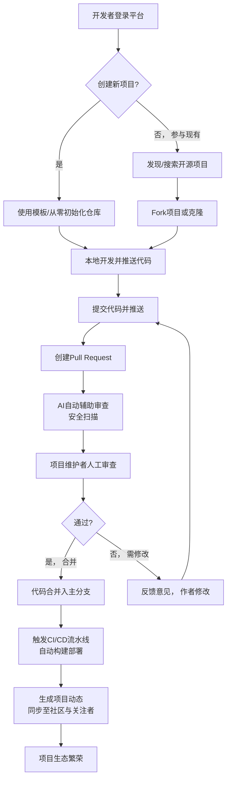

# 2.23 开源
## 2.23.1 功能描述
开源代码库平台是“九州寰宇”面向开发者生态的核心模块，是一个深度集成AI辅助开发、安全可信代码托管、社交化协作与跨平台项目管理的下一代开源创新平台。它并非简单的代码托管服务，而是深度融合平台“一站式服务”理念，在提供类GitHub/GitLab的代码托管、版本控制、协作开发等核心功能基础上，通过AI代码智能分析、自动化安全检测、与平台内博客、社区、项目公示等模块的深度联动，为开发者提供从灵感产生、代码编写、协作评审到项目展示、开源运营的全生命周期服务。其核心在于构建一个安全、高效、充满活力的开源创新社区，降低开源参与门槛，提升协作效率。
## 2.23.2 用户场景

| 场景类型        | 使用角色           | 具体场景描述                                                                                       |
| ----------- | -------------- | -------------------------------------------------------------------------------------------- |
| 学习与参与开源项目   | 数字原生代学生与技术爱好者  | 学生想学习前沿技术（如AI智能体开发），在平台内发现相关高质量开源项目，利用AI辅助理解代码结构，并通过平台内嵌的沙箱环境进行实践，最终在社区指导下提交第一个Pull Request。 |
| 高效协作与项目管理   | 都市乐活白领与中产（技术岗） | 一个敏捷开发团队使用该平台进行代码管理、Code Review和CI/CD集成。AI自动识别代码潜在问题，安全漏洞检测系统提前预警，并与项目管理工具联动，同步进度。           |
| 个人品牌建设与知识变现 | 斜杠内容创作者与独立开发者  | 开发者将个人工具项目开源，通过平台生成精美项目主页和文档。项目获得关注后，可将详细的技术文章同步发布至博客模块，并通过“好物推荐”关联相关技术书籍或硬件，实现影响力变现。        |
| 安全合规地使用开源代码 | 所有开发者用户        | 企业在项目中使用开源组件，平台自动进行许可证兼容性检查和漏洞扫描，生成合规报告，避免法律风险和安全问题。                                         |

## 2.23.3 核心价值
- 省时（一体化开发体验）：将代码托管、项目管理、文档编写、CI/CD、安全扫描等工具聚合于平台内，开发者无需在多个独立平台间切换，极大提升开发效率。
- 省心（AI赋能与安全护航）：通过AI辅助编程、智能代码推荐、自动化安全检测与漏洞预警，降低开发难度，保障代码质量与安全，让开发者更专注于创新。
- 增值（生态内循环与价值放大）：开源项目与平台内容生态（技术博客、社区讨论、在线教育课程）深度绑定，相互引流，使优秀的开源项目获得远超代码本身的影响力，为创作者带来更多价值。
- 归属（高质量开源社区）：基于技术栈、兴趣领域的精细化开发者社群，提供友好的协作氛围和有效的贡献激励体系，让每一位开发者都能找到归属感与成就感。
## 2.23.4 需求清单

| 功能类别    | 功能名称               | 功能概述                                 | 优先级 |
| ------- | ------------------ | ------------------------------------ | --- |
| 代码托管与管理 | Git代码仓库            | 提供完整的Git服务支持，包括仓库创建、克隆、提交、分支管理、标签等   | P0  |
| 代码托管与管理 | 仓库管理               | 支持公开/私有仓库设置、仓库迁移、存档、删除恢复             | P0  |
| 代码托管与管理 | 代码搜索与浏览            | 支持快速全局搜索，语法高亮，文件树导航，代码片段搜索           | P0  |
| 协作开发    | Issue跟踪            | 提供问题/Bug/需求跟踪模板，支持标签、里程碑、指派          | P0  |
| 协作开发    | Pull/Merge Request | 支持代码合并请求，在线代码差异对比、评论、讨论              | P0  |
| 协作开发    | 代码审查工具             | 内嵌Code Review工具，支持行级评论、AI辅助审查建议      | P1  |
| AI赋能    | AI代码辅助             | 基于上下文的代码补全、注释生成、算法建议、自动生成单元测试        | P1  |
| AI赋能    | 智能代码分析             | 自动生成代码文档、可视化代码架构图（如Mermaid图表）、识别代码异味 | P1  |
| 安全与合规   | 漏洞与许可证扫描           | 集成SCA工具，自动检测依赖项漏洞及许可证合规性             | P1  |
| 安全与合规   | 访问控制与权限管理          | 精细化的仓库、分支、操作权限控制，支持多因素认证             | P0  |
| 持续集成/交付 | 内置CI/CD流水线         | 提供可视化CI/CD流水线编辑，支持自动化构建、测试、部署        | P2  |
| 平台集成    | 与博客/社区联动           | 开源项目可自动生成项目主页，项目动态可同步至社区，博客可嵌入代码片段   | P1  |
| 平台集成    | 统一身份与数据            | 使用平台统一账号，项目数据可用于个性化推荐                | P0  |

## 2.23.5 需求详述
### 2.23.5.1 Git代码仓库
- 高性能Git服务：基于成熟方案（如GitLab CE/EE架构）构建，保障大仓库、大文件的读写性能。支持Git所有核心命令。
- 多种仓库创建方式：支持通过界面初始化、从本地推送、从外部平台（GitHub, Gitee, GitLab等）导入等多种方式创建仓库。
- 仓库模板功能：提供常见项目类型（如前端React应用、Python数据科学项目、Go微服务）的仓库模板，快速初始化.gitignore、README、CI配置等。
### 2.23.5.2 AI代码辅助
- 上下文感知的补全：不仅补全语法，更能基于项目上下文、已有函数定义，提供智能代码建议。
- 代码解释与文档生成：用户可选择一段代码，AI自动生成人类可读的解释文本，或为函数/类生成标准格式的文档注释。
- “对话式”代码助手：用户可通过自然语言提问，如“如何优化这个循环？”，AI给出优化建议和示例代码。
### 2.23.5.3 漏洞与许可证扫描
- 依赖成分分析：自动识别项目依赖（包括直接和间接依赖），建立软件物料清单（SBOM）。
- 实时漏洞预警：对接权威漏洞数据库（如NVD），在依赖引入或新漏洞曝光时主动告警，并提供修复建议。
- 许可证兼容性检查：分析项目自身许可证与其依赖的许可证，识别潜在冲突，并生成合规报告，特别关注GPL等传染性协议。
### 2.23.5.4 与博客/社区联动
- 自动化项目展示：为每个开源项目自动生成美观的项目主页，聚合README、贡献者、版本、下载量等信息。
- 动态同步：项目的重要事件（如新版本发布、合并重要PR）可自动生成动态，推送至相关技术社区，吸引关注和讨论。
- 内容嵌入：用户在撰写技术博客（平台内）时，可方便地嵌入指定仓库的代码片段，并保持高亮和可点击跳转。
## 2.23.6 核心流程

## 2.23.7 详细用例
### 用例：开发者快速启动并运营一个开源工具库
- 项目描述：一名独立开发者想将一个自研的通用工具函数库开源，并希望获得反馈和建立技术影响力。
- 主要参与者：开发者、AI代码助手、安全检测系统、平台社区用户。
- 前置条件：用户已登录，拥有创作者权限。
- 基本事件流：
	1. 用户进入“开源代码库”模块，点击“新建仓库”，选择“JavaScript库”模板。
	2. 系统自动生成包含基础目录结构、MIT许可证、.gitignore、CI配置的仓库。
	3. 用户在平台提供的Web IDE中或本地IDE中编码，享受AI代码补全和建议。
	4. 提交代码后，用户编写README，AI助手根据代码自动生成部分API文档内容。
	5. 用户发起第一次正式版本发布，系统自动进行安全扫描，提示某个过时依赖存在低危漏洞，并建议升级版本。
	6. 用户采纳建议升级后，版本发布成功。系统自动生成发布说明和项目主页。
	7. 用户将项目链接分享到平台内相关的“前端开发”社群，吸引其他开发者关注。
	8. 有开发者提交Issue提出新功能建议，经讨论后，该开发者Fork项目并提交PR。
	9. AI助手和原开发者共同审查代码后合并，项目得以完善。
	10. 原开发者就此次新功能撰写一篇深度技术博客，发布在平台博客系统，文中嵌入相关代码片段，博客自动关联回开源项目页。
- 扩展事件流：
	5a. 发现严重许可证冲突：系统提示项目使用的许可证与某个依赖的GPL许可证不兼容，用户需决定是否更换依赖或调整项目许可证。
## 2.23.8 界面与交互要求
参考UI设计稿
## 2.23.9 埋点方案

| 类别   | 事件/页面 ID               | 事件名称   | 触发时机              | 关键属性（示例）                                         |
| ---- | ---------------------- | ------ | ----------------- | ------------------------------------------------ |
| 仓库操作 | repo\_create           | 创建仓库   | 用户成功创建一个新代码仓库     | repo\_visibility（public/private）, template\_used |
| 代码活动 | code\_push             | 推送代码   | 用户向仓库推送新的提交       | repo\_id, commit\_count, file\_changed           |
| 协作互动 | pr\_create             | 创建PR   | 用户创建一个合并请求        | repo\_id, source\_branch                         |
| 协作互动 | pr\_merge              | 合并PR   | 合并请求被合并           | repo\_id, pr\_id                                 |
| AI交互 | ai\_suggestion\_accept | 采纳AI建议 | 用户采纳了AI提供的代码补全或建议 | suggestion\_type, language                       |
| 安全相关 | vulnerability\_alert   | 漏洞告警   | 系统检测到仓库存在漏洞并发出告警  | vuln\_level, dependency\_name                    |

## 2.23.10 技术细节
- 架构设计：采用微服务架构，代码存储服务、Git操作服务、AI分析引擎、安全扫描服务、Webhook服务等模块独立部署，通过API网关和消息队列（如Kafka）进行通信和数据同步，保证高可用和弹性扩展。
- 代码存储与Git处理：使用分布式文件系统存储仓库数据，并采用智能缓存和压缩技术优化大仓库的克隆、拉取速度。Git操作服务需高效处理并发请求。
- AI代码分析：集成或自研大型语言模型（LLM），针对代码理解进行微调。考虑使用向量数据库存储代码嵌入，实现高质量的语义搜索和推荐。
- 安全与合规：
	- 传输与存储加密：所有Git操作通过SSH/HTTPS加密，静态数据加密存储。
	- 依赖扫描集成：集成成熟的开源SCA工具（如OWASP Dependency-Check）或商业API，定期更新漏洞数据库。
	- 权限控制：基于角色的访问控制（RBAC），支持细粒度到分支级别的权限管理。