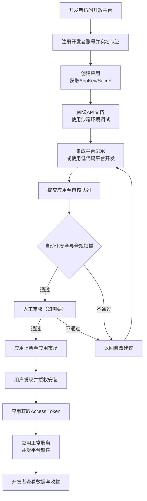

# 2.24 统一开放平台
## 2.24.1 功能描述
统一开放平台是“九州寰宇”构建生态系统的核心枢纽，是一个集能力开放、应用集成、开发者服务与生态治理于一体的平台化基础设施。该模块通过标准化的API接口、SDK工具和低代码开发环境，向第三方开发者、合作伙伴及平台内创作者开放平台的核心能力（如用户身份、支付、AI、数据等），支持快速创建、集成、部署和分发轻应用（微服务），并建有完善的应用市场、API集市和开发者社区，最终形成一个内外联动、持续进化的数字服务生态，极大丰富平台的服务内容与用户体验。
## 2.24.2 用户场景

| 场景类型         | 使用角色          | 具体场景描述                                                                                                          |
| ------------ | ------------- | --------------------------------------------------------------------------------------------------------------- |
| 第三方服务快速集成    | 斜杠内容创作者与独立开发者 | 一位开发者希望将其独立开发的专业配色工具集成到“九州寰宇”的“画廊”模块中，供平台内设计师用户使用。他通过开放平台注册开发者账号，调用平台提供的色彩分析API，并利用低代码工具快速构建了一个轻应用，成功上架至平台应用市场。 |
| 平台能力赋能外部产品   | 企业开发者/合作伙伴    | 一家本地生活服务商希望在其小程序中引入“九州寰宇”的统一支付和用户信誉体系，以提升交易可信度。通过开放平台的API网关，安全地调用了相关接口，实现了业务闭环。                                 |
| 平台内部功能扩展与客制化 | 平台运营方/内部团队    | 平台希望为“论坛社区”增加一个实时的AI翻译功能，以方便不同语言用户的交流。内部团队通过开放平台的低代码开发平台，快速编排和部署了该服务，并可在特定社群中灰度发布。                              |
| 用户发现和使用增值服务  | 所有平台用户        | 一位白领用户在“好物推荐”模块浏览时，发现一个由第三方开发者提供的“历史价格查询”插件，一键授权后即可在商品页面看到价格曲线，辅助购买决策。                                          |

## 2.24.3 核心价值
- 生态增值（核心杠杆）：将平台从单一的服务提供者转变为生态孵化器。通过吸引外部创造力，以极低的边际成本海量扩充平台服务能力，形成“平台提供土壤，开发者创造价值”的良性循环，实现生态价值的指数级增长。
- 用户体验无缝化：用户无需离开“九州寰宇”即可享受由海量开发者提供的专业、垂直的增值服务，所有服务均遵循平台的统一交互和视觉规范，并获得平台的安全与信誉背书，实现真正的一站式体验。
- 开发者成功赋能：为开发者提供从创意、开发、测试、部署到运营、变现的全生命周期支持，降低创业和技术门槛，并借助平台的流量和用户基础，帮助开发者快速触达目标用户，实现商业成功。
- 平台技术价值外溢：将平台在AI算法、大数据分析、支付、安全等领域积累的技术能力，以标准化服务的形式开放给社会，促进整个数字创意产业的发展。
## 2.24.4 需求清单

| 功能类别    | 功能名称        | 功能概述                          | 优先级 |
| ------- | ----------- | ----------------------------- | --- |
| 平台基础    | 开发者门户与管理后台  | 开发者注册、认证、管理后台、数据看板            | P0  |
| 平台基础    | 平台服务治理与监控   | 服务注册发现、流量控制、熔断降级、链路追踪         | P0  |
| 能力开放    | API网关与统一接入  | 所有开放API的统一入口，负责鉴权、限流、计量等      | P0  |
| 能力开放    | 核心能力开放套件    | 开放用户、支付、消息、AI、存储、位置等核心API与SDK | P1  |
| 能力开放    | API集市与文档中心  | 提供所有API的交互式文档、SDK下载、测试沙箱      | P0  |
| 应用开发与集成 | 低代码/无代码开发平台 | 提供可视化工具，支持通过拖拽和配置快速创建应用       | P1  |
| 应用开发与集成 | 应用托管与运行环境   | 提供轻量级应用托管服务（如Serverless容器）    | P1  |
| 应用分发与运营 | 统一应用市场      | 轻应用/插件的展示、搜索、排名、下载、授权管理       | P0  |
| 应用分发与运营 | 开发者社区与支持    | 技术问答、经验分享、官方公告、反馈收集           | P1  |
| 安全与合规   | 安全审计与合规检查   | 应用上架前自动化的代码安全扫描与合规性检查         | P1  |
| 安全与合规   | 精细化权限与隐私控制  | 支持用户数据授权的最小权限原则和透明的隐私协议       | P0  |

## 2.24.5 需求详述
### 2.24.5.1 API网关与统一接入
- 统一流量调度：作为所有外部请求的唯一入口，实现高性能、高可用的请求路由和负载均衡。
- 全生命周期API管理：支持API的创建、发布、下线、版本管理。为每个API设置严格的访问策略，包括认证（如OAuth 2.0）、授权（基于角色或范围）、限流（QPS、并发数）、计量（用于计费或分析）和审计日志（记录所有访问行为）。
- 协议转换与适配：支持HTTP/HTTPS、WebSocket等协议，并可进行内部协议与开放协议之间的转换。
### 2.24.5.2 低代码/无代码开发平台
- 可视化构建器：参考优维统一开放平台的实践，提供 “Visual Builder”（前端页面编排）、“Data Builder”（数据模型定义）和 “Flow Builder”（服务流程编排） 等核心工具。开发者可通过拖拽组件、配置属性、连接数据源和逻辑节点来构建应用界面和业务逻辑。
- AI辅助开发：探索集成AI能力，例如根据自然语言描述自动生成页面草图或推荐合适的组件。
- 与平台深度集成：生成的轻应用可无缝嵌入平台各模块（如博客侧边栏、个人中心），并天然具备调用平台其他开放API的能力。
### 2.24.5.3 统一应用市场
- 应用发现与推广：提供多种应用展示方式，如分类导航、搜索过滤、热门榜单、官方推荐、基于用户行为的个性化推荐等。
- 一站式授权与安装：用户可在应用市场内浏览应用详情、评价、查看隐私政策，并实现“一键安装”。安装过程应清晰告知用户该应用将请求哪些数据权限，并需用户确认。
- 生命周期管理：支持应用的上架审核、版本更新、下架、自动续费（若涉及付费）等全流程管理。
### 2.24.5.4 安全审计与合规检查
- 自动化安全扫描：应用上架前，必须通过自动化的静态应用程序安全测试（SAST） 和动态应用程序安全测试（DAST），检测常见的安全漏洞（如SQL注入、XSS跨站脚本）。
- 隐私合规审查：自动检查应用的数据收集和使用声明是否与平台隐私政策及相关法律法规（如个人信息保护法）相符。
- 人工审核兜底：对于高风险应用或自动化检查无法判定的情况，启动人工审核流程。
## 2.24.6 核心流程
### 2.24.6.1 第三方开发者集成应用核心流程

## 2.24.7 详细用例
### 用例：开发者为其工具创建平台轻应用版
- 项目描述：一个独立开发者希望将其广受欢迎的“Markdown增强编辑器”作为插件集成到“九州寰宇”的博客编辑器中。
- 主要参与者：开发者、开放平台系统、平台审核员、博客模块、终端用户。
- 前置条件：开发者已拥有该工具的核心代码，并已注册为“九州寰宇”平台开发者。
- 基本事件流：
	1. 开发者登录开放平台开发者中心，创建新应用，填写基本信息，获得密钥对。
	2. 在API文档中心，查阅“富文本编辑器扩展”接口的详细说明，并在沙箱环境中进行调试，确认其编辑器可与平台博客系统对接。
	3. 开发者选择使用平台提供的“低代码开发平台”进行界面适配。他使用Visual Builder拖拽组件，快速调整了插件的设置面板UI，使其符合平台设计规范。
	4. 开发完成后，提交应用至审核平台。系统自动进行代码安全扫描，未发现高危漏洞。
	5. 审核通过后，应用成功上架至“博客工具”分类下的应用市场。
	6. 一位博客用户在撰写文章时，发现并安装了这个编辑器插件。授权后，该插件即出现在博客编辑器的工具栏中。
	7. 用户使用该插件提供的特殊功能（如流程图绘制）增强了文章内容，体验流畅。
	8. 平台记录插件的使用情况，开发者可以在后台看到安装量、活跃度等数据。
- 扩展事件流：
	4a. 安全扫描发现风险：系统提示存在一个中危漏洞，开发者根据报告修复后重新提交。
	6a. 用户撤销授权：用户可在设置中随时管理已安装应用的权限或直接卸载。
## 2.24.8 界面与交互要求
参考UI设计稿
## 2.24.9 埋点方案

| 类别    | 事件/页面 ID          | 事件名称    | 触发时机         | 关键属性（示例）                               |
| ----- | ----------------- | ------- | ------------ | -------------------------------------- |
| 开发者行为 | dev\_portal\_view | 开发者门户访问 | 开发者进入门户首页    | source（搜索/引流）                          |
| 开发者行为 | api\_doc\_view    | API文档查看 | 开发者查看特定API文档 | api\_name, duration                    |
| 开发者行为 | app\_submit       | 应用提交审核  | 开发者提交应用上架申请  | app\_id, app\_category                 |
| 用户行为  | app\_market\_view | 应用市场浏览  | 用户进入应用市场     | category（浏览的类别）                        |
| 用户行为  | app\_install      | 应用安装    | 用户成功安装一个应用   | app\_id, permission\_granted           |
| 平台性能  | api\_call         | API调用   | 第三方应用调用平台API | api\_endpoint, response\_time, app\_id |

## 2.24.10 技术细节
- 架构设计：采用微服务架构，API网关、身份认证、开发者服务、应用托管、计量计费、监控告警等模块独立部署，通过服务网格或消息队列进行通信。参考天津“1+1+1+N”大数据体系的集约化建设思路。
- 多租户与资源隔离：在应用托管环境中，必须实现不同开发者应用之间的严格资源隔离（计算、存储、网络），确保安全性和稳定性。
- 高性能API网关：网关需具备高并发处理能力和低延迟响应特性，支持缓存、压缩等优化手段。可借鉴雄安新区物联网开放平台对设备接入和海量数据管理的设计。
- 安全与合规：
	- 认证与授权：全面采用OAuth 2.0/OpenID Connect等工业标准协议。
	- 数据脱敏与加密：对返回给第三方应用的敏感用户数据（如手机号）进行脱敏处理，所有数据传输必须加密。
	- 合规性要求：建立完善的数据安全管理制度和隐私保护政策，确保平台对用户数据的处理符合相关法律法规要求。