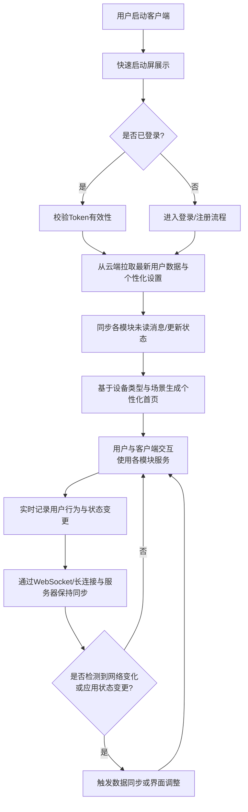

# 2.25 客户端
## 2.25.1 功能描述
全平台客户端是“九州寰宇”生态面向用户的统一服务入口和跨终端体验载体，采用原生+跨平台技术栈开发，覆盖iOS、Android、Windows、macOS、Linux及Web六大平台，确保用户在任何设备上都能获得一致、流畅、高效的服务体验。它并非简单的功能聚合，而是通过深度整合平台的AI推荐引擎、统一身份体系、社交关系链和数据同步能力，提供智能服务导航、无缝跨端续作、个性化界面适配及离线可用性等高级特性的超级应用程序。其核心目标是成为用户数字生活的“中枢神经”，实现“一次登录，全平台服务触手可及”。
## 2.25.2 用户场景

| 场景类型     | 使用角色          | 具体场景描述                                                                     |
| -------- | ------------- | -------------------------------------------------------------------------- |
| 多设备无缝切换  | 都市乐活白领与中产     | 用户在通勤地铁上用手机浏览一篇技术博客，到达办公室后，客户端自动同步阅读进度，用户可在电脑上无缝续读，并利用大屏幕和键鼠更高效地编辑关联的项目文档。 |
| 离线环境持续工作 | 数字原生代学生与技术爱好者 | 学生在图书馆网络不佳的区域，仍可访问客户端内已缓存的课程资料、博客草稿和工具文档，并进行编辑，待网络恢复后自动同步。                 |
| 情境化服务推荐  | 所有用户群体        | 客户端根据用户当前时间（晚间）、位置（家中）和设备（电视大屏），智能将“影视”和“音乐”模块推至首页，并推荐适合放松的影音内容。           |
| 统一创作与管理  | 斜杠内容创作者与独立开发者 | 创作者在平板上绘制草图后，通过客户端直接上传至“画廊”模块，并同步在电脑端使用“博客”功能撰写创作心得，所有素材通过客户端统一管理。         |

## 2.25.3 核心价值
- 省时（跨端一致性）：消除设备壁垒，提供统一的操作习惯和信息架构，用户无需重新学习，在不同设备间切换时实现“零成本”过渡，极大提升使用效率。
- 省心（智能情境感知）：客户端能感知用户所处环境（设备、网络、时间、位置），动态调整界面布局、推荐内容及功能优先级，提供“所想即所得”的情境化服务。
- 增值（体验无缝衔接）：深度打通“阅读一篇博客”与“使用相关工具”、“发现一个好物”与“一键支付”等场景，确保跨业务的操作流高度连贯，创造“1+1\>2”的整体体验价值。
- 归属（社交关系随身）：用户的社群关系、互动动态、个人成就均实时同步 across 全平台，无论使用何种设备，都能持续强化其在平台内的身份认同和社群归属感。
## 2.25.4 需求清单

| 功能类别  | 功能名称          | 功能概述                                   | 优先级 |
| ----- | ------------- | -------------------------------------- | --- |
| 跨平台适配 | 多端原生客户端       | 开发iOS、Android、Windows、macOS、Linux原生客户端 | P0  |
| 跨平台适配 | 自适应PWA Web应用  | 提供高质量的渐进式Web应用，支持离线功能                  | P1  |
| 统一体验  | 一致性的UI/UX设计语言 | 遵循统一设计规范，确保各端操作体验一致                    | P0  |
| 统一体验  | 实时跨端数据同步      | 用户状态、操作进度、偏好设置等多端实时同步                  | P0  |
| 统一体验  | 统一推送中心        | 整合所有平台服务的消息，统一推送和管理                    | P1  |
| 智能交互  | 设备情境感知        | 自动识别设备类型、网络环境，优化内容加载与交互                | P1  |
| 智能交互  | 自适应界面布局       | 根据屏幕尺寸、横竖屏状态动态调整界面布局                   | P0  |
| 智能交互  | 离线模式          | 核心功能支持离线使用，网络恢复后自动同步                   | P1  |
| 性能与安全 | 客户端性能优化       | 启动速度、流畅度、耗电量等关键指标优化                    | P0  |
| 性能与安全 | 端到端安全         | 数据传输加密、本地数据存储安全、生物识别解锁                 | P0  |
| 平台集成  | 深度链接与跳转       | 支持从外部或平台内各模块通过链接直达具体内容                 | P1  |

## 2.25.5 需求详述
### 2.25.5.1 多端原生客户端与自适应Web应用
- 技术选型：移动端采用React Native或Flutter等跨端框架平衡开发效率与性能；桌面端采用Electron或Tauri；Web端采用PWA技术，支持添加到主屏幕和离线访问。
- 一致性体验保障：建立统一的“寰宇设计系统”，明确定义颜色、字体、间距、图标、组件等，确保从手机到电视大屏，视觉和交互逻辑一脉相承。
- 差异化利用：在保持一致性的基础上，充分发挥各设备优势。例如，移动端侧重触控手势和摄像头调用；桌面端支持键盘快捷键、拖拽操作和多窗口；电视端优化遥控器导航和10英尺界面。
### 2.25.5.2 实时跨端数据同步
- 同步策略：采用操作转换或冲突免费复制数据类型技术，处理多端并发编辑可能产生的冲突，优先保证用户体验的流畅性，复杂冲突提供友好解决界面。
- 同步内容：涵盖核心用户数据（个人资料、设置）、行为数据（浏览进度、收藏夹）、创作数据（博客草稿、项目文件元数据）及会话状态（当前所在页面、筛选条件）。
- 智能同步触发：根据网络状况（Wi-Fi/移动数据）和电量，智能选择同步时机和内容（如仅在Wi-Fi下同步大文件）。
### 2.25.5.3 设备与情境感知
- 上下文推断：综合设备传感器（光感、陀螺仪）、网络状态、时间、地理位置等信息，推测用户当前场景（如通勤、办公、居家、休息）。
- 动态界面适配：不仅是响应式布局，更是功能模块的优先级调整。例如，在手机上垂直单列显示，突出核心操作；在平板上采用主从视图（Master-Detail）；在电脑上采用多标签页布局，支持复杂任务并行。
- 资源按需加载：根据设备性能和网络状况，动态加载不同分辨率的图片、视频，或延迟加载非首屏关键资源，保障流畅性。
### 2.25.5.4 离线功能与本地化处理
- 服务工作者（Service Worker）应用：在Web端和Hybrid端利用Service Worker缓存关键静态资源和API请求，实现离线访问。
- 本地数据库：移动端和桌面端使用SQLite或本地文件系统，存储用户经常访问的数据和未同步的草稿。
- 离线操作队列：用户离线时的操作（如点赞、评论、编辑）存入本地队列，联网后按序自动同步至服务器。
## 2.25.6 核心流程
### 2.25.6.1 核心应用启动与服务引导流程

## 2.25.7 详细用例
### 用例：创作者跨设备内容创作与发布
- 项目描述：一位视频创作者需要完成从素材收集、剪辑到发布的全流程，并在不同设备间切换。
- 主要参与者：创作者、全平台客户端、云端同步服务、各功能模块（网盘、影视、博客）。
- 前置条件：用户已登录，并已在客户端内授权相关权限。
- 基本事件流：
	1. 创作者在外出时，用手机客户端拍摄了一段素材，自动上传至个人网盘。
	2. 回到家后，打开桌面客户端，发现网盘中的新素材已通过“最近项目”卡片呈现在首页。
	3. 点击卡片，直接启动“影视”模块的编辑界面，利用电脑的大屏幕和强大性能进行精细剪辑。
	4. 编辑过程中需要一段资料，通过客户端内全局搜索，快速找到平台“维基百科”中的相关词条，并拖拽引用至视频描述草稿中。
	5. 编辑中途休息，在平板上打开客户端，查看剪辑进度预览，并进行简单的批注。
	6. 回到电脑前继续完成剪辑，通过客户端内集成的“统一支付中心”购买正版背景音乐授权。
	7. 视频发布至“影视”模块，客户端自动建议将视频同步分享至其关联的博客和社区，并@提及相关兴趣社群。
	8. 发布成功后，客户端记录该行为，后续将在首页更多推荐其作品给类似兴趣用户。
- 扩展事件流：
	3a. 电脑性能不足：客户端可提示“是否启用云端渲染服务？”。
	6a. 支付中断：支付流程支持断点续付，下次打开客户端时提示继续完成。
## 2.25.8 界面与交互要求
参考UI设计稿
## 2.25.9 埋点方案

| 类别    | 事件/页面 ID              | 事件名称   | 触发时机                 | 关键属性（示例）                                            |
| ----- | --------------------- | ------ | -------------------- | --------------------------------------------------- |
| 启动与留存 | client\_cold\_start   | 冷启动    | 应用从完全关闭状态启动          | os, app\_version, startup\_duration                 |
| 启动与留存 | client\_foreground    | 切换到前台  | 应用从后台切换到前台           | background\_duration                                |
| 跨端行为  | cross\_platform\_sync | 跨端同步   | 用户在一台设备上操作后，在另一台设备继续 | source\_device, target\_device, sync\_content\_type |
| 性能体验  | page\_load\_time      | 页面加载耗时 | 页面主要内容加载完成           | page\_name, load\_duration, network\_type           |
| 性能体验  | offline\_operation    | 离线操作   | 用户在无网络状态下执行操作        | operation\_type, content\_id                        |

## 2.25.10 技术细节
- 架构设计：采用跨平台框架结合原生模块的混合架构。UI和业务逻辑用跨平台技术实现，对性能或硬件访问有高要求的功能（如视频编解码、AR）使用原生模块开发。
- 状态管理与数据流：使用Redux或MobX等状态管理库，确保复杂应用状态下数据流的清晰和可预测性。结合RxJS处理异步数据流和事件通信。
- 网络层优化：
	- HTTP/2 与 QUIC：采用新协议降低连接延迟，提升并发能力。
	- 数据压缩与差分更新：对API返回数据进行压缩，并只同步变更部分（Delta Sync），减少流量消耗。
- 安全与隐私：
	- 代码混淆与加固：防止客户端被反编译，保护业务逻辑。
	- 证书绑定：防止中间人攻击。
	- 本地数据加密：对敏感本地数据（如登录凭证）进行加密存储。