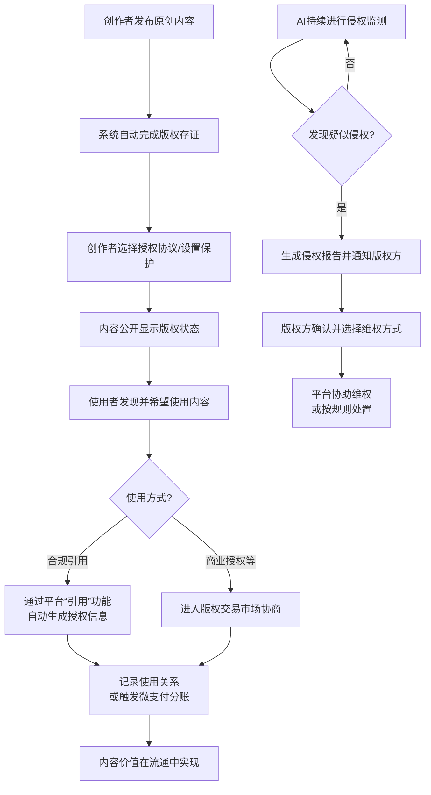

# 2.26 版权
## 2.26.1 功能描述
“版权管理”是“九州寰宇”平台构建可信内容生态的核心基础设施与服务模块。它并非一个独立的、用户直接频繁访问的“功能”，而是一套深度集成于平台各内容模块（博客、画廊、影视、音乐、阅读等）的底层能力与服务体系。该模块通过AI驱动的智能版权识别与登记、多技术融合的版权保护（如数字水印、DRM）、灵活透明的版权交易与授权机制以及高效的侵权监测与处置流程，为平台上的所有创作者（从专业机构到普通用户）提供全生命周期的版权资产管理解决方案。其核心目标是降低原创者的维权门槛、提升内容使用者的合规效率、促进版权内容的合法流通与价值转化，最终营造一个权属清晰、流通顺畅、激励创新的平台内容生态。
## 2.26.2 用户场景

| 场景类型        | 使用角色           | 具体场景描述                                                                                        |
| ----------- | -------------- | --------------------------------------------------------------------------------------------- |
| 原创内容发布与确权   | 斜杠内容创作者与独立开发者  | 一位摄影师在“画廊”模块上传一组原创摄影作品后，系统后台自动为其完成基于区块链的版权存证，并为其提供嵌入不可见数字水印的选项，摄影师可一键设置作品的授权方式（如“署名-非商业性使用”）。 |
| 安全合规地使用他人作品 | 数字原生代学生与技术爱好者  | 一名学生在撰写博客时，想引用平台内另一位用户的一幅图表。通过“引用”功能，系统自动生成符合规范的署名信息，并记录此次授权使用关系，确保学生合规使用，同时为原作带来曝光。          |
| 内容流通与价值变现   | 斜杠内容创作者/所有用户群体 | 一位独立音乐人将作品上传至“音乐”模块，并选择加入平台的“版权激励计划”。其作品被其他用户在创作的视频中作为背景音乐使用时，平台能自动追踪并核算，为音乐人带来基于使用次数的收益。     |
| 侵权发现与快速维权   | 内容创作者/平台运营方    | 系统通过AI监测发现某用户未经授权在平台外大量传播一篇付费专栏文章。平台自动向侵权方发送警示通知，同时为原创作者生成侵权报告，并提供一键提交至相关版权保护中心的便捷通道。         |

## 2.26.3 核心价值
- 对创作者：归属感与价值保障：通过低门槛的版权登记、强大的技术保护和清晰的变现路径，让创作者确信其智力成果在平台内受到尊重和保护，从而激发创作热情，强化对平台的归属感。
- 对使用者：省心与合规：提供清晰、便捷的授权通道和规范的引用工具，极大降低使用者无意侵权的风险，使其能安心、合法地使用平台内海量内容进行再创作和学习。
- 对平台生态：增值与可持续发展：健全的版权管理是构建高质量内容生态的基石。它能吸引更多优质创作者入驻，提升平台内容的整体价值（增值），并通过规范的流通机制促进内容价值的最大化释放，形成良性循环。
- 对社会价值：推动创新与标准实践：探索并实践适应数字时代的版权管理新模式，为行业提供借鉴，助力构建更加健康、公平的互联网版权环境。
## 2.26.4 需求清单

| 功能类别    | 功能名称     | 功能概述                                               | 优先级 |
| ------- | -------- | -------------------------------------------------- | --- |
| 版权确权与登记 | 智能版权存证   | 用户上传原创内容时，自动提取特征值，并基于区块链等技术完成存证，生成版权凭证             | P1  |
| 版权确权与登记 | 版权信息管理   | 用户可查看、管理其所有内容的版权状态、存证时间、登记证书（如需）                   | P1  |
| 版权保护与标识 | 数字水印服务   | 为图片、视频、音频等内容提供可见/不可见数字水印的嵌入功能，用于溯源和防盗版             | P1  |
| 版权保护与标识 | DRM内容保护  | 对高价值的音视频、文档等内容，采用符合行业标准（如ChinaDRM）的加密保护，控制访问、复制、传播 | P2  |
| 版权流通与交易 | 标准化授权协议  | 内置Creative Commons等多种标准化授权协议，供创作者快速选择              | P0  |
| 版权流通与交易 | 版权交易市场   | 为有商业授权需求的内容提供挂牌、展示、谈判、签约、支付的一站式市场                  | P2  |
| 版权流通与交易 | 微授权与分账系统 | 支持内容被小额、多次使用时的自动授权与实时分账（如文章被引用、音乐片段被使用）            | P2  |
| 侵权监测与处置 | AI侵权监测   | 7x24小时扫描平台内外（需授权）公开内容，通过内容指纹比对识别潜在侵权行为             | P1  |
| 侵权监测与处置 | 一键维权通道   | 为创作者提供便捷的侵权举报入口，并自动生成包含存证、比对结果的维权报告                | P1  |
| 平台集成与服务 | 统一版权服务中心 | 在用户个人中心设立统一入口，管理所有版权相关事务                           | P0  |
| 平台集成与服务 | 版权信息查询   | 提供平台内内容的版权状态查询接口，供用户在使用时核查                         | P0  |

## 2.26.5 需求详述
### 2.26.5.1 智能版权存证
- 自动化流程：当用户发布内容（如文章、图片、视频）时，系统在后台自动启动存证流程，无需用户额外操作。通过哈希算法生成内容数字指纹，并记录发布时间、作者信息等元数据。
- 区块链存证：将数字指纹和关键元数据写入区块链（可自建或接入司法区块链存证平台），确保存证信息的不可篡改性和法律效力。存证成功后，在内容页面的特定位置展示“已存证”标识，增强公信力。
- 自愿登记引导：对于有更强法律保障需求的用户，提供引导至国家版权保护中心等权威机构进行正式版权登记的便捷通道和信息说明。
### 2.26.5.2 数字水印服务
- 不可见水印（盲水印）：作为默认选项，在图片、视频、音频文件中嵌入不可感知的水印信息（如创作者ID、作品ID、时间戳）。该水印在经历裁剪、压缩、缩放等常见处理后仍能提取，主要用于侵权溯源和举证。
- 可见水印：用户可选项，支持在图片/视频的指定位置添加半透明的Logo或文字水印，主要用于网络传播时的品牌宣传和基础防盗。
- 水印信息管理：为用户提供水印模板管理功能，并可查询每份内容的水印嵌入记录。
### 2.26.5.3 标准化授权协议
- 协议集成：系统内置多种知识共享（CC）协议选项（如CC BY、CC BY-NC-SA等），以及平台定义的特定授权条款（如“仅限平台内转载”）。创作者在发布内容时可直观选择。
- 机器可读：协议的摘要信息以机器可读的方式（如RDF）与内容绑定，便于平台系统和其他搜索引擎理解作品的授权条件，辅助自动化处理。
- 引用规范生成：当用户通过平台的“引用”功能使用他人作品时，系统根据原作品选择的授权协议，自动生成符合规范的署名文本和来源链接。
### 2.26.5.4 AI侵权监测
- 平台内监测：实时扫描平台内新发布的内容，通过特征比对算法，识别是否存在未经授权的全文转载、大幅抄袭、图片/视频盗用等行为。
- 平台外监测（可选）：在获得创作者授权的前提下，可利用网络爬虫和内容指纹技术，对主流公开平台进行监测，发现侵权行为。
- 监测报告与处置：发现疑似侵权后，自动生成监测报告。对于平台内侵权，可依据规则自动执行下架等操作；对于平台外侵权，将报告提供给版权方，并协助其进行后续维权。
## 2.26.6 核心流程
### 2.26.6.1 核心版权管理与使用流程

## 2.26.7 详细用例
### 用例：博主合规引用图片并发现侵权
- 项目描述：一位科技博主在撰写深度分析文章时，需要引用平台内另一位用户发布的芯片结构图，并在后续发现该图被站外盗用。
- 主要参与者：博主（使用者）、图片创作者（版权方）、AI监测系统、版权管理服务。
- 前置条件：图片创作者已上传图片并选择“署名-非商业性使用-相同方式共享”授权协议。
- 基本事件流：
	1. 博主在编辑文章时，通过平台内搜索找到所需的芯片结构图。
	2. 点击图片下方的“引用”按钮，系统弹出浮层，显示该图片的版权信息、授权协议详情。
	3. 博主确认后，系统自动在文章编辑器中插入带有所选图片和规范署名信息的代码块。
	4. 文章发布后，图片下方清晰标注了来源和创作者链接。
	5. 同时，平台的AI侵权监测系统在例行扫描中，发现某外部科技网站未经授权直接盗用了该芯片结构图，且未署名。
	6. 系统自动生成侵权报告，并通过站内信通知图片创作者。报告包含侵权链接、原图链接、存证时间戳对比等信息。
	7. 图片创作者查看报告后，确认侵权事实。她使用平台提供的“一键维权”功能，选择向侵权网站发送警示函。
	8. 平台自动将警示函及侵权报告发送至对方邮箱。对方收到后很快撤下了图片并道歉。
- 扩展事件流：
	7a. 侵权方不予理会：创作者可选择将报告导出，并一键提交至中国版权保护中心等机构寻求进一步帮助。
## 2.26.8 界面与交互要求
参考UI设计稿
## 2.26.9 埋点方案

| 类别   | 事件/页面 ID              | 事件名称   | 触发时机             | 关键属性（示例）                           |
| ---- | --------------------- | ------ | ---------------- | ---------------------------------- |
| 版权声明 | copyright\_assert     | 版权声明   | 用户发布内容时选择或确认版权信息 | content\_type, license\_type       |
| 内容使用 | content\_license\_use | 内容授权使用 | 用户通过平台规范流程使用他人作品 | source\_content\_id, license\_type |
| 侵权处理 | infringement\_report  | 侵权举报   | 用户发起侵权举报         | report\_type（平台内/外）, content\_id   |
| 交易行为 | license\_transaction  | 授权交易   | 在版权市场完成一笔授权交易    | transaction\_amount, content\_id   |

## 2.26.10 技术细节
- 架构设计：采用微服务架构，版权存证、水印/DRM处理、授权交易、侵权监测等作为独立服务，通过API网关与各业务模块（博客、画廊等）对接。存证服务需考虑高可靠性和法律效力，可接入权威司法区块链。
- DRM技术选型：音视频等高价值内容保护，可参考或集成成熟的DRM系统，如符合国际标准及中国广电与网络视听行业标准的ChinaDRM体系，以满足高安全级别要求和对不同终端设备的广泛兼容性。
- AI监测算法：结合内容指纹提取（用于音视频）、图像特征比对、文本相似度分析等多种AI算法，提高侵权识别的准确率和效率。需建立持续学习的机制，以应对新的侵权形式。
- 安全与合规：
	- 所有存证、交易数据需加密存储和传输。
	- 严格遵守《著作权法》等法律法规，并参考国家版权局关于重点作品版权保护预警的工作机制。
	- 用户数据隐私保护至关重要，平台外监测必须获得用户明确授权。