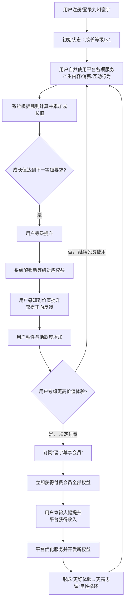

# 2.27 会员
## 2.27.1 功能描述
会员体系是“九州寰宇”平台实现用户价值分层、忠诚度培养与生态价值闭环的核心运营模块。它是一个集成长等级、付费订阅、权益生态与社区身份于一体的综合性会员框架。该体系通过“成长型会员”（免费，基于活跃度）与“寰宇尊享会员”（付费，订阅制）双轨并行机制，结合平台内各业务模块（如博客、影视、音乐、工具集合等）的专属权益，为用户提供阶梯式特权与个性化服务。其核心目标是构建一个良性的价值循环：用户通过活跃参与或付费订阅提升会员等级，获得更多特权；这些特权又反过来增强用户体验和粘性，从而提升用户的终身价值（LTV），并为平台带来稳定的收入与活跃度。
## 2.27.2 用户场景

| 场景类型       | 使用角色          | 具体场景描述                                                                                       |
| ---------- | ------------- | -------------------------------------------------------------------------------------------- |
| 新用户引导与留存   | 数字原生代学生与技术爱好者 | 新用户注册后，系统通过简单的任务引导其了解会员成长体系，完成初始任务获得成长值，快速解锁基础特权（如更大附件上传空间），感受到平台价值并被留存。                     |
| 高频用户价值深化   | 都市乐活白领与中产     | 一位经常使用平台“好物推荐”和“在线教育”模块的用户，发现成为“寰宇尊享会员”后，购物返利比例更高且能免费观看部分付费课程，认为物超所值而决定订阅。                   |
| 创作者变现与品牌提升 | 斜杠内容创作者与独立开发者 | 一名活跃的博客作者，其内容获得高互动，成长等级不断提升。高等级带来的专属身份标识和内容优先推荐权益，助其扩大了影响力，进而促使他考虑订阅付费会员，以获得更强大的数据分析工具和推广资源。 |
| 跨生态综合体验    | 所有高价值用户       | 一个重度用户同时使用平台的影视、音乐、网盘等服务。购买“寰宇尊享会员”后，可享受影视无广告、音乐高音质、网盘大空间等一揽子权益，免去多次付费的麻烦，获得真正的“一站式”畅快体验。    |

## 2.27.3 核心价值
- 对用户：省心与增值
	- 省心：会员体系整合平台内碎片化权益，提供明确的价值预期和获取路径，降低用户的选择成本。
	- 增值：通过跨业务场景的权益联动（如购物折扣+内容免广+工具高级功能），使会员身份带来“1+1\>2”的体验加成，远超单个服务价值之和。
- 对平台：归属与省时（提升效率）
	- 归属：会员等级与特权成为用户在平台内的身份象征和成就记录，增强其归属感和参与感，形成稳定的核心用户社群。
	- 省时（提升运营效率）：清晰的用户分层使平台能进行精细化运营，针对不同价值的用户提供差异化服务，优化资源配置，提升留存和转化效率。
## 2.27.4 需求清单

| 功能类别    | 功能名称     | 功能概述                               | 优先级 |
| ------- | -------- | ---------------------------------- | --- |
| 会员框架    | 双轨会员体系   | 建立“成长等级会员”（免费）和“寰宇尊享会员”（付费）两套并行的体系 | P0  |
| 会员框架    | 会员层级与命名  | 设计两套体系的等级名称、图标及升级所需成长值/付费标准        | P0  |
| 成长与积分   | 成长值获取与计算 | 定义用户通过登录、内容消费、创作、互动等行为获取成长值的规则     | P0  |
| 成长与积分   | 积分系统     | 积分作为可消耗的虚拟资产，用于权益兑换、抽奖等            | P1  |
| 权益设计    | 核心权益矩阵   | 为不同等级会员设计平台内各模块的特权（如身份、功能、内容、服务）   | P0  |
| 权益设计    | 跨平台生态权益  | 探索与外部合作伙伴（如电商、娱乐）的联合权益             | P2  |
| 用户感知与互动 | 会员中心     | 用户查看等级、进度、权益、账单的统一页面               | P0  |
| 用户感知与互动 | 会员任务中心   | 发布每日/每周任务，引导用户行为并奖励成长值/积分          | P1  |
| 用户感知与互动 | 升级与成就仪式  | 用户升级时的动效、勋章、系统通知等正向反馈              | P1  |
| 运营与后台   | 会员管理后台   | 支持配置等级规则、权益、定价、数据看板等               | P0  |
| 运营与后台   | CRM与精准触达 | 根据会员生命周期（新付费、续费、流失风险）进行消息推送        | P1  |

## 2.27.5 需求详述
### 2.27.5.1 双轨会员体系与层级设计
- 成长等级会员（免费）：
	- 层级命名：采用具有平台特色和探索感的名称，如探索者、旅人、学者、大师、寰宇行者，共5级。
	- 升级机制：完全依据“成长值”积累。成长值通过平台内自然行为（每日登录、发布内容、消费互动等）获得，无有效期限制，等级持续有效。
- 寰宇尊享会员（付费）：
	- 层级命名：采用通用认知度的金属名称，如白银、黄金、铂金、钻石，共4级，对应不同付费档位和权益包。
	- 订阅机制：按月/季/年付费订阅。付费期间享有对应等级权益，过期未续费则权益失效，降级为免费会员。
### 2.27.5.2 成长值与积分系统
- 成长值计算：
	- 核心原则：成长值反映用户对平台的综合贡献与活跃度。计算公式为多维度的黑盒模型，涵盖消费贡献（在线支付金额）、活跃贡献（登录频次、使用服务数量）、内容贡献（发布博客、视频获赞/收藏）、社区贡献（高质量评论、举报违规）等。
	- 衰减机制：为激励持续活跃，用户连续90天无任何活跃行为，成长值将有小额衰减。
- 积分系统：
	- 获取：通过签到、完成任务、内容获赞、购买付费会员等方式获得。
	- 消耗：用于兑换平台内代金券、抽奖机会、限定数字商品等。积分通常设有有效期。
### 2.27.5.3 会员权益矩阵设计
※权益设计需紧密结合平台现有及规划中的业务模块，下表为权益矩阵：

| 权益类型 | 成长等级会员            | 寰宇尊享会员                    |
| ---- | ----------------- | ------------------------- |
| 身份特权 | 专属等级标识、自定义头像框     | 炫彩身份铭牌、专属客服通道             |
| 内容特权 | 付费博客阅读8折、抢先体验新功能  | 影视/音乐免广告、付费课程免费券、AI写作高级额度 |
| 功能特权 | 网盘容量增至200G、项目协同编辑 | 云游戏不限时、开源仓库私有库、工具集合Pro版   |
| 生活特权 | 好物推荐返利加成5%        | 电商购物折上96折、每月3张免邮券         |

### 2.27.5.4 会员中心与互动
- 会员中心主页：清晰展示当前等级、进度条、下一等级预览权益、待完成任务。提供“权益一览”入口，分类展示所有可用特权。
- 任务系统：设计日常任务（如“登录平台”、“评论一次”）和挑战任务（如“成功发布一篇博文”、“完成一门课程”），引导用户探索平台功能并给予即时奖励。
- 游戏化与仪式感：用户升级时伴有庆祝动效和解锁新勋章的提示；付费会员续费周年时发送感谢信和专属礼品。
## 2.27.6 核心流程
### 2.27.6.1 会员成长与价值提升核心流程

## 2.27.7 详细用例
### 用例：白领用户从感知到订阅付费会员的全过程
- 项目描述：一位都市白领在深度使用平台免费服务后，被付费会员的深度权益吸引并完成订阅。
- 主要参与者：用户、会员系统、平台各服务模块、统一支付中心。
- 前置条件：用户已注册并活跃使用平台，成长等级达到“学者”（Lv3）。
- 基本事件流：
	1. 用户在工作日晚间打开“九州寰宇”，计划观看一部电影。在播放前，系统展示了一个15秒的贴片广告。
	2. 广告结束后，界面出现一条温和的提示：“尊敬的学者用户，订阅「寰宇尊享会员」可享受全年观影免广告，现首年特惠仅需XX元。”
	3. 用户点击提示，进入会员中心权益介绍页。页面清晰对比了免费等级与付费会员的权益差异，突出展示了“影视免广告”、“音乐SQ音质”、“网盘2T空间”、“购物96折”等对他有吸引力的特权。
	4. 用户心动了，点击“立即订阅”按钮，跳转至平台统一支付中心，使用已绑定的支付方式完成付款。
	5. 支付成功瞬间，系统提示“恭喜您已成为寰宇尊享（黄金）会员！”。
	6. 用户返回影视模块，再次播放电影，广告已消失。接着，他尝试下载一份大型工作文件到网盘，发现空间已自动扩容。
	7. 在浏览“好物推荐”时，商品价格旁直接显示了会员折扣价。
	8. 一周后，系统根据他的观影记录，通过会员专属推送通道，推荐了一部契合他口味的独家纪录片。
扩展事件流：
4a. 支付失败：系统引导用户检查支付方式或尝试其他渠道，并提供客服入口。
7a. 权益未立即生效：用户可通过会员中心的“权益中心”页面一键触发“权益刷新”，或联系专属客服通道解决问题。
## 2.27.8 界面与交互要求
参考UI设计稿
## 2.27.9 埋点方案

| 类别   | 事件/页面 ID                     | 事件名称   | 触发时机        | 关键属性（示例）                       |
| ---- | ---------------------------- | ------ | ----------- | ------------------------------ |
| 会员展示 | membership\_center\_view     | 会员中心曝光 | 用户进入会员中心主页  | current\_tier（当前等级）            |
| 会员升级 | membership\_tier\_up         | 会员等级提升 | 用户等级提升时     | previous\_tier, new\_tier      |
| 付费行为 | membership\_subscribe\_click | 订阅点击   | 用户点击订阅按钮    | subscribe\_tier（订阅档位）          |
| 付费行为 | membership\_payment\_success | 支付成功   | 用户成功支付会费    | payment\_method, order\_amount |
| 权益使用 | membership\_benefit\_use     | 权益使用   | 用户使用某项会员特权时 | benefit\_type（权益类型）            |

## 2.27.10 技术细节
- 架构设计：会员系统作为核心中台能力，采用微服务架构。等级计算服务、权益校验服务、订阅与支付服务、任务中心服务等模块独立部署，通过API网关为平台内各业务模块提供标准接口。
- 数据一致性：用户等级变更、权益发放等关键操作，采用事件驱动架构（EDA），通过消息队列（如Kafka）通知到相关业务模块，确保数据最终一致性。
- 成长值计算性能：为避免实时计算海量用户数据带来的性能压力，采用离线计算与实时增量更新相结合的方式。例如，每日凌晨通过大数据任务批量计算核心成长值，而实时行为（如支付）则触发增量更新。
- 权益验证：各业务模块在提供特权服务前，需通过标准API接口向会员权益服务中心发起校验请求，确保权限准确无误。