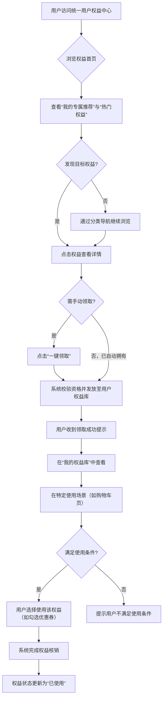

# 2.28 统一用户权益中心
## 2.28.1 功能描述
统一用户权益中心是“九州寰宇”平台生态体系的核心运营枢纽与用户价值兑现平台。它作为一个集中化、可视化的统一门户，旨在整合平台内各业务模块（如会员体系、版权服务、开源仓库、购物、网盘等）以及未来可能引入的第三方服务权益，为用户提供一站式的权益查询、领取、使用与管理体验。该中心通过构建统一的权益账户、标准化的权益标识与发放流程、以及智能化的权益推荐与提醒系统，实现用户权益的集中展示、便捷核销与透明追溯，确保用户能够清晰感知、轻松使用其在不同场景下获得的所有权益，从而最大化平台生态为用户带来的整体价值。
## 2.28.2 用户场景

| 场景类型      | 使用角色          | 具体场景描述                                                                                                |
| --------- | ------------- | ----------------------------------------------------------------------------------------------------- |
| 新用户激活与引导  | 数字原生代学生与技术爱好者 | 新用户注册后，在首次引导中访问权益中心，领取“新手礼包”（如博客附件空间券、工具集合体验券、社区声望加速卡），快速感知平台价值，降低启动门槛。                               |
| 日常价值管理与兑现 | 都市乐活白领与中产     | 用户每月初习惯性打开权益中心，查看其“寰宇尊享会员”状态、本月可领取的各类消费券（如好物推荐折扣券）、即将过期的体验权益（如云游戏时长），并进行统一规划使用，避免遗忘和浪费。               |
| 创作激励与价值变现 | 斜杠内容创作者与独立开发者 | 创作者在开源仓库的高质量项目获得大量星标，或在博客发布的热门文章带来高转化，系统自动为其权益账户发放“创作激励积分”或特定资源包（如网盘存储空间券、版权登记加速券），创作者可在中心内查看明细并兑换使用。 |
| 跨生态权益融合体验 | 所有高价值用户       | 用户购买了“寰宇尊享会员”，其权益中心不仅显示会员核心权益（如影视免广告），还清晰展示因其高会员等级而解锁的跨模块联动权益（如在购物模块的额外折扣、在开源仓库的私有代码库数量提升）。           |

## 2.28.3 核心价值
- 省心（权益透明化，管理集约化）：将分散在各处的权益聚合一处，提供清晰的分类、状态与有效期管理，使用户对自身可享受的利益一目了然，极大降低用户的认知与管理成本。
- 增值（生态联动价值显性化）：通过将跨业务模块的联动权益以及成长/付费体系的附加权益进行集中展示与说明，使平台生态的协同效应变得直观可见，让用户深切感受到“1+1\>2”的叠加价值。
- 归属（成就与身份的可视化激励）：权益中心成为用户平台身份与成就的展示窗口，例如显示用户等级勋章、获得的特殊荣誉标识、活跃度成就解锁的专属权益等，增强用户的荣誉感与社群归属感。
- 省时（智能提醒与一键直达）：系统主动提醒即将到期或新到账的权益，并提供权益使用场景的快捷入口，使用户能及时、便捷地享受其应得利益，避免因遗忘造成的损失。
## 2.28.4 需求清单

| 功能类别    | 功能名称    | 功能概述                                  | 优先级 |
| ------- | ------- | ------------------------------------- | --- |
| 权益账户与资产 | 统一权益账户  | 为每个用户建立唯一的权益账户，聚合所有类型的权益资产            | P0  |
| 权益账户与资产 | 我的权益库   | 用户查看所有已拥有权益（包括有效、即将到期、已使用、已过期）        | P0  |
| 权益账户与资产 | 权益流水与明细 | 查看每项权益的获取来源、使用记录、过期记录                 | P1  |
| 权益发现与获取 | 权益中心首页  | 聚合展示可领取、推荐、热门权益，运营活动入口                | P0  |
| 权益发现与获取 | 权益分类与筛选 | 按模块（购物、阅读、创作等）、类型（折扣、功能、身份等）筛选浏览      | P1  |
| 权益发现与获取 | 智能权益推荐  | 基于用户行为与偏好，在首页个性化推荐高相关度权益              | P1  |
| 权益使用与管理 | 权益状态可视化 | 清晰标识权益的有效期、使用条件、剩余次数/额度               | P0  |
| 权益使用与管理 | 一键领取/激活 | 对需手动领取的权益，提供便捷的一键领取/激活操作              | P0  |
| 权益使用与管理 | 快速核销与跳转 | 提供权益使用入口或指引，便捷跳转至对应使用场景               | P0  |
| 平台集成与管理 | 权益发放平台  | 为平台各模块及运营人员提供标准API与后台工具，用于权益的创建、发放、管理 | P0  |
| 平台集成与管理 | 权益规则引擎  | 支持配置权益的发放规则（如条件触发、手动投放）、使用规则与核销逻辑     | P1  |
| 运营与洞察   | 权益数据看板  | 为运营者提供各权益的领取率、核销率、用户画像等数据分析           | P1  |

## 2.28.5 需求详述
### 2.28.5.1 统一权益账户与资产可视化
- 账户抽象层：在用户统一身份体系下，构建一个逻辑上的“权益账户”，作为连接所有业务模块权益发放与用户权益资产的中间层。此账户不直接管理资金，而是记录权益的凭证、状态和元数据。
- 多维度状态管理：在“我的权益库”中，需清晰区分权益的状态（未使用/已使用/已过期/冻结）、来源（系统赠送/活动获得/会员自带/积分兑换/付费购买）、类型（虚拟权益/消费权益/体验权益/活动权益）。
- 权益卡片设计：每一项权益应以卡片化形式呈现，卡片上需突出核心信息：权益图标、名称、简要说明、剩余数量/额度、有效期（明确起止时间或“剩余X天”）。对于功能性权益（如网盘加速），可显示简要的使用进度或效果说明。
### 2.28.5.2 权益发现、领取与智能推荐
- 中心化集市：“权益中心”首页应设计为活跃的权益集市，包含以下模块：
	- 焦点图/活动区：推送大型运营活动相关的权益。
	- 我的专属推荐：基于用户历史行为（如常逛模块、消费习惯、创作领域）利用算法推荐可能感兴趣的权益，提升权益领取的针对性和使用率。
	- 热门权益：展示平台内领取和核销率高的热门权益。
	- 权益分类导航：支持按平台业务模块（阅读、影视、工具等）和权益类型（优惠券、特权功能、皮肤装扮等）进行筛选浏览。
- 便捷领取流程：对于需要用户主动领取的权益（如活动券），提供醒目的“一键领取”按钮。领取后应有明确的成功反馈，并可在“我的权益库”中立即看到。
### 2.28.5.3 权益发放平台与规则引擎
- 标准化接口：提供一套定义清晰的API接口，允许平台内各业务模块（如会员系统、版权系统、购物系统）以及未来的第三方应用，按照既定协议向指定用户或用户群发放权益。接口需包含权益类型、数量、有效期、使用条件等参数。
- 运营后台支持：为运营人员提供可视化的权益管理后台，支持：
	- 权益创建：定义新权益的名称、图标、描述、类型、规则等。
	- 批量发放：根据用户标签、行为事件等条件，向目标用户群体批量发放权益。
	- 活动管理：配置限时活动，关联活动与权益发放规则。
- 规则引擎灵活性：支持配置复杂的发放规则，例如：“用户连续登录7天后，自动发放一张‘工具集合9折券’”；“用户在本月消费满500元，即可在权益中心领取‘次月网盘空间翻倍卡’”。
## 2.28.6 核心流程
### 2.28.6.1 用户领取并使用权益核心流程

## 2.28.7 详细用例
### 用例：创作者领取并使用创作激励权益
- 项目描述：一位独立开发者因其在平台开源仓库的高质量项目获得了平台的“月度之星”激励，需在权益中心领取并使用相关权益。
- 主要参与者：开发者（用户）、权益中心系统、开源仓库模块、网盘系统。
- 前置条件：用户已获得“月度之星”资格，相关权益已准备就绪但需手动领取。
- 基本事件流：
	1. 用户登录平台后，收到系统通知：“恭喜您当选开源仓库‘月度之星’，请至权益中心领取您的专属奖励！”
	2. 用户点击通知，直接跳转至权益中心首页。首页的“我的专属推荐”区域首位醒目展示着“月度之星激励包”。
	3. 用户点击该权益包，进入详情页，查看包含的具体内容：①“200元购物代金券”；②“网盘空间+500GB（有效期30天）”；③“版权登记加急券一张”。
	4. 用户点击详情页的“立即领取”按钮。系统校验通过，将三项权益分别发放至用户的权益账户。
	5. 领取成功，用户可在“我的权益库”中看到这三项权益，并清晰看到各自的有效期。
	6. 次日，用户需要上传一个大型项目备份至网盘，发现空间不足。此时，在网盘上传页面，系统自动提示：“您拥有‘网盘空间+500GB’权益，是否立即启用？”
	7. 用户点击“启用”，网盘空间即时扩容，权益状态变为“使用中”。
	8. 一周后，用户购买编程书籍，在结算页面自动匹配并使用了“200元购物代金券”。
- 扩展事件流：
	6a. 用户未在提示下主动使用：用户亦可随时前往权益中心，在“我的权益库”中找到该网盘空间权益，点击“立即使用”跳转至网盘进行激活。
## 2.28.8 界面与交互要求
参考UI设计稿
## 2.28.9 埋点方案

| 类别   | 事件/页面 ID              | 事件名称     | 触发时机            | 关键属性（示例）                                |
| ---- | --------------------- | -------- | --------------- | --------------------------------------- |
| 页面浏览 | equity\_center\_view  | 权益中心首页浏览 | 用户进入权益中心首页      | source（通知/导航）                           |
| 权益曝光 | equity\_impression    | 权益曝光     | 权益卡片进入用户可视区域    | equity\_id, position, recommend\_reason |
| 权益互动 | equity\_click\_detail | 点击查看权益详情 | 用户点击权益卡片查看详情    | equity\_id                              |
| 权益获取 | equity\_acquire       | 权益领取     | 用户成功领取一项权益      | equity\_id, acquire\_channel            |
| 权益使用 | equity\_use           | 权益使用     | 用户在场景中成功使用/核销权益 | equity\_id, use\_scenario               |

## 2.28.10 技术细节
- 架构设计：采用微服务架构，权益中心服务作为核心中台能力，独立部署。提供标准的API网关供各业务模块调用权益发放、查询接口。需与用户中心、会员系统、支付中心、消息中心等紧密集成。
- 数据模型：需设计灵活的权益数据模型，以支持多种权益类型（券、特权、实物兑换码等）。核心表包括权益定义表、用户权益账户表、权益发放记录表、权益核销记录表。
- 规则引擎与风控：集成或自建轻量级规则引擎，处理权益发放与核销的条件判断。需设立风控机制，防止恶意刷取权益，如同一个用户ID在短时间内重复领取同一权益。
- 缓存与性能：用户频繁访问的“我的权益库”数据应进行缓存，以保障页面加载速度。权益核销接口需保证高可用和一致性，避免超卖或重复使用。