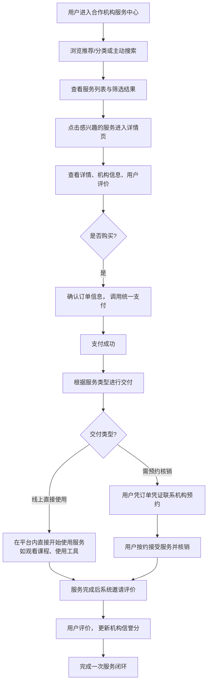

# 2.29 统一合作机构服务中心
## 2.29.1 功能描述
统一合作机构服务中心是"九州寰宇"平台实现生态资源整合与跨机构服务协同的核心枢纽，是一个集机构入驻管理、服务集成发布、资源智能匹配与合作生态治理于一体的B2B2C平台。该模块通过标准化的API接口、可视化配置工具和智能撮合机制，吸引外部优质服务提供商（如教育机构、内容工作室、工具开发者、本地服务商等）入驻平台，将其服务能力深度集成到九州寰宇的生态中。为C端用户提供一站式发现、比较、使用和评价多机构服务的统一入口，同时为B端合作机构提供完整的服务管理、数据分析、结算变现支持，最终形成"平台搭台、机构唱戏、用户受益"的良性生态循环。
## 2.29.2 用户场景

| 场景类型        | 使用角色            | 具体场景描述                                                                                                  |
| ----------- | --------------- | ------------------------------------------------------------------------------------------------------- |
| 服务发现与一站式使用  | 都市乐活白领与中产       | 用户需要系统学习数据分析技能，在服务中心通过智能筛选（按学科、难度、价格、评分）发现并比较3家知名数据科学机构提供的课程组合，一次性购买包含理论课、实践项目和证书的"技能提升套餐"。             |
| 机构服务管理与优化   | 斜杠内容创作者/独立开发工作室 | 一个独立设计工作室入驻中心，上架其UI/UX设计服务包。通过中心的数据看板分析用户点击和购买行为，发现"移动端设计"需求旺盛，于是优化服务包内容，并通过平台的"精准推广"工具定向推送至有相关搜索记录的用户。 |
| 平台生态运营与质量管控 | 平台运营方           | 平台运营人员通过审核中心对申请入驻的编程教育机构进行资质审核（师资、课程大纲、过往评价），上架后通过用户评分和完结率监控其服务质量，对持续高分机构给予流量倾斜，对低分机构发出整改警告。            |
| 跨机构服务组合与联动  | 所有用户            | 用户购买"Vlog创作入门"学习路径，该路径自动组合了A机构的视频拍摄课程、B机构的剪辑工具会员和C机构的音乐版权库订阅，用户无需分别购买和切换，实现无缝学习体验。                      |

## 2.29.3 核心价值
- 对用户：省时与省心
	- 省时：汇聚海量专业服务，免去在多个外部网站间反复搜索、比对、注册和支付的麻烦，实现"一个平台，万物可得"。
	- 省心：通过平台的资质审核、统一客服、信誉评价体系为用户筛选优质服务，降低决策风险和试错成本。AI智能推荐基于用户画像精准匹配最合适的机构与服务。
- 对合作机构：增值与增效
	- 增值：借助平台庞大的用户流量和成熟的支付、社区、营销体系，机构可快速触达目标客群，实现收入增长和品牌曝光，专注于核心服务而非平台建设。
	- 增效：中心提供完善的服务管理后台、数据分析和结算工具，极大提升机构的运营效率。可与其他机构服务组合销售，创造新的营收点。
- 对平台：生态繁荣与壁垒构建
	- 生态繁荣：丰富的第三方服务极大增强了平台对用户的吸引力和粘性，形成"更多用户→更多优质机构入驻→更丰富服务→更多用户"的增长飞轮。
	- 构建壁垒：深度集成的合作网络和成熟的协同机制难以被简单复制，构成平台的核心竞争力。
## 2.29.4 需求清单

| 功能类别    | 功能名称      | 功能概述                        | 优先级 |
| ------- | --------- | --------------------------- | --- |
| 机构入驻与管理 | 机构入驻申请与审核 | 机构在线提交申请，平台审核资质后完成入驻        | P0  |
| 机构入驻与管理 | 机构后台管理系统  | 为机构提供服务上下架、信息修改、数据查看等功能     | P0  |
| 机构入驻与管理 | 机构分层与评级体系 | 根据服务质量、销量等指标对机构进行分级和认证      | P1  |
| 服务集成与展示 | 统一服务目录与货架 | 集中展示所有审核通过的服务，支持多维度分类筛选     | P0  |
| 服务集成与展示 | 服务详情页     | 展示服务详情、机构信息、用户评价、常见问答等      | P0  |
| 服务集成与展示 | 智能搜索与推荐   | 支持关键词搜索，并根据用户偏好推荐服务         | P1  |
| 交易与履约   | 统一订购与支付   | 用户通过平台统一支付中心购买服务            | P0  |
| 交易与履约   | 服务交付与核销   | 支持线上直接交付（如课程学习）和线下核销（如预约服务） | P0  |
| 交易与履约   | 结算与分成中心   | 平台与机构按约定规则进行结算和分成           | P1  |
| 评价与反馈   | 服务评价与信誉体系 | 用户完成服务后可评价，形成机构和服务的信誉分      | P1  |
| 评价与反馈   | 争议处理与客服介入 | 出现问题时用户可发起申诉，平台客服介入协调       | P1  |
| 平台运营    | 机构与服务审核   | 平台运营人员审核申请入驻的机构及上架的服务       | P0  |
| 平台运营    | 数据看板与运营分析 | 查看平台交易数据、机构运营情况等            | P1  |

## 2.29.5 需求详述
### 2.29.5.1 机构入驻与认证
- 标准化入驻流程：提供清晰的在线申请入口，机构需填写基本信息（名称、简介、Logo）、资质证明（营业执照、行业许可证）、联系人信息等。平台运营团队后台审核，确保机构资质合规。
- 分层管理体系：建立机构等级（如普通、银牌、金牌），等级与服务质量、用户评价、交易额等指标挂钩。高等级机构在搜索排名、推荐权重、平台活动资源上获得倾斜，激励机构提供优质服务。
- 机构后台赋能：为每个入驻机构提供独立后台，支持其管理服务信息（增删改查）、查看订单与结算数据、回复用户咨询、参与平台营销活动等。
### 2.29.5.2 服务集成与货架管理
- 标准化服务模板：针对不同类型服务（在线课程、工具软件、咨询服务、实体商品等）设计标准化信息字段和交付流程，保证服务展示的规范性和用户体验的一致性。
- 智能分类与标签：采用"平台预设分类+机构自定义标签"的方式，对服务进行多维度打标（如目标人群、技能领域、价格区间），便于用户筛选和系统精准推荐。
- 服务组合与打包：支持机构或将不同机构的服务组合成"解决方案包"或"学习路径"，满足用户复杂需求，提升客单价和交叉销售机会。
### 2.29.5.3 交易、交付与结算
- 统一交易流程：购买流程深度集成平台统一支付中心，支持多种支付方式。交易资金由平台暂存，服务完成后或根据约定周期结算给机构，保障双方权益。
- 灵活交付与核销：
	- 线上服务：如在线课程，用户购买后直接在平台内学习、使用。
	- 需预约服务：如线下培训、咨询，用户购买后获得凭证，在约定时间内向机构预约、核销。
	- 工具类服务：如SAAS工具，用户购买后获得授权码或自动开通平台内使用权限。
- 自动化结算对账：平台提供清晰的结算规则（如平台收取技术服务费比例）和对账工具，机构可随时查询订单状态和结算金额，支持定期（如月结）自动打款。
### 2.29.5.4 评价与信誉体系
- 多维度评价：用户可从服务质量、服务态度、性价比等多个维度对已完成的服务进行打分和文字评价，并可上传图片/视频凭证。
- 信誉分计算：基于评价分数、投诉率、完结率等数据，动态计算每个机构和单项服务的信誉分，并在详情页醒目位置展示，作为用户决策的重要参考。
- 评价管理：机构可对评价进行回复（公开），对于恶意差评可提交证据申请平台审核。平台运营方有权管理不当评价。
## 2.29.6 核心流程
### 2.29.6.1 用户使用服务核心流程

## 2.29.7 详细用例
### 用例：白领用户寻找并购买专业技能提升课程
- 项目描述：一位职场人士希望提升项目管理能力，通过服务中心寻找并购买合适的课程。
- 主要参与者：用户、合作机构服务中心、培训机构（合作机构）、统一支付系统。
- 前置条件：用户已登录平台，已有若干家项目管理培训机构入驻并通过审核。
- 基本事件流：
	1. 用户在平台个人中心看到"根据您的职业规划，为您推荐项目管理技能"的提示，点击进入"合作机构服务中心"。
	2. 服务中心首页的"猜你喜欢"区域展示了几个项目管理课程。用户使用筛选功能，选择"技能领域：项目管理"、"难度：初级到中级"、"学习方式：在线直播+录播"、"评分：4.5星以上"。
	3. 系统筛选出3个符合条件的课程。用户比较它们的课程大纲、师资介绍、价格和用户评价后，选择了由"某知名培训机构"提供的"敏捷项目管理实战课"。
	4. 用户点击"立即购买"，系统跳转至订单确认页，展示了课程名称、价格、服务周期（半年内可无限次回看）。用户使用平台账户余额完成支付。
	5. 支付成功后，订单状态更新为"已购买"。用户可在"我的学习"页面看到该课程，并立即开始学习第一章节。
	6. 课程结束后，系统提示用户进行评价。用户给予了5星好评，并评论"老师讲得很实战，受益匪浅"。
	7. 该好评被计入机构的信誉分，并在课程详情页展示。
- 扩展事件流：
	4a. 用户想咨询细节：用户在购买前点击了"联系客服"，与培训机构的客服通过平台内置的IM工具进行了沟通，疑问解决后完成购买。
	6a. 课程体验不佳：用户给了中评并提出了一些问题，机构客服在看到评价后主动联系用户，解答了问题并赠送了部分学习资料以示诚意。
## 2.29.8 界面与交互要求
参考UI设计稿
## 2.29.9 埋点方案

| 类别   | 事件/页面 ID                  | 事件名称     | 触发时机          | 关键属性（示例）                     |
| ---- | ------------------------- | -------- | ------------- | ---------------------------- |
| 页面浏览 | service\_center\_view     | 服务中心首页浏览 | 用户进入服务中心首页    | source（导航/推荐）                |
| 浏览行为 | service\_list\_view       | 服务列表浏览   | 服务列表进入可视区域    | category, filter\_conditions |
| 浏览行为 | service\_detail\_view     | 服务详情页浏览  | 用户进入服务详情页     | service\_id, org\_id         |
| 互动行为 | service\_contact\_click   | 联系机构客服   | 用户点击详情页“联系客服” | service\_id                  |
| 交易行为 | service\_purchase\_click  | 服务购买点击   | 用户点击“立即购买”按钮  | service\_id, price           |
| 交易行为 | service\_payment\_success | 服务支付成功   | 用户成功支付服务费用    | order\_id, payment\_amount   |
| 反馈行为 | service\_review\_submit   | 服务评价提交   | 用户提交服务评价      | service\_id, rating\_score   |

## 2.29.10 技术细节
- 架构设计：采用微服务架构，机构服务、订单管理、支付网关、评价服务、消息推送等模块独立部署，通过API网关统一调度。与平台内用户中心、支付中心、消息中心等核心模块深度集成。
- 数据隔离与权限：采用多租户技术，确保不同机构的数据（订单、客户信息）严格隔离。机构后台的权限体系需精细化管理（如超级管理员、运营人员、客服人员）。
- 搜索与推荐：采用Elasticsearch等引擎提供高性能搜索服务。推荐算法结合协同过滤（基于相似用户偏好）和内容过滤（基于服务标签和用户画像），实现精准匹配。
- 安全与合规：
	- 资质审核：建立严格的机构入驻审核流程，包括机器校验（营业执照OCR识别）和人工审核，确保机构资质真实有效。
	- 数据安全：敏感数据（用户信息、交易数据）加密存储和传输。遵守相关法律法规（如个人信息保护法）。