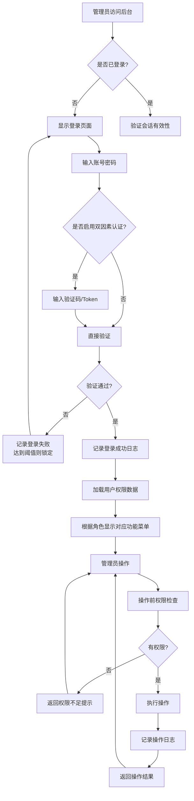
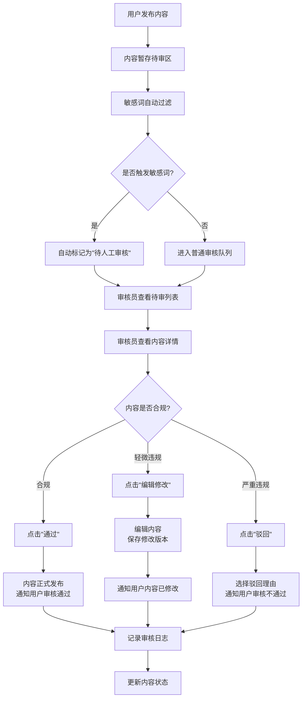
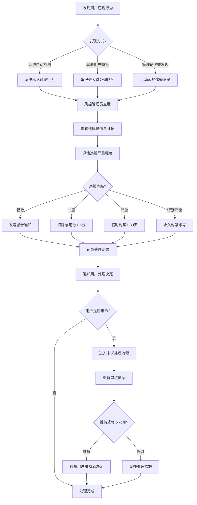
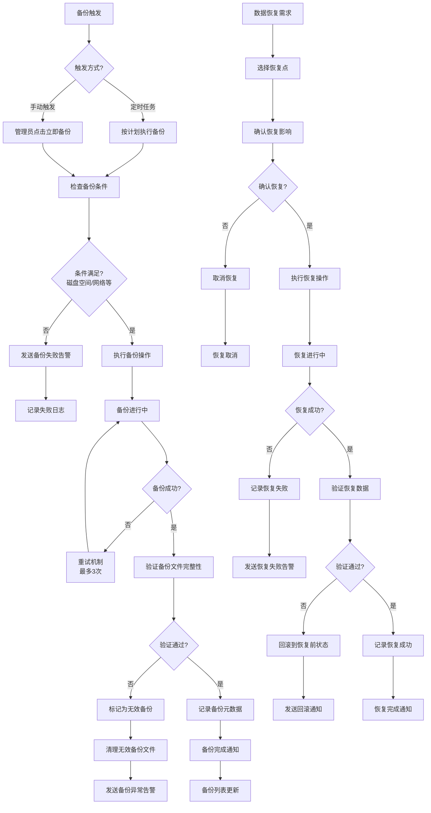

# 2.3 后台管理
## 2.3.1 功能描述
后台管理是九州寰宇平台的管理中枢，为平台管理员提供全面的系统管理、用户管理、内容审核、数据监控和配置管理能力。该模块支持管理员对平台用户账号、权限角色、发布内容、系统配置、数据统计等进行集中化管理，确保平台安全、稳定、合规运营。管理员可通过后台管理系统实现用户审核封禁、内容质量把控、系统性能监控、数据统计分析等核心管理职能，为平台健康发展和用户体验优化提供管理支撑。
## 2.3.2 用户场景

| 场景类型    | 使用角色   | 具体场景描述                                                 |
| ------- | ------ | ------------------------------------------------------ |
| 用户账号管理  | 平台管理员  | 查看用户列表，搜索特定用户，审核新注册账号，对违规用户进行启用/禁用操作，批量导出用户数据。         |
| 实名认证审核  | 审核专员   | 审核用户提交的身份证、学历证明等实名材料，判断材料真实性，通过或驳回认证申请，要求用户补充缺失材料。     |
| 违规处理管理  | 风控管理员  | 根据用户举报或系统检测，对发布违规内容的用户进行警告、信用分扣减、临时封禁（7天/30天）或永久封禁处理。  |
| 角色权限配置  | 系统管理员  | 创建"超级管理员"、"内容审核员"、"客服专员"、"运营专员"等角色，为每个角色分配细粒度的功能权限。    |
| 管理员账号管理 | 超级管理员  | 创建新的后台管理员账号，分配角色权限，设置双因素认证，监控管理员登录行为，定期审查权限分配。         |
| 内容审核监管  | 内容审核员  | 审核待审内容列表，对博客文章、项目公示进行人工审核，标记敏感内容，批量通过或驳回，编辑不当内容。       |
| 留言反馈处理  | 客服专员   | 查看用户留言反馈列表，按优先级排序，回复用户咨询，标记"已处理"状态，将复杂问题转交技术团队。        |
| 附件文件管理  | 存储管理员  | 监控附件存储空间使用情况，搜索特定文件，清理过期或违规文件，设置文件存储策略和自动清理规则。         |
| 内容分类维护  | 运营专员   | 维护博客、项目公示等内容分类体系，新增"技术教程"、"生活分享"等分类，调整分类排序，删除无效分类。     |
| 敏感词库管理  | 内容安全员  | 维护敏感词库，添加新的敏感词，设置替换规则（如"赌博"替换为"\*\*\*"），测试过滤效果，导出词库备份。 |
| 数据统计分析  | 运营分析师  | 查看用户增长趋势图，分析用户活跃时段，生成内容质量报告，评估各业务模块使用率，制作运营周报。         |
| 系统配置维护  | 技术管理员  | 修改站点名称、LOGO、联系方式等基础信息，开启/关闭特定服务功能，配置API接口参数，设置维护模式。    |
| 安全策略配置  | 安全管理员  | 设置密码复杂度要求，配置登录失败锁定策略，管理API访问密钥，启用数据加密，设置安全审计规则。        |
| 系统监控告警  | 运维工程师  | 监控服务器CPU、内存、磁盘使用率，设置性能阈值告警（如CPU\>80%），查看实时流量监控，处理系统异常。 |
| 数据备份恢复  | 数据库管理员 | 设置每日自动备份计划，手动触发即时备份，选择恢复点进行数据恢复，验证备份文件完整性。             |
| 通知消息配置  | 运营专员   | 配置用户注册成功、内容审核通过等通知模板，设置邮件/SMS发送规则，测试通知发送效果。            |
| 操作日志审计  | 审计专员   | 查询特定时间段的管理操作日志，追踪用户数据修改记录，导出操作日志用于安全审计，分析异常操作模式。       |
| 登录日志分析  | 安全分析师  | 分析用户登录失败记录，识别异常登录IP，检测账号盗用风险，生成登录安全报告。                 |

## 2.3.3 核心价值
- 运营效率提升：集中化管理平台所有用户和内容，提供批量操作和自动化流程，大幅减少重复性管理工作，提高管理效率。
- 安全合规保障：通过严格的权限控制、内容审核、敏感词过滤和操作审计，确保平台内容安全、用户数据合规，防范法律风险。
- 数据驱动决策：提供全面的数据统计和分析工具，可视化展示关键指标，帮助管理者基于实时数据做出科学运营决策。
- 用户体验优化：通过后台监控用户反馈和行为数据，及时发现并解决用户体验问题，持续优化平台功能和服务质量。
- 系统稳定可靠：完善的系统监控、性能告警、数据备份机制，确保平台7×24小时稳定运行，保障业务连续性。
- 管理规范化：标准化的审核流程、权限体系和操作规范，确保管理工作的规范性和可追溯性。
- 风险可控化：实时监控异常行为和系统风险，快速响应和处理安全事件，将运营风险控制在可接受范围内。
## 2.3.4 需求清单

| 功能类别 | 功能名称    | 功能概述                                           | 优先级 |
| ---- | ------- | ---------------------------------------------- | --- |
| 用户管理 | 用户账户管理  | 管理平台所有用户账号，支持查看、搜索、筛选用户信息，进行账号审核、启用/禁用、删除等操作   | P0  |
| 用户管理 | 实名认证审核  | 审核用户提交的实名认证材料，支持通过、驳回、要求补充材料等操作，记录审核历史         | P0  |
| 用户管理 | 违规处理管理  | 对违规用户进行警告、信用分扣减、临时封禁、永久封禁等处理，记录违规原因和处理依据       | P0  |
| 权限管理 | 角色权限管理  | 创建和管理不同管理角色，定义角色权限范围，支持权限的细粒度控制                | P0  |
| 权限管理 | 会员体系管理  | 管理后台管理员账号，分配角色权限，设置管理员登录验证和安全策略                | P0  |
| 内容管理 | 内容审核管理  | 审核用户发布的博客文章、项目公示等内容，支持批量审核、内容编辑、删除、标记等操作       | P0  |
| 内容管理 | 留言反馈管理  | 查看和管理用户留言反馈，支持回复、标记已处理、转交处理等操作                 | P0  |
| 内容管理 | 附件文件管理  | 管理用户上传的附件文件，支持查看、搜索、下载、删除文件，监控存储空间使用情况         | P0  |
| 内容管理 | 内容分类管理  | 创建和维护内容分类体系，支持分类的新增、编辑、删除及排序，便于用户浏览和内容组织       | P0  |
| 内容管理 | 敏感词管理   | 维护敏感词库，对用户发布内容进行敏感词检测和过滤，支持敏感词的添加、删除、替换规则设置    | P0  |
| 数据统计 | 数据统计    | 统计用户注册、活跃、留存等数据，生成用户增长趋势图、用户画像分析报告             | P1  |
| 数据统计 |         | 统计内容发布量、阅读量、互动量等数据，分析内容质量和用户偏好                 | P1  |
| 数据统计 |         | 统计各业务模块使用情况，分析服务受欢迎程度和用户行为模式                   | P1  |
| 数据统计 |         | 统计平台访问量、页面浏览量、访客来源等流量数据，生成流量趋势分析图表             | P1  |
| 数据统计 |         | 统计平台付费服务等营收相关数据，生成营收报表和趋势分析                    | P2  |
| 系统管理 | 配置管理    | 管理平台基础配置，包括站点信息、联系方式、备案信息、服务开关等                | P0  |
| 系统管理 |         | 配置安全策略，包括登录验证、密码策略、API访问控制、数据加密等               | P0  |
| 系统管理 | 系统监控告警  | 监控系统运行状态，设置性能阈值告警，查看系统资源使用情况                   | P1  |
| 系统管理 | 数据备份与恢复 | 定期自动备份系统数据，支持手动触发备份，提供数据恢复功能及恢复点选择，保障数据安全性和完整性 | P1  |
| 系统管理 | 通知消息管理  | 配置系统通知模板，管理站内消息、邮件通知、短信通知等发送规则，支持批量发送和个性化通知设置  | P1  |
| 日志管理 | 操作日志记录  | 记录所有后台管理操作日志，支持按时间、操作人、操作类型查询和导出               | P0  |
| 日志管理 | 系统日志分析  | 记录系统运行日志和错误日志，提供日志分析和异常检测功能                    | P1  |
| 日志管理 | 登录日志记录  | 记录所有用户及管理员的登录日志，包括登录账号、登录时间、登录IP、登录设备、登录状态等信息  | P0  |
| 日志管理 | 异常行为日志  | 识别并记录用户及系统的异常行为，如多次登录失败、异常数据访问等，辅助安全审计         | P1  |

## 2.3.5 需求详述
### 2.3.5.1 用户账号管理
- 用户列表展示：以表格形式展示用户列表，包含用户ID、昵称、注册时间、最后登录时间、账号状态（正常/禁用/待审核）、实名状态等基础信息。支持分页显示，每页默认20条。
- 搜索与筛选：提供多条件组合搜索：按用户ID精确搜索、按昵称模糊搜索、按注册时间范围筛选、按账号状态筛选、按实名状态筛选。搜索条件支持保存为常用筛选方案。
- 账号操作：支持对单个或多个用户执行批量操作：启用账号、禁用账号（可选择禁用时长：7天/30天/永久）、重置密码、发送站内信。禁用操作需填写原因，系统自动记录操作人和时间。
- 数据导出：支持导出当前筛选条件下的用户数据为Excel/CSV格式，导出字段可自定义选择，包含用户基本信息、行为数据等。
### 2.3.5.2 实名认证审核
- 待审列表：展示待审核的实名认证申请，每条记录包含用户基本信息、提交时间、认证材料（身份证正反面、手持身份证照片等）、认证类型（个人/企业）。
- 材料查看：点击查看详情可放大查看认证材料原图，支持图片旋转、缩放。系统自动识别材料中的关键信息（姓名、身份证号等）并高亮显示。
- 审核操作：提供三种审核操作：通过（用户获得实名认证标识）、驳回（需填写驳回原因，如"照片模糊"、"信息不一致"等）、要求补充材料（指定需要补充的材料类型）。
- 审核历史：记录每次审核的操作人、操作时间、审核结果、备注信息。支持查看用户的认证历史记录。
### 2.3.5.3 违规处理管理
- 违规记录：展示用户违规记录列表，包括违规用户、违规类型（发布违禁内容、恶意评论、骚扰他人等）、违规时间、处理状态（待处理/已处理）。
- 处理操作：根据违规严重程度选择处理方式：警告（发送站内警告信）、信用分扣减（1-10分）、临时封禁（1-30天）、永久封禁。支持附加处理说明。
- 处理依据：系统自动关联违规内容截图或链接作为处理依据。管理员可补充文字说明或上传额外证据材料。
- 申诉处理：如果用户对处理结果提出申诉，系统显示申诉信息，管理员可重新审查并修改处理决定。
### 2.3.5.4 角色权限管理
- 角色列表：展示现有角色列表：超级管理员（拥有所有权限）、内容审核员（内容审核相关权限）、客服专员（用户反馈处理权限）、运营专员（数据查看和内容管理权限）等。
- 权限配置：以树形结构展示所有后台功能权限节点，支持勾选分配。权限分为模块级（如"用户管理"）、功能级（如"用户账号管理"）、操作级（如"用户禁用"）三层粒度。
- 角色复制：支持基于现有角色创建新角色，复制权限配置后微调，提高配置效率。
- 权限验证：提供权限测试功能，输入用户账号可查看其实际拥有的权限列表，验证权限配置是否正确。
### 2.3.5.5 管理员账号管理
- 账号创建：创建新的管理员账号，填写基本信息（姓名、工号、部门），分配角色，设置初始密码或发送激活链接。
- 安全设置：强制要求管理员启用双因素认证（手机验证码/身份验证器），设置密码过期策略（90天强制修改），限制登录IP段（可选）。
- 登录监控：实时显示管理员登录状态，记录每次登录的IP地址、设备信息、登录时间。异常登录（如异地登录）系统自动标记。
- 权限审查：定期（每月）生成权限审查报告，列出各管理员权限变更记录，提示长期未使用的过高权限。
### 2.3.5.6 内容审核管理
- 待审内容队列：按内容类型（博客文章、项目公示、评论等）和提交时间排序展示待审内容。系统根据审核优先级自动排序（新用户发布内容优先）。
- 审核界面：左侧显示内容原文，右侧提供审核操作面板。支持富文本内容预览，保持原格式显示。
- 批量审核：支持勾选多个内容进行批量操作：批量通过、批量驳回、批量标记为"需要修改"。批量驳回需选择预设的驳回理由模板。
- 内容编辑：对于轻微违规内容（如包含联系方式），审核员可直接编辑修改，系统记录编辑历史，通知内容作者。
- 敏感词高亮 系统自动检测内容中的敏感词并高亮显示，提示审核员重点关注。
### 2.3.5.7 留言反馈管理
- 反馈列表：展示用户留言反馈列表，每条反馈显示用户信息、反馈时间、反馈类型（咨询/建议/投诉/bug报告）、处理状态、优先级（系统根据关键词自动标记）。
- 反馈详情：点击查看反馈详情，显示反馈内容、用户联系方式（如提供）、相关截图或附件。系统自动关联用户历史反馈记录。
- 回复处理：直接在详情页回复用户，支持富文本编辑，可添加内部备注（仅管理员可见）。回复后自动标记为"已处理"，可选择"转交技术团队"或"需要跟进"。
- 满意度评价：用户对处理结果进行满意度评价（1-5星），系统统计客服专员的服务质量数据。
### 2.3.5.8 附件文件管理
- 文件列表：展示所有附件文件，包括文件名、文件类型、大小、上传用户、上传时间、存储路径、引用次数（被多少内容引用）。
- 存储监控：实时显示附件存储空间使用情况：总容量、已使用、剩余空间、各文件类型占比。设置使用阈值告警（如\>80%）。
- 文件操作：支持文件搜索（按文件名、类型、用户）、预览（图片/文档）、下载、删除。删除被引用的文件时系统提示风险。
- 清理策略：设置自动清理规则：删除超过180天未被引用的临时文件，压缩超过1年的旧图片，迁移冷数据到低成本存储。
### 2.3.5.9 内容分类管理
- 分类树展示：以树形结构展示内容分类，支持多级分类（如"技术"-\>"编程"-\>"Python"）。显示每个分类下的内容数量。
- 分类操作：支持新增分类（填写名称、描述、图标、排序值）、编辑分类、删除分类（删除前需确认无内容属于该分类）、调整分类顺序（拖拽排序）。
- 分类关联：管理分类与内容类型的关联关系，如"技术教程"分类可关联博客文章和项目公示两种内容类型。
- 批量调整：支持将某个分类下的所有内容批量移动到另一个分类，系统记录迁移日志。
### 2.3.5.10 敏感词管理
- 词库管理：展示敏感词库列表，支持按类别分组（政治敏感、色情低俗、暴力恐怖、广告营销等）。显示每个敏感词的匹配模式（精确匹配/模糊匹配）。
- 词条操作：添加新敏感词：输入关键词、选择类别、设置匹配模式、配置替换文本（如替换为”\*\*\*”或特定文本）。支持批量导入词库（TXT格式）。
- 过滤测试：提供测试输入框，输入文本实时显示过滤效果，高亮显示被过滤的敏感词。
- 过滤日志：记录敏感词过滤统计：每日过滤次数、高频敏感词排行、触发过滤的用户分布。
### 2.3.5.11 用户数据统计
- 增长趋势：折线图展示每日/每周/每月新增用户数、活跃用户数（DAU/WAU/MAU）。支持按用户来源（自然流量/推广活动）细分。
- 留存分析：计算用户次日留存率、7日留存率、30日留存率。 cohort分析展示不同时期注册用户的留存曲线。
- 用户画像：基于用户行为数据生成画像标签：兴趣标签（技术、生活、娱乐等）、活跃时段、设备分布（PC/移动）、地域分布。
- 行为路径：分析用户典型使用路径，如"注册-\>选择兴趣-\>浏览博客-\>发布内容-\>参与社区"。
### 2.3.5.12 内容数据统计
- 发布统计：统计各内容类型（博客、项目、评论等）的日发布量，分析发布趋势和高峰期。
- 互动分析：统计内容的阅读量、点赞量、评论量、分享量，计算互动率（互动数/阅读数）。识别高互动内容特征。
- 质量评估：基于内容长度、原创性、互动数据、用户反馈等维度评估内容质量分数，识别优质内容创作者。
- 热门排行：生成热门内容排行榜：24小时热门、本周热门、本月热门。支持按内容类型和分类筛选。
### 2.3.5.13 业务数据统计
- 模块使用率：统计各业务模块（博客、工具、社区、教育等）的访问量、使用时长、功能使用次数。
- 用户行为：分析用户在各模块间的跳转路径，识别常用功能组合，发现潜在的产品关联机会。
- 功能热度：统计各具体功能（如"Markdown编辑器"、"代码高亮"）的使用频率，识别高价值和低价值功能。
- 漏斗分析：设置关键转化漏斗，如"访问首页-\>点击服务-\>完成使用"，分析各环节转化率和流失原因。
### 2.3.5.14 流量数据统计
- 访问趋势：实时显示当前在线用户数，统计PV（页面浏览量）、UV（独立访客）趋势图。对比不同时段（工作日/周末）的流量模式。
- 来源分析：分析流量来源渠道：直接访问、搜索引擎（百度/谷歌）、外部链接、社交媒体。统计各渠道的转化质量。
- 页面分析：统计各页面的访问量、停留时长、跳出率。识别高价值入口页面和需要优化的页面。
- 设备分析：分析用户设备分布：PC/手机/平板，浏览器类型，操作系统，屏幕分辨率。
### 2.3.5.15 营收数据统计
- 收入概览：统计总收入、各收入来源（会员费、广告、付费服务）占比，显示收入增长趋势。
- 付费用户：分析付费用户数量、ARPU（每用户平均收入）、付费转化率、续费率。
- 产品收入：统计各付费产品/服务的收入贡献，识别明星产品和待优化产品。
- 财务报表：生成月度收入报表，支持导出为财务系统兼容格式。
### 2.3.5.16 基础配置管理
- 站点信息：配置站点名称、LOGO、favicon、备案号、版权信息、联系方式（邮箱、电话、地址）。
- 服务开关：控制各功能模块的开启/关闭状态，如"开启博客系统"、"关闭支付功能（维护中）"。支持按用户群体灰度发布。
- 接口配置：管理第三方服务接口配置：短信服务商、邮件服务器、支付接口、地图API等。支持测试连接功能。
- 维护模式：开启维护模式时显示维护页面，允许设置维护通知和预计恢复时间。
### 2.3.5.17 安全设置管理
- 登录安全：设置密码策略：最小长度、复杂度要求（大小写字母+数字+特殊字符）、历史密码检查、密码过期时间。 配置登录失败锁定：连续失败次数阈值、锁定时长、解锁方式（自动/手动）。
- 访问控制：设置IP白名单/黑名单，限制特定IP段的访问。配置API访问频率限制，防止滥用。
- 数据加密：管理数据加密密钥，配置敏感字段（密码、手机号、身份证号）的加密存储策略。
- 安全审计：设置安全审计规则，如"异常登录尝试告警"、"敏感操作二次验证"。
### 2.3.5.18 系统监控告警
- 资源监控：实时图表显示服务器CPU使用率、内存使用率、磁盘IO、网络流量。设置阈值告警（CPU\>80%持续5分钟）。
- 服务监控：监控各微服务状态、响应时间、错误率。显示服务依赖关系和健康状态。
- 数据库监控：监控数据库连接数、查询性能、慢查询日志、表空间使用情况。
- 告警管理：配置告警接收人、告警方式（邮件/短信/钉钉）、告警级别（警告/严重）。查看历史告警记录和处理状态。
### 2.3.5.19 数据备份与恢复
- 备份策略：设置自动备份计划：每日全量备份、每小时增量备份。配置备份存储位置（本地/云存储）。
- 手动备份：支持手动触发即时备份，填写备份说明（如"版本发布前备份"）。
- 备份列表：展示所有备份记录，包括备份时间、大小、类型（全量/增量）、状态（成功/失败）。
- 恢复操作：选择备份点进行数据恢复，支持预览恢复内容，确认后执行恢复操作。系统记录所有恢复操作日志。
### 2.3.5.20 通知消息管理
- 模板管理：管理各类通知模板：用户注册欢迎信、内容审核结果通知、系统公告等。支持变量替换（如`{用户名}`）。
- 发送规则：配置触发条件：用户注册成功后自动发送欢迎邮件，内容审核通过后发送站内通知。
- 渠道配置：配置各通知渠道：邮件服务器设置、短信服务商配置、站内信系统。
- 发送记录：记录所有通知发送日志：接收人、发送时间、通知类型、发送状态。支持重试失败发送。
### 2.3.5.21 操作日志记录
- 日志查询：按时间范围、操作人、操作模块、操作类型（增删改查）查询操作日志。支持复杂条件组合查询。
- 日志详情：查看单条操作日志详情：操作时间、操作人IP、操作内容（前后数据变化）、操作结果。
- 数据对比：对于修改操作，系统记录修改前后的数据差异，以对比视图显示变更内容。
- 日志导出：支持导出查询结果为Excel或日志文件，用于外部审计或长期存档。
### 2.3.5.22 系统日志分析
- 日志聚合：聚合各服务的运行日志和错误日志，统一时间轴展示。支持按日志级别（INFO/WARN/ERROR）过滤。
- 错误分析：自动统计错误类型和频率，识别高频错误和影响范围。关联错误发生的服务版本和环境信息。
- 日志搜索：全文搜索日志内容，支持正则表达式匹配。保存常用搜索条件。
- 异常检测：基于历史日志模式自动检测异常日志模式，如突然增加的错误日志、异常的服务调用链。
### 2.3.5.23 登录日志记录
- 登录记录：记录所有用户和管理员的每次登录尝试：账号、登录时间、登录IP、登录设备（浏览器/操作系统）、登录结果（成功/失败）。
- 失败分析：统计登录失败原因分布：密码错误、验证码错误、账号禁用、IP限制等。识别异常失败模式。
- 异地登录：自动检测异地登录（与常用登录地距离\>500km），标记为可疑登录，支持人工确认。
- 设备指纹：记录用户设备指纹信息，用于识别账号共享或盗用行为。
### 2.3.5.24 异常行为日志
- 行为识别：系统自动识别异常行为模式：短时间内多次登录失败、异常时间登录（如凌晨3点）、高频数据访问、敏感数据批量导出。
- 风险评分：基于行为特征计算风险评分，高风险行为自动触发告警或临时限制。
- 行为关联：关联同一用户的多项异常行为，识别潜在的攻击模式或内部威胁。
- 处置记录：记录对异常行为的处置措施：人工审核、临时限制、安全告警等。
## 2.3.6 核心流程
### 2.3.6.1 后台管理登录与权限验证流程

### 2.3.6.2 用户内容审核流程

### 2.3.6.3 用户违规处理流程

### 2.3.6.4 数据备份与恢复流程

## 2.3.7 详细用例
### 用例1：新用户实名认证审核
- 用例描述：审核专员处理用户提交的实名认证申请
- 主要参与者：审核专员、用户认证系统、用户
- 前置条件：
	1. 用户已提交实名认证申请并上传身份证照片
	2. 审核专员已登录后台管理系统
	3. 审核专员拥有"实名认证审核"权限
- 基本事件流：
	1. 审核专员进入"用户管理-实名认证审核"页面，系统显示待审核申请列表（按提交时间倒序排列）。
	2. 审核专员点击第一条待审记录，系统打开详情页面，左侧显示用户基本信息（昵称、注册时间），右侧显示用户上传的认证材料：身份证正面照、反面照、手持身份证照。
	3. 系统自动识别身份证照片中的姓名、身份证号、有效期信息，并在图片旁以文字形式显示，供审核专员核对。
	4. 审核专员仔细核对：①身份证照片清晰度是否达标；②身份证信息是否在有效期内；③手持身份证照片中的人脸与身份证照片是否一致；④用户填写的姓名、身份证号与身份证信息是否一致。
	5. 审核专员确认所有信息一致且材料真实有效，点击"通过"按钮。
	6. 系统弹出确认对话框，审核专员填写审核备注"材料清晰，信息一致，人脸匹配"，点击确认。
	7. 系统执行以下操作：
		- 更新用户实名状态为"已认证"
		- 为用户账号添加实名认证标识（金色V标）
		- 记录审核日志（审核人、时间、结果、备注）
		- 向用户发送站内通知："您的实名认证已通过审核"
	8. 页面自动返回待审列表，已处理的记录消失，审核专员继续处理下一条。
- 扩展事件流：
	5a. 材料不清晰或信息不一致：审核专员点击"驳回"按钮，选择驳回原因"照片模糊，请重新上传清晰照片"，系统通知用户重新提交。
	5b. 缺少必要材料：审核专员点击"补充材料"按钮，勾选需要补充的材料类型"请补充身份证反面照片"，系统通知用户补充指定材料。
	5c. 疑似虚假材料：审核专员点击"标记可疑"按钮，系统将用户加入重点监控名单，后续操作需要更高级别审核。
### 用例2：违规内容批量处理
- 用例描述：风控管理员批量处理一批违规内容
- 主要参与者：风控管理员、内容审核系统、用户
- 前置条件：
	1. 系统检测到10篇博客文章包含广告营销内容
	2. 风控管理员已登录后台管理系统
	3. 风控管理员拥有"内容审核管理"和"违规处理管理"权限
- 基本事件流：
	1. 风控管理员进入"内容管理-内容审核"页面，使用筛选条件：内容类型=博客文章、状态=待审核、包含关键词"购买"、"微信"。
	2. 系统显示筛选出的10篇疑似广告内容，每篇显示标题、作者、发布时间、前100字预览。
	3. 风控管理员点击"全选"复选框，然后点击"批量审核"按钮。
	4. 系统弹出批量操作对话框，提供操作选项：批量通过、批量驳回、批量删除、批量标记。
	5. 风控管理员选择"批量驳回"，然后在驳回理由中选择预设模板"包含广告营销内容，违反平台规则"。
	6. 风控管理员勾选"同时处理发布用户"选项，选择用户处理方式"扣除信用分3分"。
	7. 点击确认后，系统执行批量操作：
		- 将10篇博客文章状态改为"已驳回"
		- 记录每篇内容的审核日志
		- 向10位作者发送站内通知："您发布的《XXX》因包含广告内容已被驳回"
		- 为10位用户扣除3分信用分（如果用户已有违规记录，累计扣分）
		- 更新用户信用等级（信用分低于60分自动降级）
	8. 系统显示批量处理结果：成功10条，失败0条。风控管理员点击"导出处理记录"保存本次操作详情。
- 扩展事件流：
	4a. 需要不同处理方式：风控管理员取消全选，手动勾选8篇明显违规文章进行批量驳回，另外2篇边界案例单独点击进入详情页人工判断。
	5a. 需要自定义驳回理由：风控管理员选择"其他原因"，手动输入详细驳回说明"文章主体为技术分享，但末尾添加了微信号和购买链接，建议删除推广内容后重新提交"。
	7a. 用户信用分已接近阈值：系统检测到某用户当前信用分55分，扣除3分后将达到52分（低于50分触发自动封禁），系统弹出警告提示，风控管理员可选择调整扣分数或添加额外备注。
### 用例3：系统性能监控与告警处理
- 用例描述：运维工程师处理系统性能告警
- 主要参与者：运维工程师、系统监控系统、服务器集群
- 前置条件：
	1. 系统监控检测到数据库服务器CPU使用率持续5分钟超过85%
	2. 运维工程师已登录后台管理系统
	3. 运维工程师拥有"系统监控告警"权限
- 基本事件流：
	1. 运维工程师登录后台时，顶部导航栏显示红色告警图标（数字1表示有1条未处理告警）。
	2. 点击告警图标进入"系统管理-系统监控告警"页面，系统显示告警列表，第一条为"数据库服务器CPU使用率过高"。
	3. 点击告警条目查看详情：告警时间、持续时间、当前值（CPU 87%）、阈值（85%）、影响范围（主数据库节点）。
	4. 运维工程师点击"查看关联监控"按钮，系统打开监控仪表盘，显示：
		- 数据库服务器CPU使用率趋势图（过去1小时）
		- 内存使用率（65%正常）
		- 磁盘IO（偏高）
		- 活跃连接数（120个，较平时增加50%）
	5. 运维工程师点击"查看慢查询日志"按钮，系统显示最近10分钟最耗时的SQL查询，发现一条复杂报表查询占用大量资源。
	6. 运维工程师判断为临时查询压力，采取缓解措施：
		- 点击"终止查询"按钮，强制终止该耗时查询
		- 点击"清理连接池"按钮，释放空闲连接
	7. 返回监控仪表盘，观察CPU使用率在2分钟内下降到72%。
	8. 运维工程师在告警处理页面点击"标记为已处理"，填写处理说明"终止耗时报表查询，CPU已恢复正常"。
	9. 系统记录告警处理日志，告警状态更新为"已处理"。
- 扩展事件流：
	6a. 无法立即解决：运维工程师发现是业务高峰期正常负载，点击"调整告警阈值"将CPU告警阈值从85%调整为90%，避免频繁误告警。
	6b. 需要扩容处理：运维工程师判断为长期负载增长，点击"创建扩容工单"，填写扩容需求"数据库服务器需要从4核8G扩容到8核16G"，提交给基础设施团队。
	6c. 关联其他问题：运维工程师发现磁盘IO异常高，进一步检查发现磁盘空间不足，点击"清理磁盘空间"启动自动清理临时文件流程。
## 2.3.8 界面与交互要求
参考UI设计稿
## 2.3.9 埋点方案

| 类别    | 事件/页面 ID               | 事件名称   | 触发时机         | 关键属性（示例）                                                                            |
| ----- | ---------------------- | ------ | ------------ | ----------------------------------------------------------------------------------- |
| 用户与留存 | admin\_login           | 管理员登录  | 管理员成功登录后台    | login\_method, role, login\_ip, device\_type                                        |
| 用户与留存 | admin\_logout          | 管理员登出  | 管理员主动登出或会话超时 | session\_duration, logout\_type                                                     |
| 功能使用  | module\_access         | 模块访问   | 管理员进入某个功能模块  | module\_name, access\_path, duration                                                |
| 功能使用  | user\_manage\_action   | 用户管理操作 | 执行用户相关操作     | action\_type(enable/disable/reset\_pwd等), target\_user\_count, reason               |
| 功能使用  | content\_audit\_action | 内容审核操作 | 审核内容时        | content\_type, audit\_result(pass/reject/edit), audit\_time, has\_sensitive\_words  |
| 功能使用  | permission\_change     | 权限变更   | 修改角色或用户权限时   | change\_type(role\_create/role\_edit/user\_assign), target\_role, permission\_count |
| 数据操作  | data\_export           | 数据导出   | 导出数据时        | export\_type(users/content/logs等), export\_format, record\_count                    |
| 数据操作  | batch\_operation       | 批量操作   | 执行批量操作时      | operation\_type, item\_count, success\_count, fail\_count                           |
| 系统操作  | config\_change         | 配置变更   | 修改系统配置时      | config\_key, old\_value, new\_value, change\_scope                                  |
| 系统操作  | backup\_restore        | 备份恢复   | 执行备份或恢复时     | operation(backup/restore), data\_size, result, duration                             |
| 安全相关  | security\_event        | 安全事件   | 发生安全相关事件时    | event\_type(failed\_login/suspicious\_access/data\_breach), severity, source\_ip    |
| 错误监控  | error\_occurred        | 错误发生   | 系统出现错误时      | error\_code, error\_message, page\_url, stack\_trace                                |
| 性能监控  | slow\_operation        | 慢操作    | 操作耗时超过阈值时    | operation\_name, duration\_ms, resource\_usage                                      |
| 搜索行为  | admin\_search          | 后台搜索   | 在后台执行搜索时     | search\_type, keyword, result\_count, search\_time                                  |

### 页面访问埋点：
- page_admin_dashboard：后台仪表盘
- page_user_management：用户管理页面
- page_content_audit：内容审核页面
- page_permission_manage：权限管理页面
- page_data_statistics：数据统计页面
- page_system_monitor：系统监控页面
- page_log_query：日志查询页面
## 2.3.10 技术细节
### 2.3.10.1 架构设计
- 微服务架构：
	- 后台管理作为独立微服务，与用户服务、内容服务、认证服务等通过API网关通信
	- 服务发现使用Consul或Nacos，实现动态服务注册与发现
	- API网关统一处理请求路由、认证鉴权、限流熔断
- 数据存储设计：
	- 主业务数据：MySQL集群，分库分表设计，用户表按UID哈希分片
	- 日志数据：Elasticsearch集群，用于操作日志、系统日志的存储和检索
	- 监控数据：时序数据库（InfluxDB或Prometheus），存储性能指标数据
	- 缓存层：Redis集群，缓存用户会话、权限数据、热点配置
- 权限架构：
	- 基于RBAC（角色基于访问控制）模型，支持角色继承和多级权限
	- 权限验证在API网关层统一处理，减少业务代码侵入
	- 权限数据缓存到Redis，减少数据库查询压力
### 2.3.10.2 核心算法与逻辑
- 内容审核算法：
	- 敏感词过滤：使用AC自动机算法进行多模式匹配，支持模糊匹配和同音字替换检测
	- 图片审核：集成第三方内容安全API，对上传图片进行色情、暴恐、政治敏感识别
	- 相似度检测：对重复发布内容使用SimHash算法检测相似度，防止垃圾内容
	- 用户风险评分算法：
			风险分数 = 基础分(60) 
			          + 违规次数 × 10 
			          + 严重违规次数 × 30 
			          - 正常行为天数 × 0.5
	- 分数\>80：高风险，自动限制部分功能
	- 分数\<30：低风险，享受优先服务
	- 实时计算，每小时更新一次
- 智能审核优先级算法：
	`优先级 = 内容敏感度 × 0.4 `
		    + 用户风险系数 × 0.3 
		    + 时间衰减因子 × 0.2 
		    + 举报数量 × 0.1
	- 新用户发布内容初始敏感度较高
	- 时间衰减因子：发布后每过1小时降低0.1
	- 高优先级内容优先进入人工审核队列
- 数据统计聚合算法：
	- 实时统计：使用Flink流处理，实时计算PV/UV等指标
	- 离线统计：每日凌晨跑批处理，生成日报、周报、月报
	- 多维分析：使用Apache Druid支持OLAP查询，快速响应多维度数据查询
### 2.3.10.3 性能优化策略
- 数据库优化：
	- 读写分离：写操作走主库，读操作走从库
	- 分库分表：用户表按UID哈希分16个库，每个库分64张表
	- 索引优化：高频查询字段建立组合索引，定期分析慢查询
- 缓存策略：
	- 一级缓存：本地缓存（Caffeine），缓存用户基本信息、配置数据，有效期5分钟
	- 二级缓存：Redis集群，缓存权限数据、会话数据、热点内容，有效期根据数据类型设置
	- 缓存穿透防护：布隆过滤器过滤无效查询，空结果也缓存短时间
- 接口性能：
	- 批量接口支持：用户批量操作、内容批量审核使用批量API，减少网络开销
	- 异步处理：日志记录、消息通知等非核心操作异步处理，不阻塞主流程
	- 连接池优化：数据库连接池、Redis连接池根据压力动态调整
- 前端性能：
	- 组件懒加载：非首屏组件按需加载
	- 虚拟滚动：大数据列表使用虚拟滚动，只渲染可见区域
	- 请求合并：短时间内相同请求合并发送，减少请求次数
### 2.3.10.4 安全约束
- 认证与授权：
	- 管理员登录强制双因素认证（TOTP或短信验证码）
	- 会话有效期：普通操作30分钟，敏感操作15分钟
	- 权限最小化原则：每个角色只分配必要权限
- 数据安全：
	- 敏感数据加密：密码使用bcrypt加密，手机号、身份证号使用AES加密存储
	- 数据传输安全：全站HTTPS，敏感API请求额外签名验证
	- 操作审计：所有敏感操作记录完整日志，包括操作前后数据快照
- API安全：
	- 限流防护：每个管理员账号每分钟最多100次请求，防止恶意调用
	- 参数校验：所有输入参数严格校验，防止SQL注入、XSS攻击
	- 访问控制：API按权限分级，高权限API需要额外验证
- 系统安全：
	- 定期漏洞扫描：每周自动扫描系统漏洞
	- 安全更新：依赖库安全更新自动检测和提示
	- 备份加密：备份数据使用加密存储，备份密钥分离管理
### 2.3.10.5 监控与告警
- 监控指标：
	- 应用层：QPS、响应时间、错误率、服务依赖健康度
	- 系统层：CPU、内存、磁盘、网络使用率
	- 业务层：审核通过率、用户投诉率、数据一致性
- 告警规则：
	- 紧急告警（P0）：服务不可用、数据不一致、安全漏洞，立即通知
	- 重要告警（P1）：性能下降、错误率升高，30分钟内处理
	- 一般告警（P2）：资源使用率高、备份失败，24小时内处理
- 日志规范：
	- 结构化日志：使用JSON格式，包含trace_id、span_id便于链路追踪
	- 日志分级：DEBUG、INFO、WARN、ERROR、FATAL
	- 日志收集：统一收集到ELK栈，保留180天