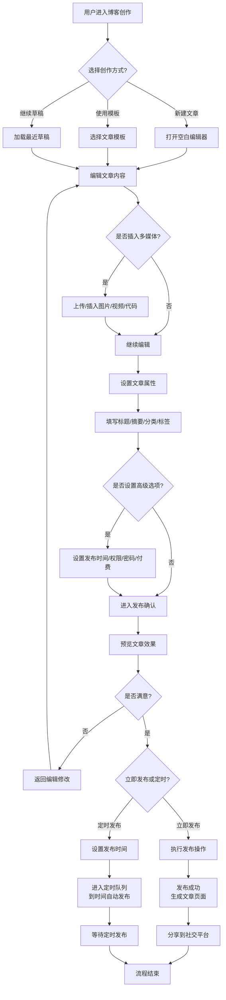
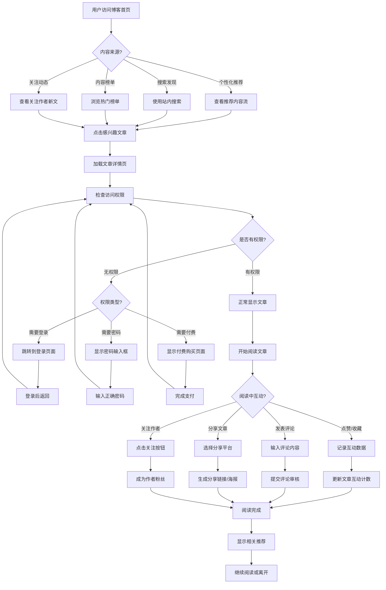
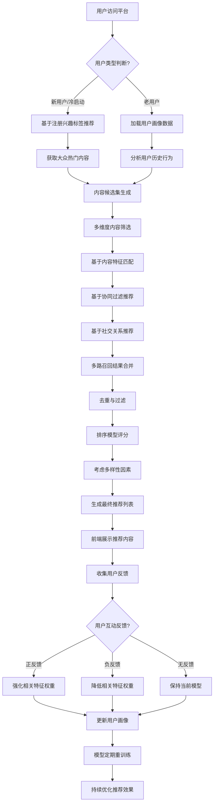
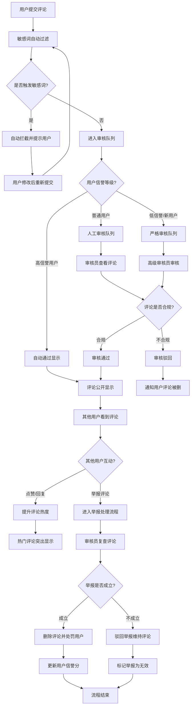

# 2.4 博客系统
## 2.4.1 功能描述
博客系统是九州寰宇平台的核心内容创作与知识分享模块，为用户提供专业的个人博客空间。用户可在此发布原创文章、技术教程、生活感悟、行业见解等内容，支持富文本编辑和Markdown语法，具备多图上传、代码高亮、标签分类、草稿保存等功能。系统提供文章点赞、收藏、评论、分享等互动机制，基于用户兴趣和行为进行个性化内容推荐，设立热门、最新、推荐等文章榜单，打造高质量的内容创作与交流社区。
## 2.4.2 用户场景

| 场景类型    | 使用角色          | 具体场景描述                                        |
| ------- | ------------- | --------------------------------------------- |
| 技术学习与分享 | 数字原生代学生与技术爱好者 | 阅读前沿技术教程，学习编程技能，发布自己的学习笔记和实践项目，与同行交流技术问题。     |
| 知识沉淀与输出 | 斜杠内容创作者与独立开发者 | 将专业知识系统化整理为系列文章，建立个人技术品牌，吸引关注者和合作机会，提升行业影响力。  |
| 生活经验分享  | 都市乐活白领与中产     | 分享职场经验、生活技巧、旅行见闻、消费心得，获得共鸣和反馈，建立基于兴趣的社交连接。    |
| 信息获取与筛选 | 所有平台用户        | 通过个性化推荐发现感兴趣的高质量内容，免去全网搜索的麻烦，高效获取有价值的信息。      |
| 创作与发布   | 内容创作者         | 使用友好的编辑器撰写文章，插入代码片段、图片、视频等多媒体内容，设置分类标签，预览后发布。 |
| 互动与反馈   | 读者与作者         | 对喜欢的文章点赞收藏，发表评论与作者互动，分享文章到社交平台，参与内容社区的讨论。     |
| 个人品牌建设  | 创作者与专业人士      | 通过持续输出高质量内容积累粉丝，展示专业能力，获得打赏或合作机会，实现知识变现。      |

## 2.4.3 核心价值
- 知识共享与传播：打造高质量的内容创作与分享平台，促进知识交流、经验传承和思想碰撞，形成良性循环的内容生态。
- 个人品牌展示：为创作者提供专业的个人展示空间，帮助用户建立和强化个人品牌，扩大影响力，实现知识价值转化。
- 省时高效获取：通过AI个性化推荐和智能筛选，帮助用户快速找到最相关、最高质量的内容，免去信息过载的困扰。
- 创作体验优化：提供强大易用的编辑工具，降低内容创作门槛，支持多种内容格式，提升创作效率和表达效果。
- 社区互动归属：基于内容兴趣建立连接，形成深度互动的读者作者社区，增强用户粘性和平台归属感。
- 跨场景价值联动：博客内容可与项目公示、论坛社区、在线教育等模块联动，创造连贯的学习和创作体验。
## 2.4.4 需求清单

| 功能类别  | 功能名称    | 功能概述                                               | 优先级 |
| ----- | ------- | -------------------------------------------------- | --- |
| 内容创作  | 文章编辑器   | 提供富文本和Markdown双模式编辑器，支持多媒体插入、代码高亮、实时预览、草稿保存        | P0  |
| 内容创作  | 多媒体支持   | 支持图片上传（拖拽/选择）、视频嵌入、音频插入、文件附件，提供图床和CDN加速            | P0  |
| 内容创作  | 代码高亮    | 支持多种编程语言的代码块插入和语法高亮，可设置主题风格，提供复制功能                 | P0  |
| 内容创作  | 文章模板功能  | 提供多种预设模板（如新闻稿、技术文档、博客、论文等），支持模板自定义、保存和复用，快速生成结构化内容 | P1  |
| 内容管理  | 文章发布管理  | 文章发布、编辑、删除、置顶、隐藏，设置发布时间（立即/定时），管理文章状态              | P0  |
| 内容管理  | 分类标签管理  | 创建和管理文章分类体系，添加文章标签，支持多级分类和标签云展示                    | P0  |
| 内容管理  | 草稿与版本   | 自动保存草稿，支持版本历史管理，可对比不同版本差异，恢复到历史版本                  | P0  |
| 内容展示  | 文章列表展示  | 多种布局展示文章列表（卡片/列表），支持排序（时间/热度）、筛选（分类/标签）            | P0  |
| 内容展示  | 文章详情页   | 文章正文展示，阅读进度指示，字号调整，主题切换，目录导航，相关推荐                  | P0  |
| 内容展示  | 个性化推荐   | 基于用户兴趣、阅读历史、社交关系的个性化文章推荐，首页智能内容流                   | P0  |
| 内容展示  | 内容榜单    | 热门文章榜（24h/7天/30天）、最新文章榜、编辑推荐榜、上升最快榜                | P0  |
| 用户互动  | 点赞收藏系统  | 文章点赞、点踩、收藏功能，显示计数，用户可管理自己的收藏夹                      | P0  |
| 用户互动  | 评论系统    | 文章评论、回复、点赞，支持@用户，评论排序（热门/时间），举报管理                  | P0  |
| 用户互动  | 分享功能    | 一键分享到主流社交平台，生成带二维码的文章海报，复制文章链接                     | P0  |
| 用户互动  | 关注系统    | 关注作者功能，接收作者新文章通知，管理关注列表                            | P0  |
| 数据统计  | 阅读数据统计  | 文章阅读量、点赞数、收藏数、评论数、分享数统计，阅读时长分析                     | P1  |
| 数据统计  | 作者数据面板  | 作者后台数据面板，展示文章数据、粉丝增长、互动趋势、收入情况（如有）                 | P1  |
| 搜索发现  | 站内搜索    | 全文搜索文章内容，支持关键词、作者、分类、时间范围等多条件筛选                    | P0  |
| 搜索发现  | 标签发现    | 标签云展示热门标签，点击进入标签专题页，发现相关主题内容                       | P0  |
| 搜索发现  | 专题聚合    | 编辑创建专题页面，聚合相关主题文章，提供深度内容阅读体验                       | P1  |
| 增值功能  | 打赏支持    | 读者对文章进行打赏，支持多种支付方式，作者提现功能（需统一支付中心）                 | P2  |
| 增值功能  | 付费阅读    | 设置文章部分内容或全文付费阅读，按篇或按月订阅（需统一支付中心）                   | P3  |
| SEO优化 | SEO基础功能 | 自定义文章URL、Meta标签、摘要，生成sitemap，支持搜索引擎友好              | P0  |
| SEO优化 | 社交化分享   | Open Graph协议支持，在社交平台分享时显示优化后的摘要和图片                 | P0  |
| 安全防护  | 编辑器防攻击  | 对文章编辑器输入内容进行XSS过滤、SQL注入防护、敏感词检测，发布时拦截恶意代码输入        | P0  |
| 内容安全  | 密码访问控制  | 支持为单篇文章设置访问密码，用户需输入正确密码方可查看内容                      | P1  |
| 内容安全  | 权限访问控制  | 文章默认仅发布者可见，支持授权指定用户/角色访问，非授权用户无法查看                 | P1  |

## 2.4.5 需求详述
### 2.4.5.1 文章编辑器
- 双模式切换：提供富文本编辑器和Markdown编辑器两种模式，支持一键切换。富文本模式提供所见即所得的编辑体验，Markdown模式为技术用户提供纯文本高效编辑。
- 工具栏功能：富文本工具栏包含字体样式（加粗、斜体、下划线）、标题层级（H1-H6）、列表（有序/无序）、对齐方式、超链接、引用块、分割线等基础功能。
- 实时预览：Markdown模式下右侧实时显示渲染效果，支持分屏和全屏编辑模式，可调整预览比例。
- 草稿保存：系统每30秒自动保存草稿到本地存储，意外关闭页面时可恢复最近草稿。手动保存按钮提供即时保存功能。
- 快捷键支持：支持常用编辑快捷键（Ctrl+S保存、Ctrl+B加粗、Ctrl+I斜体、Ctrl+K插入链接等），提升编辑效率。
### 2.4.5.2 多媒体支持
- 图片上传：支持拖拽上传和文件选择两种方式，最大支持10MB单张图片，支持JPG、PNG、GIF、WebP格式。上传时自动压缩优化，保持画质的同时减小文件体积。
- 视频嵌入：支持嵌入主流视频平台链接（YouTube、Bilibili、腾讯视频等），自动识别并生成响应式播放器。也支持本地上传视频（最大100MB），转码为流媒体格式。
- 音频插入：支持插入音频文件（MP3、WAV、M4A），提供嵌入式播放器，显示播放进度、音量控制和播放列表。
- 文件附件：支持上传文档附件（PDF、Word、Excel、PPT等），在文章中显示下载链接和文件大小。
- 图床与CDN：所有多媒体文件自动上传到专用图床，通过CDN加速分发，确保全球访问速度。提供图片管理后台，可查看使用统计和清理未引用文件。
### 2.4.5.3 代码高亮
- 语言支持：支持50+种编程语言语法高亮，包括Python、JavaScript、Java、C++、Go、Rust、SQL、HTML/CSS等主流语言。
- 代码块插入：通过工具栏按钮或Markdown语法`` （```) ``插入代码块，选择编程语言后自动应用对应高亮规则。
- 主题选择：提供10+种代码高亮主题（暗色/亮色），如Monokai、Solarized、GitHub、VS Code等风格，用户可全局设置或个人偏好。
- 功能增强：代码块支持行号显示、代码折叠、一键复制、代码运行（沙盒环境，需配置）等高级功能。
- 内联代码：支持行内代码标记（反引号），用于标注变量名、函数名等短代码片段。
### 2.4.5.4 文章模板功能
- 模板库：提供多种预设模板分类：技术文档（API文档、技术教程）、博客文章（观点文、评测文）、新闻稿、学术论文、产品说明等。
- 模板预览：点击模板可预览效果，显示模板结构和样式特点，帮助用户选择合适的模板。
- 模板应用：选择模板后自动加载到编辑器，保留模板的结构框架和样式，用户只需替换内容部分。
- 自定义模板：用户可将自己设计的文章结构保存为个人模板，支持模板命名、分类和分享（可选公开）。
- 模板管理：个人模板库支持模板的增删改查，可设置默认模板，提高重复类型文章的创作效率。
### 2.4.5.5 文章发布管理
- 发布设置：发布前可设置文章标题、摘要（自动生成或手动编辑）、封面图、分类、标签等元信息。
- 定时发布：支持设置未来时间自动发布，适用于系列文章、节假日内容等场景。可查看定时发布队列和修改发布时间。
- 状态管理：文章状态包括草稿、待发布（定时）、已发布、已隐藏、已删除。已隐藏文章仅作者可见，已删除文章进入回收站（30天后永久删除）。
- 置顶功能：作者可将重要文章置顶到个人博客首页，最多置顶3篇，按置顶时间排序。
- 批量操作：在文章管理列表支持批量操作：批量发布、批量隐藏、批量删除、批量修改分类/标签。
### 2.4.5.6 分类标签管理
- 分类体系：支持多级分类（最多3级），如"技术-\>后端开发-\>Java"。分类可设置图标、描述、排序权重。
- 标签系统：每篇文章可添加1-10个标签，标签支持自动补全（基于平台热门标签和个人历史标签）。
- 标签云展示：在个人博客侧边栏显示标签云，热门标签字体更大，点击进入该标签下的所有文章。
- 分类管理：提供分类管理后台，可新增、编辑、删除、排序分类。删除非空分类时需要选择文章迁移方案。
- 全局标签：平台提供全局热门标签推荐，帮助创作者选择合适标签，增加文章曝光。
### 2.4.5.7 草稿与版本
- 自动保存：编辑器每30秒自动保存草稿到本地，意外退出后重新进入时可恢复。同时每5分钟自动同步到服务器备份。
- 版本历史：每次发布或手动保存都会创建一个版本，记录版本时间、修改摘要（可选）。最多保留50个历史版本。
- 版本对比：选择两个版本进行对比，高亮显示文本差异（增删改），支持逐行或并排对比视图。
- 版本恢复：可选择任意历史版本恢复到编辑器，恢复前提示将覆盖当前内容，确认后加载历史版本。
- 版本备注：重要修改可添加版本备注，说明本次修改的主要内容，便于后续追溯。
### 2.4.5.8 文章列表展示
- 布局模式：提供卡片布局（大图模式）和列表布局（简洁模式）两种显示方式，用户可自由切换。
- 排序选项：支持按发布时间（最新优先）、修改时间、阅读量、点赞数、评论数等多种排序方式。
- 筛选功能：可按分类、标签、时间范围（今天/本周/本月/今年）、作者等多条件组合筛选文章。
- 分页加载：传统分页和无限滚动两种加载方式可选，默认每页显示20篇文章，支持调整每页数量。
- 快速预览：鼠标悬停文章卡片时显示放大预览，包含文章摘要、阅读量、点赞数等关键信息。
### 2.4.5.9 文章详情页
- 阅读体验：精心设计的阅读版面，合适的行高（1.6-1.8）、字号（16-18px）、行宽（45-75字符），减少视觉疲劳。
- 进度指示：右侧显示阅读进度条，滚动时实时更新。顶部进度条显示当前阅读位置占总文章比例。
- 字号调整：提供小、中、大三种字号预设，适应不同设备和阅读习惯。调整后记忆用户偏好。
- 主题切换：支持亮色、暗色、护眼（淡黄）三种阅读主题，根据系统主题或时间自动切换。
- 目录导航：长文章自动生成目录，悬浮在侧边，点击跳转到对应章节。支持目录展开/收起。
- 相关推荐：文章底部基于内容相似度、标签匹配、协同过滤算法推荐相关文章，提高阅读深度。
### 2.4.5.10 个性化推荐
- 推荐算法：基于用户行为（阅读历史、点赞、收藏、评论）、兴趣标签、社交关系（关注作者）的多维度协同过滤推荐。
- 首页内容流：用户首页显示个性化内容流，混合推荐文章、关注作者新文、热门文章等，按兴趣权重排序。
- 冷启动处理：新用户通过注册时选择的兴趣标签、浏览行为快速建立兴趣模型，初期展示大众热门内容。
- 反馈机制：提供"不感兴趣"按钮，点击后减少类似内容推荐，优化推荐准确度。
- 探索与利用：平衡推荐准确性和内容多样性，定期插入小众高质量内容，帮助用户发现新兴趣点。
### 2.4.5.11 内容榜单
- 热门文章榜：按时间维度分为24小时热门、7天热门、30天热门，基于阅读量、点赞数、评论数、分享数加权计算热度值。
- 最新文章榜：实时展示最新发布的文章，按发布时间倒序排列，帮助用户追踪最新内容。
- 编辑推荐榜：编辑人工精选的高质量文章，每周更新，标注推荐理由，提升内容品质标杆。
- 上升最快榜：识别近期热度快速上升的文章，基于热度增长速度和加速度计算，发现潜力内容。
- 榜单展示：在平台首页、博客频道页等多处展示榜单，支持按分类筛选榜单内容。
### 2.4.5.12 点赞收藏系统
- 点赞功能：文章详情页和列表显示点赞按钮，点击后计数+1，用户可取消点赞。显示点赞用户头像列表（前10个）。
- 点踩功能：提供点踩按钮（可选开启），用于反馈低质量内容，点踩数据用于内容质量评估，不公开显示。
- 收藏功能：读者可将文章收藏到个人收藏夹，支持创建多个收藏夹（如"技术教程"、"生活感悟"），管理收藏内容。
- 收藏夹管理：用户可管理收藏夹的公开/私有设置，公开收藏夹可被其他用户查看和关注。
- 互动计数：实时显示文章的点赞数、收藏数，数字动态更新，提供社交证明。
### 2.4.5.13 评论系统
- 评论发布：文章底部显示评论框，支持富文本评论（加粗、链接、代码片段等），@其他用户功能。
- 评论层级：支持多级回复（最多3级），形成讨论线程，清晰展示对话关系。
- 评论排序：默认按时间正序，可选按热度排序（点赞数多的评论靠前），帮助发现高质量评论。
- 评论互动：可对评论点赞，点赞数高的评论突出显示。作者可置顶优质评论，标记"作者回复"。
- 评论管理：作者可删除不当评论，用户可举报违规评论，后台审核处理。敏感词自动过滤评论内容。
### 2.4.5.14 分享功能
- 一键分享：提供微信、微博、QQ、Twitter、Facebook等主流平台分享按钮，点击后跳转到对应分享页面。
- 分享海报：生成带文章标题、摘要、二维码、作者信息的分享海报，支持自定义样式和logo。
- 链接复制：一键复制文章链接，带UTM参数跟踪分享来源，便于在IM工具中分享。
- 分享统计：记录文章分享次数和分享平台分布，作者可在后台查看分享数据。
- 激励分享：可选开启分享得积分功能，鼓励用户分享优质内容。
- Open Graph：自动生成OG标签（og:title、og:description、og:image），社交平台分享时显示优化后的摘要和图片。
- Twitter Cards：生成Twitter Card数据，在Twitter分享时显示富媒体卡片。
- 分享追踪：通过UTM参数追踪分享来源，分析各社交平台的引流效果。
- 即时预览：提供社交分享预览工具，模拟在各大平台的显示效果，便于调整优化。
### 2.4.5.15 关注系统
- 关注操作：作者主页和文章页显示关注按钮，点击后成为粉丝，接收作者新文章通知。
- 粉丝列表：作者可查看粉丝列表（按关注时间或活跃度排序），了解读者群体。
- 关注动态：用户首页显示关注作者的新文章、新评论等动态，类似时间线功能。
- 关注管理：用户可管理关注列表，分组管理关注作者（如"技术大牛"、"生活博主"），调整通知频率。
- 相互关注：显示关注关系（已关注、相互关注），增强社交连接感。
### 2.4.5.16 阅读数据统计
- 基础统计：实时统计文章阅读量（UV/PV）、点赞数、收藏数、评论数、分享数，每日更新数据。
- 阅读时长：记录用户阅读文章的平均时长、完成阅读比例，评估内容吸引力和质量。
- 读者画像：统计读者地域分布、设备类型、来源渠道（直接访问/搜索/推荐等），帮助作者了解受众。
- 趋势分析：展示文章数据随时间变化趋势，识别内容传播规律和生命周期。
- 数据导出：支持导出文章统计数据为CSV/Excel格式，用于外部分析。
### 2.4.5.17 作者数据面板
- 数据概览：仪表盘显示关键数据概览：总阅读量、总点赞数、粉丝数、文章数、互动率等。
- 文章分析：列表展示每篇文章的详细数据，支持按数据指标排序，识别表现最佳和最差内容。
- 粉丝分析：分析粉丝增长趋势、活跃时间段、兴趣标签，了解核心读者特征。
- 收入面板：如开启打赏功能，显示打赏收入、提现记录、收入趋势等财务数据。
- 数据对比：提供与同类作者的对比数据，帮助作者定位自身水平和改进方向。
### 2.4.5.18 站内搜索
- 全文搜索：基于Elasticsearch实现全文检索，支持中文分词、同义词、拼音搜索。
- 高级筛选：搜索时可添加筛选条件：作者、分类、标签、发布时间范围、字数范围等。
- 搜索建议：输入时实时显示搜索建议，基于热门搜索词和个人搜索历史。
- 搜索结果：搜索结果按相关性排序，高亮显示匹配关键词，显示文章摘要和关键数据。
- 搜索历史：记录用户搜索历史，支持一键清除，保护用户隐私。
### 2.4.5.19 标签发现
- 标签云展示：在发现页显示标签云，热门标签字体更大、颜色更深，直观展示内容分布。
- 标签专题页：点击标签进入专题页，展示该标签下的所有文章，可按热度、时间排序。
- 标签关注：用户可关注感兴趣标签，在首页接收该标签下的新文章推荐。
- 标签趋势：展示热门标签变化趋势，发现近期兴起的话题标签。
- 标签管理：后台管理标签合并、重命名、删除等操作，维护标签体系质量。
### 2.4.5.20 专题聚合
- 专题创建：编辑后台创建专题，设置专题名称、封面、描述、关联标签，选择包含文章。
- 专题展示：专题页采用特殊布局，突出专题主题，提供深度阅读引导和内容组织。
- 专题系列：支持创建系列专题，如"Python入门系列"包含多篇关联文章，提供连续学习体验。
- 专题推广：专题在首页、推荐位等位置展示，提高高质量内容的曝光和传播。
- 专题统计：统计专题阅读量、完成率、用户反馈，评估专题效果。
### 2.4.5.21 打赏支持
- 打赏入口：文章底部显示打赏按钮，点击后弹出打赏面板，选择打赏金额或自定义金额。
- 支付方式：集成统一支付中心，支持微信支付、支付宝、银行卡等多种支付方式。
- 打赏记录：显示文章打赏总额、打赏用户列表（可选匿名），作者可查看详细打赏记录。
- 提现功能：作者可将打赏收入提现到绑定账户，设置提现门槛（如满50元可提现），处理提现申请。
- 打赏排行：平台展示打赏排行榜，激励创作者产出高质量内容。
### 2.4.5.22 付费阅读
- 付费设置：发布文章时可设置付费模式：全文付费、前X%免费试读、关键章节付费等。
- 定价策略：支持按篇定价（如5元/篇）或订阅模式（如30元/月无限阅读），作者自主定价。
- 试读体验：付费文章提供足够免费试读内容，让读者评估价值后再决定是否付费。
- 购买流程：读者点击购买后跳转支付页面，支付成功后立即解锁全文，支持7天无理由退款。
- 版权保护：付费内容添加版权水印，防止内容盗取，提供DRM基础保护。
### 2.4.5.23 SEO基础功能
- URL自定义：支持自定义文章URL别名，使用英文或拼音，避免过长随机字符串。
- Meta标签：自动生成或手动编辑文章的Title、Description、Keywords等Meta标签。
- 摘要优化：提供文章摘要编辑，用于搜索引擎摘要显示，提高点击率。
- Sitemap生成：自动生成和更新sitemap.xml，包含所有公开文章，提交给搜索引擎。
- 结构化数据：添加Article、Breadcrumb等Schema.org结构化数据，提升搜索结果显示效果。
### 2.4.5.24 编辑器防攻击
- XSS过滤：对编辑器输入内容进行严格的XSS过滤，移除或转义危险脚本标签。
- SQL注入防护：防止通过文章内容进行SQL注入攻击，对特殊字符进行转义处理。
- 敏感词检测：实时检测输入内容中的敏感词，提示用户修改，发布时二次检测拦截。
- 恶意代码拦截：检测和拦截可能包含恶意代码的特定模式，如eval()、document.write()等危险函数。
- 内容审核：高风险内容（含外链、联系方式等）自动进入人工审核队列，审核通过后方可发布。
### 2.4.5.25 密码访问控制
- 密码设置：发布文章时可选择"密码访问"模式，设置访问密码（6-20位字符）。
- 访问验证：未登录用户或非授权用户访问文章时，显示密码输入框，输入正确密码后方可查看。
- 密码分享：作者可将密码分享给特定人群，实现小范围内容分享。
- 密码管理：作者可随时修改或取消文章密码，修改后旧密码立即失效。
- 访问记录：记录密码访问日志（时间、IP），帮助作者了解谁访问了受保护内容。
### 2.4.5.26 权限访问控制
- 权限级别：文章可设置为公开（所有人）、登录用户可见、关注者可见、指定用户可见、仅自己可见。
- 用户授权：选择"指定用户可见"时，可通过用户名、邮箱搜索并添加授权用户。
- 角色授权：支持按用户角色授权，如"VIP会员"、"内测用户"等角色组。
- 权限继承：系列文章支持权限继承，设置父级权限后，子文章自动继承。
- 权限验证：每次访问时验证用户权限，无权限用户显示友好提示，不泄露文章存在信息。
## 2.4.6 核心流程
### 2.4.6.1 文章创作与发布流程

### 2.4.6.2 文章阅读与互动流程

### 2.4.6.3 个性化推荐算法流程

### 2.4.6.4 评论审核与管理流程

## 2.4.7 详细用例
### 用例1：技术创作者发布Python教程文章
- 用例描述：独立开发者发布一篇Python数据分析教程
- 主要参与者：技术创作者、博客系统、读者用户
- 前置条件：
	1. 用户已登录九州寰宇平台，拥有创作者身份
	2. 用户已准备好教程内容和大纲
	3. 用户已收集相关代码示例和演示图片
- 基本事件流：
	1. 创作者点击"写文章"按钮，系统打开双模式编辑器，默认进入富文本模式。
	2. 创作者输入文章标题"使用Pandas进行数据分析：从入门到实战"，系统自动生成URL别名"python-pandas-data-analysis-tutorial"。
	3. 创作者切换到Markdown模式，开始编写教程正文。先写引言部分，介绍Pandas库的重要性和应用场景。
	4. 插入代码示例：点击工具栏"代码块"按钮，选择语言"Python"，输入数据加载的示例代码。系统自动应用语法高亮（Monokai主题）。
	5. 插入演示图片：将本地截图拖拽到编辑器，系统自动上传到图床，生成Markdown图片链接并显示预览。
	6. 创建章节结构：使用Markdown标题语法（##）创建"数据加载"、"数据清洗"、"数据分析"、"可视化"等章节。
	7. 设置文章属性：点击"设置"按钮，选择分类"技术-\>编程-\>Python"，添加标签"Python"、"数据分析"、"Pandas"、"教程"。
	8. 设置高级选项：选择"立即发布"，权限设为"公开"，不设置密码和付费。
	9. 预览效果：点击"预览"按钮，系统显示文章最终效果，检查格式、代码高亮、图片显示是否正常。
	10. 确认发布：点击"发布"按钮，系统执行发布操作，生成文章页面，显示发布成功提示。
	11. 分享文章：系统提示"是否分享到社交平台？"，创作者点击"生成分享海报"，制作带二维码的海报分享到技术社群。
- 扩展事件流：
	4a. 需要多语言代码：教程中包含SQL查询示例，插入第二个代码块时选择语言"SQL"，系统应用不同的高亮规则。
	7a. 标签不存在：输入"数据科学"标签时系统提示"该标签不存在，是否创建？"，创作者确认后系统创建新标签。
	9a. 发现问题：预览时发现图片尺寸过大，返回编辑器调整图片大小，重新预览确认。
	10a. 定时发布：创作者希望明早8点发布，选择"定时发布"，设置时间后文章进入待发布队列。
### 用例2：白领用户通过个性化推荐发现优质内容
- 用例描述：都市白领在通勤时间浏览个性化推荐内容
- 主要参与者：白领用户、推荐系统、内容创作者
- 前置条件：
	1. 用户已登录九州寰宇平台，有3个月使用历史
	2. 用户历史行为显示偏好职场发展、个人成长、生活技巧类内容
	3. 推荐系统已建立用户兴趣画像
- 基本事件流：
	1. 用户早上8点打开九州寰宇App，系统根据时间（工作日早晨）和位置（通勤中）推荐"晨间阅读"内容流。
	2. 首页顶部显示个性化推荐栏目"根据你的兴趣推荐"，第一条是"职场人如何高效管理时间"。
	3. 用户点击文章标题，系统记录点击行为（时间、位置、设备），加载文章详情页。
	4. 文章页面显示清晰的阅读进度条，用户开始阅读。文章质量较高，用户阅读完整篇文章（平均阅读时长5分钟）。
	5. 阅读完成后，用户觉得内容有价值，点击底部"点赞"按钮，系统记录点赞行为，更新文章点赞数。
	6. 用户点击"收藏"按钮，选择收藏到"个人成长"收藏夹，系统记录收藏行为。
	7. 用户想保存文章稍后细读，点击"分享"按钮，选择"生成阅读清单"，系统将文章添加到用户的稍后阅读列表。
	8. 文章底部显示"相关推荐"，基于内容相似性推荐"番茄工作法实战技巧"、"如何避免工作倦怠"等文章。
	9. 用户点击"番茄工作法"文章继续阅读，系统记录连续阅读行为，强化"工作效率"兴趣标签权重。
	10. 阅读两篇文章后，用户点击"关注作者"按钮，成为该职场博主的粉丝，系统将作者新文章加入用户关注动态。
- 扩展事件流：
	3a. 内容不感兴趣：用户点击文章后发现内容不符合预期，快速滑动到底部，系统记录短时间阅读行为，降低类似内容推荐权重。
	5a. 点踩内容：用户认为文章质量差，点击"点踩"按钮，选择原因"内容肤浅"，系统记录负反馈，减少该作者内容推荐。
	8a. 深度互动：用户对文章有疑问，点击"评论"按钮发表评论，@作者提问，系统通知作者回复，形成深度互动。
	10a. 发现新兴趣：相关推荐中出现"冥想入门指南"，用户点击阅读并点赞，系统发现用户新兴趣点"身心健康"，调整兴趣模型。
### 用例3：作者使用数据面板优化内容策略
- 用例描述：内容创作者分析文章数据改进创作方向
- 主要参与者：创作者、数据统计系统、读者群体
- 前置条件：
	1. 创作者已发布15篇文章，拥有500粉丝
	2. 数据系统已积累3个月的文章表现数据
	3. 创作者希望提升内容影响力和读者互动
- 基本事件流：
	1. 创作者进入"创作者中心-数据面板"，系统显示数据概览：总阅读量10万，平均阅读完成率45%，粉丝月增长120人。
	2. 点击"文章分析"标签，系统列表展示所有文章，默认按阅读量排序。发现最高阅读量文章"10个提升编程效率的VS Code插件"（2.5万阅读）。
	3. 创作者点击该文章查看详细数据：阅读来源分布（40%推荐系统、30%搜索、20%直接访问、10%社交分享），读者平均阅读时长4.5分钟。
	4. 查看读者画像：读者中75%为18-30岁男性，地域集中在一二线城市，设备以Windows和macOS为主。
	5. 对比分析：选择阅读量最低的文章"函数式编程概念解析"（800阅读），对比发现标签差异（高效文章标签更具体"VS Code"、"效率工具"）。
	6. 查看互动数据：高阅读文章点赞率8%，收藏率12%，评论数45条；低阅读文章点赞率3%，收藏率5%，评论数8条。
	7. 分析时间规律：点击"趋势分析"，发现工作日中午12-14点、晚上20-22点是阅读高峰，周末阅读量下降30%。
	8. 制定优化策略：基于数据分析，决定：①增加具体工具类教程；②使用更具体标签；③在高峰时间发布；④在文章末尾添加互动问题提升评论。
	9. 执行优化：创作新文章"使用GitHub Copilot提升代码质量"，选择标签"AI编程"、"GitHub"、"效率工具"，设置周四20点定时发布。
	10. 跟踪效果：发布后3天查看数据，新文章阅读量5000，点赞率10%，收藏率15%，验证策略有效。
- 扩展事件流：
	5a. 发现意外成功：某篇小众技术文章阅读量不高但收藏率极高（25%），分析发现是深度技术内容，决定增加此类内容比例。
	7a. 季节性变化：发现节假日期间生活类内容阅读量上升，技术类下降，调整内容发布节奏，节假日多发布生活类内容。
	9a. A/B测试：对同一主题创作两版文章（简洁版vs详细版），分析读者偏好，数据驱动内容形式优化。
	10a. 粉丝反馈：数据面板显示某文章评论中多次提到希望有视频教程，创作者据此决定增加视频内容。
## 2.4.8 界面与交互要求
参考UI设计稿
## 2.4.9 埋点方案

| 类别    | 事件/页面 ID          | 事件名称  | 触发时机           | 关键属性（示例）                                          |
| ----- | ----------------- | ----- | -------------- | ------------------------------------------------- |
| 用户与留存 | blog\_visit       | 博客访问  | 用户进入博客频道页      | source, device, first\_visit                      |
| 用户与留存 | article\_view     | 文章浏览  | 用户查看文章详情页      | article\_id, author\_id, category, read\_duration |
| 用户与留存 | author\_follow    | 关注作者  | 用户点击关注作者按钮     | author\_id, source\_page                          |
| 功能使用  | article\_publish  | 文章发布  | 创作者成功发布文章      | article\_id, word\_count, has\_image, has\_code   |
| 功能使用  | editor\_use       | 编辑器使用 | 用户使用编辑器超过1分钟   | editor\_mode, use\_duration, actions\_count       |
| 功能使用  | search\_use       | 搜索使用  | 用户执行搜索操作       | query, result\_count, search\_type                |
| 内容互动  | article\_like     | 文章点赞  | 用户点赞文章         | article\_id, like\_type（点赞/点踩）                    |
| 内容互动  | article\_comment  | 文章评论  | 用户发表评论         | article\_id, comment\_length, has\_mention        |
| 内容互动  | article\_share    | 文章分享  | 用户分享文章         | article\_id, share\_platform, share\_type         |
| 内容互动  | article\_collect  | 文章收藏  | 用户收藏文章         | article\_id, collection\_name                     |
| 内容发现  | recommend\_click  | 推荐点击  | 用户点击推荐内容       | recommend\_id, position, algorithm\_type          |
| 内容发现  | tag\_click        | 标签点击  | 用户点击标签         | tag\_name, source\_page                           |
| 内容发现  | ranking\_view     | 榜单查看  | 用户查看内容榜单       | ranking\_type, time\_range                        |
| 增值行为  | article\_tip      | 文章打赏  | 用户打赏文章         | article\_id, amount, payment\_method              |
| 增值行为  | article\_purchase | 文章购买  | 用户购买付费文章       | article\_id, price, payment\_method               |
| 系统性能  | page\_load        | 页面加载  | 页面加载完成         | page\_type, load\_time, resource\_size            |
| 系统性能  | api\_call         | API调用 | 前端调用后端API      | api\_endpoint, response\_time, status             |
| 错误监控  | js\_error         | JS错误  | 前端JavaScript错误 | error\_message, stack\_trace, page\_url           |
| 错误监控  | api\_error        | API错误 | 后端API返回错误      | api\_endpoint, error\_code, error\_message        |

## 2.4.10 技术细节
### 2.4.10.1 后端架构设计
- 微服务划分：
	- 文章服务：负责文章CRUD、分类标签管理、草稿版本
	- 用户服务：用户管理、关注关系、个人资料
	- 互动服务：点赞、收藏、评论、分享记录
	- 推荐服务：个性化推荐算法、内容榜单计算
	- 搜索服务：全文检索、搜索建议、结果排序
	- 数据服务：阅读统计、作者数据、分析报表
	- 媒体服务：图片/视频上传、转码、CDN分发
	- 支付服务：打赏、付费阅读、提现处理（依赖统一支付中心）
- 数据存储方案：
	- 主数据库：MySQL/PostgreSQL存储结构化数据（用户、文章、分类等）
	- 缓存层：Redis缓存热点数据（文章详情、用户关系、计数数据）
	- 搜索引擎：Elasticsearch实现全文检索和复杂查询
	- 对象存储：OSS/S3存储多媒体文件，CDN加速分发
	- 时序数据库：InfluxDB存储阅读统计、性能监控等时序数据
- API设计规范：
	- RESTful API设计，资源导向，版本控制（/api/v1/）
	- 统一响应格式：{code, message, data, timestamp}
	- 分页标准：page, size, total, list
	- 认证鉴权：JWT Token，角色权限控制
	- 限流防护：API网关统一限流，防止恶意请求
### 2.4.10.2 前端技术选型
- 技术栈：
	- 前端框架：Vue + TypeScript
	- 状态管理：Pinia
	- UI组件库：Primevue + 自定义主题
	- 编辑器：TinyMCE 6（富文本） + CodeMirror 6（Markdown）
	- 图表库：ECharts 5（数据可视化）
	- 构建工具：Vite
- 性能优化：
	- 代码分割：路由级和组件级懒加载
	- 图片优化：WebP格式，懒加载，响应式图片
	- 缓存策略：Service Worker离线缓存，API响应缓存
	- 渲染优化：虚拟列表，防抖节流，Memo优化
	- 包体积优化：Tree Shaking，代码压缩，依赖分析
- SEO优化：
	- SSR/SSG：关键页面服务端渲染，提高首屏速度和SEO
	- Meta管理：React Helmet动态管理页面Meta标签
	- 结构化数据：JSON-LD格式，Article、Breadcrumb等Schema
	- 预渲染：静态页面生成，sitemap自动更新
### 2.4.10.3 推荐算法实现
- 算法架构：
	- 多路召回：基于内容、协同过滤、热门、社交关系等多路召回候选集
	- 排序模型：深度学习排序模型（DeepFM、DIN等），实时特征计算
	- 在线学习：实时反馈更新用户兴趣模型，快速适应兴趣变化
	- A/B测试：多算法版本并行测试，数据驱动算法优化
- 特征工程：
	- 用户特征： demographics、历史行为、兴趣标签、社交关系
	- 文章特征：内容主题、分类标签、文本向量、作者影响力
	- 上下文特征：时间、位置、设备、网络环境
	- 交互特征：点击率、阅读时长、互动深度、负反馈
- 冷启动处理：
	- 新用户：基于注册信息、设备指纹、初始行为快速建模
	- 新文章：基于内容相似度、作者历史表现、初始反馈进行推荐
	- 探索策略：ε-greedy、Thompson Sampling等探索策略平衡探索与利用
### 2.4.10.4 安全防护措施
- 内容安全：
	- XSS防护：输入过滤、输出转义、CSP策略
	- SQL注入：参数化查询、ORM使用、SQL防火墙
	- 敏感词过滤：多级词库、模糊匹配、上下文理解
	- 版权保护：图片水印、内容指纹、盗版检测
- 数据安全：
	- 加密存储：敏感数据（密码、支付信息）加密存储
	- 访问控制：RBAC权限模型，最小权限原则
	- 审计日志：所有敏感操作记录审计日志
	- 数据脱敏：生产环境测试数据脱敏处理
- 系统安全：
	- DDoS防护：CDN层清洗，API限流，IP黑名单
	- 漏洞扫描：定期安全扫描，第三方渗透测试
	- 依赖安全：依赖包漏洞监控，及时更新修复
	- 应急响应：安全事件应急预案，快速响应处理
### 2.4.10.5 监控与运维
- 监控体系：
	- 应用监控：APM工具监控应用性能、错误率、响应时间
	- 业务监控：关键业务指标监控（发布量、阅读量、互动率）
	- 基础设施：服务器CPU、内存、磁盘、网络监控
	- 用户体验：真实用户监控（RUM），页面加载性能
- 日志系统：
	- 结构化日志：JSON格式日志，便于解析分析
	- 日志聚合：ELK/EFK栈集中管理日志
	- 链路追踪：分布式链路追踪，问题定位
	- 告警通知：多级告警，多渠道通知（邮件、钉钉、短信）
- 部署与运维：
	- 容器化部署：Docker + Kubernetes，弹性伸缩
	- CI/CD流水线：自动化测试、构建、部署
	- 蓝绿部署：无停机部署，快速回滚
	- 备份策略：定期全量备份，实时增量备份