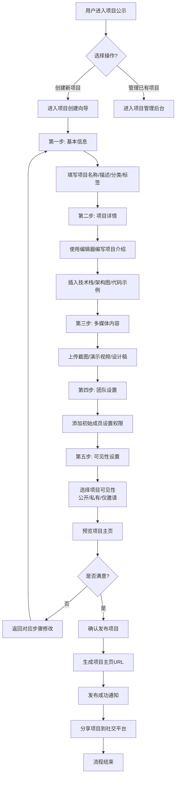
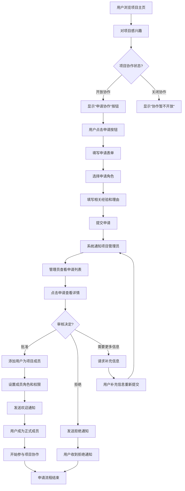
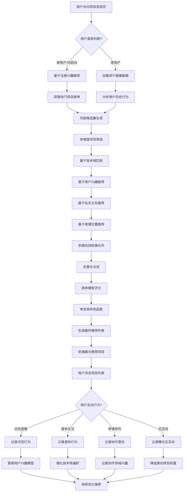
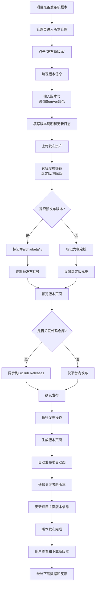

# 2.5 项目公示
## 2.5.1 功能描述
项目公示是九州寰宇平台的核心项目展示与协作模块，为用户提供专业的项目展示、管理和协作空间。用户可在此创建项目页面，展示项目概述、技术栈、团队成员、进展动态、成果展示等内容，支持多图上传、文档附件、进度跟踪、版本管理等功能。系统提供项目关注、星标、评论、协作申请等互动机制，基于用户兴趣和技术栈进行个性化项目推荐，设立热门、最新、推荐等项目榜单，打造高质量的项目展示与协作社区。
## 2.5.2 用户场景

| 场景类型    | 使用角色        | 具体场景描述                                  |
| ------- | ----------- | --------------------------------------- |
| 开源项目展示  | 独立开发者与开源贡献者 | 展示个人或团队的开源项目，吸引贡献者参与，管理issue和PR，建立项目社区。 |
| 课程项目展示  | 数字原生代学生     | 展示课程设计、毕业设计、竞赛项目，获得同学和老师的反馈，积累项目经验。     |
| 商业产品展示  | 创业团队与企业     | 展示商业产品、SaaS服务、移动应用，吸引用户试用、投资关注或商业合作。    |
| 作品集展示   | 斜杠内容创作者     | 展示设计作品、摄影集、视频作品、写作作品等创意项目，建立个人作品集，吸引客户。 |
| 研究项目展示  | 学术研究者       | 展示学术研究项目、论文成果、实验数据，与同行交流，寻找合作研究者。       |
| 协作招募    | 项目发起人       | 发布项目协作需求，招募技术伙伴、设计师、产品经理等角色，组建项目团队。     |
| 项目发现与学习 | 技术学习者       | 浏览优质开源项目，学习技术实现，参与项目贡献，提升实践能力。          |
| 投资与孵化   | 投资者与孵化器     | 发现潜力项目，评估团队和技术，进行投资或孵化支持。               |

## 2.5.3 核心价值
- 项目展示与曝光：为各类项目提供专业的展示平台，帮助项目获得更多曝光、关注和资源支持。
- 协作与连接：建立项目方与参与者之间的连接桥梁，促进技术协作、资源对接和团队组建。
- 学习与成长：提供优质项目案例和学习资源，帮助用户通过实际项目提升技能和实践经验。
- 省时高效发现：通过AI个性化推荐和智能筛选，帮助用户快速发现感兴趣的相关项目。
- 项目管理简化：提供轻量级的项目管理工具，简化项目展示、进度跟踪和团队协作流程。
- 社区生态构建：围绕项目形成讨论、贡献、反馈的社区生态，增强平台粘性和用户归属感。
- 价值转化促进：帮助项目实现从展示到协作、从关注到合作的价值转化链条。
## 2.5.4 需求清单

| 功能类别 | 功能名称     | 功能概述                                        | 优先级 |
| ---- | -------- | ------------------------------------------- | --- |
| 项目创建 | 项目基本信息   | 创建项目页面，设置项目名称、描述、分类、标签、开源协议、主页链接等基础信息       | P0  |
| 项目创建 | 项目详情编辑   | 富文本编辑器编辑项目详细介绍，支持Markdown，插入技术栈、架构图、功能列表等   | P0  |
| 项目创建 | 多媒体展示    | 支持项目截图、演示视频、产品原型、设计稿等多媒体内容上传和展示             | P0  |
| 项目创建 | 技术栈标签    | 选择项目使用的技术栈标签（前端、后端、数据库、框架等），支持自定义技术标签       | P0  |
| 项目展示 | 项目主页展示   | 响应式项目主页，展示项目概览、详情、动态、成员、资源等模块               | P0  |
| 项目展示 | README渲染 | 自动渲染项目的README.md文件，支持GitHub风格Markdown渲染     | P0  |
| 项目展示 | 项目动态流    | 展示项目更新、版本发布、进展汇报等动态信息，类似项目时间线               | P0  |
| 项目展示 | 个性化推荐    | 基于用户兴趣、技术栈、关注领域的个性化项目推荐                     | P0  |
| 项目展示 | 项目榜单     | 热门项目榜（星标数）、最新项目榜、上升最快榜、技术分类榜                | P0  |
| 团队管理 | 成员管理     | 添加/移除项目成员，设置成员角色（所有者、管理员、贡献者等），管理权限         | P0  |
| 团队管理 | 协作申请     | 用户可申请加入项目协作，项目管理员审核申请，发送邀请链接                | P0  |
| 版本管理 | 版本发布     | 创建项目版本（v1.0.0），添加版本说明、更新日志、下载链接             | P0  |
| 版本管理 | 版本历史     | 展示项目版本历史，支持版本对比，查看每个版本的详细变更                 | P0  |
| 资源管理 | 文档资源     | 上传和管理项目文档（设计文档、API文档、用户手册等）                 | P0  |
| 资源管理 | 代码仓库     | 关联GitHub、GitLab等代码仓库，显示仓库信息、提交记录、分支情况       | P1  |
| 资源管理 | 附件管理     | 上传项目相关附件（原型文件、设计源文件、数据集等）                   | P0  |
| 互动功能 | 星标关注     | 用户星标（star）项目，关注项目更新，管理星标项目列表                | P0  |
| 互动功能 | 项目讨论     | 项目讨论区，支持话题分类（问题反馈、功能建议、技术讨论等）               | P0  |
| 互动功能 | Issue跟踪  | 简易Issue系统，报告bug、提出功能请求，分配处理人，跟踪状态           | P1  |
| 互动功能 | 贡献者展示    | 展示项目贡献者列表，按贡献度排序，显示贡献统计                     | P0  |
| 搜索发现 | 项目搜索     | 全文搜索项目名称、描述、README内容，支持技术栈、分类、许可证筛选         | P0  |
| 搜索发现 | 技术栈发现    | 按技术栈分类浏览项目，发现使用特定技术的相关项目                    | P0  |
| 搜索发现 | 分类浏览     | 按项目分类（开源工具、商业产品、学习项目、创意作品等）浏览               | P0  |
| 数据分析 | 项目数据统计   | 统计项目访问量、星标数、讨论数、贡献者数等数据                     | P1  |
| 数据分析 | 贡献度统计    | 统计成员贡献度（提交数、Issue解决数、文档贡献等）                 | P1  |
| 集成功能 | CI/CD状态  | 显示关联仓库的CI/CD构建状态（如GitHub Actions、Travis CI） | P2  |
| 集成功能 | 文档站点集成   | 集成项目文档站点（如GitBook、Read the Docs），显示文档链接     | P2  |
| 安全权限 | 项目可见性    | 设置项目可见性（公开、私有、仅邀请可见），控制谁可以查看项目              | P0  |
| 安全权限 | 编辑权限控制   | 精细控制不同角色成员的编辑权限（编辑基本信息、发布版本、管理成员等）          | P0  |

## 2.5.5 需求详述
### 2.5.5.1 项目基本信息
- 项目名称：输入项目名称（2-50字符），支持中英文、数字和连字符，创建后不可修改（或需管理员权限修改）。
- 项目描述：简短描述项目（50-200字符），用于列表展示和搜索摘要，清晰说明项目核心价值。
- 项目分类：选择项目所属分类，支持多级分类：技术类型（Web应用、移动应用、桌面软件、库/框架）、领域（教育、电商、社交、工具等）、性质（开源项目、商业产品、学习项目、创意作品）。
- 标签系统：添加3-10个描述性标签，如"人工智能"、"区块链"、"React"、"小程序"等，支持自动补全和热门标签推荐。
- 开源协议：选择开源协议（MIT、GPL、Apache等），商业项目可选择"商业许可"或"自定义协议"。
- 主页链接：填写项目官方网站或演示地址，支持HTTPS验证，显示为可点击链接。
- 项目图标：上传项目图标（正方形，最小256×256px，支持PNG/JPG），用于列表展示和分享缩略图。
### 2.5.5.2 项目详情编辑
- 双模式编辑器：提供富文本和Markdown双模式编辑器，支持实时预览，技术用户偏好Markdown模式。
- 结构化章节：建议章节结构：项目简介、功能特性、技术架构、安装部署、使用示例、路线图、贡献指南等。
- 技术栈展示：专用模块展示技术栈，可视化显示前端、后端、数据库、DevOps等技术选择，点击技术标签查看使用该技术的其他项目。
- 架构图支持：支持上传架构图、流程图，提供图床存储和CDN加速，支持图片缩放和全屏查看。
- 代码片段：支持插入代码片段，语法高亮，提供复制功能，展示关键实现代码。
- 功能列表：使用列表展示项目功能特性，支持特性分类（核心功能、进阶功能、规划中功能）。
- 响应式预览：编辑时提供桌面、平板、手机三种设备预览，确保内容在不同设备显示效果良好。
### 2.5.5.3 多媒体展示
- 截图上传：上传项目截图（最多20张），支持拖拽排序，设置封面图。自动生成缩略图，点击查看大图轮播。
- 演示视频：支持嵌入YouTube、Bilibili等平台视频，或本地上传演示视频（最大500MB），自动转码为流媒体格式。
- 产品原型：支持上传原型文件（Figma、Sketch、Axure等），提供在线预览或下载链接。
- 设计稿展示：设计师上传UI设计稿，支持多屏演示，展示设计理念和交互细节。
- 3D模型：支持上传3D模型文件（glTF、OBJ等），提供Web端3D预览（基于Three.js）。
- 多媒体管理：提供多媒体管理后台，可重新排序、删除、替换多媒体文件，查看使用统计。
### 2.5.5.4 技术栈标签
- 技术分类：技术栈按类别组织：前端框架（React、Vue、Angular）、后端框架（Spring Boot、Django、Express）、数据库（MySQL、MongoDB、Redis）、云服务（AWS、Azure、阿里云）、开发工具等。
- 标签选择：通过多选下拉框或标签输入框选择技术栈，支持搜索过滤，显示技术图标和描述。
- 自定义技术：如果技术不在列表中，可添加自定义技术标签，填写技术名称、官网链接、描述。
- 技术关系图：自动生成技术栈关系图，可视化展示技术选型和依赖关系。
- 技术趋势：显示各技术的使用热度趋势，帮助创建者了解技术选型是否主流。
- 技术匹配：基于技术栈推荐相似项目、相关教程、兼容工具，提供技术生态连接。
### 2.5.5.5 项目主页展示
- 响应式布局：自适应桌面、平板、手机屏幕，确保在各种设备上阅读体验良好。
- 头部区域：显示项目图标、名称、描述、星标数、关注数、最后更新时间，提供星标和关注按钮。
- 导航菜单：固定导航菜单：概览、详情、动态、成员、资源、讨论等，点击平滑滚动到对应章节。
- 概览模块：折叠显示项目关键信息：技术栈、开源协议、项目状态（活跃/维护中/归档）、主要贡献者。
- 详情模块：全宽度展示项目详细介绍，支持目录导航（长文章自动生成），字号和主题切换。
- 动态模块：展示项目更新动态，包括版本发布、进展汇报、重要公告等，按时间倒序排列。
- 成员模块：展示项目成员列表，按角色排序，显示成员头像、姓名、角色、贡献统计。
- 资源模块：展示项目相关资源：文档、代码仓库、附件、相关链接等，分类清晰。
- 页脚信息：显示项目创建时间、最后更新时间、访问统计、分享按钮。
### 2.5.5.6 README渲染
- 自动检测：如果项目关联了GitHub/GitLab仓库，自动获取README.md文件内容。
- 手动上传：支持手动上传或编辑README文件，覆盖自动获取的内容。
- Markdown渲染：使用GitHub风格的Markdown渲染引擎，支持表格、任务列表、脚注、表情符号等扩展语法。
- 代码高亮：自动识别代码块语言，应用语法高亮，提供代码复制和折叠功能。
- 相对路径处理：正确处理README中的相对图片链接，转换为绝对路径或从仓库获取。
- TOC生成：为长README自动生成目录（Table of Contents），支持锚点跳转。
- 渲染缓存：缓存渲染结果，减少重复渲染开销，README更新时清除缓存。
- 样式定制：提供多种README渲染主题（GitHub Light、GitHub Dark、Solarized等）。
### 2.5.5.7 项目动态流
- 动态类型：支持多种动态类型：版本发布、进展汇报、团队变更、重大更新、活动通知等。
- 发布动态：项目管理员发布动态，选择类型，填写标题和内容，支持富文本和附件。
- 自动动态：系统自动生成动态：新成员加入、星标数里程碑、版本发布、代码仓库更新等。
- 时间线展示：按时间倒序展示动态流，类似社交网络时间线，显示发布时间和发布者。
- 动态互动：用户可对动态点赞、评论、分享，形成围绕项目进展的讨论。
- 订阅通知：关注项目的用户接收动态通知，可设置通知频率（实时、每日摘要、不通知）。
- 动态筛选：支持按动态类型筛选，如只看版本发布、只看团队动态等。
- RSS订阅：提供项目动态的RSS订阅链接，方便用户通过阅读器跟踪更新。
### 2.5.5.8 个性化推荐
- 推荐维度：基于用户技术栈兴趣、关注领域、星标历史、浏览行为、相似用户偏好等多维度推荐。
- 首页推荐：用户首页显示"为你推荐的项目"栏目，混合推荐热门项目、技术相关项目、关注作者的新项目。
- 项目详情页推荐：项目详情页底部推荐"类似项目"、"使用相同技术的项目"、"同一作者的其他项目"。
- 发现页面：专门的"项目发现"页面，提供个性化项目流，支持筛选和排序。
- 冷启动处理：新用户通过注册时选择的兴趣标签、技术偏好进行初始推荐，逐渐优化。
- 负反馈机制：提供"不感兴趣"按钮，减少类似项目推荐，优化推荐准确度。
- 探索机制：定期推荐小众高质量项目，帮助用户发现新技术和新领域。
- 推荐解释：显示推荐理由，如"因为你关注React技术"、"因为和你星标的项目类似"。
### 2.5.5.9 项目榜单
- 热门项目榜：基于星标数、关注数、访问量、互动数加权计算热度，分24小时、7天、30天榜单。
- 最新项目榜：按创建时间排序的最新项目，帮助发现新发布项目。
- 上升最快榜：识别近期热度快速上升的项目，基于星标增长速度和加速度计算。
- 技术分类榜：按技术栈分类的榜单，如"React项目榜"、"Python项目榜"等。
- 领域分类榜：按应用领域分类的榜单，如"AI项目榜"、"区块链项目榜"、"教育项目榜"。
- 贡献活跃榜：基于近期提交数、Issue解决数、讨论活跃度的贡献度榜单。
- 榜单更新：榜单每小时更新一次，确保时效性，同时避免频繁变动影响用户体验。
- 榜单展示：在平台首页、项目发现页、分类页面等多处展示榜单，点击进入项目详情。
### 2.5.5.10 成员管理
- 成员角色：定义多种成员角色：所有者（创建者，拥有所有权限）、管理员（可管理成员和设置）、贡献者（可编辑内容和发布动态）、观察者（仅查看）。
- 添加成员：通过用户名搜索添加现有平台用户，或通过邮箱邀请新用户（发送邀请链接）。
- 权限设置：为每个成员设置具体权限：编辑项目信息、发布版本、管理成员、发布动态、管理资源等。
- 成员列表：展示成员列表，按角色分组，显示加入时间、最后活跃时间、贡献统计。
- 成员移除：管理员可移除成员（除所有者外），移除后失去所有项目权限。
- 角色变更：调整成员角色，如将贡献者提升为管理员，变更后权限立即生效。
- 成员贡献：显示每个成员的贡献统计：编辑次数、动态发布数、问题解决数等。
- 团队规模：免费项目限制最多10名成员，高级项目可扩展更多成员。
### 2.5.5.11 协作申请
- 申请入口：项目主页显示"申请协作"按钮（如果项目开放协作），点击进入申请页面。
- 申请表单：填写申请信息：申请角色（贡献者、设计师、文档维护等）、相关经验、申请理由、联系方式。
- 作品展示：可关联个人作品集、GitHub主页、其他项目经验，增强申请说服力。
- 申请提交：提交后通知项目管理员，申请进入待处理队列，申请人可查看申请状态。
- 管理员审核：管理员查看申请详情，可批准、拒绝或要求补充信息。批准后自动添加为成员。
- 邀请链接：管理员可生成邀请链接，直接邀请特定用户加入，无需申请流程。
- 申请历史：用户和管理员均可查看申请历史记录，包括处理结果和处理时间。
- 自动匹配：系统可基于用户技能和项目需求自动推荐协作匹配，发送协作建议。
### 2.5.5.12 版本发布
- 版本号规范：遵循语义化版本控制（SemVer）：主版本.次版本.修订号（如v1.2.3），系统验证格式。
- 版本信息：填写版本名称、发布日期、版本说明（支持Markdown）、更新日志（新增功能、修复问题、破坏性变更等）。
- 发布资产：上传版本相关资产：可执行文件、安装包、源代码zip、文档、更新说明等。
- 预发布标记：标记为预发布版本（alpha/beta/rc），在版本号后添加后缀（如v1.0.0-beta.1）。
- 发布渠道：选择发布渠道：稳定版、测试版、开发版，不同渠道显示不同标识。
- 自动发布：如果关联了GitHub仓库，可设置自动同步GitHub Releases，减少手动操作。
- 版本列表：展示所有版本列表，按版本号降序排列，支持筛选稳定版/预发布版。
- 下载统计：统计每个版本的下载次数，显示热门版本，帮助用户选择稳定版本。
### 2.5.5.13 版本历史
- 时间线视图：按发布时间顺序展示版本时间线，可视化版本演进过程。
- 版本对比：选择两个版本进行对比，高亮显示版本说明的差异，快速了解变更内容。
- 版本详情：点击版本进入详情页，显示完整版本信息、发布资产、讨论评论。
- 版本依赖：显示版本间的依赖关系，如v1.2.0基于v1.1.0，帮助理解版本演进。
- 下载历史：用户可查看自己的下载历史，记录下载的版本和时间。
- 版本订阅：用户可订阅特定版本的更新通知，如该版本有安全更新时收到提醒。
- 版本归档：将旧版本标记为归档，不再推荐新用户下载，但保留访问权限。
- 版本统计：统计版本发布频率、平均版本周期、版本大小趋势等数据。
### 2.5.5.14 文档资源
- 文档分类：支持多种文档类型：设计文档、API文档、用户手册、开发指南、部署文档、架构设计等。
- 文档上传：上传文档文件（PDF、Word、Markdown等），或创建在线文档（富文本编辑器）。
- 文档预览：支持在线预览常见文档格式，无需下载即可查看内容。
- 版本控制：文档支持版本历史，记录修改记录，可恢复到历史版本。
- 权限控制：设置文档访问权限：公开、仅成员可见、仅管理员可见。
- 文档搜索：提供文档内容全文搜索，快速定位所需信息。
- 文档评价：用户可对文档评分和评论，帮助改进文档质量。
- 集成文档站：支持集成外部文档站点（GitBook、Read the Docs），显示链接和同步状态。
### 2.5.5.15 代码仓库
- 仓库关联：关联GitHub、GitLab、Gitee、Bitbucket等代码仓库，输入仓库URL自动识别。
- 仓库信息同步：定期同步仓库信息：星标数、Fork数、最后提交时间、主要语言、许可证等。
- 提交记录：显示最近提交记录，包括提交信息、作者、时间、变更文件数。
- 分支信息：显示仓库分支列表，默认分支、保护分支、活跃分支状态。
- CI/CD状态：显示关联CI/CD服务的构建状态（通过API集成），构建失败时显示警告。
- 代码统计：统计代码行数、文件数、贡献者数、提交频率等数据。
- 仓库切换：支持切换关联的仓库，如从GitHub迁移到GitLab，保留项目其他信息。
- 仓库健康度：基于活跃度、Issue解决率、测试覆盖率等指标评估仓库健康度。
### 2.5.5.16 附件管理
- 附件类型：支持多种附件类型：设计源文件（Sketch、Figma、PSD）、数据集、配置文件、演示文稿、测试文件等。
- 上传限制：单文件最大500MB，总空间根据项目类型限制（免费项目5GB，高级项目更多）。
- 文件预览：支持预览常见文件格式：图片、PDF、文本文件等，其他格式提供下载。
- 版本管理：附件可关联到特定项目版本，如v1.0.0的设计稿、v2.0.0的测试数据。
- 权限控制：设置附件访问权限：公开下载、仅成员下载、仅管理员下载。
- 下载统计：统计附件下载次数，了解哪些资源最受欢迎。
- 附件分类：支持创建文件夹分类管理附件，保持资源组织有序。
- 外部存储：大文件支持外部存储链接（如Google Drive、百度网盘），显示链接和提取码。
### 2.5.5.17 星标关注
- 星标功能：项目主页显示星标按钮，点击后星标数+1，用户星标列表中添加该项目。
- 星标列表：用户个人中心显示"我的星标"列表，按星标时间倒序排列，支持搜索和筛选。
- 关注功能：除星标外，还可关注项目，关注后接收项目动态通知。
- 星标趋势：显示项目星标增长趋势图，识别星标快速增长期。
- 星标提醒：项目达到星标里程碑（如100、1000星）时自动发布庆祝动态。
- 星标分析：分析用户星标模式，推荐类似项目，发现用户兴趣领域。
- 导出星标：支持导出星标项目列表为CSV/JSON格式，用于备份或分析。
- 星标社交：可选公开显示星标项目，其他用户可查看你的技术兴趣。
### 2.5.5.18 项目讨论
- 讨论区分类：支持多个讨论分类：一般讨论、问题反馈、功能建议、技术问答、安装部署、性能优化等。
- 话题发布：用户发布讨论话题，选择分类，填写标题和内容（支持Markdown）。
- 回复系统：支持话题回复，多级回复（最多3级），形成讨论线程。
- 话题排序：默认按最后回复时间排序，可选按创建时间、热度（回复数）排序。
- 话题状态：话题状态：开放中、已解决、已关闭、已归档，管理员可修改状态。
- 精华话题：管理员可将优质话题标记为精华，在讨论区置顶或单独展示。
- @提及：支持@项目成员或其他用户，被提及用户收到通知。
- 讨论搜索：提供讨论区全文搜索，快速找到相关讨论。
### 2.5.5.19 Issue跟踪
- Issue创建：用户创建Issue，选择类型：Bug报告、功能请求、文档改进、问题咨询等。
- 模板支持：提供不同Issue类型的模板，引导用户提供必要信息（如Bug报告要求提供环境、复现步骤等）。
- 标签系统：为Issue添加标签：bug、enhancement、help wanted、good first issue等，方便分类筛选。
- 分配处理：管理员将Issue分配给特定成员处理，被分配者收到通知。
- 状态管理：Issue状态：待处理、进行中、已解决、已关闭、无法复现等，支持状态流转。
- 评论讨论：Issue下方可评论讨论，记录解决过程，@相关人员。
- 关联提交：可将Issue关联到代码提交，提交信息中引用Issue号自动建立关联。
- 统计报表：统计Issue解决率、平均解决时间、常见问题类型等数据。
### 2.5.5.20 贡献者展示
- 贡献者列表：展示所有贡献者，按贡献度排序，显示头像、姓名、角色、贡献统计。
- 贡献统计：统计每个贡献者的贡献指标：提交数、Issue解决数、文档编辑数、代码审查数等。
- 贡献时间线：显示贡献者的贡献时间线，展示参与项目的时间分布。
- 贡献者详情：点击贡献者进入详情页，显示在该项目的详细贡献记录。
- 自动识别：从关联的代码仓库自动识别提交作者，添加到贡献者列表。
- 手动添加：管理员可手动添加贡献者，特别是非代码贡献者（设计、文档、测试等）。
- 贡献者证书：为重要贡献者生成贡献证书，认可其对项目的贡献。
- 贡献者社交：贡献者可选择公开自己的贡献记录，展示在个人主页。
## 2.5.6 核心流程
### 2.5.6.1 项目创建与发布流程

### 2.5.6.2 项目协作申请与处理流程

### 2.5.6.3 项目发现与推荐流程

### 2.5.6.4 版本发布与管理流程

## 2.5.7 详细用例
### 用例1：独立开发者发布开源项目
- 用例描述：全栈开发者发布一个开源的前端组件库项目
- 主要参与者：独立开发者、项目公示系统、潜在用户和贡献者
- 前置条件：
	1. 开发者已完成组件库v1.0.0开发，代码托管在GitHub
	2. 开发者已准备好项目文档、示例和演示
	3. 开发者希望吸引用户使用和贡献者参与
- 基本事件流：
	1. 开发者登录九州寰宇，进入"项目公示"模块，点击"创建新项目"。
	2. 填写基本信息：项目名称"UI-Components-Library"，描述"一个轻量级、可定制的前端UI组件库，基于React和TypeScript"。
	3. 选择分类："开源项目" -\> "前端库"，添加标签"React"、"TypeScript"、"UI组件"、"前端开发"。
	4. 选择开源协议："MIT License"，填写GitHub仓库地址"https://github.com/dev/ui-components"。
	5. 进入详情编辑，使用Markdown编辑器编写项目详细介绍，包括设计理念、特性列表、技术架构图。
	6. 插入技术栈：选择"React 18"、"TypeScript 5"、"Vite"、"Tailwind CSS"，系统自动生成技术栈展示模块。
	7. 上传多媒体：上传5张组件截图，展示不同组件的使用效果；上传一个演示视频到B站，嵌入视频链接。
	8. 设置团队：暂时只有自己，设置角色为"所有者"，后续可添加贡献者。
	9. 设置可见性："公开"，允许任何人查看和星标。
	10. 预览项目主页，检查所有内容显示正常，技术栈图标正确，截图轮播流畅。
	11. 点击"发布项目"，系统生成项目主页URL"https://jz-verse.com/projects/ui-components-library"。
	12. 发布后，立即创建第一个版本v1.0.0，填写版本说明"初始版本，包含10个基础组件"，上传npm包和源代码zip。
	13. 分享项目到技术社区，使用系统生成的分享海报，包含项目二维码和简介。
- 扩展事件流：
	5a. 关联仓库自动同步：系统自动从GitHub仓库获取README.md，开发者选择使用自动获取的内容。
	7a. 设计稿展示：开发者有Figma设计稿，上传Figma原型文件，系统提供在线预览。
	10a. 发现问题：预览时发现技术栈图标显示不全，返回编辑调整技术栈选择，重新预览。
	12a. 预发布版本：组件库还处于测试阶段，标记为v1.0.0-beta.1，在版本号添加beta标签。
### 用例2：学生团队展示课程设计项目
- 用例描述：计算机专业学生团队展示数据库课程设计项目
- 主要参与者：学生团队（3人）、项目公示系统、同学和老师
- 前置条件：
	1. 团队已完成数据库课程设计"图书馆管理系统"
	2. 项目包含需求文档、ER图、SQL脚本、前端界面
	3. 需要展示项目成果，获得老师和同学的评价
- 基本事件流：
	1. 团队组长登录平台，创建新项目"图书馆管理系统-课程设计"。
	2. 填写描述："一个完整的图书馆管理系统，包含图书管理、借阅管理、用户管理、统计报表等功能"。
	3. 选择分类："学习项目" -\> "课程设计"，标签"数据库"、"Java"、"MySQL"、"课程设计"。
	4. 设置项目为"仅邀请可见"，准备先完善内容再开放。
	5. 编辑项目详情：使用富文本编辑器，分章节介绍项目背景、需求分析、系统设计、实现过程、总结反思。
	6. 上传ER图、数据流图、系统架构图等设计文档，使用系统图床存储。
	7. 添加团队成员：邀请另外两名组员加入，设置角色为"管理员"，他们可以共同编辑内容。
	8. 上传项目资源：SQL脚本文件、Java源代码zip、项目报告PDF、演示PPT。
	9. 设置资源权限：SQL脚本和报告公开，源代码仅成员可见（保护作业原创性）。
	10. 创建讨论区话题"项目设计讨论"，团队成员在话题下交流改进意见。
	11. 完善所有内容后，将项目可见性改为"公开"，允许其他同学查看。
	12. 分享项目链接到课程群，邀请同学和老师查看并提供反馈。
	13. 在讨论区创建"反馈收集"话题，收集老师和同学的评价和建议。
	14. 根据反馈更新项目内容，发布v1.1版本"根据反馈优化了用户界面和查询性能"。
- 扩展事件流：
	4a. 协作申请：有同学看到项目后想学习参考，申请协作查看源代码，团队审核后批准为"观察者"角色。
	9a. 作业保护：担心作业抄袭，设置源代码为"仅成员可见"，答辩后再开放。
	13a. 教师评价：课程老师在项目讨论区留下详细评价，团队将评价标记为"精华"，展示在项目主页。
	14a. 持续维护：课程结束后，团队决定继续完善项目，转为长期维护的开源项目，更新分类为"开源项目"。
### 用例3：创业团队展示商业产品寻求合作
- 用例描述：创业团队展示SaaS产品寻求用户和投资
- 主要参与者：创业团队、项目公示系统、潜在客户和投资者
- 前置条件：
	1. 团队开发了一款企业协同办公SaaS产品
	2. 产品已上线，有初步用户基础
	3. 希望通过平台展示吸引更多企业客户和投资机会
- 基本事件流：
	1. 团队产品经理创建项目"协同办公SaaS-企业级解决方案"。
	2. 选择分类："商业产品" -\> "SaaS服务"，标签"协同办公"、"企业服务"、"SaaS"、"B端产品"。
	3. 设置专业的企业风格：上传产品Logo，选择深蓝色作为主题色，体现专业感。
	4. 编辑产品详情：重点展示产品价值主张、目标客户、核心功能、技术优势、客户案例。
	5. 上传产品演示视频，展示完整使用流程；上传客户案例截图（脱敏处理）。
	6. 设置技术栈：展示后端微服务架构、前端React技术栈、数据库集群、云服务部署。
	7. 创建"客户评价"模块，展示现有客户的评价摘要（获得授权）。
	8. 设置"预约演示"功能，用户可填写表单预约产品演示，信息发送到团队邮箱。
	9. 设置"合作咨询"讨论分类，潜在客户可在此咨询产品详情、定价、定制需求。
	10. 发布项目后，在团队社交媒体分享，使用系统生成的专业分享海报。
	11. 定期发布产品动态：v2.0版本发布、新功能上线、客户成功案例、行业活动参与。
	12. 监控项目数据：每日查看访问量、咨询数、演示预约数，分析流量来源。
	13. 通过讨论区与潜在客户互动，回答技术问题，收集产品反馈。
	14. 收到投资机构咨询，通过平台初步沟通后转为线下深入交流。
- 扩展事件流：
	8a. 集成预约系统：团队有自己的Calendly预约系统，在项目页面嵌入预约链接。
	11a. 产品更新日志：每次产品更新都发布版本动态，保持项目活跃度，显示团队持续投入。
	12a. 数据分析：发现大部分流量来自移动端，优化移动端项目页面体验。
	14a. 合作达成：通过平台接触最终达成合作协议，在项目动态中宣布合作消息（经双方同意）。
## 2.5.8 界面与交互要求
参考UI设计稿
## 2.5.9 埋点方案

| 类别   | 事件/页面 ID                  | 事件名称    | 触发时机           | 关键属性（示例）                                                                      |
| ---- | ------------------------- | ------- | -------------- | ----------------------------------------------------------------------------- |
| 页面访问 | page\_view                | 页面浏览    | 用户进入项目相关页面     | page\_type（discover/project/edit）, project\_id, category                      |
| 项目发现 | project\_discover\_view   | 项目发现页浏览 | 用户进入项目发现页面     | view\_type（grid/list）, filter\_count, sort\_by                                |
| 项目发现 | project\_card\_click      | 项目卡片点击  | 用户点击项目卡片       | project\_id, position（列表位置）, source（推荐/搜索/榜单）                                 |
| 项目发现 | project\_filter\_apply    | 筛选条件应用  | 用户应用筛选条件       | filter\_type（category/tech/license）, filter\_value, result\_count             |
| 项目发现 | project\_sort\_change     | 排序方式变更  | 用户更改排序方式       | old\_sort, new\_sort, page\_number                                            |
| 项目操作 | project\_star             | 项目星标    | 用户星标项目         | project\_id, star\_count\_before, star\_count\_after                          |
| 项目操作 | project\_unstar           | 取消星标    | 用户取消星标         | project\_id, star\_count\_before, star\_count\_after                          |
| 项目操作 | project\_follow           | 关注项目    | 用户关注项目         | project\_id, follow\_count\_before, follow\_count\_after                      |
| 项目操作 | project\_unfollow         | 取消关注    | 用户取消关注         | project\_id, follow\_count\_before, follow\_count\_after                      |
| 项目操作 | project\_share            | 项目分享    | 用户分享项目         | project\_id, share\_platform（wechat/weibo/link）, share\_method（海报/链接）         |
| 内容创建 | project\_create\_start    | 项目创建开始  | 用户开始创建项目       | user\_type（new/experienced）, template\_used（是/否）                              |
| 内容创建 | project\_create\_complete | 项目创建完成  | 用户成功创建项目       | project\_id, creation\_time（秒）, field\_completeness（完成度%）                     |
| 内容创建 | project\_create\_abandon  | 项目创建放弃  | 用户放弃创建项目       | step（放弃时的步骤）, time\_spent（秒）, reason（可选）                                      |
| 内容编辑 | project\_edit             | 项目编辑    | 用户编辑项目内容       | project\_id, edit\_section（info/detail/media）, edit\_duration（秒）              |
| 版本管理 | version\_publish          | 版本发布    | 用户发布项目版本       | project\_id, version\_number, release\_type（stable/beta）, asset\_count        |
| 团队协作 | collaboration\_apply      | 协作申请提交  | 用户提交协作申请       | project\_id, apply\_role, has\_portfolio（是/否）                                 |
| 团队协作 | collaboration\_approve    | 协作申请批准  | 管理员批准协作申请      | project\_id, applicant\_id, approved\_role                                    |
| 团队协作 | collaboration\_reject     | 协作申请拒绝  | 管理员拒绝协作申请      | project\_id, applicant\_id, reject\_reason                                    |
| 讨论互动 | discussion\_create        | 讨论话题创建  | 用户创建讨论话题       | project\_id, topic\_category, title\_length                                   |
| 讨论互动 | discussion\_reply         | 讨论回复    | 用户回复讨论话题       | project\_id, topic\_id, reply\_depth（1/2/3）                                   |
| 讨论互动 | discussion\_resolve       | 话题标记解决  | 用户标记话题为已解决     | project\_id, topic\_id, resolve\_time（从创建到解决秒数）                               |
| 资源操作 | resource\_download        | 资源下载    | 用户下载项目资源       | project\_id, resource\_type（doc/code/attachment）, resource\_size（MB）          |
| 资源操作 | resource\_view            | 资源查看    | 用户在线查看资源       | project\_id, resource\_type, view\_duration（秒）                                |
| 搜索行为 | project\_search           | 项目搜索    | 用户执行项目搜索       | search\_query, result\_count, search\_source（发现页/全局搜索）                        |
| 搜索行为 | search\_suggestion\_click | 搜索建议点击  | 用户点击搜索建议       | suggestion\_text, suggestion\_rank（位置）                                        |
| 推荐交互 | recommendation\_click     | 推荐项目点击  | 用户点击推荐项目       | project\_id, recommendation\_source（首页/详情页/发现页）, recommendation\_rank         |
| 推荐交互 | recommendation\_feedback  | 推荐反馈    | 用户反馈推荐质量       | project\_id, feedback\_type（interested/not\_interested）, feedback\_reason（可选） |
| 用户留存 | project\_return           | 项目回访    | 用户再次访问已星标/关注项目 | project\_id, days\_since\_last\_visit, visit\_count                           |
| 用户留存 | project\_engagement       | 项目深度互动  | 用户与项目多维度互动     | project\_id, interaction\_types（star+comment+download）, session\_duration（秒）  |

## 2.5.10 技术细节
### 2.5.10.1 架构设计
- 微服务架构：项目公示模块采用独立微服务架构，与平台其他模块解耦，通过API网关统一调度。
	- 项目服务：核心业务逻辑，处理项目CRUD、成员管理、权限验证
	- 内容服务：管理项目详情内容、多媒体资源、版本历史
	- 搜索服务：基于Elasticsearch的全文搜索，支持复杂查询和筛选
	- 推荐服务：个性化项目推荐算法，实时计算和离线训练结合
	- 互动服务：处理星标、关注、讨论、申请等用户互动
	- 通知服务：发送项目动态、申请通知、系统消息
- 数据存储设计：
	- 关系数据库（PostgreSQL）：存储结构化数据（项目基本信息、成员关系、版本信息）
		- 项目表：id, name, description, category, visibility, created_at, updated_at
		- 成员表：project_id, user_id, role, joined_at, permissions
		- 版本表：project_id, version, release_date, changelog, assets
	- 文档数据库（MongoDB）：存储非结构化内容（项目详情、动态内容、讨论话题）
		- 项目详情文档：支持版本历史，差异存储
		- 动态流文档：时间序列数据，按项目分区
		- 讨论文档：嵌套回复结构，支持全文搜索
	- 对象存储（S3兼容）：存储多媒体文件（图片、视频、附件）
		- 按项目ID分区存储，设置生命周期策略
		- 图片自动处理：缩略图生成、格式转换、压缩优化
		- 视频转码：多种分辨率适配，流媒体格式输出
	- 缓存层（Redis）：
		- 热点项目数据缓存，减少数据库查询
		- 星标数、关注数等计数器的原子操作
		- 用户会话和权限信息缓存
	- 搜索引擎（Elasticsearch）：
		- 项目全文索引：名称、描述、README、技术栈
		- 多语言分词支持（中文IK分词，英文标准分词）
		- 复杂查询：多字段匹配、范围过滤、聚合统计
### 2.5.10.2 核心算法
- 个性化推荐算法：
	- 多路召回：
		- 基于内容的召回：用户兴趣标签匹配、技术栈匹配、分类偏好
		- 协同过滤召回：基于用户-项目交互矩阵（星标、关注、浏览）
		- 社交关系召回：关注作者的项目、相似用户喜欢的项目
		- 热门补充召回：全局热门项目、上升最快项目
	- 排序模型：
		- 特征工程：项目特征（质量分、活跃度、完整性）、用户特征（兴趣强度、活跃程度）、上下文特征（时间、设备、位置）
		- 模型选择：初期使用逻辑回归（LR），后期升级为深度排序模型（DeepFM、DIN）
		- 在线学习：实时反馈数据用于模型增量更新
	- 多样性控制：
		- 技术栈多样性：避免推荐过多相同技术的项目
		- 分类多样性：平衡不同分类项目的推荐比例
		- 新颖性控制：定期插入新发布项目，避免推荐结果固化
- 搜索排序算法：
	- 相关性评分：
		- BM25算法计算文本相关性，字段加权（名称权重\>描述\>README）
		- 技术栈匹配加分，完全匹配的技术栈获得更高权重
		- 项目质量因子：星标数、关注数、活跃度作为质量信号
	- 时间衰减：新发布项目获得时间加分，随时间衰减
	- 个性化调整：根据用户历史行为调整排序，优先显示用户可能感兴趣的项目
	- 综合排序公式：最终分数 = 相关性分数 × 质量因子 × 时间因子 × 个性化因子
- 项目质量评估：
	- 完整性评分：基于项目信息完整度（描述长度、图片数、技术栈数、文档完整性）
	- 活跃度评分：基于最近更新时间、动态发布频率、讨论活跃度
	- 社区健康度：星标增长趋势、贡献者多样性、Issue解决率
	- 技术栈流行度：使用技术的社区流行度和趋势
	- 综合质量分：用于推荐排序和榜单计算，定期更新
### 2.5.10.3 性能优化
- 前端性能：
	- 代码分割：按路由懒加载，减少首屏资源体积
	- 图片优化：WebP格式优先，响应式图片（srcset），懒加载
	- 缓存策略：静态资源长期缓存，API响应适当缓存
	- 虚拟滚动：长列表使用虚拟滚动，只渲染可见项
	- 服务端渲染：项目主页关键内容服务端渲染，提升首屏速度
- 后端性能：
	- 数据库优化：
		- 读写分离：主库写，从库读
		- 索引优化：高频查询字段建立复合索引
		- 分库分表：大项目按ID范围分表，历史数据归档
	- 缓存策略：
		- 多级缓存：本地缓存 → Redis缓存 → 数据库
		- 缓存穿透防护：空值缓存，布隆过滤器
		- 缓存雪崩防护：随机过期时间，热点数据永不过期
	- 异步处理：
		- 耗时操作异步化：图片处理、视频转码、数据统计
		- 消息队列：用户互动、通知发送、数据同步
	- CDN加速：静态资源全球CDN分发，多媒体文件边缘缓存
- 搜索性能：
	- 索引优化：按项目热度分片，热点项目单独分片
	- 查询优化：复杂查询拆解，结果缓存
	- 实时索引：项目更新后异步更新搜索索引，延迟控制在1分钟内
### 2.5.10.4 安全约束
- 数据安全：
	- 敏感数据加密：用户联系方式、申请信息等敏感字段加密存储
	- 数据传输安全：全站HTTPS，敏感API请求额外加密
	- 数据备份：每日全量备份，每小时增量备份，异地灾备
- 权限安全：
	- RBAC模型：基于角色的访问控制，细粒度权限管理
	- 权限验证：每次操作验证权限，服务端二次验证
	- 会话管理：JWT令牌，短期有效，刷新机制
- 内容安全：
	- 敏感词过滤：用户输入内容实时敏感词检测
	- 图片鉴黄：上传图片自动鉴黄，违规内容拦截
	- 恶意行为检测：刷星标、刷关注等恶意行为识别和限制
- API安全：
	- 速率限制：API调用频率限制，防止滥用
	- 请求验证：参数校验，防止注入攻击
	- 访问日志：完整API访问日志，用于安全审计
### 2.5.10.5 集成接口
- 外部服务集成：
	- 代码仓库API：GitHub/GitLab API集成，同步仓库信息
		- OAuth2.0授权，获取仓库读写权限（可选）
		- Webhook配置，仓库更新时自动同步
		- 频率限制处理，令牌刷新机制
	- 文档服务集成：GitBook/Read the Docs API，显示文档状态
	- CI/CD状态集成：GitHub Actions/Travis CI API，显示构建状态
	- 支付服务集成：统一支付中心API，支持项目赞助功能
- 内部模块集成：
	- 统一身份服务：用户认证和基本信息获取
	- 博客系统集成：项目可关联博客文章，互相推荐
	- 论坛社区集成：项目讨论可同步到相关社区板块
	- 消息通知系统：项目动态、申请通知通过统一消息系统发送
- 开放API：
	- 公共API：项目基本信息查询，无需认证
	- 认证API：项目管理、成员管理，需要用户认证
	- Webhook：项目事件通知（新版本、新成员、新星标）
	- 数据导出API：项目数据批量导出，支持多种格式