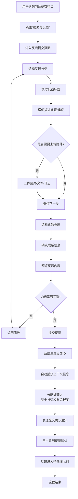
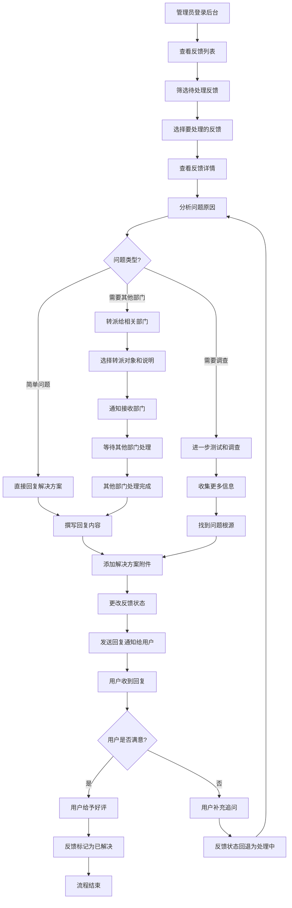
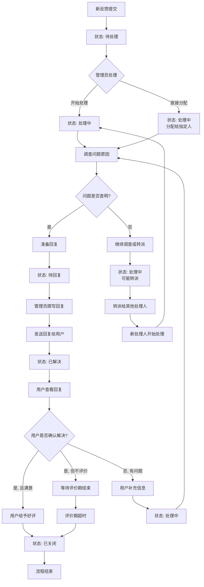
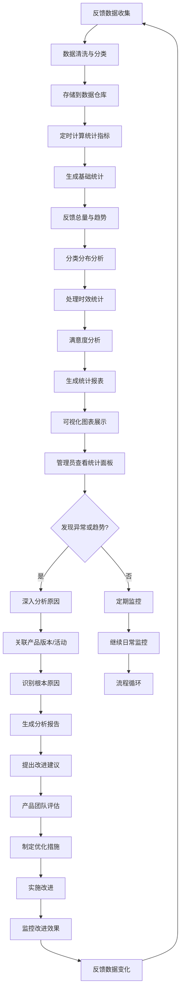

# 2.6 留言反馈
## 2.6.1 功能描述
留言反馈是九州寰宇平台的核心用户沟通与问题反馈模块，为用户提供便捷的问题反馈、建议提交、bug报告渠道，为管理员提供高效的反馈处理与管理工具。用户可在此提交使用问题、功能建议、内容举报、合作咨询等各类反馈，支持文字描述、图片上传、分类选择、优先级设置。系统提供反馈状态跟踪、管理员回复、满意度评价等功能，建立透明、高效的平台与用户沟通机制，持续改进产品体验。
## 2.6.2 用户场景

| 场景类型     | 使用角色       | 具体场景描述                                |
| -------- | ---------- | ------------------------------------- |
| 问题反馈与求助  | 所有平台用户     | 使用过程中遇到功能问题、操作困惑、技术错误时，提交问题描述寻求帮助解决。  |
| 功能建议与改进  | 深度使用用户     | 基于使用体验提出功能改进建议、新功能需求、用户体验优化建议，帮助平台完善。 |
| 内容举报与审核  | 内容消费者      | 发现违规内容（侵权、低俗、虚假信息等）时进行举报，维护平台内容环境。    |
| 合作咨询与商务  | 商业用户与创作者   | 咨询平台合作机会、广告投放、商业合作、资源对接等商务事宜。         |
| bug报告与追踪 | 技术爱好者与测试用户 | 发现系统bug、性能问题、安全漏洞时提交详细报告，跟踪修复进度。      |
| 投诉与争议处理  | 权益受损用户     | 遇到账号问题、支付纠纷、服务争议时提交投诉，寻求官方介入处理。       |
| 数据问题反馈   | 数据敏感用户     | 发现数据错误、信息不准确、统计异常时进行反馈，确保平台数据质量。      |
| 体验调研参与   | 积极参与用户     | 参与平台发起的用户体验调研、功能测试邀请、意见征集活动。          |

## 2.6.3 核心价值
- 用户沟通桥梁：建立平台与用户之间的直接沟通渠道，及时了解用户需求和问题。
- 产品改进驱动：收集用户反馈作为产品迭代的重要输入，数据驱动产品优化决策。
- 问题快速解决：标准化反馈处理流程，确保用户问题得到及时响应和解决。
- 用户体验提升：通过反馈机制发现用户体验痛点，持续优化交互和功能设计。
- 社区氛围维护：有效处理内容举报和用户争议，维护健康、积极的社区环境。
- 用户参与感增强：让用户感受到自己的意见被重视，增强用户归属感和忠诚度。
- 风险预警机制：通过反馈数据发现潜在的系统风险、安全问题和运营隐患。
## 2.6.4 需求清单

| 功能类别 | 功能名称  | 功能概述                                 | 优先级 |
| ---- | ----- | ------------------------------------ | --- |
| 反馈提交 | 反馈表单  | 用户填写反馈的表单界面，包含分类选择、标题、详细描述、附件上传等字段   | P0  |
| 反馈提交 | 反馈分类  | 预设反馈分类体系（问题反馈、功能建议、内容举报、合作咨询等），支持子分类 | P0  |
| 反馈提交 | 附件上传  | 支持上传图片、日志文件、屏幕录像等附件，辅助问题描述           | P0  |
| 反馈提交 | 紧急程度  | 用户选择反馈紧急程度（低、中、高、紧急），影响处理优先级         | P0  |
| 反馈管理 | 反馈列表  | 用户和管理员查看反馈列表，支持多种排序和筛选条件             | P0  |
| 反馈管理 | 状态跟踪  | 反馈状态流转（待处理、处理中、待回复、已解决、已关闭），用户可查看状态  | P0  |
| 反馈管理 | 详情查看  | 查看反馈完整详情，包括提交信息、处理记录、附件内容等           | P0  |
| 反馈处理 | 管理员回复 | 管理员对反馈进行回复，支持文字回复、附件添加、状态变更          | P0  |
| 反馈处理 | 内部备注  | 管理员添加内部处理备注，用户不可见，用于记录处理过程和内部沟通      | P0  |
| 反馈处理 | 分配处理  | 将反馈分配给特定管理员或处理小组，支持转派和重新分配           | P0  |
| 反馈处理 | 批量操作  | 支持批量处理反馈（批量分配、批量关闭、批量更改状态等）          | P0  |
| 互动功能 | 用户补充  | 用户在管理员回复后补充信息或追问，形成对话线程              | P0  |
| 互动功能 | 满意度评价 | 问题解决后用户对处理结果进行满意度评价（1-5星）和评价留言       | P0  |
| 互动功能 | 公开反馈  | 用户可选择将反馈设为公开，其他用户可查看和评论（类似建议墙）       | P1  |
| 搜索筛选 | 高级搜索  | 根据分类、状态、紧急程度、时间范围、关键词等多条件搜索反馈        | P0  |
| 搜索筛选 | 筛选面板  | 侧边筛选面板，快速按常见条件筛选反馈列表                 | P0  |
| 搜索筛选 | 搜索历史  | 记录用户搜索历史，支持一键搜索和搜索历史管理               | P0  |
| 通知提醒 | 状态通知  | 反馈状态变更时通知用户（站内信、邮件、App推送）            | P0  |
| 通知提醒 | 回复通知  | 管理员回复反馈时通知用户，用户补充信息时通知管理员            | P0  |
| 通知提醒 | 逾期提醒  | 反馈超过处理时限时提醒管理员，确保及时处理                | P0  |
| 数据统计 | 反馈统计  | 统计反馈数量、分类分布、处理时效、满意度等数据              | P1  |
| 数据统计 | 趋势分析  | 分析反馈量趋势、常见问题变化、满意度趋势等                | P1  |
| 数据统计 | 管理员绩效 | 统计管理员处理数量、平均处理时间、用户满意度等绩效数据          | P1  |
| 模板功能 | 回复模板  | 管理员常用回复模板库，支持模板创建、管理和快速应用            | P1  |
| 模板功能 | 反馈模板  | 常见反馈类型模板（如bug报告模板），引导用户提供完整信息        | P1  |
| 集成功能 | 上下文捕获 | 自动捕获用户提交反馈时的页面URL、浏览器信息、登录状态等上下文     | P0  |
| 集成功能 | 截图工具  | 集成网页截图工具，用户可直接截取问题页面作为附件             | P1  |
| 权限控制 | 查看权限  | 控制用户只能查看自己的反馈，管理员可查看所有反馈             | P0  |
| 权限控制 | 处理权限  | 不同管理员角色拥有不同的反馈处理权限（查看、回复、分配、关闭等）     | P0  |

## 2.6.5 需求详述
### 2.6.5.1 反馈表单
- 表单布局：清晰的分组表单布局，分为"反馈类型"、"问题描述"、"附加信息"三个主要部分。
- 分类选择：下拉选择反馈主分类（问题反馈、功能建议、内容举报、合作咨询、其他），选择后显示子分类选项。
- 标题输入：简要概括反馈内容（10-50字），作为反馈列表的显示标题，必填字段。
- 详细描述：多行文本输入框，详细描述问题或建议，支持基础文本格式（加粗、列表、链接），提供问题描述引导（如"请详细描述您遇到的问题，包括操作步骤、预期结果和实际结果"）。
- 附件上传：支持上传图片（截图、照片）、文本文件、日志文件、屏幕录像等，单文件最大10MB，最多5个附件。
- 紧急程度：单选按钮选择紧急程度：低（一般建议）、中（功能问题）、高（影响使用）、紧急（系统故障、安全漏洞）。
- 联系信息：自动填充用户注册邮箱和手机号（可编辑），用于接收处理进展通知。
- 提交前验证：检查必填字段是否填写，附件格式和大小是否符合要求，提供实时验证反馈。
### 2.6.5.2 反馈分类
- 主分类体系：
	- 问题反馈：使用过程中遇到的问题和错误
	- 功能建议：新功能建议和现有功能优化
	- 内容举报：违规内容、侵权内容、垃圾信息举报
	- 合作咨询：商务合作、广告投放、资源对接咨询
	- bug报告：系统bug、性能问题、安全漏洞报告
	- 账号问题：账号登录、安全、权限相关问题
	- 支付问题：支付失败、退款、账单问题
	- 数据反馈：数据错误、信息不准确反馈
	- 其他反馈：不属于以上分类的其他反馈
- 子分类设置：每个主分类下设置子分类，如"问题反馈"下可设：功能异常、操作困惑、性能问题、兼容性问题等。
- 分类权限：某些分类可能需要特定权限才能提交，如"合作咨询"可能需要企业认证用户。
- 分类引导：选择分类后显示该分类的提交指引，如选择"bug报告"后显示"请提供复现步骤、环境信息、错误日志"等提示。
- 分类统计：后台统计各分类反馈数量和处理情况，识别高频问题领域。
### 2.6.5.3 附件上传
- 支持格式：
	- 图片：JPG、PNG、GIF、WebP（最大5MB）
	- 文档：PDF、TXT、DOC、DOCX（最大10MB）
	- 日志文件：LOG、TXT（最大2MB）
	- 屏幕录像：MP4、WebM（最大20MB，最长30秒）
	- 其他：ZIP、RAR（最大10MB，用于打包多个文件）
- 上传方式：拖拽上传和文件选择两种方式，支持多文件同时上传。
- 上传进度：显示每个文件的上传进度条、上传速度和剩余时间，上传失败时显示错误原因和重试按钮。
- 图片处理：图片上传后自动生成缩略图，支持在线预览、旋转、裁剪（可选）。
- 文件预览：图片、PDF、文本文件支持在线预览，无需下载即可查看。
- 附件管理：上传后显示附件列表，可删除单个附件、重新排序、添加描述。
- 安全扫描：上传文件进行病毒和安全扫描，拦截恶意文件。
- 存储策略：附件存储到专用对象存储，通过CDN加速访问，定期清理过期附件。
### 2.6.5.4 紧急程度
- 程度等级：
	- 低：一般性建议、优化想法，不影响正常使用
	- 中：功能问题、操作困惑，影响部分使用体验
	- 高：关键功能失效、数据错误，严重影响使用
	- 紧急：系统崩溃、安全漏洞、数据丢失，需要立即处理
- 选择引导：每个等级提供示例说明，帮助用户准确选择。如"紧急：系统完全无法访问、用户数据泄露风险"。
- 视觉区分：不同紧急程度在列表中用不同颜色标识：低（灰色）、中（蓝色）、高（橙色）、紧急（红色）。
- 处理时限：不同紧急程度对应不同的处理时限要求：低（5个工作日）、中（3个工作日）、高（24小时）、紧急（4小时）。
- 权限控制："紧急"级别可能需要特定用户权限或验证机制，防止滥用。
- 自动升级：系统可基于反馈内容自动建议或升级紧急程度，如反馈中包含"无法登录"、"数据丢失"等关键词时建议升级为高或紧急。
### 2.6.5.5 反馈列表
- 列表布局：表格布局，每行显示反馈关键信息：ID、标题、分类、紧急程度、状态、提交时间、最后更新时间。
- 视图模式：提供紧凑视图（只显示关键信息）和详细视图（显示更多字段）两种模式。
- 排序功能：支持按提交时间（最新/最旧）、更新时间、紧急程度、ID等多种方式排序。
- 分页加载：每页显示20条反馈，支持传统分页和无限滚动，显示总条数和当前页码。
- 快速筛选：列表顶部提供快速筛选按钮：我的反馈、待处理、处理中、已解决、最近7天、高紧急度等。
- 批量选择：支持复选框选择多个反馈，进行批量操作（分配、关闭、更改状态等）。
- 搜索框：顶部全局搜索框，输入关键词实时筛选列表，支持搜索标题和描述内容。
- 导出功能：支持导出当前列表为CSV或Excel文件，包含所有可见字段。
### 2.6.5.6 状态跟踪
- 状态定义：
	- 待处理：新提交的反馈，等待管理员处理
	- 处理中：管理员已开始处理，正在调查或解决中
	- 待回复：问题已查明，等待管理员撰写回复
	- 已解决：问题已解决，管理员已回复，等待用户确认
	- 已关闭：用户确认解决或反馈已完结
	- 已拒绝：反馈内容不符合要求或无法处理（需说明理由）
- 状态流转：定义状态之间的合法流转路径，如"待处理"→"处理中"→"待回复"→"已解决"→"已关闭"。
- 状态历史：记录状态变更历史，包括变更时间、变更人、变更原因（可选）。
- 用户可见性：用户可查看自己反馈的当前状态和历史状态变更，管理员可查看所有反馈状态。
- 状态通知：状态变更时自动通知相关用户和管理员，如反馈从"待处理"变为"处理中"时通知提交用户。
- 状态统计：统计各状态反馈数量，识别处理瓶颈，如"待处理"积压过多时预警。
- 自动状态：系统可基于规则自动更新状态，如管理员回复后自动变为"已解决"，用户7天未响应自动变为"已关闭"。
### 2.6.5.7 详情查看
- 详情布局：分为左右两栏，左栏显示反馈原始内容，右栏显示处理记录和回复。
- 反馈内容区：
	- 显示反馈标题、分类、紧急程度、提交时间、提交用户
	- 完整显示反馈描述，保留原始格式
	- 展示所有附件，支持预览和下载
	- 显示自动捕获的上下文信息：页面URL、用户代理、屏幕分辨率等
- 处理记录区：
	- 时间线展示所有处理记录，包括状态变更、管理员回复、用户补充、内部备注
	- 每条记录显示时间、操作人、操作内容，回复内容支持富文本显示
	- 内部备注以特殊样式显示，仅管理员可见
- 附件预览：图片附件支持放大预览、幻灯片模式，文档附件支持在线预览（如PDF）。
- 上下文信息：如果是网页问题反馈，显示页面截图和URL，可点击重新访问原页面。
- 关联反馈：显示可能关联的类似反馈，帮助管理员识别共性问题。
- 操作历史：记录所有对反馈的操作历史，包括查看、编辑、状态变更等，用于审计。
### 2.6.5.8 管理员回复
- 回复编辑器：富文本回复编辑器，支持文字格式、链接、代码片段、列表等，提供常用回复模板。
- 附件添加：回复时可添加附件，如解决方案文档、修复后的截图、补丁文件等。
- 状态同步：回复时可同步更改反馈状态，如选择"已解决"状态并回复解决方案。
- 内部备注：可添加仅管理员可见的内部备注，记录处理细节、内部讨论、后续跟进事项。
- @提及：回复中可@其他管理员或相关部门，被提及者收到通知。
- 保存草稿：回复内容支持保存草稿，可多次编辑后再发送。
- 发送通知：发送回复时可选是否通知用户，紧急反馈默认立即通知。
- 回复历史：保存所有回复历史，可查看和引用历史回复内容。
- 快捷回复：常用回复可保存为快捷短语，一键插入到回复中。
### 2.6.5.9 内部备注
- 备注类型：支持多种备注类型：处理记录、内部讨论、转派说明、延期原因、后续计划等。
- 格式支持：支持基础文本格式，可添加待办事项列表、时间计划等。
- 可见范围：严格限制仅管理员可见，用户端完全不显示，确保内部沟通隐私。
- @提及功能：备注中可@其他管理员或团队，发起内部协作。
- 关联附件：可关联内部文档、会议记录、问题分析报告等内部文件。
- 备注搜索：支持搜索内部备注内容，快速查找相关处理记录。
- 审计追踪：所有内部备注记录操作人和操作时间，用于责任追溯。
- 模板支持：常用备注内容可保存为模板，如"已转派给技术团队"、"需要产品经理确认"等。
### 2.6.5.10 分配处理
- 分配对象：可分配给单个管理员、处理小组（如技术支持组、产品组、内容审核组）、或外部团队。
- 分配方式：手动选择分配对象，或基于规则自动分配（如按分类、紧急程度、用户等级自动路由）。
- 分配历史：记录分配历史，包括分配时间、分配人、接收人、分配原因。
- 转派功能：接收人可将反馈转派给更合适的处理人，需说明转派理由。
- 分配通知：分配时通知接收人，包括反馈摘要和紧急程度。
- 负载均衡：系统考虑各处理人的当前负载，建议均衡分配，避免个别人员负担过重。
- 技能匹配：基于处理人的技能标签（如前端技术、支付问题、内容审核）进行智能分配建议。
- 超时重分配：分配后超过处理时限未处理，自动重新分配或升级处理。
### 2.6.5.11 批量操作
- 选择模式：列表页面提供全选、反选、按条件选择（如选择所有"待处理"的"高紧急度"反馈）。
- 批量操作菜单：
	- 批量分配：选择多个反馈分配给同一处理人或团队
	- 批量更改状态：将多个反馈状态统一更改（如全部标记为"处理中"）
	- 批量关闭：关闭多个已解决的反馈
	- 批量删除：删除无效或重复的反馈（需管理员权限）
	- 批量导出：导出选中反馈的详细信息
- 操作确认：批量操作前显示确认对话框，列出将影响的反馈数量和示例，防止误操作。
- 操作进度：批量操作显示进度条，特别是数量较多时，显示处理中和已完成数量。
- 错误处理：批量操作中部分失败时，继续处理其他项，最后显示失败项列表和原因。
- 操作记录：记录批量操作日志，包括操作人、操作时间、影响反馈数量、操作类型。
- 权限控制：不同管理员角色拥有不同的批量操作权限，如只有高级管理员可批量删除。
### 2.6.5.12 用户补充
- 补充入口：在反馈详情页管理员回复下方显示"补充信息"按钮。
- 补充内容：多行文本输入框，用户可补充更多信息、追问细节、报告新情况。
- 状态影响：用户补充后，反馈状态自动从"已解决"变回"处理中"，提醒管理员需要继续处理。
- 附件补充：补充时可上传新的附件，如新的错误截图、测试结果等。
- 补充通知：用户补充后自动通知原处理管理员，确保及时跟进。
- 补充历史：记录所有用户补充内容，形成完整的对话线程。
- 补充限制：避免恶意刷补充，可设置时间间隔限制或总次数限制。
- 自动关闭：用户补充后管理员一定时间内未回复，可自动发送提醒或自动关闭。
### 2.6.5.13 满意度评价
- 评价触发：反馈状态变为"已解决"后，向用户发送评价邀请（站内信、邮件、App推送）。
- 评价内容：
	- 星级评分：1-5星，5星为非常满意
	- 评价留言：可选填写，对处理过程的具体评价或建议
	- 解决确认：确认问题是否真正解决（是/部分/否）
- 评价时机：用户收到管理员最终回复后3天内可评价，超时后关闭评价入口。
- 评价展示：评价结果在反馈详情页显示，管理员可查看所有收到的评价。
- 评价统计：后台统计满意度数据：平均分、各星级分布、评价率等。
- 评价反馈：低满意度评价（1-2星）自动通知管理员和上级，需要跟进处理。
- 评价激励：可选设置评价奖励机制，如完成评价获得积分或勋章。
- 评价分析：分析评价内容，提取关键词，识别用户满意和不满意的主要因素。
### 2.6.5.14 公开反馈
- 公开选项：提交反馈时可选择"公开此反馈"，允许其他用户查看和评论。
- 公开范围：公开反馈显示在"建议墙"或"公开反馈"专区，所有用户可见（登录或未登录）。
- 内容过滤：公开前进行内容审核，过滤敏感信息、个人隐私、攻击性内容。
- 互动功能：公开反馈支持其他用户点赞、评论、支持（"我也遇到此问题"）。
- 热度排序：公开反馈按点赞数、评论数、时间等综合热度排序。
- 状态同步：公开反馈的处理进展同步公开，如标记为"已采纳"、"已规划"、"已实现"。
- 隐私保护：公开时可选匿名显示，隐藏用户名和头像，保护用户隐私。
- 分类浏览：公开反馈按分类组织，用户可按感兴趣的分类浏览。
- 管理员响应：对高热度公开反馈，管理员可公开回复，说明处理计划和进展。
### 2.6.5.15 高级搜索
- 搜索界面：高级搜索面板，包含多个搜索条件字段，支持条件组合。
- 搜索条件：
	- 关键词：搜索标题和描述内容，支持AND/OR逻辑
	- 分类：单选或多选反馈分类
	- 状态：单选或多选反馈状态
	- 紧急程度：单选或多选紧急程度
	- 时间范围：提交时间、更新时间、解决时间范围
	- 处理人：按处理管理员搜索
	- 提交人：按提交用户搜索（管理员权限）
	- 满意度：按评价星级搜索
- 条件保存：常用搜索条件可保存为搜索预设，一键应用。
- 搜索历史：记录用户搜索历史，支持快速重新搜索。
- 搜索结果：搜索结果列表，高亮显示匹配关键词，显示匹配度。
- 结果统计：显示搜索结果数量，支持结果导出。
- 搜索权限：不同角色搜索权限不同，如普通用户只能搜索自己的反馈。
- 性能优化：对大量数据搜索进行性能优化，使用索引和缓存。
### 2.6.5.16 筛选面板
- 面板布局：左侧固定或可折叠筛选面板，包含常用筛选条件。
- 筛选条件组：
	- 状态筛选：待处理、处理中、已解决、已关闭等状态单选/多选
	- 紧急程度：低、中、高、紧急程度单选/多选
	- 分类筛选：主要分类快速筛选
	- 时间筛选：今天、最近7天、最近30天、自定义范围
	- 我的反馈：快速筛选自己提交的反馈
	- 我处理的：快速筛选分配给自己处理的反馈
- 交互方式：点击筛选条件立即应用筛选，列表实时更新，显示当前筛选条件。
- 条件组合：支持多个筛选条件组合，如"状态=待处理 AND 紧急程度=高"。
- 条件清除：一键清除所有筛选条件，恢复默认列表。
- 条件持久：筛选条件在会话间保持，用户返回时自动恢复上次筛选。
- 移动适配：移动端筛选面板转为底部弹出面板或顶部下拉菜单。
### 2.6.5.17 状态通知
- 通知类型：
	- 新反馈通知：管理员收到新反馈通知（根据分配规则）
	- 状态变更通知：反馈状态变更时通知提交用户和相关管理员
	- 回复通知：管理员回复时通知用户，用户补充时通知管理员
	- 分配通知：反馈被分配时通知接收人
	- 逾期提醒：反馈超过处理时限时提醒处理人
	- 评价邀请：问题解决后邀请用户评价
- 通知渠道：
	- 站内信：平台内消息系统，必达
	- 邮件：发送到用户注册邮箱，包含反馈摘要和链接
	- App推送：移动端App推送通知（如启用）
	- 短信：紧急反馈可发送短信提醒（可选）
- 通知频率：用户可设置通知频率偏好：实时、每日摘要、每周摘要、不通知。
- 通知模板：各类通知使用模板，支持变量替换（如`{反馈标题}、{处理人}`）。
- 通知管理：用户可管理通知偏好，屏蔽某些类型的通知。
- 通知统计：统计通知发送和打开率，优化通知策略。
- 免打扰时段：设置免打扰时段（如夜间），非紧急通知延后发送。
### 2.6.5.18 逾期提醒
- 时限定义：根据反馈紧急程度定义处理时限：
	- 紧急：4小时
	- 高：24小时
	- 中：3个工作日
	- 低：5个工作日
- 提醒规则：
	- 首次提醒：超过时限50%时发送温和提醒
	- 二次提醒：超过时限80%时发送较强提醒
	- 最终提醒：超过时限时发送紧急提醒
	- 升级提醒：严重超时后通知上级管理员
- 提醒对象：提醒当前处理人，如果未分配则提醒相关团队负责人。
- 暂停机制：处理人可申请暂停计时（如等待用户提供更多信息），需说明理由。
- 超时统计：统计各处理人的超时率和平均处理时间，用于绩效评估。
- 自动升级：严重超时且无响应时，自动重新分配或升级给更高级别处理人。
- 豁免情况：某些特殊情况可豁免超时，如节假日、系统维护期等。
- 用户可见：用户端显示预计处理时间，超时时显示延迟说明。
### 2.6.5.19 反馈统计
- 基础统计：
	- 总反馈数量、新增趋势（日/周/月）
	- 分类分布：各分类反馈数量和占比
	- 状态分布：各状态反馈数量和占比
	- 紧急程度分布：各紧急程度数量和占比
	- 满意度统计：平均分、各星级数量
- 时效统计：
	- 平均处理时间：从提交到解决的总时间
	- 各阶段时间：待处理时间、处理中时间、回复时间
	- 按时完成率：在规定时限内完成的比例
- 来源分析：
	- 用户类型分布：新用户/老用户、免费用户/付费用户
	- 设备来源：Web端/移动端、浏览器/操作系统
	- 页面来源：从哪个页面提交的反馈最多
- 趋势分析：各指标随时间变化趋势，识别高峰期和低谷期。
- 对比分析：与历史同期对比、与行业基准对比。
- 报表导出：统计结果支持导出为图表和表格，用于报告和分享。
- 实时看板：管理员后台显示实时统计看板，关键指标一目了然。
### 2.6.5.20 趋势分析
- 时间维度：支持按日、周、月、季度、年分析趋势。
- 分析指标：
	- 反馈总量趋势：识别反馈高峰期和低谷期
	- 分类趋势：各分类反馈量的变化趋势
	- 紧急程度趋势：高紧急反馈比例变化
	- 满意度趋势：用户满意度分数变化
	- 处理时效趋势：平均处理时间变化
- 同比环比：支持与上月同期、去年同期对比，识别季节性变化。
- 预测分析：基于历史数据预测未来趋势，如预测下月反馈量。
- 异常检测：自动检测数据异常，如某类反馈突然激增时发出预警。
- 关联分析：分析反馈趋势与产品版本、运营活动、外部事件的关联。
- 可视化图表：使用折线图、柱状图、热力图等可视化趋势。
- 根本原因：对趋势变化进行根本原因分析，如新版本发布导致bug报告增加。
## 2.6.6 核心流程
### 2.6.6.1 用户提交反馈流程

### 2.6.6.2 管理员处理反馈流程

### 2.6.6.3 反馈状态流转流程

### 2.6.6.4 反馈统计与报告流程

## 2.6.7 详细用例
### 用例1：用户报告网站功能bug
- 用例描述：技术爱好者在博客系统使用过程中发现编辑器bug
- 主要参与者：技术爱好者用户、反馈系统、技术支持管理员
- 前置条件：
	1. 用户已登录九州寰宇平台，正在使用博客编辑器
	2. 用户发现Markdown模式下插入图片功能异常
	3. 用户希望报告此bug帮助平台改进
- 基本事件流：
	1. 用户在博客编辑器页面，点击右上角"帮助"按钮，选择"报告问题"。
	2. 系统自动跳转到反馈页面，并自动捕获当前页面URL和浏览器信息。
	3. 用户选择反馈分类："问题反馈"→"功能异常"，子分类选择"编辑器问题"。
	4. 填写标题："Markdown编辑器插入图片功能异常"，简要描述问题。
	5. 在详细描述中填写："在Markdown编辑器模式下，点击插入图片按钮，选择图片后，编辑器中没有显示图片链接，控制台显示JavaScript错误。"
	6. 上传附件：点击"截图"按钮，系统调用浏览器截图工具，用户截取错误界面和浏览器控制台错误信息。
	7. 选择紧急程度："中"（功能异常影响使用，但可切换富文本模式暂时规避）。
	8. 系统自动填充用户联系信息（注册邮箱），用户确认无误。
	9. 点击"预览"查看反馈内容，确认截图和描述清晰准确。
	10. 点击"提交"，系统生成反馈ID：#FB20250315001，显示提交成功提示。
	11. 系统自动分配反馈给"技术支持-前端"小组，发送新反馈通知。
	12. 用户收到提交确认邮件，包含反馈ID和查看链接。
	13. 2小时后，用户收到处理通知，反馈状态变为"处理中"。
	14. 第二天，用户收到解决方案回复，管理员确认bug已定位，将在下个版本修复，提供了临时解决方案。
	15. 用户测试临时方案有效，点击"确认解决"并给予4星评价："响应迅速，提供了有效临时方案"。
- 扩展事件流：
	6a. 屏幕录制：问题复杂难以截图描述，用户使用系统集成的屏幕录制工具，录制30秒操作视频作为附件。
	10a. 类似反馈：系统检测到类似反馈已存在，提示"类似问题已报告，是否查看现有反馈？"，用户选择查看并补充信息到现有反馈。
	14a. 需要更多信息：管理员回复要求提供浏览器版本和操作系统信息，用户补充信息后继续处理。
	15a. 问题未解决：临时方案无效，用户补充说明，反馈重新进入处理流程。
### 用例2：创作者建议新增博客功能
- 用例描述：内容创作者建议博客系统增加文章模板功能
- 主要参与者：内容创作者、反馈系统、产品经理
- 前置条件：
	1. 创作者经常使用博客系统发布技术教程
	2. 发现每次都要重复设置相同格式，效率低下
	3. 希望平台增加文章模板功能提升创作效率
- 基本事件流：
	1. 创作者在个人博客管理页面，点击侧边栏"功能建议"入口。
	2. 进入反馈页面，选择分类："功能建议"→"博客系统优化"。
	3. 填写标题："建议博客系统增加文章模板功能"。
	4. 详细描述建议：
	- 当前痛点：每次写技术教程都要重新设置格式、插入相同代码块样式
	- 建议方案：提供模板功能，可保存常用文章结构，一键应用
	- 具体功能：支持创建模板、模板分类、模板预览、模板分享
	- 预期价值：提升创作效率50%，降低格式设置时间
	5. 上传附件：上传自己设计的模板功能界面草图（PNG格式）。
	6. 选择紧急程度："低"（优化建议，不影响现有功能使用）。
	7. 选择"公开此反馈"，允许其他用户查看和支持。
	8. 提交反馈，系统分配产品团队处理。
	9. 反馈公开显示在"建议墙"，其他创作者看到后点赞支持，评论中补充更多模板使用场景。
	10. 一周后，产品经理回复：建议已采纳，纳入产品路线图，预计Q3开发。
	11. 系统将反馈状态标记为"已采纳"，公开显示产品团队回复。
	12. 三个月后，博客系统发布新版本，包含文章模板功能。
	13. 系统自动通知原反馈用户新功能上线，邀请体验。
	14. 创作者体验新功能后，在原反馈下评论："功能已体验，非常好用，感谢采纳建议！"。
- 扩展事件流：
	7a. 匿名公开：创作者选择匿名公开，隐藏用户名，保护隐私同时分享建议。
	9a. 热度飙升：建议获得大量点赞，进入热门建议榜，产品团队优先处理。
	10a. 建议修改：产品经理认为建议需要调整，回复中提出修改方案，征求用户意见。
	12a. 部分实现：模板功能分阶段实现，先实现基础模板，高级功能后续版本添加。
### 用例3：用户举报违规内容
- 用例描述：用户发现博客文章中存在侵权内容进行举报
- 主要参与者：平台用户、反馈系统、内容审核团队
- 前置条件：
	1. 用户在浏览博客文章时，发现一篇技术教程大量抄袭其他网站内容
	2. 用户确认原文出处，判断为侵权内容
	3. 用户希望举报此内容维护平台版权环境
- 基本事件流：
	1. 用户在侵权文章页面，点击"举报"按钮（文章菜单中或页面底部）。
	2. 系统自动跳转到反馈页面，自动填充文章URL和标题。
	3. 选择分类："内容举报"→"侵权抄袭"，子分类选择"文字内容侵权"。
	4. 系统自动使用文章标题作为反馈标题："举报文章侵权：'Python高级技巧10讲'"。
	5. 用户详细描述侵权情况：
	- 指出具体抄袭部分（第3-5节与某技术博客内容高度相似）
	- 提供原文链接和截图对比
	- 说明侵权程度（约70%内容雷同）
	6. 上传证据附件：原文链接截图、内容对比截图、版权声明截图。
	7. 选择紧急程度："中"（侵权内容影响平台质量，需及时处理）。
	8. 提交举报，系统分配内容审核团队处理，高优先级。
	9. 系统自动暂时隐藏被举报文章（仅举报人和管理员可见），防止侵权扩散。
	10. 4小时后，内容审核员查看举报内容，对比确认侵权事实。
	11. 审核员联系文章作者要求解释，作者无法提供原创证明。
	12. 审核员处理结果：删除侵权文章，警告作者，记录违规一次。
	13. 系统通知举报用户处理结果："举报已处理，侵权文章已删除，感谢维护平台环境"。
	14. 用户收到处理通知，对处理速度和结果满意，给予5星评价。
	15. 系统记录举报有效，用户获得"内容卫士"勋章（累计有效举报3次）。
- 扩展事件流：
	2a. 匿名举报：用户选择匿名举报，不暴露身份，防止可能的报复。
	9a. 误判处理：审核员发现举报误判，文章为原创，恢复文章并通知举报人误判原因。
	12a. 多次侵权：作者多次侵权，系统自动封禁账号，严重情况法律追责。
	14a. 举报奖励：平台设置举报奖励机制，有效举报获得积分或特权。
## 2.6.8 界面与交互要求
参考UI设计稿
## 2.6.9 埋点方案

| 类别   | 事件/页面 ID                   | 事件名称    | 触发时机       | 关键属性（示例）                                              |
| ---- | -------------------------- | ------- | ---------- | ----------------------------------------------------- |
| 页面访问 | page\_feedback\_submit     | 反馈提交页访问 | 用户进入反馈提交页面 | source（帮助菜单/错误页面/其他）                                  |
| 页面访问 | page\_feedback\_list       | 反馈列表页访问 | 用户进入反馈列表页面 | user\_type（普通用户/管理员），filter\_status                   |
| 页面访问 | page\_feedback\_detail     | 反馈详情页访问 | 用户进入反馈详情页面 | feedback\_id, feedback\_status                        |
| 反馈提交 | feedback\_submit\_start    | 反馈提交开始  | 用户开始填写反馈表单 | category, source\_page                                |
| 反馈提交 | feedback\_submit\_success  | 反馈提交成功  | 用户成功提交反馈   | feedback\_id, category, urgency, has\_attachment      |
| 反馈提交 | feedback\_submit\_fail     | 反馈提交失败  | 用户提交反馈失败   | error\_reason, category                               |
| 反馈互动 | feedback\_view             | 反馈查看    | 用户查看反馈详情   | feedback\_id, view\_duration                          |
| 反馈互动 | feedback\_reply            | 管理员回复   | 管理员回复反馈    | feedback\_id, reply\_length, has\_attachment          |
| 反馈互动 | feedback\_supplement       | 用户补充    | 用户补充反馈信息   | feedback\_id, supplement\_length                      |
| 反馈互动 | feedback\_status\_change   | 状态变更    | 反馈状态变更     | feedback\_id, old\_status, new\_status, changer\_role |
| 反馈互动 | feedback\_evaluation       | 满意度评价   | 用户评价反馈处理   | feedback\_id, rating, comment\_length                 |
| 反馈管理 | feedback\_assign           | 反馈分配    | 管理员分配反馈    | feedback\_id, assignee, assign\_reason                |
| 反馈管理 | feedback\_batch\_operation | 批量操作    | 管理员执行批量操作  | operation\_type, feedback\_count, success\_count      |
| 搜索筛选 | feedback\_search           | 反馈搜索    | 用户搜索反馈     | search\_query, result\_count                          |
| 搜索筛选 | feedback\_filter           | 反馈筛选    | 用户筛选反馈列表   | filter\_conditions, result\_count                     |
| 公开反馈 | public\_feedback\_view     | 公开反馈查看  | 用户查看公开反馈墙  | view\_type（列表/详情）                                     |
| 公开反馈 | public\_feedback\_like     | 公开反馈点赞  | 用户点赞公开反馈   | feedback\_id, like\_count                             |
| 公开反馈 | public\_feedback\_comment  | 公开反馈评论  | 用户评论公开反馈   | feedback\_id, comment\_length                         |
| 公开反馈 | public\_feedback\_support  | 公开反馈支持  | 用户点击"我也遇到" | feedback\_id, support\_count                          |
| 系统性能 | feedback\_load\_time       | 页面加载时间  | 反馈相关页面加载完成 | page\_type, load\_time, resource\_count               |

## 2.6.10 技术细节
### 2.6.10.1 后端架构设计
- 微服务划分：
	- 反馈服务：核心业务逻辑，处理反馈CRUD、状态管理、分配
	- 消息服务：处理通知发送（站内信、邮件、推送）
	- 附件服务：管理文件上传、存储、预览
	- 搜索服务：反馈全文检索和高级筛选
	- 统计服务：反馈数据统计和分析
	- 公开反馈服务：管理公开反馈墙内容和互动
- 数据存储方案：
	- 主数据库（PostgreSQL）：存储结构化数据
		- 反馈表：id, user_id, category, urgency, title, description, status, created_at, updated_at
		- 反馈处理表：feedback_id, operator_id, action, content, internal_note, created_at
		- 分配表：feedback_id, assigner_id, assignee_id, assigned_at
		- 附件表：feedback_id, file_name, file_type, file_size, storage_path
	- 文档数据库（MongoDB）：存储非结构化数据
		- 反馈内容版本历史
		- 公开反馈互动数据
	- 对象存储（S3兼容）：存储上传的附件文件
	- 缓存（Redis）：缓存热点反馈数据、统计结果
	- 搜索引擎（Elasticsearch）：反馈全文搜索，支持复杂查询
- API设计规范：
	- RESTful API设计，版本控制（/api/v1/feedback/）
	- 统一响应格式：{code, message, data, timestamp}
	- 分页标准：page, size, total, items
	- 认证鉴权：JWT Token，角色权限控制
	- 限流防护：敏感接口限流（如提交反馈频率限制）
### 2.6.10.2 核心业务逻辑
- 反馈分配算法：
	- 规则引擎：基于反馈分类、紧急程度、用户等级自动路由
	- 负载均衡：考虑各处理人当前待处理数量，均衡分配
	- 技能匹配：基于处理人技能标签（技术、产品、运营等）匹配
	- 优先级计算：紧急程度 + 用户等级 + 反馈年龄综合计算
- 状态流转控制：
	- 状态机：明确定义状态和合法流转路径
	- 权限验证：每次状态变更验证操作人权限
	- 审计日志：记录所有状态变更操作
	- 自动状态：基于规则自动更新状态（如超时自动关闭）
- 通知引擎：
	- 模板管理：各类通知模板，支持变量替换
	- 多渠道分发：站内信、邮件、App推送、短信（紧急）
	- 频率控制：避免重复通知，合并同类通知
	- 退订管理：用户可管理通知偏好
- 附件处理：
	- 文件验证：格式、大小、病毒扫描
	- 图片处理：自动生成缩略图，压缩优化
	- 视频转码：统一转码为WebM/MP4格式
	- 安全存储：加密存储，访问权限控制
### 2.6.10.3 性能优化
- 前端性能：
	- 代码分割：按页面懒加载
	- 图片优化：WebP格式，懒加载
	- 缓存策略：API响应缓存，本地存储缓存
	- 虚拟列表：长列表使用虚拟滚动
- 后端性能：
	- 数据库优化：索引优化，查询优化，读写分离
	- 缓存策略：多级缓存，热点数据预加载
	- 异步处理：附件上传、通知发送、统计计算异步化
	- CDN加速：静态资源和附件CDN分发
- 搜索性能：
	- 索引优化：分片、副本、字段映射优化
	- 查询优化：复杂查询拆解，结果缓存
	- 实时索引：反馈更新后异步更新索引
### 2.6.10.4 安全约束
- 数据安全：
	- 敏感数据加密：用户联系方式加密存储
	- 数据传输安全：全站HTTPS，敏感API额外加密
	- 访问控制：用户只能访问自己的反馈，管理员按权限访问
	- 数据脱敏：生产环境测试数据脱敏
- 内容安全：
	- 输入过滤：XSS防护，SQL注入防护
	- 附件安全：病毒扫描，恶意文件拦截
	- 敏感词过滤：反馈内容实时敏感词检测
	- 举报处理：举报内容优先审核，快速响应
- 系统安全：
	- 速率限制：提交反馈频率限制，防止滥用
	- 身份验证：操作验证用户身份，防止冒用
	- 审计日志：所有操作记录审计日志
	- 安全扫描：定期安全漏洞扫描
### 2.6.10.5 集成接口
- 内部模块集成：
	- 统一身份服务：用户认证和基本信息
	- 消息中心：通知集成到统一消息中心
	- 博客系统：从博客页面快捷反馈
	- 项目公示：从项目页面快捷反馈
- 外部服务集成：
	- 邮件服务：发送邮件通知（SMTP或第三方服务）
	- 推送服务：App推送通知（Firebase、极光等）
	- 短信服务：紧急通知短信（阿里云、腾讯云等）
	- 对象存储：文件存储（阿里云OSS、腾讯云COS等）
- 开放API：
	- 反馈提交API：支持第三方应用提交反馈
	- 反馈查询API：查询反馈状态（需认证）
	- Webhook：反馈状态变更回调第三方系统
	- 数据导出API：批量导出反馈数据（管理员）