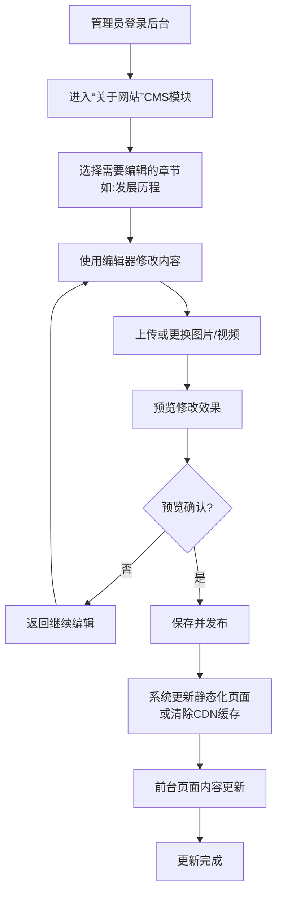

# 2.7 关于网站
## 2.7.1 功能描述
“关于网站”是九州寰宇平台的官方信息门户与信任建立中心。该模块集中展示平台的发展历程、核心愿景、团队文化、运营数据、媒体报道、用户协议及联系方式等权威信息。用户可通过此模块全面了解平台的背景与价值，管理员可通过内容管理系统（CMS）动态更新各项信息。其核心在于构建平台透明度，建立用户信任感，并作为官方信息发布的标准渠道。
## 2.7.2 用户场景

| 场景类型      | 使用角色        | 具体场景描述                                             |
| --------- | ----------- | -------------------------------------------------- |
| 首次访问与信任建立 | 新用户 / 潜在合作方 | 用户首次接触平台，希望通过“关于网站”了解平台背景、实力和可靠性，以决定是否注册使用或开展商业合作。 |
| 信息查询与求证   | 所有用户        | 用户在使用过程中对平台政策、数据来源或背景信息产生疑问，主动来此寻找官方权威解答。          |
| 内容引用与传播   | 内容创作者 / 媒体  | 创作者或媒体人员在撰写与平台相关的内容时，需要引用官方的准确数据、发展历程或品牌信息。        |
| 问题反馈与寻求支持 | 遇到问题的用户     | 用户在其他渠道未能解决问题，通过“关于网站”中的详细联系方式（如客服电话、官方邮箱）寻求直接帮助。  |
| 了解发展规划    | 深度用户 / 投资者  | 忠实用户或潜在投资者希望了解平台未来的发展路线图和新功能规划，以保持同步或评估投资价值。       |

## 2.7.3 核心价值
- 建立品牌信任与透明度：通过系统化展示权威信息，构建平台的可靠形象，降低用户的使用和决策门槛。
- 统一信息出口与品牌一致性：确保平台对内外宣传信息的一致性，维护专业的品牌形象。
- 提升用户归属感与社区认同：通过展示愿景、使命和团队文化，增强用户（特别是核心用户）的参与感和归属感。
- 辅助决策与降低沟通成本：为用户、合作方、媒体提供一站式信息获取渠道，减少信息不对称带来的重复沟通。
- 履行信息披露义务：集中管理并展示用户协议、隐私政策、免责声明等法律文件，满足合规要求。
## 2.7.4 需求清单

| 功能类别   | 功能名称     | 功能概述                     | 优先级 |
| ------ | -------- | ------------------------ | --- |
| 核心信息展示 | 平台愿景与使命  | 展示平台的核心价值观、创立初衷与长期目标。    | P0  |
| 核心信息展示 | 发展历程与里程碑 | 以时间线形式展示平台重大发展事件和关键成就。   | P0  |
| 核心信息展示 | 核心团队介绍   | 展示核心成员的背景、照片与职责，增强人情味。   | P0  |
| 核心信息展示 | 平台数据概览   | 动态展示用户数、内容量等关键数据，体现平台活力。 | P1  |
| 内容管理   | CMS内容管理  | 后台CMS支持管理员便捷地更新所有展示内容。   | P0  |
| 内容管理   | 多语言支持    | 支持中英文等多种语言切换，满足国际化需求。    | P1  |
| 法律与合规  | 法律文件聚合   | 集中展示用户协议、隐私政策、社区准则等。     | P0  |
| 法律与合规  | 版权声明     | 明确平台内容版权归属和使用规则。         | P0  |
| 互动与连接  | 官方联系方式   | 提供客服邮箱、电话、办公地址等官方联系渠道。   | P0  |
| 互动与连接  | 社交媒体链接   | 提供官方微博、微信公众号等社交媒体入口。     | P0  |
| 互动与连接  | 招聘信息     | 展示平台最新招聘职位，吸引人才加入。       | P2  |
| 互动与连接  | 媒体报道     | 展示权威媒体对平台的报道文章，提升公信力。    | P1  |

## 2.7.5 需求详述
### 2.7.5.1 平台愿景与使命
- 内容结构：
	- 愿景陈述：描绘平台希望创造的未来和追求的长期目标，例如“构建一个连接人与知识、创意与资源的开放式数字生态”。
	- 使命陈述：阐述平台为何存在及要解决的核心问题，例如“通过一站式聚合与AI技术，让每个人更高效地获取价值，激发创造潜能”。
	- 核心价值理念：分点列出“省时、省心、增值、归属”等核心价值，并配以简短解释。
- 展示形式：采用图文结合的方式，设计应具有感染力和品牌辨识度。可考虑使用品牌主视觉图片或简短激励视频背景。
### 2.7.5.2 发展历程与里程碑
- 时间线设计：采用垂直时间线（Timeline）交互设计，清晰展示关键节点。
- 里程碑事件：每个事件节点包含：
- 时间：精确到年月。
- 事件标题：如“九州寰宇平台正式上线”、“用户数突破100万”。
- 事件描述：简要说明该事件的意义。
- 视觉元素：可配以事件相关的小图标或图片。
- 数据驱动：后期可与后台数据打通，关键数据里程碑（如用户数）可自动更新。
### 2.7.5.3 核心团队介绍
- 成员信息卡：以卡片式布局展示团队成员，点击可查看详情。
	- 成员头像、姓名、职位。
	- 专业背景或简短履历（突出专业性）。
	- 在平台中的角色或负责领域。
	- 一句个人座右铭或对平台的寄语（增强亲和力）。
- 团队文化展示：在团队介绍区域下方，可增加团队活动照片、文化价值观（如“极致创新”、“用户为先”等），展示团队活力。
### 2.7.5.4 平台数据概览
- 动态数据看板：设计一个简洁、现代的数据看板，数字具有动态增长动画效果。
- 核心指标：显示如累计注册用户数、日活跃用户数、平台内容总量（文章、项目等）、合作伙伴数量等。
- 数据来源与更新：数据由后端API实时或定时拉取，确保准确性。需注明数据最后更新时间。
### 2.7.5.5 CMS内容管理
- 后台管理界面：为管理员提供直观的WYSIWYG（所见即所得）编辑器，用于修改“关于网站”各页面的文字、图片内容。
- 模块化管理：每个章节（如愿景、历程、团队）可作为独立模块进行编辑、上下架控制。
- 版本历史：保存内容修改历史，便于回溯和错误恢复。
### 2.7.5.6 法律文件聚合
- 集中陈列：以列表形式清晰陈列《用户协议》、《隐私政策》、《社区指导原则》、《免责声明》等文件链接。
- 便捷访问：用户可点击直接查看完整内容，页面支持内部锚点导航，方便用户快速定位章节。
- 更新提示：当法律文件有更新时，在链接旁显示“已更新”标签，并在用户首次访问时提示重要变更。
### 2.7.5.7 官方联系方式
- 结构化信息：
	- 客户服务邮箱（如：`support@jz-verse.com`）。
	- 商务合作邮箱（如：`bd@jz-verse.com`）。
	- 客服热线（注明服务时间）。
	- 公司注册地址与办公地址。
- 交互集成：在提供邮箱地址处，集成“点击复制”功能。考虑嵌入一个简易的留言表单，用户可直接提交问题。
## 2.7.6 核心流程
### 2.7.6.1 内容管理更新流程

## 2.7.7 详细用例
### 用例：潜在合作伙伴了解平台实力
- 项目描述：一家投资机构经理欲了解九州寰宇平台背景，评估投资潜力。
- 主要参与者：投资经理、关于网站模块、后台CMS。
- 前置条件：投资经理通过搜索引擎或直接输入网址访问九州寰宇平台。
- 基本事件流：
	1. 用户访问平台首页，滚动至页面底部，点击“关于我们”链接。
	2. 系统跳转至“关于网站”主页面，首屏展示平台的宏大愿景与使命陈述。
	3. 用户向下滚动，浏览“发展历程”时间线，重点关注平台关键融资节点和产品里程碑。
	4. 用户点击“我们的团队”，查看核心成员的背景，评估团队实力与稳定性。
	5. 用户关注“平台数据”看板，记录下活跃用户数和内容增长趋势。
	6. 用户点击“媒体报道”，查看是否有权威财经媒体对平台的报道以作交叉验证。
	7. 用户最后点击“商务合作”，获取合作邮箱，准备起草投资意向书。
- 扩展事件流：
	3a. 用户对某个里程碑事件感兴趣，希望看到更详细的数据报告。系统可考虑在时间线节点上提供“查看详情”的扩展链接，链向更详细的公告或数据页面。
	5a. 用户希望导出数据看板。系统可提供“生成简报”功能，将关键数据生成一份PDF简报供用户下载。
## 2.7.8 界面与交互要求
参考UI设计稿
## 2.7.9 埋点方案

| 类别   | 事件/页面 ID                | 事件名称   | 触发时机         | 关键属性                |
| ---- | ----------------------- | ------ | ------------ | ------------------- |
| 页面访问 | page\_about\_view       | 关于页面浏览 | 用户进入关于网站页面   | source（首页底部/搜索等）    |
| 内容互动 | section\_vision\_click  | 愿景使命点击 | 用户点击愿景章节导航   | N/A                 |
| 内容互动 | section\_timeline\_view | 发展历程浏览 | 发展历程章节进入视口   | scroll\_depth（滚动深度） |
| 内容互动 | team\_member\_click     | 团队成员查看 | 用户点击某个团队成员卡片 | member\_id          |
| 内容互动 | legal\_doc\_view        | 法律文件查看 | 用户点击查看任一法律文件 | doc\_name           |
| 用户转化 | contact\_email\_copy    | 邮箱复制   | 用户点击复制联系邮箱   | email\_type（客服/商务等） |
| 用户转化 | social\_link\_click     | 社交链接点击 | 用户点击社交媒体图标   | platform（微博/微信等）    |

## 2.7.10 技术细节
- 架构设计：采用静态化生成（SSG）或服务器端渲染（SSR）技术，以保证页面的快速加载和良好的SEO效果。内容数据通过API从后台CMS获取。
- CMS集成：后端需开发一套专用的内容管理API，供后台CMS调用。内容模型（Content Model）需提前定义好，对应前端的各个展示模块。
- 性能优化：对图片和视频资源进行懒加载（Lazy Load）和压缩优化。充分利用浏览器缓存和CDN加速，确保全球用户访问速度。
- 安全约束：CMS后台需有严格的权限验证，防止未授权修改。前台页面信息展示需进行安全编码，防范XSS等攻击。