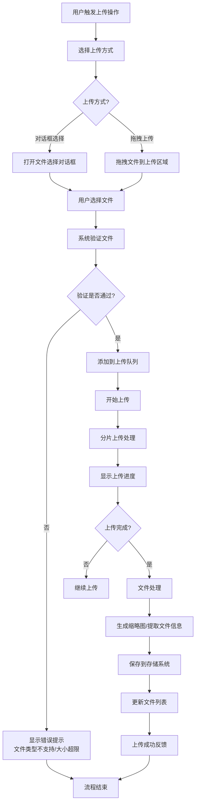
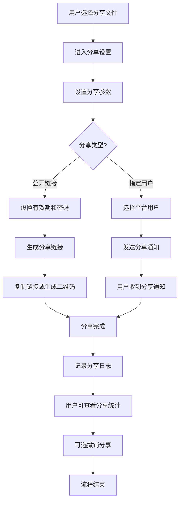
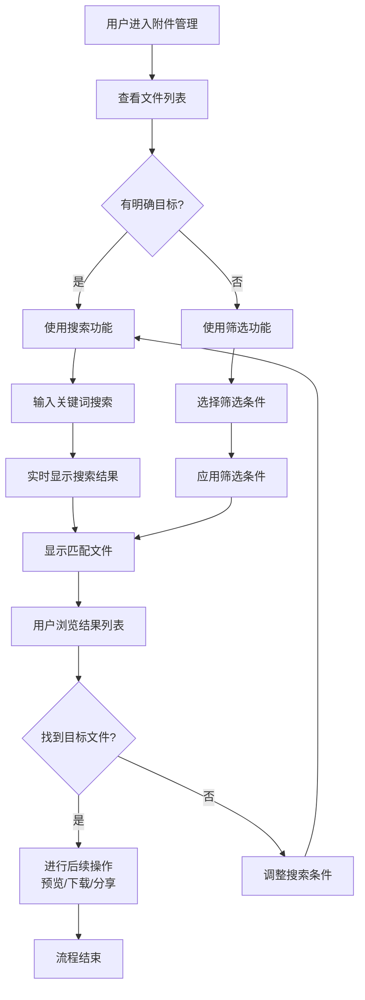

# 2.8 附件管理
## 2.8.1 功能描述
附件管理是九州寰宇平台的基础资源管理模块，为用户提供统一的文件上传、存储、管理和分享服务。支持多类型文件（文档、图片、视频、压缩包等）的上传与管理，提供文件预览、版本控制、权限管理、分享链接生成等功能。用户可在博客创作、项目公示、社区交流等场景中无缝使用附件服务，实现跨业务场景的文件资源统一管理。
## 2.8.2 用户场景

| 场景类型     | 使用角色        | 具体场景描述                                   |
| -------- | ----------- | ---------------------------------------- |
| 内容创作附件管理 | 博客作者、内容创作者  | 撰写技术博客时上传代码截图、设计稿、演示视频等多媒体素材，管理已上传的附件资源库 |
| 项目展示资源管理 | 项目开发者、团队负责人 | 在项目公示页面上传项目文档、原型文件、演示视频、软件安装包等项目相关资源     |
| 学习资料共享   | 学生、教育工作者    | 上传课程资料、作业文档、学习笔记，在学习社区中分享给同学或老师          |
| 协作文件管理   | 团队协作者、社区成员  | 在论坛讨论、项目协作中共享参考文档、数据文件，管理团队共享资源          |
| 个人资源备份   | 所有用户        | 将个人重要文件上传至平台云端存储，实现跨设备访问和资源备份            |

## 2.8.3 核心价值
- 资源统一管理：提供一站式的文件存储管理解决方案，避免用户在不同云存储服务间切换
- 跨场景协同：支持附件在博客、项目、社区等不同场景下的无缝引用和共享
- 版本控制与追溯：重要文档的版本管理，避免版本混乱，支持历史版本回溯
- 安全可靠存储：企业级文件存储安全保障，数据加密、备份恢复机制
- 提升创作效率：简化文件上传、管理流程，让用户更专注于内容创作而非文件管理
- 知识资产沉淀：帮助用户构建个人知识资产库，实现资源的长期积累和价值复用
## 2.8.4 需求清单

| 功能类别 | 功能名称  | 功能概述                    | 优先级 |
| ---- | ----- | ----------------------- | --- |
| 文件上传 | 多格式支持 | 支持图片、文档、视频、压缩包等常见文件格式上传 | P0  |
| 文件上传 | 批量上传  | 支持多文件同时上传，显示上传进度和状态     | P0  |
| 文件上传 | 大文件分片 | 支持大文件分片上传，断点续传功能        | P1  |
| 文件上传 | 拖拽上传  | 拖拽文件到指定区域完成上传           | P0  |
| 文件管理 | 文件列表  | 查看用户所有文件，支持缩略图、列表两种视图   | P0  |
| 文件管理 | 文件分类  | 按类型、时间、标签等维度对文件进行分类管理   | P0  |
| 文件管理 | 搜索筛选  | 按文件名、类型、时间等条件搜索和筛选文件    | P0  |
| 文件管理 | 文件夹管理 | 创建、编辑、删除文件夹，组织文件结构      | P1  |
| 文件操作 | 预览功能  | 支持图片、文档、视频等文件的在线预览      | P0  |
| 文件操作 | 下载管理  | 文件下载，支持原格式下载和压缩包下载      | P0  |
| 文件操作 | 重命名移动 | 文件重命名和移动到其他文件夹          | P0  |
| 文件操作 | 删除恢复  | 文件删除和回收站恢复功能            | P0  |
| 文件操作 | 版本管理  | 文件版本控制，支持历史版本查看和恢复      | P1  |
| 分享权限 | 分享链接  | 生成文件分享链接，设置有效期和访问密码     | P0  |
| 分享权限 | 权限控制  | 设置文件访问权限（私有、公开、指定用户）    | P0  |
| 分享权限 | 外链统计  | 查看分享链接的访问次数、下载次数等统计信息   | P1  |
| 集成功能 | 编辑器集成 | 在富文本编辑器中直接插入已上传的附件      | P0  |
| 集成功能 | 跨场景引用 | 在博客、项目、社区等场景中引用附件库文件    | P0  |
| 管理工具 | 存储统计  | 查看用户存储空间使用情况            | P0  |
| 管理工具 | 批量操作  | 支持文件的批量删除、移动、下载等操作      | P1  |

## 2.8.5 需求详述
### 2.8.5.1 多格式支持
- 支持格式分类：
	- 图片格式：JPG、PNG、GIF、WebP、SVG（支持预览和缩略图生成）
	- 文档格式：PDF、DOC/DOCX、XLS/XLSX、PPT/PPTX、TXT（支持在线预览）
	- 视频格式：MP4、WebM、MOV（支持流媒体播放）
	- 音频格式：MP3、WAV、AAC（支持在线播放）
	- 压缩格式：ZIP、RAR、7Z（支持在线解压预览）
	- 代码文件：JS、CSS、HTML、PY、JAVA等（支持语法高亮预览）
- 格式限制：每种格式有大小限制，如图片最大20MB，视频最大500MB，文档最大100MB
- 安全检测：上传文件进行病毒扫描和安全检测，拦截恶意文件
- 格式转换：支持常见格式转换，如HEIC图片自动转换为JPG格式
### 2.8.5.2 批量上传
- 选择方式：支持文件选择对话框多选，也支持拖拽文件夹上传
- 进度显示：每个文件显示独立的上传进度条，包括文件名、大小、进度百分比、速度、剩余时间
- 错误处理：单个文件上传失败不影响其他文件，显示具体错误原因（格式不支持、大小超限等）
- 暂停续传：支持上传过程中暂停和继续，网络中断后自动重试
- 队列管理：显示上传队列，可调整上传优先级，移除等待中的文件
- 完成反馈：上传完成后显示成功提示，新文件在文件列表中高亮显示
### 2.8.5.3 文件列表与视图
- 双视图模式：
	- 网格视图：显示文件缩略图，适合图片、视频等可视化文件
	- 列表视图：显示文件详细信息（名称、大小、类型、修改时间），适合文档管理
- 文件信息：
	- 基本属性：文件名、大小、格式、上传时间、修改时间
	- 业务属性：所属场景（博客附件、项目资源等）、引用次数
	- 状态标识：分享状态、加密状态、标签信息
- 排序选项：按名称、大小、上传时间、修改时间、类型进行升降序排序
- 缩放控制：网格视图支持缩略图大小调节，满足不同浏览需求
- 选择模式：支持单选、多选（Shift连续选择、Ctrl多选）、全选操作
### 2.8.5.4 文件分类与标签
- 系统分类：按文件类型自动分类（图片、文档、视频、音频、其他）
- 自定义分类：用户创建文件夹和子文件夹，拖拽方式组织文件结构
- 标签系统：为文件添加自定义标签，支持多标签筛选
- 智能分类：基于AI技术自动为文件添加标签（如"风景图片"、"技术文档"等）
- 收藏功能：重要文件可标记为收藏，快速访问
- 颜色标记：使用不同颜色标记文件优先级或类别
### 2.8.5.5 搜索与筛选
- 关键词搜索：实时搜索文件名和标签，支持模糊匹配
- 高级筛选：
	- 按文件类型筛选（图片、文档、视频等）
	- 按大小范围筛选（小于1MB、1-10MB、大于10MB）
	- 按时间范围筛选（今天、本周、本月、自定义范围）
	- 按使用场景筛选（博客附件、项目资源、社区上传等）
- 筛选组合：多个筛选条件可组合使用，筛选结果实时更新
- 搜索历史：记录最近搜索条件，快速重用
- 保存搜索：常用搜索条件可保存为"智能文件夹"，条件匹配的文件自动归入
### 2.8.5.6 文件预览
- 图片预览：支持缩放、旋转、幻灯片模式浏览
- 文档预览：PDF、Office文档在线预览，保持格式和布局
- 视频音频：在线播放器，支持进度控制、音量调节
- 代码预览：语法高亮、行号显示、代码折叠
- 压缩包预览：不解压直接查看包内文件列表，选择性地下载单个文件
- 多页文档：支持多页文档的翻页浏览和缩略图导航
- 全屏模式：重要文件可全屏预览，减少干扰
### 2.8.5.7 版本管理
- 自动版本：文件更新上传时自动保存历史版本，记录版本号和修改时间
- 版本对比：对比不同版本内容差异（文档类文件）
- 版本描述：为重要版本添加描述说明，记录变更内容
- 版本恢复：可恢复至任意历史版本，当前版本自动存档
- 版本清理：自动清理过旧版本，释放存储空间
- 版本下载：可选择下载特定历史版本
### 2.8.5.8 分享与权限
- 分享链接：生成文件或文件夹的分享链接，可设置有效期（1天、7天、30天、永久）
- 权限级别：
	- 仅查看：可预览不可下载
	- 可下载：允许下载原文件
	- 可编辑：允许在线编辑（支持的文件类型）
- 密码保护：为分享链接设置访问密码，增加安全性
- 指定分享：直接分享给平台内其他用户，无需生成外链
- 分享统计：查看分享链接的访问次数、下载次数、访问时间等数据
- 分享撤销：随时撤销分享链接，立即失效
## 2.8.6 核心流程
### 2.8.6.1 文件上传流程

### 2.8.6.2 文件分享流程

### 2.8.6.3 文件检索流程

## 2.8.7 详细用例
### 用例1：内容创作者上传博客图片
- 项目描述：技术博主撰写一篇关于前端框架的教程，需要插入多张代码截图和示意图
- 主要参与者：技术博主、附件管理系统、博客编辑器
- 前置条件：用户已登录九州寰宇，正在使用博客编辑器撰写文章，已准备好需要插入的图片文件
- 基本事件流：
	1. 用户在博客编辑器中点击"插入图片"按钮，系统弹出附件选择界面。
	2. 用户选择"上传新文件"标签页，将准备好的5张教程图片拖拽到上传区域。
	3. 系统立即开始上传，显示每个文件的上传进度条，5张图片（总计15MB）在20秒内上传完成。
	4. 上传完成后，图片自动出现在附件库的"图片"分类中，按上传时间排序。
	5. 用户切换到"插入图片"对话框的"我的附件"标签页，看到刚上传的图片缩略图。
	6. 用户依次点击5张图片的缩略图，图片被插入到博客文章的相应位置。
	7. 用户发现第三张图片需要调整，点击该图片选择"替换"，从附件库中选择另一张已上传的图片。
	8. 所有图片插入完成后，用户继续编辑文章文本内容，图片自动保存到文章草稿中。
	9. 文章发布后，读者可以正常查看所有图片内容。
- 扩展事件流：
	3a. 网络中断：上传到第3张图片时网络中断，系统自动暂停上传，网络恢复后继续从断点上传。
	6a. 图片调整：用户需要调整图片大小，点击图片选择"编辑"，使用内置图片编辑器进行简单裁剪和调整。
	7a. 图片描述：用户为每张图片添加ALT文本，提高文章可访问性和SEO效果。
### 用例2：项目团队共享开发文档
- 项目描述：开发团队在项目公示页面共享项目相关文档和资源
- 主要参与者：项目经理、开发团队成员、附件管理系统
- 前置条件：项目已在九州寰宇平台创建，团队成员已加入项目，需要共享项目文档
- 基本事件流：
	1. 项目经理进入项目管理页面，点击"资源管理"部分。
	2. 项目经理创建"项目文档"、"设计资源"、"测试资料"三个文件夹，设置不同的访问权限。
	3. 项目经理将项目需求文档、设计稿、API文档等文件批量上传到相应文件夹。
	4. 系统自动为文档类文件提取文本内容，建立全文搜索索引。
	5. 开发团队成员访问项目页面，在资源库中查看文档，支持在线预览和下载。
	6. 开发人员需要更新技术方案文档，上传新版本，系统自动保留历史版本。
	7. 测试人员将测试用例和测试报告上传到"测试资料"文件夹，并通知相关成员。
	8. 团队成员可对文档进行评论和讨论，反馈意见。
	9. 项目经理定期查看资源库的访问统计，了解哪些文档最受关注。
- 扩展事件流：
	5a. 外部协作：需要与客户共享项目进度报告，项目经理生成分享链接，设置7天有效期和访问密码。
	6a. 版本对比：开发人员上传新版本技术文档后，团队成员可以对比新旧版本的内容差异。
	8a. 文档审批：重要文档需要审批流程，项目经理设置关键文档需经审批才能正式发布。
## 2.8.8 界面与交互要求
参考UI设计稿
## 2.8.9 埋点方案

| 类别   | 事件/页面 ID           | 事件名称    | 触发时机          | 关键属性（示例）                                                     |
| ---- | ------------------ | ------- | ------------- | ------------------------------------------------------------ |
| 页面访问 | page\_attachment   | 附件管理页访问 | 用户进入附件管理页面    | source（博客编辑器/项目页面/独立访问）                                      |
| 文件操作 | file\_upload       | 文件上传    | 用户上传文件成功      | file\_type, file\_size, upload\_time, upload\_source         |
| 文件操作 | file\_download     | 文件下载    | 用户下载文件        | file\_type, file\_size, download\_source                     |
| 文件操作 | file\_preview      | 文件预览    | 用户预览文件        | file\_type, preview\_duration, preview\_source               |
| 文件操作 | file\_delete       | 文件删除    | 用户删除文件        | file\_type, file\_age, delete\_reason（手动/自动清理）               |
| 文件操作 | file\_share        | 文件分享    | 用户创建分享链接      | share\_type（公开链接/指定用户）, expiry\_setting, password\_protected |
| 文件操作 | file\_organize     | 文件组织    | 用户移动/重命名/分类文件 | operation\_type, target\_folder, old\_path, new\_path        |
| 搜索行为 | attachment\_search | 附件搜索    | 用户搜索文件        | search\_query, result\_count, search\_time                   |
| 搜索行为 | attachment\_filter | 附件筛选    | 用户使用筛选条件      | filter\_conditions, result\_count                            |
| 用户体验 | upload\_speed      | 上传速度    | 文件上传完成        | file\_size, upload\_time, network\_type                      |
| 用户体验 | storage\_usage     | 存储使用    | 用户查看存储统计      | total\_usage, percentage, file\_count                        |
| 业务转化 | attachment\_reuse  | 附件复用    | 用户在编辑器中插入已有附件 | source\_module（博客/项目/社区）, file\_type                         |

## 2.8.10 技术细节
### 2.8.10.1 后端架构设计
- 微服务划分：
	- 文件上传服务：处理文件上传、分片、断点续传
	- 文件存储服务：管理文件存储、备份、迁移
	- 文件处理服务：图片处理、文档转换、病毒扫描
	- 元数据服务：管理文件属性、索引、搜索
	- 分享服务：管理分享链接、权限验证、访问统计
- 存储方案：
	- 对象存储：使用S3兼容对象存储保存文件内容，支持多地域备份
	- 数据库：使用PostgreSQL存储文件元数据、版本信息、分享记录
	- 缓存：使用Redis缓存热门文件、用户操作记录、分享验证信息
	- 搜索引擎：使用Elasticsearch提供文件内容搜索和高级筛选
- API设计：
	- RESTful API设计，统一认证和权限验证
	- 文件上传API支持分片上传，提供进度查询
	- 文件预览API支持多种格式转换和优化
	- 分享API支持多种分享方式和权限控制
### 2.8.10.2 核心算法与处理
- 文件分片上传算法：
	- 动态分片大小调整，根据网络状况优化分片策略
	- 哈希校验确保分片上传完整性
	- 并行上传加速大文件传输
	- 断点续传记录上传状态，支持异常恢复
- 图片处理优化：
	- 自适应图片格式转换（WebP优先）
	- 智能压缩保持视觉质量的同时减少文件大小
	- 缩略图生成多尺寸适配不同使用场景
	- 图片EXIF信息处理和保护隐私
- 搜索排名算法：
	- 多因素权重排序：使用频率、新鲜度、相关性综合评分
	- 个性化结果：基于用户使用习惯和场景偏好调整排序
	- 语义搜索：支持同义词扩展和语义理解
### 2.8.10.3 安全与性能
- 安全措施：
	- 文件上传安全检测：病毒扫描、恶意代码检测
	- 访问权限控制：基于角色和上下文的精细权限管理
	- 分享链接安全：有效期限制、访问密码、盗链防护
	- 数据加密传输：全链路HTTPS加密，敏感文件端到端加密
- 性能优化：
	- CDN加速：静态文件全球CDN分发，优化访问速度
	- 缓存策略：热门文件多级缓存，减少源站压力
	- 异步处理：图片处理、格式转换等耗时操作异步执行
	- 负载均衡：上传下载流量均衡分配，避免单点瓶颈