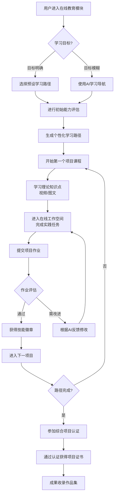
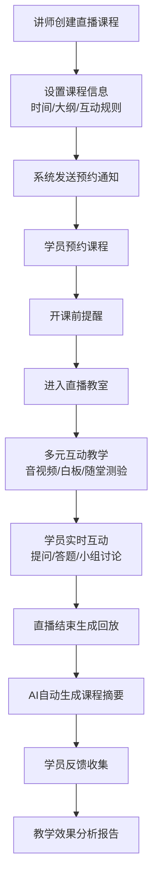

# 2.9 在线教育
## 2.9.1 功能描述
“在线教育”是九州寰宇平台的核心学习与成长模块，是一个深度融合项目式学习、AI个性化路径与社区化互动的下一代数字学习平台。它超越了传统的课程点播模式，构建了一个从知识获取、技能实践到成果认证的完整闭环。该模块旨在通过动态的学习路径规划、云端实践环境、丰富的互动机制以及可信的微证书体系，为各类用户提供高效、沉浸且富有成就感的学习体验，真正实现“学以致用，用以促学”。
本模块名为南离书院，口号为汇诸般学脉，融六艺九流；100% 项目式课程设计，打造实战技能，塑造您的技术未来。特色有：100%项目式学习、在线工作空间、每周主题挑战
## 2.9.2 用户场景

| 场景类型      | 使用角色          | 具体场景描述                                                                        |
| --------- | ------------- | ----------------------------------------------------------------------------- |
| 系统化技能进阶   | 数字原生代学生与技术爱好者 | 用户希望成为一名前端工程师，通过AI路径规划进入“前端工程师成长路径”，依次完成各个项目课程，在集成开发环境中边学边做，最终通过项目认证，丰富个人作品集。 |
| 碎片化主题探索   | 都市乐活白领与中产     | 用户对数据可视化产生兴趣，参与平台举办的“一周数据可视化挑战赛”，利用通勤时间学习提供的迷你课程，并提交自己的作品，获得社区反馈和成就徽章。        |
| 知识分享与变现   | 斜杠内容创作者与独立开发者 | 一位资深UI设计师利用平台的课程创作工具，将自身经验设计成一个“高级视觉设计实战”项目课程，并通过平台的营销与支付系统进行授课，建立个人品牌。       |
| 问题驱动的即时学习 | 所有平台用户        | 用户在“项目公示”模块参与协作时遇到技术瓶颈，可直接在项目页面找到平台AI推荐的相关技能课程或知识片段，进行针对性学习，快速解决问题。           |
| 认证与职业发展   | 求职者与职业晋升者     | 用户完成一系列课程和项目后，获得平台颁发的技能徽章和项目认证，并将其展示在个人主页、博客或直接分享至招聘平台，作为能力的权威证明。             |

## 2.9.3 核心价值
- 省时（结构化与个性化）：通过AI路径规划与官方学习路径，为用户过滤噪音，直达最有效的学习内容，避免盲目搜索与试错。
- 省心（沉浸式与引导式）：集成的在线工作空间、项目化学习工具包以及多元的学习互动，降低学习与实践的门槛，让用户专注于学习本身。
- 增值（实践导向与成果可视化）：强调项目制学习，将知识转化为可展示的成果（项目、证书、作品集），并与平台其他模块（如博客、项目公示）联动，形成个人价值增值的飞轮。
- 归属（社区化学习与竞技乐趣）：通过学习社区、主题挑战和排行榜，构建积极的学习氛围，激发用户的好胜心与分享欲，增强学习动力和平台粘性。
## 2.9.4 需求清单

| 功能类别    | 功能名称       | 功能概述                                      | 优先级 |
| ------- | ---------- | ----------------------------------------- | --- |
| 课程与学习核心 | 课程发现与推荐    | 首页推荐、分类浏览、搜索排序、AI个性化推荐课程                  | P0  |
| 课程与学习核心 | 项目式课程结构    | 支持课程→项目→任务的多级学习路径，任务类型包含视频、阅读、实践、作业       | P0  |
| 课程与学习核心 | 在线工作空间     | 提供云端开发/创作环境（Web IDE、设计工具集成），支持代码、文件实时保存   | P1  |
| 课程与学习核心 | 项目化学习工具包   | 为项目式学习提供模板、案例库、协作工具和成果评估标准，支持跨学科项目。       | P1  |
| 课程与学习核心 | AI学习路径规划   | 基于用户目标、初始能力评估及学习行为数据，动态生成并调整个性化学习路径。      | P1  |
| 课程与学习核心 | 结构化学习路径    | 提供官方/专家创建的学习路径（如“前端工程师成长路径”），明确课程顺序与目标。   | P1  |
| 学习体验与互动 | 多模式学习      | 支持直播课（含互动工具）、录播课（防拖拽、防切屏）、图文专栏学习          | P0  |
| 学习体验与互动 | 灵活主题挑战     | 支持定期（如每周）和不定期的主题挑战，用户提交作品，支持点赞、评论、排行榜     | P0  |
| 学习体验与互动 | 学习社区与问答    | 课程讨论区、课程专属问答区，支持@讲师、采纳答案、点赞排序             | P0  |
| 学习体验与互动 | AI智能学伴与助教  | 引入VR/AR实训场景、元宇宙课堂等，用于高风险、高成本或需情境模拟的教学。    | P2  |
| 学习体验与互动 | 沉浸式学习体验    | 课程讨论区、课程专属问答区，支持@讲师、采纳答案、点赞排序             | P0  |
| 认证与成果管理 | 微证书体系      | 定义证书等级（如完课证书、技能徽章、项目认证）、颁发条件、元数据标准        | P0  |
| 认证与成果管理 | 技能测评考试     | 支持限时考试、防作弊（如切屏检测），客观题自动阅卷                 | P1  |
| 认证与成果管理 | 证书颁发与验证    | 基于规则自动或手动颁发证书，提供第三方可验证的查询链接或二维码           | P0  |
| 认证与成果管理 | 数字证书展示     | 用户个人中心集中展示所获证书、徽章，可公开分享至社交平台或简历           | P1  |
| 认证与成果管理 | 学分银行与积累    | 记录微证书对应学分或学习成果，支持积累与转换，为终身学习提供依据          | P1  |
| 认证与成果管理 | 作品集与人才对接   | 支持用户将项目成果、证书等整合为个人作品集，并可选接入平台人才库，向合作企业展示。 | P1  |
| 教学管理    | 课程创作与发布    | 讲师端工具，用于创建课程内容、设置定价、管理学员、查看课程数据           | P1  |
| 教学管理    | AI辅助课程设计   | 基于教学目标智能生成课程大纲、推荐教学资源、优化教学顺序。             | P1  |
| 教学管理    | 智能教学评估与报告  | 对讲师教学数据（如课堂互动、作业反馈及时性）进行分析，提供改进建议报告。      | P1  |
| 后台与支撑   | 证书管理后台     | 平台管理证书模板、颁发记录、验证查询、违规吊销等                  | P1  |
| 后台与支撑   | 挑战管理平台     | 支持创建、发布、管理多种类型的主题挑战，包括设置灵活的时间周期           | P1  |
| 后台与支撑   | 支付与订单      | 与统一支付中心集成，支持课程购买、优惠券、退款策略                 | P0  |
| 后台与支撑   | 平台管理后台     | 课程审核、用户管理、数据统计、内容推荐位配置、挑战活动管理             | P0  |
| 后台与支撑   | 数据驾驶舱与决策支持 | 可视化平台核心数据（用户学习、课程质量、财务等），为运营决策提供洞察。       | P1  |
| 后台与支撑   | 平台互联与API开放 | 支持与外部教育平台（如国家智慧教育平台）的资源互通，并提供API供第三方集成。   | P2  |

## 2.9.5 需求详述
### 2.9.5.1 课程与学习核心
#### 2.9.5.1.1 课程发现与推荐
- 首页个性化推荐：基于用户画像（兴趣标签、学习目标、技能水平）、历史学习行为、实时热点以及协同过滤算法，在首页生成“猜你想学”、“热门课程”、“基于你正在学习的XX课程推荐”等动态推荐流。
- 智能分类浏览：课程分类体系采用多维度标签（领域、难度、技术栈、形式等），支持多标签交叉筛选。同时提供官方课程合集（如“AI入门必看”）和热门标签云。
- 高级搜索排序：支持关键词搜索课程标题、简介、讲师。搜索结果可按相关性、热度、评分、价格、上新时间等多种方式排序。
- AI个性化推荐：在课程详情页、学习过程中，根据用户当前学习内容，实时推荐相关的补充知识、进阶课程或实践项目，形成知识网络。
#### 2.9.5.1.2 项目式课程结构
- 层级化组织：课程内容采用“课程 → 项目 → 任务”三级结构。一门课程由1个或多个核心项目构成，每个项目进一步拆解为一系列连贯的学习任务（Video）。
- 多元化任务类型：
	- 视频/录播：支持变速播放、字幕、笔记打点。
	- 阅读材料：图文、PDF、外部链接。
	- 实践操作：引导用户在集成的“在线工作空间”中完成编码、设计等实操。
	- 作业/测验：用于巩固和检验知识掌握情况。
- 学习流设计：任务之间可设置线性或非线性的完成逻辑，支持解锁模式（完成前一任务才能进入下一任务）。
#### 2.9.5.1.3 在线工作空间
- 云端环境：为技术类、设计类课程提供即开即用的Web IDE或设计工具集成环境（如Code-Server、Figma插件），用户无需配置本地环境即可开始实践。
- 实时保存与版本管理：用户在工作空间中的所有代码和文件均实时保存至云端，并支持版本历史回溯，防止丢失。
- 集成与预览：工作空间可与课程任务紧密集成，任务可直接引导用户打开特定文件进行修改。支持项目成果的实时预览。
#### 2.9.5.1.4 项目化学习工具包
- 模板与案例库：提供多种项目类型的启动模板（如“数据可视化看板”、“个人博客网站”）和成功案例库，供用户参考和复用。
- 协作工具：支持项目小组内的任务分配、讨论、文档共享和版本协同。
- 评估标准（Rubric）：为每个项目提供清晰的评估标准（Rubric），明确项目成果在完成度、创新性、技术实现等方面的要求，使学习目标可视化。
#### 2.9.5.1.5 AI学习路径规划
- 初始能力评估：用户设定学习目标（如“掌握Python数据分析”）后，通过一套AI生成的适应性测试题，精准评估其当前知识水平。
- 动态路径生成：AI根据评估结果和学习目标，从平台课程库中智能挑选并排序课程与项目，生成一条专属的、可达成的学习路径。
- 持续优化调整：根据用户的学习进度、作业完成情况和测评分数，AI动态调整后续路径的推荐内容，强化薄弱环节，推荐挑战内容。
#### 2.9.5.1.6 结构化学习路径
- 官方/专家认证路径：由平台或行业专家设计的一系列系统化课程集合，如“前端工程师成长路径”、“数据科学家养成计划”，路径内课程有明确的学习顺序和阶段目标。
- 路径详情页：清晰展示路径涵盖的所有课程、预计耗时、最终能获得的技能认证以及适合人群。
- 学习进度追踪：用户加入路径后，可清晰看到自己在整个路径中的进度百分比，以及已完成和待学习的课程。
### 2.9.5.2 学习体验与互动
#### 2.9.5.2.1 多模式学习
- 直播课：支持实时音视频互动、聊天问答、举手连线、互动白板、随堂测验等。支持预约和提醒功能。
- 录播课：提供高清流畅的播放体验。为保障学习效果，可对付费或认证课程启用防拖拽快进和防切屏提示等功能。
- 图文专栏：支持富文本和Markdown格式的图文学习，适合理论知识、案例分析等内容的深度阅读。
#### 2.9.5.2.2 灵活主题挑战
- 挑战类型：支持定期（如“每周算法挑战”）和不定期（如与热点结合的“热门应用UI redesign”）的主题挑战赛。
- 参与机制：挑战页面包含任务描述、时间限制、提交要求、奖励（如证书、积分、实物）。用户在线提交作品（代码、设计稿、文章等）。
- 社区互动：提交的作品在挑战专区公开展示，支持其他用户点赞、评论。系统根据评分或热度自动生成排行榜。
#### 2.9.5.2.3 学习社区与问答
- 课程讨论区：每门课程拥有独立的讨论区，学员可在此交流学习心得、提出疑问。支持发布帖子、回复、@讲师或同学。
- 专属问答区：区别于开放式讨论，问答区以问题为导向，支持将回复标记为“采纳答案”，形成高质量的QA知识库，方便后续学员查阅。
- 内容排序：讨论和问答均支持按时间、热度或是否已解决等条件进行排序筛选。
#### 2.9.5.2.4 AI智能学伴与助教
- 即时答疑：在学习过程中，用户可随时向AI助教提问，AI基于课程上下文和知识库提供即时解答和知识点解释。
- 学习提醒与督促：基于学习计划，AI学伴可发送个性化的学习提醒、进度督促和复习建议。
- 学习分析报告：定期为用户生成学习报告，总结学习成果，指出优势与可改进之处。
#### 2.9.5.2.5 沉浸式学习体验
- VR/AR实训场景：对于机械维修、医疗解剖等高成本或高风险的技能，提供VR/AR模拟实训环境，使学习者在虚拟场景中进行安全、可重复的练习。
- 元宇宙课堂：构建3D虚拟学习空间，学员以虚拟形象参与课堂，可增强课堂的临场感和趣味性，适用于沙龙、研讨会等互动性强的场景。
### 2.9.5.3 认证与成果管理
#### 2.9.5.3.1 微证书体系
- 证书等级：
	- 完课证书：学习完课程所有内容即可获得。
	- 技能徽章：通过特定技能测评后获得。
	- 项目认证：完成项目并达到评估标准（Rubric）要求后获得，含金量更高。
- 元数据标准：每个证书/徽章包含加密的元数据，如获得者、颁发机构、颁发时间、能力描述等，确保可验证性。
#### 2.9.5.3.2 技能测评考试
- 考试形式：支持限时考试，包含单选、多选、判断、填空等客观题。
- 防作弊机制：可启用防切屏检测（如切屏超过设定次数自动交卷）、题目顺序随机、选项随机等功能，保障考试严肃性。
- 自动阅卷：客观题系统自动批改，即时出分。
#### 2.9.5.3.3 证书颁发与验证
- 自动化颁发：当用户满足预设条件（如看完课程、通过考试、项目达标），系统自动颁发证书至用户账户。
- 手动颁发：讲师或管理员也可手动为特定学员颁发证书。
- 第三方验证：每个证书提供唯一的公开查询链接和二维码，第三方可通过此链接在平台验证证书的真伪及有效性。
#### 2.9.5.3.4 数字证书展示
- 个人中心展馆：在用户个人中心设有“我的证书”专区，以可视化展馆的形式集中展示所有获得的证书和徽章。
- 分享与导出：支持将单个证书或整个证书集合分享到社交媒体（如微博、微信），或生成图片/PDF用于嵌入简历。
#### 2.9.5.3.5 学分银行与积累
- 学分记录：为每个微证书定义对应的学分值，记录在用户的“学分银行”中。
- 学分积累：支持学分跨课程、跨路径的累积。
- 成绩单导出：用户可申请官方成绩单，清晰列出所获学分及对应能力，为升学、求职或继续教育提供证明。
#### 2.9.5.3.6 作品集与人才对接
- 作品集构建：用户可将课程项目、挑战赛作品、证书等成果一键添加至个人作品集，并自定义描述和展示顺序。
- 人才库：用户可授权平台将脱敏后的技能标签和作品集（可选）纳入平台人才库。
- 企业对接：合作企业可在人才库中（在获得用户授权前提下）筛选符合要求的人才，平台可提供初步的匹配推荐。
### 2.9.5.4 教学管理
#### 2.9.5.4.1 课程创作与发布
- 课程建设工作室：为讲师提供直观的课程创作后台，支持拖拽式编排课程章节（项目/任务），上传视频、图文、布置作业。
- 定价与营销：支持设置课程价格、优惠券，并提供简单的营销工具（如生成分享海报）。
- 学员管理：讲师可查看学员列表、学习进度、作业提交情况，并与学员沟通。
#### 2.9.5.4.2 AI辅助课程设计
- 大纲生成：讲师输入课程主题和目标，AI可智能推荐课程大纲结构。
- 资源推荐：AI可根据课程内容，自动推荐平台内外的相关教学资源（如图片、视频、文章）作为素材。
- 教学顺序优化：AI可分析知识点的依赖关系，为讲师优化教学内容的顺序提供建议。
#### 2.9.5.4.3 智能教学评估与报告
- 教学数据分析：系统统计讲师的教学数据，如课程平均完成率、作业平均分、学员互动活跃度、答疑响应时间等。
- 改进建议报告：AI基于数据对比和教学理论，为讲师生成教学效果评估报告，并提供具体的改进建议（如“可增加更多实操案例”、“答疑响应速度可提升”）。
### 2.9.5.5 后台与支撑
#### 2.9.5.5.1 证书管理后台
- 模板管理：平台管理员可设计和管理不同等级的证书模板。
- 颁发记录：记录所有证书的颁发详情，支持按课程、用户、时间查询。
- 违规吊销：对于通过不当手段获得的证书，管理员有权核查并吊销，并更新验证链接状态。
#### 2.9.5.5.2 挑战管理平台
- 活动创建：运营人员可后台创建主题挑战，设置标题、描述、时间、规则、奖励等。
- 作品管理：审核用户提交的挑战作品，管理评论，并最终宣布结果和发放奖励。
#### 2.9.5.5.3 支付与订单
- 集成支付：与平台“统一支付中心”无缝集成，支持多种支付方式。
- 订单管理：处理课程购买订单、退款申请，并管理优惠券的发放与核销。
#### 2.9.5.5.4 平台管理后台
- 内容审核：对讲师提交的课程、用户发布的内容进行审核，确保合规与质量。
- 用户管理：管理用户账号、权限及学习数据。
- 运营配置：配置首页推荐位、广告位、通知消息等。
#### 2.9.5.5.5 数据驾驶舱与决策支持
- 可视化报表：将平台核心数据（用户增长、学习活跃度、课程完成率、财务收入等）通过图表形式直观展示。
- 多维度分析：支持按时间、用户群体、课程分类等多维度下钻分析，为运营策略调整提供数据洞察。
#### 2.9.5.5.6 平台互联与API开放
- 资源互通：支持与外部权威教育平台（如国家智慧教育平台）进行资源对接和引入。
- 开放API：提供标准的API接口，允许第三方教育工具或平台集成九州寰宇的课程、用户或证书数据，构建教育生态。
## 2.9.6 核心流程
### 2.9.6.1 项目式学习核心流程

### 2.9.6.2 直播互动教学流程

## 2.9.7 详细用例
### 用例1：前端工程师成长路径学习
- 项目描述：大学生通过系统化路径学习前端开发技能
- 主要参与者：大学生用户、AI学习导航系统、在线工作空间
- 前置条件：用户已注册完成，具有基本的计算机操作能力
- 基本事件流：
	1. 用户选择"前端工程师成长路径"，AI导航系统启动初始能力评估
	2. 系统根据评估结果生成个性化学习路径，动态调整课程顺序
	3. 用户开始"响应式网页设计"项目，先观看理论视频学习HTML5/CSS3概念
	4. 进入在线工作空间，基于模板完成个人作品集网站开发
	5. 系统实时保存代码版本，AI助教提供实时语法检查和优化建议
	6. 提交项目后，系统基于Rubric标准自动评估，生成详细改进报告
	7. 用户根据反馈优化代码，重新提交后获得项目徽章
	8. 完成所有项目后，参加综合实践考试，系统启用防切屏检测保障考试严肃性
	9. 通过考试获得前端开发工程师认证证书
	10. 证书自动加入个人作品集，用户选择加入平台人才库
- 扩展事件流：
	5a. 用户遇到技术难题：AI助教提供分步骤指导，推荐相关文档和社区讨论
	8a. 考试未通过：系统生成薄弱知识点分析，推荐针对性复习内容
### 用例2：企业培训师创建AI辅助课程
- 项目描述：培训专家利用平台工具开发企业内训课程
- 主要参与者：企业培训师、AI课程设计助手、学员
- 基本事件流：
	1. 培训师进入课程创作工作室，输入"项目管理实战培训"主题
	2. AI助手基于主题智能生成课程大纲，推荐教学资源和案例
	3. 培训师使用拖拽式界面编排课程模块，集成视频案例和互动环节
	4. 系统自动检查内容连贯性和难度梯度，提供优化建议
	5. 设置小组实战项目，定义项目评估标准和协作规则
	6. 发布课程到企业学习空间，学员通过多终端接入学习
	7. 培训师通过数据驾驶舱监控学习进度和参与度
	8. AI系统自动生成学习效果报告，识别优秀学员和需要关注的个体
	9. 结业时系统自动颁发数字证书，记录学分到企业学分银行
## 2.9.8 界面与交互要求

## 2.9.9 埋点方案

| 类别   | 事件/页面 ID                 | 事件名称   | 触发时机       | 关键属性                                    |
| ---- | ------------------------ | ------ | ---------- | --------------------------------------- |
| 学习行为 | learning\_path\_start    | 开始学习路径 | 用户确认个性化路径  | path\_id, estimated\_duration           |
| 学习行为 | project\_submit          | 提交项目作业 | 用户提交项目成果   | project\_id, submit\_count, file\_type  |
| 互动行为 | live\_class\_interaction | 直播课互动  | 直播中发问/答题   | class\_id, interaction\_type, timestamp |
| 转化行为 | certificate\_earn        | 获得证书   | 用户满足证书条件   | certificate\_type, earn\_condition      |
| 系统性能 | workspace\_load          | 工作空间加载 | 在线IDE初始化完成 | load\_time, resource\_type              |

## 2.9.10 技术细节
### 2.9.10.1 架构设计
- 微服务架构：学习服务、内容服务、评估服务、AI服务独立部署，通过API网关集成
- 数据持久化策略：结构化数据用PostgreSQL，学习行为数据用时序数据库，大文件用对象存储
- 实时通信层：采用WebRTC实现低延迟音视频互动，支持万级并发在线教室
### 2.9.10.2 AI能力集成
- 智能推荐引擎：基于协同过滤和内容特征的双路推荐，实时更新用户兴趣模型
- 作业自动批改：代码类作业采用静态分析+测试用例，设计类作业采用计算机视觉相似度评估
- 学习风险预警：基于学习行为序列预测辍学风险，提前触发干预机制
### 2.9.10.3 安全与合规
- 内容版权保护：视频DRM加密，文档动态水印，防爬虫机制
- 数据隐私合规：遵循GDPR等法规，提供数据导出和遗忘权支持
- 考试监管机制：活体检测、屏幕共享监测、异常行为识别三重防作弊保障